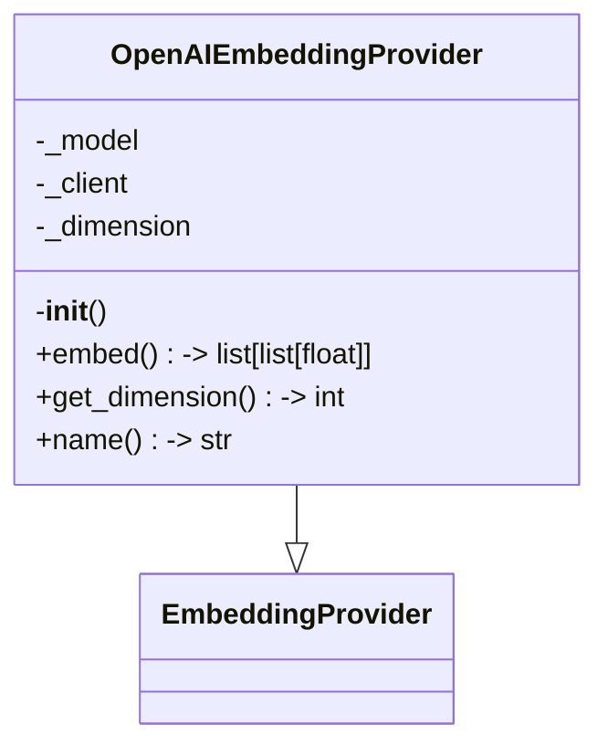
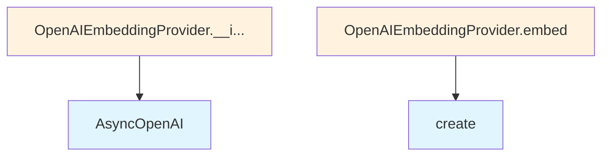

# OpenAI Embedding Provider

## File Overview

This file implements an OpenAI-based embedding provider for the local_deepwiki system. It provides a concrete implementation of the [EmbeddingProvider](../base.md) base class using OpenAI's embedding API through their async client.

## Classes

### OpenAIEmbeddingProvider

The OpenAIEmbeddingProvider class extends the [EmbeddingProvider](../base.md) base class to provide embeddings using OpenAI's API.

**Purpose**: Generate text embeddings using OpenAI's embedding models through their async API client.

#### Constructor

```python
def __init__(self, model: str = "text-embedding-3-small", api_key: str | None = None)
```

**Parameters**:
- `model` (str, optional): The OpenAI embedding model name. Defaults to "text-embedding-3-small"
- `api_key` (str | None, optional): The OpenAI API key. If not provided, uses the `OPENAI_API_KEY` environment variable

**Behavior**:
- Initializes an AsyncOpenAI client with the provided or environment-based API key
- Sets the model and determines embedding dimensions based on a lookup table (`OPENAI_EMBEDDING_DIMENSIONS`)
- Falls back to 1536 dimensions if the model is not found in the lookup table

## Usage Examples

### Basic Usage

```python
from local_deepwiki.providers.embeddings.openai import OpenAIEmbeddingProvider

# Using default model with environment API key
provider = OpenAIEmbeddingProvider()

# Using custom model
provider = OpenAIEmbeddingProvider(model="text-embedding-3-large")

# Using explicit API key
provider = OpenAIEmbeddingProvider(
    model="text-embedding-3-small", 
    api_key="your-api-key-here"
)
```

## Related Components

- **[EmbeddingProvider](../base.md)**: The base class that OpenAIEmbeddingProvider extends
- **AsyncOpenAI**: The OpenAI async client used for API communication

## Configuration

The provider requires an OpenAI API key, which can be provided either:
1. As a parameter to the constructor
2. Through the `OPENAI_API_KEY` environment variable

The default embedding model is "text-embedding-3-small", but this can be customized during initialization.

## API Reference

### class `OpenAIEmbeddingProvider`

**Inherits from:** [`EmbeddingProvider`](../base.md)

Embedding provider using OpenAI API.

**Methods:**


<details>
<summary>View Source (lines 17-57) | <a href="https://github.com/UrbanDiver/local-deepwiki-mcp/blob/[main](../../export/pdf.md)/src/local_deepwiki/providers/embeddings/openai.py#L17-L57">GitHub</a></summary>

```python
class OpenAIEmbeddingProvider(EmbeddingProvider):
    """Embedding provider using OpenAI API."""

    def __init__(self, model: str = "text-embedding-3-small", api_key: str | None = None):
        """Initialize the OpenAI embedding provider.

        Args:
            model: OpenAI embedding model name.
            api_key: Optional API key. Uses OPENAI_API_KEY env var if not provided.
        """
        self._model = model
        self._client = AsyncOpenAI(api_key=api_key or os.environ.get("OPENAI_API_KEY"))
        self._dimension = OPENAI_EMBEDDING_DIMENSIONS.get(model, 1536)

    async def embed(self, texts: list[str]) -> list[list[float]]:
        """Generate embeddings for a list of texts.

        Args:
            texts: List of text strings to embed.

        Returns:
            List of embedding vectors.
        """
        response = await self._client.embeddings.create(
            model=self._model,
            input=texts,
        )
        return [item.embedding for item in response.data]

    def get_dimension(self) -> int:
        """Get the embedding dimension.

        Returns:
            The dimension of the embedding vectors.
        """
        return self._dimension

    @property
    def name(self) -> str:
        """Get the provider name."""
        return f"openai:{self._model}"
```

</details>

#### `__init__`

```python
def __init__(model: str = "text-embedding-3-small", api_key: str | None = None)
```

Initialize the OpenAI embedding provider.


| [Parameter](../../generators/api_docs.md) | Type | Default | Description |
|-----------|------|---------|-------------|
| `model` | `str` | `"text-embedding-3-small"` | OpenAI embedding model name. |
| `api_key` | `str | None` | `None` | Optional API key. Uses OPENAI_API_KEY env var if not provided. |


<details>
<summary>View Source (lines 17-57) | <a href="https://github.com/UrbanDiver/local-deepwiki-mcp/blob/[main](../../export/pdf.md)/src/local_deepwiki/providers/embeddings/openai.py#L17-L57">GitHub</a></summary>

```python
class OpenAIEmbeddingProvider(EmbeddingProvider):
    """Embedding provider using OpenAI API."""

    def __init__(self, model: str = "text-embedding-3-small", api_key: str | None = None):
        """Initialize the OpenAI embedding provider.

        Args:
            model: OpenAI embedding model name.
            api_key: Optional API key. Uses OPENAI_API_KEY env var if not provided.
        """
        self._model = model
        self._client = AsyncOpenAI(api_key=api_key or os.environ.get("OPENAI_API_KEY"))
        self._dimension = OPENAI_EMBEDDING_DIMENSIONS.get(model, 1536)

    async def embed(self, texts: list[str]) -> list[list[float]]:
        """Generate embeddings for a list of texts.

        Args:
            texts: List of text strings to embed.

        Returns:
            List of embedding vectors.
        """
        response = await self._client.embeddings.create(
            model=self._model,
            input=texts,
        )
        return [item.embedding for item in response.data]

    def get_dimension(self) -> int:
        """Get the embedding dimension.

        Returns:
            The dimension of the embedding vectors.
        """
        return self._dimension

    @property
    def name(self) -> str:
        """Get the provider name."""
        return f"openai:{self._model}"
```

</details>

#### `embed`

```python
async def embed(texts: list[str]) -> list[list[float]]
```

Generate embeddings for a list of texts.


| [Parameter](../../generators/api_docs.md) | Type | Default | Description |
|-----------|------|---------|-------------|
| `texts` | `list[str]` | - | List of text strings to embed. |


<details>
<summary>View Source (lines 17-57) | <a href="https://github.com/UrbanDiver/local-deepwiki-mcp/blob/[main](../../export/pdf.md)/src/local_deepwiki/providers/embeddings/openai.py#L17-L57">GitHub</a></summary>

```python
class OpenAIEmbeddingProvider(EmbeddingProvider):
    """Embedding provider using OpenAI API."""

    def __init__(self, model: str = "text-embedding-3-small", api_key: str | None = None):
        """Initialize the OpenAI embedding provider.

        Args:
            model: OpenAI embedding model name.
            api_key: Optional API key. Uses OPENAI_API_KEY env var if not provided.
        """
        self._model = model
        self._client = AsyncOpenAI(api_key=api_key or os.environ.get("OPENAI_API_KEY"))
        self._dimension = OPENAI_EMBEDDING_DIMENSIONS.get(model, 1536)

    async def embed(self, texts: list[str]) -> list[list[float]]:
        """Generate embeddings for a list of texts.

        Args:
            texts: List of text strings to embed.

        Returns:
            List of embedding vectors.
        """
        response = await self._client.embeddings.create(
            model=self._model,
            input=texts,
        )
        return [item.embedding for item in response.data]

    def get_dimension(self) -> int:
        """Get the embedding dimension.

        Returns:
            The dimension of the embedding vectors.
        """
        return self._dimension

    @property
    def name(self) -> str:
        """Get the provider name."""
        return f"openai:{self._model}"
```

</details>

#### `get_dimension`

```python
def get_dimension() -> int
```

Get the embedding dimension.


<details>
<summary>View Source (lines 17-57) | <a href="https://github.com/UrbanDiver/local-deepwiki-mcp/blob/[main](../../export/pdf.md)/src/local_deepwiki/providers/embeddings/openai.py#L17-L57">GitHub</a></summary>

```python
class OpenAIEmbeddingProvider(EmbeddingProvider):
    """Embedding provider using OpenAI API."""

    def __init__(self, model: str = "text-embedding-3-small", api_key: str | None = None):
        """Initialize the OpenAI embedding provider.

        Args:
            model: OpenAI embedding model name.
            api_key: Optional API key. Uses OPENAI_API_KEY env var if not provided.
        """
        self._model = model
        self._client = AsyncOpenAI(api_key=api_key or os.environ.get("OPENAI_API_KEY"))
        self._dimension = OPENAI_EMBEDDING_DIMENSIONS.get(model, 1536)

    async def embed(self, texts: list[str]) -> list[list[float]]:
        """Generate embeddings for a list of texts.

        Args:
            texts: List of text strings to embed.

        Returns:
            List of embedding vectors.
        """
        response = await self._client.embeddings.create(
            model=self._model,
            input=texts,
        )
        return [item.embedding for item in response.data]

    def get_dimension(self) -> int:
        """Get the embedding dimension.

        Returns:
            The dimension of the embedding vectors.
        """
        return self._dimension

    @property
    def name(self) -> str:
        """Get the provider name."""
        return f"openai:{self._model}"
```

</details>

#### `name`

```python
def name() -> str
```

Get the provider name.


<details>
<summary>View Source (lines 17-57) | <a href="https://github.com/UrbanDiver/local-deepwiki-mcp/blob/[main](../../export/pdf.md)/src/local_deepwiki/providers/embeddings/openai.py#L17-L57">GitHub</a></summary>

```python
class OpenAIEmbeddingProvider(EmbeddingProvider):
    """Embedding provider using OpenAI API."""

    def __init__(self, model: str = "text-embedding-3-small", api_key: str | None = None):
        """Initialize the OpenAI embedding provider.

        Args:
            model: OpenAI embedding model name.
            api_key: Optional API key. Uses OPENAI_API_KEY env var if not provided.
        """
        self._model = model
        self._client = AsyncOpenAI(api_key=api_key or os.environ.get("OPENAI_API_KEY"))
        self._dimension = OPENAI_EMBEDDING_DIMENSIONS.get(model, 1536)

    async def embed(self, texts: list[str]) -> list[list[float]]:
        """Generate embeddings for a list of texts.

        Args:
            texts: List of text strings to embed.

        Returns:
            List of embedding vectors.
        """
        response = await self._client.embeddings.create(
            model=self._model,
            input=texts,
        )
        return [item.embedding for item in response.data]

    def get_dimension(self) -> int:
        """Get the embedding dimension.

        Returns:
            The dimension of the embedding vectors.
        """
        return self._dimension

    @property
    def name(self) -> str:
        """Get the provider name."""
        return f"openai:{self._model}"
```

</details>

## Class Diagram



## Call Graph



## Used By

Functions and methods in this file and their callers:

- **`AsyncOpenAI`**: called by `OpenAIEmbeddingProvider.__init__`
- **`create`**: called by `OpenAIEmbeddingProvider.embed`

## Usage Examples

*Examples extracted from test files*

### Test provider initialization

From `test_openai_embedding_provider.py::TestOpenAIEmbeddingProvider::test_initialization`:

```python
from local_deepwiki.providers.embeddings.openai import OpenAIEmbeddingProvider

provider = OpenAIEmbeddingProvider(model="text-embedding-3-small")
assert provider.name == "openai:text-embedding-3-small"
```

### Test provider initialization

From `test_openai_embedding_provider.py::TestOpenAIEmbeddingProvider::test_initialization`:

```python
from local_deepwiki.providers.embeddings.openai import OpenAIEmbeddingProvider

provider = OpenAIEmbeddingProvider(model="text-embedding-3-small")
assert provider.name == "openai:text-embedding-3-small"
```

### Test provider initialization with custom API key

From `test_openai_embedding_provider.py::TestOpenAIEmbeddingProvider::test_initialization_with_custom_api_key`:

```python
from local_deepwiki.providers.embeddings.openai import OpenAIEmbeddingProvider

provider = OpenAIEmbeddingProvider(model="text-embedding-3-small", api_key="custom-key")
assert provider.name == "openai:text-embedding-3-small"
```

### Test provider initialization with custom API key

From `test_openai_embedding_provider.py::TestOpenAIEmbeddingProvider::test_initialization_with_custom_api_key`:

```python
from local_deepwiki.providers.embeddings.openai import OpenAIEmbeddingProvider

provider = OpenAIEmbeddingProvider(model="text-embedding-3-small", api_key="custom-key")
assert provider.name == "openai:text-embedding-3-small"
```


## Last Modified

| Entity | Type | Author | Date | Commit |
|--------|------|--------|------|--------|
| `OpenAIEmbeddingProvider` | class | Brian Breidenbach | 5 days ago | `cdae76f` Initial commit: Local DeepW... |

## Relevant Source Files

- `src/local_deepwiki/providers/embeddings/openai.py:17-57`
