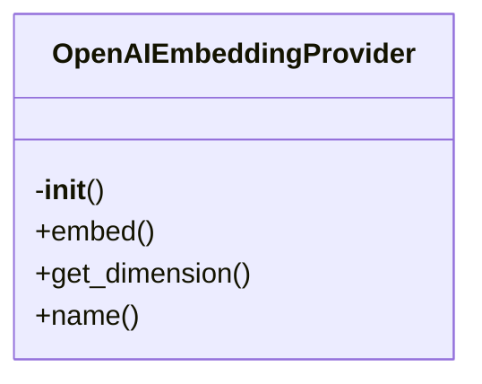

# OpenAI Embedding Provider

## File Overview

This file implements an embedding provider that uses the OpenAI API to generate embeddings for text. It provides an asynchronous interface for generating embeddings using OpenAI's embedding models.

## Classes

### `OpenAIEmbeddingProvider`

An embedding provider that uses OpenAI's API to generate text embeddings.

#### Constructor

```python
def __init__(self, model: str = "text-embedding-3-small", api_key: str | None = None)
```

Initialize the OpenAI embedding provider.

**Parameters:**
- `model` (str): OpenAI embedding model name. Defaults to "text-embedding-3-small"
- `api_key` (str | None): Optional API key. Uses OPENAI_API_KEY environment variable if not provided

**Attributes:**
- `_model` (str): The embedding model name
- `_client` (AsyncOpenAI): Async OpenAI client instance
- `_dimension` (int): Embedding dimension size for the specified model

#### Methods

```python
async def embed(self, texts: list[str]) -> list[list[float]]
```

Generate embeddings for a list of texts.

**Parameters:**
- `texts` (list[str]): List of text strings to embed

**Returns:**
- `list[list[float]]`: List of embedding vectors, where each vector is a list of floats

## Usage Examples

### Basic Usage

```python
from local_deepwiki.providers.embeddings.openai import OpenAIEmbeddingProvider

# Using default model and API key from environment
provider = OpenAIEmbeddingProvider()

# Using custom model and API key
provider = OpenAIEmbeddingProvider(
    model="text-embedding-3-large",
    api_key="your-api-key-here"
)
```

### Generating Embeddings

```python
import asyncio

async def example():
    provider = OpenAIEmbeddingProvider()

    texts = [
        "Hello world",
        "How are you?",
        "OpenAI embeddings"
    ]

    embeddings = await provider.embed(texts)
    print(embeddings)

# Run the async function
asyncio.run(example())
```

## Dependencies

- `os`: For accessing environment variables
- `openai.AsyncOpenAI`: OpenAI asynchronous client
- `local_deepwiki.providers.base.EmbeddingProvider`: Base embedding provider class

The provider requires the `OPENAI_API_KEY` environment variable to be set if no explicit API key is provided during initialization.

## Class Diagram



## See Also

- [base](../base.md) - dependency
- [openai](../llm/openai.md) - shares 3 dependencies
- [anthropic](../llm/anthropic.md) - shares 2 dependencies
