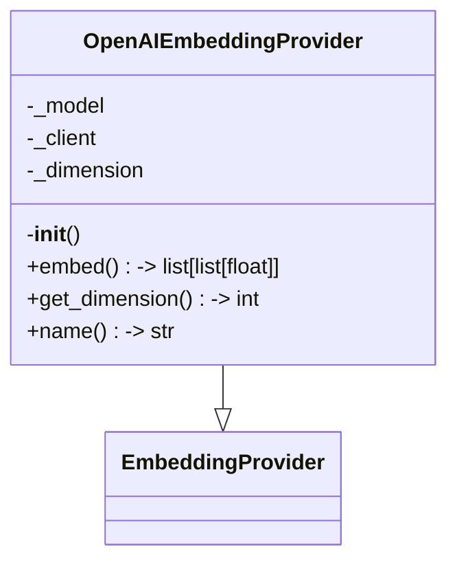
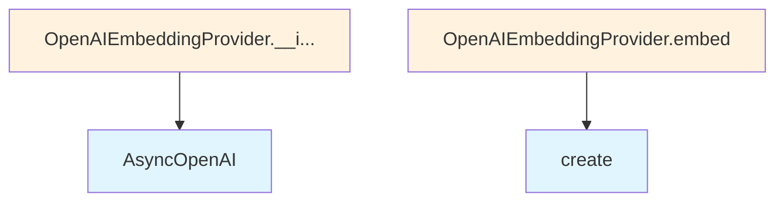

# OpenAI Embedding Provider

## File Overview

This file implements an OpenAI-based embedding provider for the local_deepwiki system. It provides a concrete implementation of the [EmbeddingProvider](../base.md) base class that uses OpenAI's embedding API to generate vector embeddings for text content.

## Classes

### OpenAIEmbeddingProvider

The OpenAIEmbeddingProvider class extends the [EmbeddingProvider](../base.md) base class to provide embedding functionality using OpenAI's API.

**Purpose**: Generate text embeddings using OpenAI's embedding models through their async API client.

**Constructor Parameters**:
- `model` (str, optional): The OpenAI embedding model name. Defaults to `"text-embedding-3-small"`
- `api_key` (str | None, optional): OpenAI API key. If not provided, uses the `OPENAI_API_KEY` environment variable

**Key Features**:
- Initializes an AsyncOpenAI client for making API requests
- Supports configurable embedding models
- Automatically determines embedding dimensions based on the selected model using `OPENAI_EMBEDDING_DIMENSIONS` mapping
- Falls back to 1536 dimensions if the model is not found in the dimensions mapping

## Usage Examples

### Basic Initialization

```python
# Using default model with environment variable API key
provider = OpenAIEmbeddingProvider()

# Using specific model
provider = OpenAIEmbeddingProvider(model="text-embedding-3-small")

# Using explicit API key
provider = OpenAIEmbeddingProvider(
    model="text-embedding-3-small",
    api_key="your-api-key-here"
)
```

### Environment Setup

The provider expects the OpenAI API key to be available either as a parameter or through the environment:

```bash
export OPENAI_API_KEY="your-openai-api-key"
```

## Related Components

- **[EmbeddingProvider](../base.md)**: The base class that OpenAIEmbeddingProvider extends, imported from `local_deepwiki.providers.base`
- **AsyncOpenAI**: The OpenAI client library used for making asynchronous API calls
- **OPENAI_EMBEDDING_DIMENSIONS**: A mapping that provides dimension information for different OpenAI embedding models (referenced but not defined in the visible code)

## Dependencies

- `openai`: Official OpenAI Python library for API access
- `os`: Standard library for environment variable access
- [`local_deepwiki.providers.base.EmbeddingProvider`](../base.md): Base embedding provider interface

## API Reference

### class `OpenAIEmbeddingProvider`

**Inherits from:** [`EmbeddingProvider`](../base.md)

Embedding provider using OpenAI API.

**Methods:**

#### `__init__`

```python
def __init__(model: str = "text-embedding-3-small", api_key: str | None = None)
```

Initialize the OpenAI embedding provider.


| [Parameter](../../generators/api_docs.md) | Type | Default | Description |
|-----------|------|---------|-------------|
| `model` | `str` | `"text-embedding-3-small"` | OpenAI embedding model name. |
| `api_key` | `str | None` | `None` | Optional API key. Uses OPENAI_API_KEY env var if not provided. |

#### `embed`

```python
async def embed(texts: list[str]) -> list[list[float]]
```

Generate embeddings for a list of texts.


| [Parameter](../../generators/api_docs.md) | Type | Default | Description |
|-----------|------|---------|-------------|
| `texts` | `list[str]` | - | List of text strings to embed. |

#### `get_dimension`

```python
def get_dimension() -> int
```

Get the embedding dimension.

#### `name`

```python
def name() -> str
```

Get the provider name.


## Class Diagram



## Call Graph



## Relevant Source Files

- `src/local_deepwiki/providers/embeddings/openai.py:17-57`
