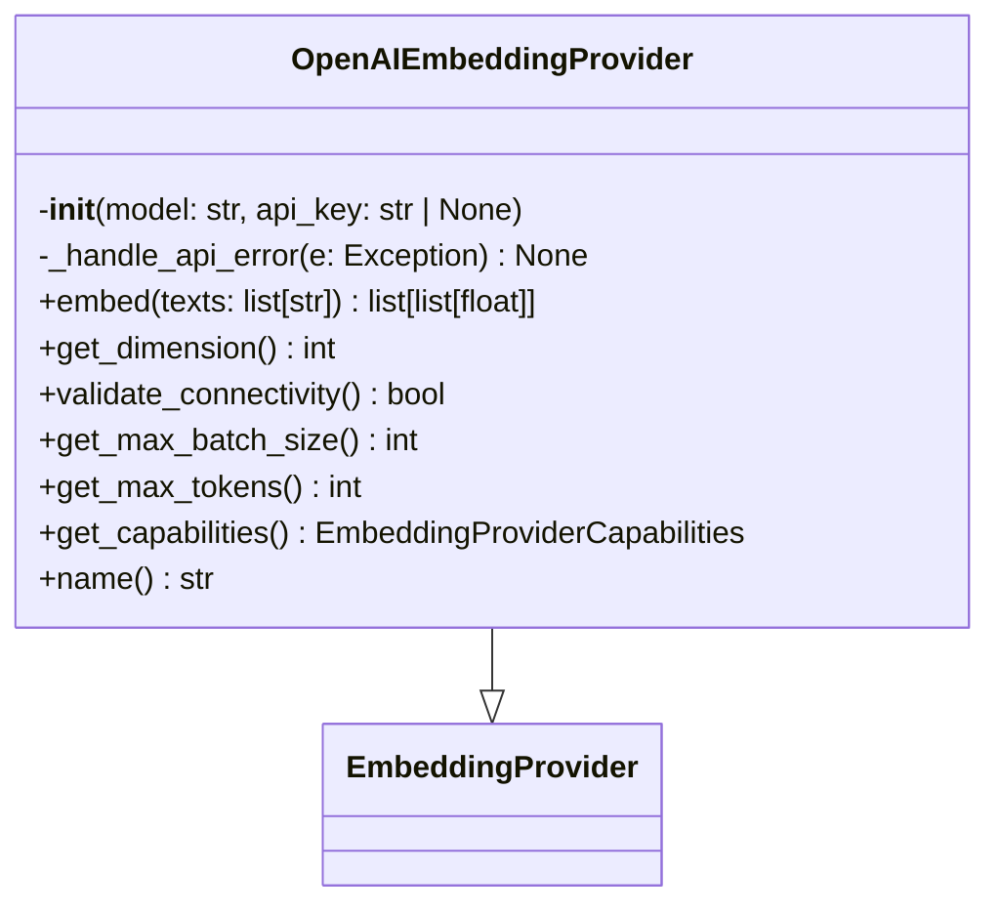

# File Overview

This file defines the `OpenAIEmbeddingProvider` class, which implements the [`EmbeddingProvider`](../base.md) interface for interacting with OpenAI's embedding models. It provides functionality to generate embeddings for text inputs using the OpenAI API, handle authentication, and manage API errors.

The file imports necessary dependencies from the `openai` library and local provider modules, including error handling and credential management.

---

# Classes

## OpenAIEmbeddingProvider

The `OpenAIEmbeddingProvider` class implements the [`EmbeddingProvider`](../base.md) interface to interact with OpenAI's embedding models. It supports initializing with a specific model, handling API errors, generating embeddings, and validating connectivity.

### Key Methods

- `__init__(self, model: str = "text-embedding-3-small", api_key: str | None = None)`
  - Initializes the provider with a model name and optional API key.
  - If no API key is provided, it retrieves one using [`CredentialManager`](../credentials.md).

- `_handle_api_error(self, e: Exception) -> None`
  - Converts OpenAI API exceptions into standardized provider errors.

- `embed(self, texts: list[str]) -> list[list[float]]`
  - Generates embeddings for a list of text inputs.

- `get_dimension(self) -> int`
  - Returns the dimension of the embedding vectors.

- `validate_connectivity(self) -> bool`
  - Tests connectivity to the OpenAI API.

- `get_max_batch_size(self) -> int`
  - Returns the maximum number of texts that can be embedded in a single API call.

- `get_max_tokens(self) -> int`
  - Returns the maximum number of tokens allowed per text input.

- `get_capabilities(self) -> EmbeddingProviderCapabilities`
  - Returns provider capabilities including batch size, token limits, and supported models.

- `name(self) -> str`
  - Returns the provider name, including the model identifier.

---

# Functions

This file does not define standalone functions; all functionality is encapsulated within the `OpenAIEmbeddingProvider` class.

---

# Integration

This file integrates with the local deepwiki project by implementing the [`EmbeddingProvider`](../base.md) interface, which is used by other components such as generators and plugins. It leverages:

- [`CredentialManager`](../credentials.md) for secure API key handling
- Standardized provider error types ([`ProviderAuthenticationError`](../base.md), [`ProviderConnectionError`](../base.md), [`ProviderRateLimitError`](../base.md))
- The `AsyncOpenAI` client from the `openai` library for asynchronous API calls

It is closely related to:
- `src/local_deepwiki/providers/base.py` (for base provider interface)
- `src/local_deepwiki/providers/credentials.py` (for credential handling)

---

# Usage Examples

### Initialize the Provider

```python
provider = OpenAIEmbeddingProvider(model="text-embedding-3-small")
```

### Generate Embeddings

```python
texts = ["Hello world", "How are you?"]
embeddings = await provider.embed(texts)
```

### Validate Connectivity

```python
is_connected = await provider.validate_connectivity()
```

### Get Provider Capabilities

```python
capabilities = provider.get_capabilities()
```

### Get Provider Name

```python
provider_name = provider.name()
```

## API Reference

### class `OpenAIEmbeddingProvider`

**Inherits from:** [`EmbeddingProvider`](../base.md)

Embedding provider using OpenAI API.

**Methods:**


<details>
<summary>View Source (lines 23-203) | <a href="https://github.com/UrbanDiver/local-deepwiki-mcp/blob/[main](../../export/pdf.md)/src/local_deepwiki/providers/embeddings/openai.py#L23-L203">GitHub</a></summary>

```python
class OpenAIEmbeddingProvider(EmbeddingProvider):
    # Methods: __init__, _handle_api_error, embed, get_dimension, validate_connectivity, get_max_batch_size, get_max_tokens, get_capabilities, name
```

</details>

#### `__init__`

```python
def __init__(model: str = "text-embedding-3-small", api_key: str | None = None)
```

Initialize the OpenAI embedding provider.


| [Parameter](../../generators/api_docs.md) | Type | Default | Description |
|-----------|------|---------|-------------|
| `model` | `str` | `"text-embedding-3-small"` | OpenAI embedding model name. |
| `api_key` | `str | None` | `None` | Optional API key. Uses OPENAI_API_KEY env var if not provided. |


<details>
<summary>View Source (lines 26-57) | <a href="https://github.com/UrbanDiver/local-deepwiki-mcp/blob/[main](../../export/pdf.md)/src/local_deepwiki/providers/embeddings/openai.py#L26-L57">GitHub</a></summary>

```python
def __init__(self, model: str = "text-embedding-3-small", api_key: str | None = None):
        """Initialize the OpenAI embedding provider.

        Args:
            model: OpenAI embedding model name.
            api_key: Optional API key. Uses OPENAI_API_KEY env var if not provided.

        Raises:
            ProviderAuthenticationError: If no API key is configured or format is invalid.
        """
        self._model = model

        # Get API key without storing in instance variable
        api_key = api_key or CredentialManager.get_api_key("OPENAI_API_KEY", "openai")

        if not api_key:
            raise ProviderAuthenticationError(
                "No OpenAI API key configured. Set OPENAI_API_KEY environment variable.",
                provider_name="openai:embedding",
            )

        # Validate format
        if not CredentialManager.validate_key_format(api_key, "openai"):
            raise ProviderAuthenticationError(
                "OpenAI API key format appears invalid.",
                provider_name="openai:embedding",
            )

        # Pass directly to client, don't store in self
        self._client = AsyncOpenAI(api_key=api_key)
        model_info = OPENAI_EMBEDDING_MODELS.get(model, {})
        self._dimension = model_info.get("dimension", 1536)
```

</details>

#### `embed`

```python
async def embed(texts: list[str]) -> list[list[float]]
```

Generate embeddings for a list of texts.


| [Parameter](../../generators/api_docs.md) | Type | Default | Description |
|-----------|------|---------|-------------|
| `texts` | `list[str]` | - | List of text strings to embed. |


<details>
<summary>View Source (lines 104-128) | <a href="https://github.com/UrbanDiver/local-deepwiki-mcp/blob/[main](../../export/pdf.md)/src/local_deepwiki/providers/embeddings/openai.py#L104-L128">GitHub</a></summary>

```python
async def embed(self, texts: list[str]) -> list[list[float]]:
        """Generate embeddings for a list of texts.

        Args:
            texts: List of text strings to embed.

        Returns:
            List of embedding vectors.

        Raises:
            ProviderConnectionError: If the API cannot be reached.
            ProviderAuthenticationError: If authentication fails.
            ProviderRateLimitError: If rate limited.
        """
        try:
            response = await self._client.embeddings.create(
                model=self._model,
                input=texts,
            )
            return [item.embedding for item in response.data]
        except (ProviderConnectionError, ProviderAuthenticationError, ProviderRateLimitError):
            raise
        except Exception as e:
            self._handle_api_error(e)
            raise
```

</details>

#### `get_dimension`

```python
def get_dimension() -> int
```

Get the embedding dimension.


<details>
<summary>View Source (lines 130-136) | <a href="https://github.com/UrbanDiver/local-deepwiki-mcp/blob/[main](../../export/pdf.md)/src/local_deepwiki/providers/embeddings/openai.py#L130-L136">GitHub</a></summary>

```python
def get_dimension(self) -> int:
        """Get the embedding dimension.

        Returns:
            The dimension of the embedding vectors.
        """
        return self._dimension
```

</details>

#### `validate_connectivity`

```python
async def validate_connectivity() -> bool
```

Test that the OpenAI API is reachable and configured correctly.


<details>
<summary>View Source (lines 138-167) | <a href="https://github.com/UrbanDiver/local-deepwiki-mcp/blob/[main](../../export/pdf.md)/src/local_deepwiki/providers/embeddings/openai.py#L138-L167">GitHub</a></summary>

```python
async def validate_connectivity(self) -> bool:
        """Test that the OpenAI API is reachable and configured correctly.

        Returns:
            True if the API is accessible.

        Raises:
            ProviderConnectionError: If the API cannot be reached.
            ProviderAuthenticationError: If authentication fails.
        """
        if not self._api_key:
            raise ProviderAuthenticationError(
                "No OpenAI API key configured. Set OPENAI_API_KEY environment variable.",
                provider_name=self.name,
            )

        try:
            # Make a minimal API call to verify connectivity
            await self._client.embeddings.create(
                model=self._model,
                input=["test"],
            )
            return True
        except Exception as e:
            self._handle_api_error(e)
            raise ProviderConnectionError(
                f"Failed to validate OpenAI embedding connectivity: {e}",
                provider_name=self.name,
                original_error=e,
            ) from e
```

</details>

#### `get_max_batch_size`

```python
def get_max_batch_size() -> int
```

Return maximum number of texts that can be embedded in a single call.


<details>
<summary>View Source (lines 169-175) | <a href="https://github.com/UrbanDiver/local-deepwiki-mcp/blob/[main](../../export/pdf.md)/src/local_deepwiki/providers/embeddings/openai.py#L169-L175">GitHub</a></summary>

```python
def get_max_batch_size(self) -> int:
        """Return maximum number of texts that can be embedded in a single call.

        Returns:
            Maximum batch size for OpenAI embeddings.
        """
        return 2048  # OpenAI allows up to 2048 inputs per request
```

</details>

#### `get_max_tokens`

```python
def get_max_tokens() -> int
```

Return maximum tokens per text.


<details>
<summary>View Source (lines 177-184) | <a href="https://github.com/UrbanDiver/local-deepwiki-mcp/blob/[main](../../export/pdf.md)/src/local_deepwiki/providers/embeddings/openai.py#L177-L184">GitHub</a></summary>

```python
def get_max_tokens(self) -> int:
        """Return maximum tokens per text.

        Returns:
            Maximum tokens per text for this model.
        """
        model_info = OPENAI_EMBEDDING_MODELS.get(self._model, {})
        return model_info.get("max_tokens", 8191)
```

</details>

#### `get_capabilities`

```python
def get_capabilities() -> EmbeddingProviderCapabilities
```

Return provider capabilities.


<details>
<summary>View Source (lines 186-198) | <a href="https://github.com/UrbanDiver/local-deepwiki-mcp/blob/[main](../../export/pdf.md)/src/local_deepwiki/providers/embeddings/openai.py#L186-L198">GitHub</a></summary>

```python
def get_capabilities(self) -> EmbeddingProviderCapabilities:
        """Return provider capabilities.

        Returns:
            EmbeddingProviderCapabilities with OpenAI-specific information.
        """
        return EmbeddingProviderCapabilities(
            max_batch_size=self.get_max_batch_size(),
            max_tokens_per_text=self.get_max_tokens(),
            dimension=self._dimension,
            models=list(OPENAI_EMBEDDING_MODELS.keys()),
            supports_truncation=True,  # OpenAI API handles truncation
        )
```

</details>

#### `name`

```python
def name() -> str
```

Get the provider name.


<details>
<summary>View Source (lines 201-203) | <a href="https://github.com/UrbanDiver/local-deepwiki-mcp/blob/[main](../../export/pdf.md)/src/local_deepwiki/providers/embeddings/openai.py#L201-L203">GitHub</a></summary>

```python
def name(self) -> str:
        """Get the provider name."""
        return f"openai:{self._model}"
```

</details>

## Class Diagram


```mermaid
classDiagram
    class OpenAIEmbeddingProvider {
        -__init__(model: str, api_key: str | None)
        -_handle_api_error(e: Exception) None
        +embed(texts: list[str]) list[list[float]]
        +get_dimension() int
        +validate_connectivity() bool
        +get_max_batch_size() int
        +get_max_tokens() int
        +get_capabilities() EmbeddingProviderCapabilities
        +name() str
    }
    OpenAIEmbeddingProvider --|> EmbeddingProvider
```

## Call Graph


```mermaid
flowchart TD
    N0[AsyncOpenAI]
    N1[EmbeddingProviderCapabilities]
    N2[OpenAIEmbeddingProvider.__i...]
    N3[OpenAIEmbeddingProvider._ha...]
    N4[OpenAIEmbeddingProvider.embed]
    N5[OpenAIEmbeddingProvider.get...]
    N6[OpenAIEmbeddingProvider.val...]
    N7[ProviderAuthenticationError]
    N8[ProviderConnectionError]
    N9[ProviderRateLimitError]
    N10[_handle_api_error]
    N11[create]
    N12[get_api_key]
    N13[get_max_batch_size]
    N14[get_max_tokens]
    N15[validate_key_format]
    N2 --> N12
    N2 --> N7
    N2 --> N15
    N2 --> N0
    N3 --> N7
    N3 --> N9
    N3 --> N8
    N4 --> N11
    N4 --> N10
    N6 --> N7
    N6 --> N11
    N6 --> N10
    N6 --> N8
    N5 --> N1
    N5 --> N13
    N5 --> N14
    classDef func fill:#e1f5fe
    class N0,N1,N7,N8,N9,N10,N11,N12,N13,N14,N15 func
    classDef method fill:#fff3e0
    class N2,N3,N4,N5,N6 method
```

## Used By

Functions and methods in this file and their callers:

- **`AsyncOpenAI`**: called by `OpenAIEmbeddingProvider.__init__`
- **[`EmbeddingProviderCapabilities`](../base.md)**: called by `OpenAIEmbeddingProvider.get_capabilities`
- **[`ProviderAuthenticationError`](../base.md)**: called by `OpenAIEmbeddingProvider.__init__`, `OpenAIEmbeddingProvider._handle_api_error`, `OpenAIEmbeddingProvider.validate_connectivity`
- **[`ProviderConnectionError`](../base.md)**: called by `OpenAIEmbeddingProvider._handle_api_error`, `OpenAIEmbeddingProvider.validate_connectivity`
- **[`ProviderRateLimitError`](../base.md)**: called by `OpenAIEmbeddingProvider._handle_api_error`
- **`_handle_api_error`**: called by `OpenAIEmbeddingProvider.embed`, `OpenAIEmbeddingProvider.validate_connectivity`
- **`create`**: called by `OpenAIEmbeddingProvider.embed`, `OpenAIEmbeddingProvider.validate_connectivity`
- **`get_api_key`**: called by `OpenAIEmbeddingProvider.__init__`
- **`get_max_batch_size`**: called by `OpenAIEmbeddingProvider.get_capabilities`
- **`get_max_tokens`**: called by `OpenAIEmbeddingProvider.get_capabilities`
- **`validate_key_format`**: called by `OpenAIEmbeddingProvider.__init__`

## Usage Examples

*Examples extracted from test files*

### Test initialization fails without API key

From `test_openai_provider.py::TestOpenAIProviderInitialization::test_initialization_no_api_key_raises_error`:

```python
from local_deepwiki.providers.llm.openai import OpenAILLMProvider

with patch.dict(os.environ, {}, clear=True):
    # Remove OPENAI_API_KEY from environment
    os.environ.pop("OPENAI_API_KEY", None)
    with pytest.raises(ProviderAuthenticationError) as exc_info:
        OpenAILLMProvider(model="gpt-4o")

    assert "No OpenAI API key configured" in str(exc_info.value)
    assert "OPENAI_API_KEY" in str(exc_info.value)
```

### Test initialization fails with invalid API key format

From `test_openai_provider.py::TestOpenAIProviderInitialization::test_initialization_invalid_key_format_raises_error`:

```python
from local_deepwiki.providers.llm.openai import OpenAILLMProvider

# Mock validate_key_format to return False
with patch(
    "local_deepwiki.providers.llm.openai.CredentialManager.get_api_key",
    return_value="invalid",
):
    with patch(
        "local_deepwiki.providers.llm.openai.CredentialManager.validate_key_format",
        return_value=False,
    ):
        with pytest.raises(ProviderAuthenticationError) as exc_info:
            OpenAILLMProvider(model="gpt-4o")

        assert "format appears invalid" in str(exc_info.value)
```

### Test handling of APIConnectionError

From `test_openai_provider.py::TestOpenAIProviderHandleApiError::test_handle_connection_error`:

```python
from local_deepwiki.providers.base import ProviderConnectionError
from local_deepwiki.providers.llm.openai import OpenAILLMProvider

provider = OpenAILLMProvider(model="gpt-4o")

conn_error = APIConnectionError(request=MagicMock())

with pytest.raises(ProviderConnectionError) as exc_info:
    provider._handle_api_error(conn_error)

assert "Failed to connect to OpenAI API" in str(exc_info.value)
```

### Test that unknown errors are re-raised when called within exception context

From `test_openai_provider.py::TestOpenAIProviderHandleApiError::test_handle_unknown_error_reraises`:

```python
# _handle_api_error uses bare 'raise' so must be called within exception handler
with pytest.raises(ValueError):
    try:
        raise unknown_error
    except ValueError as e:
        provider._handle_api_error(e)
        raise  # This mirrors the actual usage pattern
```

### Test connectivity validation fails without API key

From `test_openai_provider.py::TestOpenAIProviderValidateConnectivity::test_validate_connectivity_no_api_key`:

```python
from local_deepwiki.providers.base import ProviderAuthenticationError
from local_deepwiki.providers.llm.openai import OpenAILLMProvider

provider = OpenAILLMProvider(model="gpt-4o")

# Set _api_key to None to trigger the check
provider._api_key = None

with pytest.raises(ProviderAuthenticationError) as exc_info:
    await provider.validate_connectivity()

assert "No OpenAI API key configured" in str(exc_info.value)
```


## Last Modified

| Entity | Type | Author | Date | Commit |
|--------|------|--------|------|--------|
| `OpenAIEmbeddingProvider` | class | Brian Breidenbach | 1 week ago | `4eb4353` Phase 2: Implement RBAC, de... |
| `__init__` | method | Brian Breidenbach | 1 week ago | `4eb4353` Phase 2: Implement RBAC, de... |
| `_handle_api_error` | method | Brian Breidenbach | 1 week ago | `a64166a` Add seven medium-priority e... |
| `embed` | method | Brian Breidenbach | 1 week ago | `a64166a` Add seven medium-priority e... |
| `validate_connectivity` | method | Brian Breidenbach | 1 week ago | `a64166a` Add seven medium-priority e... |
| `get_max_batch_size` | method | Brian Breidenbach | 1 week ago | `a64166a` Add seven medium-priority e... |
| `get_max_tokens` | method | Brian Breidenbach | 1 week ago | `a64166a` Add seven medium-priority e... |
| `get_capabilities` | method | Brian Breidenbach | 1 week ago | `a64166a` Add seven medium-priority e... |
| `get_dimension` | method | Brian Breidenbach | 3 weeks ago | `cdae76f` Initial commit: Local DeepW... |
| `name` | method | Brian Breidenbach | 3 weeks ago | `cdae76f` Initial commit: Local DeepW... |

## Additional Source Code

Source code for functions and methods not listed in the API Reference above.

#### `_handle_api_error`

<details>
<summary>View Source (lines 59-102) | <a href="https://github.com/UrbanDiver/local-deepwiki-mcp/blob/[main](../../export/pdf.md)/src/local_deepwiki/providers/embeddings/openai.py#L59-L102">GitHub</a></summary>

```python
def _handle_api_error(self, e: Exception) -> None:
        """Convert OpenAI API errors to standardized provider errors.

        Args:
            e: The exception from the OpenAI API.

        Raises:
            ProviderAuthenticationError: If authentication fails.
            ProviderRateLimitError: If rate limited.
            ProviderConnectionError: If connection fails.
        """
        if isinstance(e, AuthenticationError):
            raise ProviderAuthenticationError(
                "OpenAI API authentication failed. Check your OPENAI_API_KEY.",
                provider_name=self.name,
            ) from e

        if isinstance(e, APIStatusError):
            error_str = str(e).lower()
            if e.status_code == 429 or "rate" in error_str:
                # Try to extract retry-after header
                retry_after = None
                if hasattr(e, "response") and e.response:
                    retry_after_str = e.response.headers.get("retry-after")
                    if retry_after_str:
                        try:
                            retry_after = float(retry_after_str)
                        except ValueError:
                            pass
                raise ProviderRateLimitError(
                    f"OpenAI API rate limit exceeded: {e}",
                    provider_name=self.name,
                    retry_after=retry_after,
                ) from e

        if isinstance(e, APIConnectionError):
            raise ProviderConnectionError(
                f"Failed to connect to OpenAI API: {e}",
                provider_name=self.name,
                original_error=e,
            ) from e

        # Re-raise unknown errors
        raise
```

</details>

## Relevant Source Files

- `src/local_deepwiki/providers/embeddings/openai.py:23-203`
