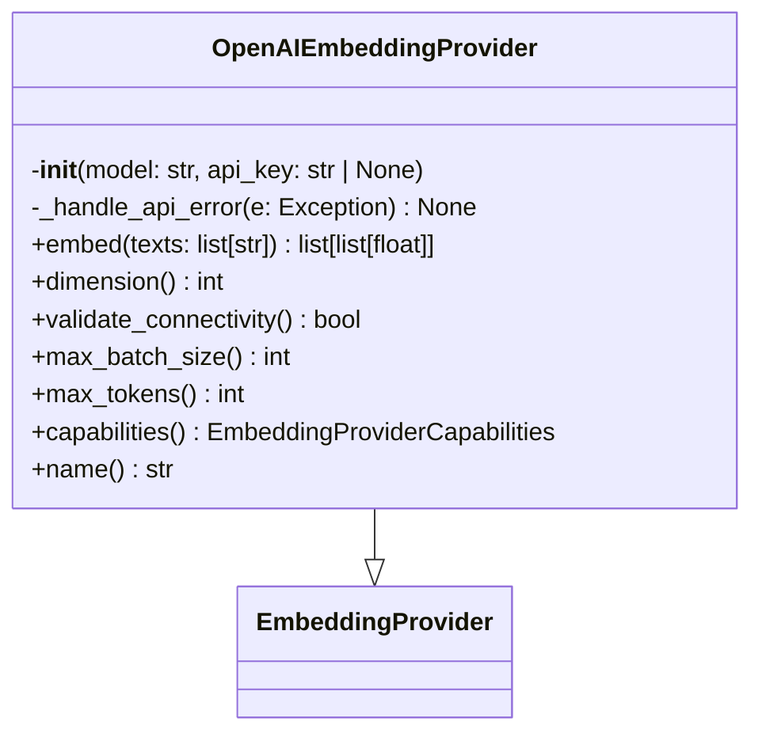

# File: `src/local_deepwiki/providers/embeddings/openai.py`

## File Overview

This file implements the `OpenAIEmbeddingProvider` class, which provides an interface for generating text embeddings using OpenAI's embedding models. It serves as a concrete implementation of the [`EmbeddingProvider`](../base.md) base class, enabling integration with OpenAI's API for embedding generation.

The provider is designed to handle authentication, error conversion, and connectivity validation, making it a robust component for embedding workflows within the `local_deepwiki` system.

## Key Concepts

### Embedding Provider Abstraction
The `OpenAIEmbeddingProvider` extends [`EmbeddingProvider`](../base.md), following a base class pattern that ensures consistent behavior across different embedding providers. This abstraction allows the system to support multiple providers without changing client code.

### Error Handling and Standardization
This provider converts OpenAI-specific API errors (e.g., `APIConnectionError`, `APIStatusError`, `AuthenticationError`) into standardized provider errors ([`ProviderConnectionError`](../errors.md), [`ProviderAuthenticationError`](../errors.md), [`ProviderRateLimitError`](../errors.md)). This standardization simplifies error handling for callers and maintains consistency with the broader `local_deepwiki` error model.

### Credential Management
API keys are retrieved via [`CredentialManager`](../credentials.md), which supports environment variable-based configuration and avoids storing sensitive data in instance variables. This approach enhances security and aligns with best practices for handling credentials.

### Model Configuration
The provider supports multiple OpenAI embedding models by mapping them to their respective metadata (e.g., dimension, max tokens) using `OPENAI_EMBEDDING_MODELS`. This design allows dynamic configuration without hardcoding model-specific behavior.

## Integration

### External Dependencies
This file imports from:
- `openai`: For API connection and status error types (`APIConnectionError`, `APIStatusError`, `AsyncOpenAI`, `AuthenticationError`)
- `local_deepwiki.providers.base`: For base classes and utilities ([`EmbeddingProvider`](../base.md), [`ProviderAuthenticationError`](../errors.md), [`ProviderConnectionError`](../errors.md), [`ProviderRateLimitError`](../errors.md), [`handle_api_status_error`](../errors.md), [`with_retry`](../retry.md))
- `local_deepwiki.providers.credentials`: For secure credential handling ([`CredentialManager`](../credentials.md))

### Usage in Codebase
This provider is used by:
- `OpenAIEmbeddingProvider` itself (via `__init__`, `test_openai_embedding_provider`, `test_openai_embeddings`)

It integrates into the embedding subsystem through:
- `src/local_deepwiki/providers/embeddings/__init__.py` (likely imports and exposes this provider)
- `src/local_deepwiki/cli/main.py` and `src/local_deepwiki/cli/config_validator.py` (likely use this provider during CLI operations)

## Design Notes

### API Key Handling
API keys are fetched via [`CredentialManager`](../credentials.md) and not stored as instance variables. This prevents accidental exposure and aligns with secure credential practices.

### Model Metadata
Model-specific information (dimension, max tokens) is defined in a global `OPENAI_EMBEDDING_MODELS` dictionary. This approach avoids hardcoding and allows easy updates to model capabilities.

### Retry Logic
While [`with_retry`](../retry.md) is imported, it is not explicitly used in the code. This suggests it may be intended for future use or applied at a higher level in the call stack.

### Error Propagation
The `_handle_api_error` method uses [`handle_api_status_error`](../errors.md) to standardize errors and then re-raises them. This ensures that unknown errors are not silently ignored, maintaining system reliability.

### Connectivity Validation
The `validate_connectivity` method performs a minimal API call to confirm that the provider is functional. This is a common pattern for validating external API access.

### Batch Size and Token Limits
The `max_batch_size` and `max_tokens` methods return values based on OpenAI's documented limits. This ensures that the provider does not attempt operations that would fail at the API level.

## API Reference

### class `OpenAIEmbeddingProvider`

**Inherits from:** [`EmbeddingProvider`](../base.md)

Embedding provider using OpenAI API.

**Methods:**


<details>
<summary>View Source (lines 27-202) | <a href="https://github.com/UrbanDiver/local-deepwiki-mcp/blob/main/src/local_deepwiki/providers/embeddings/openai.py#L27-L202">GitHub</a></summary>

```python
class OpenAIEmbeddingProvider(EmbeddingProvider):
    # Methods: __init__, _handle_api_error, embed, dimension, validate_connectivity, max_batch_size, max_tokens, capabilities, name
```

</details>

#### `__init__`

```python
def __init__(model: str = "text-embedding-3-small", api_key: str | None = None)
```

Initialize the OpenAI embedding provider.


| Parameter | Type | Default | Description |
|-----------|------|---------|-------------|
| `model` | `str` | `"text-embedding-3-small"` | OpenAI embedding model name. |
| `api_key` | `str | None` | `None` | Optional API key. Uses OPENAI_API_KEY env var if not provided. |


<details>
<summary>View Source (lines 30-63) | <a href="https://github.com/UrbanDiver/local-deepwiki-mcp/blob/main/src/local_deepwiki/providers/embeddings/openai.py#L30-L63">GitHub</a></summary>

```python
def __init__(
        self, model: str = "text-embedding-3-small", api_key: str | None = None
    ):
        """Initialize the OpenAI embedding provider.

        Args:
            model: OpenAI embedding model name.
            api_key: Optional API key. Uses OPENAI_API_KEY env var if not provided.

        Raises:
            ProviderAuthenticationError: If no API key is configured or format is invalid.
        """
        self._model = model

        # Get API key without storing in instance variable
        api_key = api_key or CredentialManager.get_api_key("OPENAI_API_KEY", "openai")

        if not api_key:
            raise ProviderAuthenticationError(
                "No OpenAI API key configured. Set OPENAI_API_KEY environment variable.",
                provider_name="openai:embedding",
            )

        # Validate format
        if not CredentialManager.validate_key_format(api_key, "openai"):
            raise ProviderAuthenticationError(
                "OpenAI API key format appears invalid.",
                provider_name="openai:embedding",
            )

        # Pass directly to client, don't store in self
        self._client = AsyncOpenAI(api_key=api_key)
        model_info = OPENAI_EMBEDDING_MODELS.get(model, {})
        self._dimension = model_info.get("dimension", 1536)
```

</details>

#### `embed`

```python
async def embed(texts: list[str]) -> list[list[float]]
```

Generate embeddings for a list of texts.


| Parameter | Type | Default | Description |
|-----------|------|---------|-------------|
| `texts` | `list[str]` | - | List of text strings to embed. |


<details>
<summary>View Source (lines 79-118) | <a href="https://github.com/UrbanDiver/local-deepwiki-mcp/blob/main/src/local_deepwiki/providers/embeddings/openai.py#L79-L118">GitHub</a></summary>

```python
async def embed(self, texts: list[str]) -> list[list[float]]:
        """Generate embeddings for a list of texts.

        Args:
            texts: List of text strings to embed.

        Returns:
            List of embedding vectors.

        Raises:
            ProviderConnectionError: If the API cannot be reached.
            ProviderAuthenticationError: If authentication fails.
            ProviderRateLimitError: If rate limited.
        """
        try:
            response = await self._client.embeddings.create(
                model=self._model,
                input=texts,
            )
            return [item.embedding for item in response.data]
        except (
            ProviderConnectionError,
            ProviderAuthenticationError,
            ProviderRateLimitError,
        ):
            raise
        except (
            APIConnectionError,
            APIStatusError,
            AuthenticationError,
            ValueError,
            RuntimeError,
        ) as e:
            # APIConnectionError: Network connection failures
            # APIStatusError: HTTP 4xx/5xx responses from API
            # AuthenticationError: Invalid API key
            # ValueError: API parameter validation failures
            # RuntimeError: OpenAI SDK internal errors
            self._handle_api_error(e)
            raise
```

</details>

#### `dimension`

```python
def dimension() -> int
```

Get the embedding dimension.


<details>
<summary>View Source (lines 121-127) | <a href="https://github.com/UrbanDiver/local-deepwiki-mcp/blob/main/src/local_deepwiki/providers/embeddings/openai.py#L121-L127">GitHub</a></summary>

```python
def dimension(self) -> int:
        """Get the embedding dimension.

        Returns:
            The dimension of the embedding vectors.
        """
        return self._dimension
```

</details>

#### `validate_connectivity`

```python
async def validate_connectivity() -> bool
```

Test that the OpenAI API is reachable and configured correctly.


<details>
<summary>View Source (lines 129-163) | <a href="https://github.com/UrbanDiver/local-deepwiki-mcp/blob/main/src/local_deepwiki/providers/embeddings/openai.py#L129-L163">GitHub</a></summary>

```python
async def validate_connectivity(self) -> bool:
        """Test that the OpenAI API is reachable and configured correctly.

        Returns:
            True if the API is accessible.

        Raises:
            ProviderConnectionError: If the API cannot be reached.
            ProviderAuthenticationError: If authentication fails.
        """
        try:
            # Make a minimal API call to verify connectivity
            await self._client.embeddings.create(
                model=self._model,
                input=["test"],
            )
            return True
        except (
            APIConnectionError,
            APIStatusError,
            AuthenticationError,
            ValueError,
            RuntimeError,
        ) as e:
            # APIConnectionError: Network connection failures
            # APIStatusError: HTTP 4xx/5xx responses from API
            # AuthenticationError: Invalid API key
            # ValueError: API parameter validation failures
            # RuntimeError: OpenAI SDK internal errors
            self._handle_api_error(e)
            raise ProviderConnectionError(
                f"Failed to validate OpenAI embedding connectivity: {e}",
                provider_name=self.name,
                original_error=e,
            ) from e
```

</details>

#### `max_batch_size`

```python
def max_batch_size() -> int
```

Return maximum number of texts that can be embedded in a single call.


<details>
<summary>View Source (lines 166-172) | <a href="https://github.com/UrbanDiver/local-deepwiki-mcp/blob/main/src/local_deepwiki/providers/embeddings/openai.py#L166-L172">GitHub</a></summary>

```python
def max_batch_size(self) -> int:
        """Return maximum number of texts that can be embedded in a single call.

        Returns:
            Maximum batch size for OpenAI embeddings.
        """
        return 2048  # OpenAI allows up to 2048 inputs per request
```

</details>

#### `max_tokens`

```python
def max_tokens() -> int
```

Return maximum tokens per text.


<details>
<summary>View Source (lines 175-182) | <a href="https://github.com/UrbanDiver/local-deepwiki-mcp/blob/main/src/local_deepwiki/providers/embeddings/openai.py#L175-L182">GitHub</a></summary>

```python
def max_tokens(self) -> int:
        """Return maximum tokens per text.

        Returns:
            Maximum tokens per text for this model.
        """
        model_info = OPENAI_EMBEDDING_MODELS.get(self._model, {})
        return model_info.get("max_tokens", 8191)
```

</details>

#### `capabilities`

```python
def capabilities() -> EmbeddingProviderCapabilities
```

Return provider capabilities.


<details>
<summary>View Source (lines 185-197) | <a href="https://github.com/UrbanDiver/local-deepwiki-mcp/blob/main/src/local_deepwiki/providers/embeddings/openai.py#L185-L197">GitHub</a></summary>

```python
def capabilities(self) -> EmbeddingProviderCapabilities:
        """Return provider capabilities.

        Returns:
            EmbeddingProviderCapabilities with OpenAI-specific information.
        """
        return EmbeddingProviderCapabilities(
            max_batch_size=self.max_batch_size,
            max_tokens_per_text=self.max_tokens,
            dimension=self._dimension,
            models=list(OPENAI_EMBEDDING_MODELS.keys()),
            supports_truncation=True,  # OpenAI API handles truncation
        )
```

</details>

#### `name`

```python
def name() -> str
```

Get the provider name.


<details>
<summary>View Source (lines 200-202) | <a href="https://github.com/UrbanDiver/local-deepwiki-mcp/blob/main/src/local_deepwiki/providers/embeddings/openai.py#L200-L202">GitHub</a></summary>

```python
def name(self) -> str:
        """Get the provider name."""
        return f"openai:{self._model}"
```

</details>

## Class Diagram


```mermaid
classDiagram
    class OpenAIEmbeddingProvider {
        -__init__(model: str, api_key: str | None)
        -_handle_api_error(e: Exception) None
        +embed(texts: list[str]) list[list[float]]
        +dimension() int
        +validate_connectivity() bool
        +max_batch_size() int
        +max_tokens() int
        +capabilities() EmbeddingProviderCapabilities
        +name() str
    }
    OpenAIEmbeddingProvider --|> EmbeddingProvider
```

## Call Graph


```mermaid
flowchart TD
    N0[ApiErrorConfig]
    N1[AsyncOpenAI]
    N2[EmbeddingProviderCapabilities]
    N3[OpenAIEmbeddingProvider.__i...]
    N4[OpenAIEmbeddingProvider._ha...]
    N5[OpenAIEmbeddingProvider.cap...]
    N6[OpenAIEmbeddingProvider.embed]
    N7[OpenAIEmbeddingProvider.val...]
    N8[ProviderAuthenticationError]
    N9[ProviderConnectionError]
    N10[_handle_api_error]
    N11[create]
    N12[get_api_key]
    N13[handle_api_status_error]
    N14[validate_key_format]
    N3 --> N12
    N3 --> N8
    N3 --> N14
    N3 --> N1
    N4 --> N0
    N4 --> N13
    N6 --> N11
    N6 --> N10
    N7 --> N11
    N7 --> N10
    N7 --> N9
    N5 --> N2
    classDef func fill:#e1f5fe
    class N0,N1,N2,N8,N9,N10,N11,N12,N13,N14 func
    classDef method fill:#fff3e0
    class N3,N4,N5,N6,N7 method
```

## Used By

Functions and methods in this file and their callers:

- **[`ApiErrorConfig`](../errors.md)**: called by `OpenAIEmbeddingProvider._handle_api_error`
- **`AsyncOpenAI`**: called by `OpenAIEmbeddingProvider.__init__`
- **[`EmbeddingProviderCapabilities`](../base.md)**: called by `OpenAIEmbeddingProvider.capabilities`
- **[`ProviderAuthenticationError`](../errors.md)**: called by `OpenAIEmbeddingProvider.__init__`
- **[`ProviderConnectionError`](../errors.md)**: called by `OpenAIEmbeddingProvider.validate_connectivity`
- **`_handle_api_error`**: called by `OpenAIEmbeddingProvider.embed`, `OpenAIEmbeddingProvider.validate_connectivity`
- **`create`**: called by `OpenAIEmbeddingProvider.embed`, `OpenAIEmbeddingProvider.validate_connectivity`
- **`get_api_key`**: called by `OpenAIEmbeddingProvider.__init__`
- **[`handle_api_status_error`](../errors.md)**: called by `OpenAIEmbeddingProvider._handle_api_error`
- **`validate_key_format`**: called by `OpenAIEmbeddingProvider.__init__`

## Usage Examples

*Examples extracted from test files*

### Test initialization fails without API key

From `test_openai_provider.py::TestOpenAIProviderInitialization::test_initialization_no_api_key_raises_error`:

```python
from local_deepwiki.providers.llm.openai import OpenAILLMProvider

with patch.dict(os.environ, {}, clear=True):
    # Remove OPENAI_API_KEY from environment
    os.environ.pop("OPENAI_API_KEY", None)
    with pytest.raises(ProviderAuthenticationError) as exc_info:
        OpenAILLMProvider(model="gpt-4o")

    assert "No OpenAI API key configured" in str(exc_info.value)
    assert "OPENAI_API_KEY" in str(exc_info.value)
```

### Test handling of APIConnectionError

From `test_openai_provider.py::TestOpenAIProviderHandleApiError::test_handle_connection_error`:

```python
from local_deepwiki.providers.base import ProviderConnectionError
from local_deepwiki.providers.llm.openai import OpenAILLMProvider

provider = OpenAILLMProvider(model="gpt-4o")

conn_error = APIConnectionError(request=MagicMock())

with pytest.raises(ProviderConnectionError) as exc_info:
    provider._handle_api_error(conn_error)

assert "Failed to connect to OpenAI API" in str(exc_info.value)
```

### Test that unknown errors are re-raised when called within exception context

From `test_openai_provider.py::TestOpenAIProviderHandleApiError::test_handle_unknown_error_reraises`:

```python
# _handle_api_error uses bare 'raise' so must be called within exception handler
with pytest.raises(ValueError):
    try:
        raise unknown_error
    except ValueError as e:
        provider._handle_api_error(e)
        raise  # This mirrors the actual usage pattern
```

### Test connectivity validation wraps unknown errors in ProviderConnectionError

From `test_openai_provider.py::TestOpenAIProviderValidateConnectivity::test_validate_connectivity_unknown_error`:

```python
from local_deepwiki.providers.base import ProviderConnectionError
from local_deepwiki.providers.llm.openai import OpenAILLMProvider

provider = OpenAILLMProvider(model="gpt-4o")

# Use a RuntimeError that doesn't match any known patterns
# This will go through _handle_api_error and then get wrapped
unknown_error = RuntimeError("Unknown error that doesn't match patterns")

provider._client.chat.completions.create = AsyncMock(side_effect=unknown_error)

# The error will first go through _handle_api_error (which re-raises)
# then get caught and wrapped in ProviderConnectionError at line 151
with pytest.raises((ProviderConnectionError, RuntimeError)):
    await provider.validate_connectivity()
```

### Test capabilities for gpt-4o model

From `test_openai_provider.py::TestOpenAIProviderCapabilities::test_capabilities_gpt4o`:

```python
from local_deepwiki.providers.llm.openai import OpenAILLMProvider

provider = OpenAILLMProvider(model="gpt-4o")
caps = provider.capabilities

assert caps.supports_streaming is True
assert caps.supports_system_prompt is True
assert caps.max_tokens == 16384
assert caps.max_context_length == 128000
assert caps.supports_function_calling is True
assert caps.supports_vision is True
```


## Last Modified

| Entity | Type | Author | Date | Commit |
|--------|------|--------|------|--------|
| `OpenAIEmbeddingProvider` | class | Brian Breidenbach | 1 week ago | `5465a75` refactor: introduce ApiErro... |
| `_handle_api_error` | method | Brian Breidenbach | 1 week ago | `5465a75` refactor: introduce ApiErro... |
| `dimension` | method | Brian Breidenbach | Feb 20, 2026 | `8182b15` refactor: Pythonic API impr... |
| `max_batch_size` | method | Brian Breidenbach | Feb 20, 2026 | `8182b15` refactor: Pythonic API impr... |
| `max_tokens` | method | Brian Breidenbach | Feb 20, 2026 | `8182b15` refactor: Pythonic API impr... |
| `capabilities` | method | Brian Breidenbach | Feb 20, 2026 | `8182b15` refactor: Pythonic API impr... |
| `embed` | method | Brian Breidenbach | Feb 11, 2026 | `74bebaf` fix: improve exception hand... |
| `validate_connectivity` | method | Brian Breidenbach | Feb 11, 2026 | `74bebaf` fix: improve exception hand... |
| `__init__` | method | Brian Breidenbach | Feb 09, 2026 | `ac3d8c2` fix: Resolve 17 bugs from s... |
| `name` | method | Brian Breidenbach | Jan 10, 2026 | `cdae76f` Initial commit: Local DeepW... |

## Additional Source Code

Source code for functions and methods not listed in the API Reference above.

#### `_handle_api_error`

<details>
<summary>View Source (lines 65-76) | <a href="https://github.com/UrbanDiver/local-deepwiki-mcp/blob/main/src/local_deepwiki/providers/embeddings/openai.py#L65-L76">GitHub</a></summary>

```python
def _handle_api_error(self, e: Exception) -> None:
        """Convert OpenAI API errors to standardized provider errors."""
        config = ApiErrorConfig(
            provider_name=self.name,
            api_label="OpenAI API",
            auth_error_type=AuthenticationError,
            status_error_type=APIStatusError,
            connection_error_type=APIConnectionError,
        )
        handle_api_status_error(e, config)
        # Re-raise unknown errors
        raise
```

</details>

## Relevant Source Files

- `src/local_deepwiki/providers/embeddings/openai.py:27-202`
