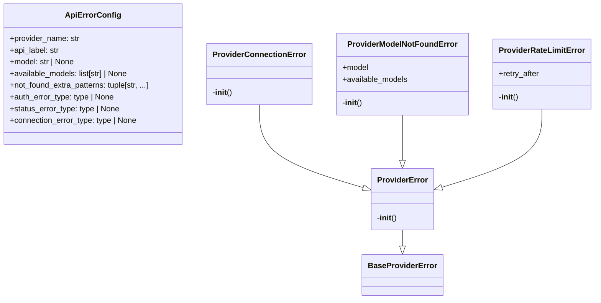
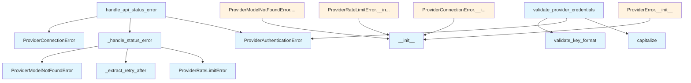

# File: `src/local_deepwiki/providers/errors.py`

## File Overview

This file defines a set of standardized exception classes and utility functions for handling errors that occur when interacting with external AI providers (e.g., OpenAI, Anthropic). The module centralizes error handling logic to ensure consistent behavior across different provider integrations, improving maintainability and debugging.

The file is designed to work in conjunction with [`local_deepwiki.errors.BaseProviderError`](../errors.md) and [`local_deepwiki.providers.credentials.CredentialManager`](credentials.md), which provide the base error infrastructure and credential validation logic respectively.

## Key Concepts

### Standardized Exception Hierarchy

The module defines a hierarchy of provider-specific exceptions inheriting from `ProviderError`, which in turn inherits from [`BaseProviderError`](../errors.md). This design ensures:

- **Consistency**: All provider errors follow a common structure with optional `hint`, `context`, and `original_error`.
- **Backward Compatibility**: The `ProviderError` class supports both legacy signatures (message, provider_name) and new features like hints and context.
- **Granular Error Types**: Each specific error type (`ProviderConnectionError`, `ProviderRateLimitError`, etc.) allows callers to handle different failure modes appropriately.

### Error Handling Utilities

Two main utility functions are provided for consolidating common error handling patterns:

- `validate_provider_credentials`: Centralizes credential validation logic used by multiple providers, reducing duplication.
- `handle_api_status_error`: Converts SDK-specific API errors into standardized `ProviderError` subclasses based on configuration, abstracting away provider-specific error types.

These utilities promote reuse and reduce boilerplate in provider implementations.

### Configuration-Driven Error Mapping

The `ApiErrorConfig` class serves as a configuration object that allows mapping SDK-specific error types to standardized provider errors. This enables flexible and extensible error handling without hardcoding error detection logic per provider.

## Integration

This file is a core component of the provider integration layer within the `local_deepwiki` project. It is imported and used by:

- `local_deepwiki.providers.base` (for base error handling)
- `local_deepwiki.providers.openai` (for OpenAI-specific error handling)
- `local_deepwiki.providers.anthropic` (for Anthropic-specific error handling)
- `local_deepwiki.providers.credentials` (for credential validation)

It also integrates with:

- [`local_deepwiki.errors.BaseProviderError`](../errors.md) to ensure all errors are structured consistently.
- [`local_deepwiki.providers.credentials.CredentialManager`](credentials.md) to validate API keys.

The functions and classes in this file are used throughout the codebase to raise and handle errors when communicating with external APIs, ensuring a unified error reporting experience.

## Design Notes

### Why Standardized Exceptions?

By defining a consistent set of exception types, the system avoids scattered error handling logic and makes it easier to write robust code that reacts appropriately to different failure scenarios. For example, a `ProviderRateLimitError` can trigger a retry mechanism with a delay, while a `ProviderAuthenticationError` might prompt the user to check their API keys.

### Credential Validation Pattern

The `validate_provider_credentials` function encapsulates a common pattern seen across providers:

1. Check if an API key is present.
2. Validate its format using [`CredentialManager`](credentials.md).

This centralization reduces code duplication and ensures uniform validation behavior.

### Retry-After Header Support

The `_extract_retry_after` function provides support for extracting retry intervals from HTTP responses, which is essential for implementing rate-limit-aware retry logic. It handles potential parsing errors gracefully, returning `None` if the header is missing or malformed.

### Extensibility via `ApiErrorConfig`

The `ApiErrorConfig` class allows each provider to define how its SDK-specific exceptions map to `ProviderError` subclasses. This abstraction makes it easier to add new providers or modify existing ones without changing core error-handling logic.

### Backward Compatibility

The `ProviderError` class maintains backward compatibility with older code by accepting the legacy `(message, provider_name)` signature, while also supporting richer features like `hint`, `context`, and `original_error`. This allows gradual migration to more detailed error reporting without breaking existing integrations.

## API Reference

### class `ProviderError`

**Inherits from:** [`BaseProviderError`](../errors.md)

Base exception for all provider errors.  Inherits from local_deepwiki.errors.ProviderError ([DeepWikiError](../errors.md) subclass) to provide consistent error handling with hints and context.  This class maintains backward compatibility with existing code that uses the simpler (message, provider_name) signature while also supporting the richer [DeepWikiError](../errors.md) features (hint, context, original_error).

**Methods:**


<details>
<summary>View Source (lines 28-55) | <a href="https://github.com/UrbanDiver/local-deepwiki-mcp/blob/main/src/local_deepwiki/providers/errors.py#L28-L55">GitHub</a></summary>

```python
class ProviderError(BaseProviderError):
    """Base exception for all provider errors.

    Inherits from local_deepwiki.errors.ProviderError (DeepWikiError subclass)
    to provide consistent error handling with hints and context.

    This class maintains backward compatibility with existing code that uses
    the simpler (message, provider_name) signature while also supporting
    the richer DeepWikiError features (hint, context, original_error).
    """

    def __init__(
        self,
        message: str,
        provider_name: str | None = None,
        *,
        hint: str | None = None,
        context: dict[str, Any] | None = None,
        original_error: Exception | None = None,
    ):
        # Call the parent (BaseProviderError) __init__ with all parameters
        super().__init__(
            message=message,
            hint=hint,
            context=context,
            provider_name=provider_name,
            original_error=original_error,
        )
```

</details>

#### `__init__`

```python
def __init__(message: str, provider_name: str | None = None, hint: str | None = None, context: dict[str, Any] | None = None, original_error: Exception | None = None)
```


| Parameter | Type | Default | Description |
|-----------|------|---------|-------------|
| `message` | `str` | - | - |
| `provider_name` | `str | None` | `None` | - |
| `hint` | `str | None` | `None` | - |
| `context` | `dict[str, Any] | None` | `None` | - |
| `original_error` | `Exception | None` | `None` | - |


<details>
<summary>View Source (lines 28-55) | <a href="https://github.com/UrbanDiver/local-deepwiki-mcp/blob/main/src/local_deepwiki/providers/errors.py#L28-L55">GitHub</a></summary>

```python
class ProviderError(BaseProviderError):
    """Base exception for all provider errors.

    Inherits from local_deepwiki.errors.ProviderError (DeepWikiError subclass)
    to provide consistent error handling with hints and context.

    This class maintains backward compatibility with existing code that uses
    the simpler (message, provider_name) signature while also supporting
    the richer DeepWikiError features (hint, context, original_error).
    """

    def __init__(
        self,
        message: str,
        provider_name: str | None = None,
        *,
        hint: str | None = None,
        context: dict[str, Any] | None = None,
        original_error: Exception | None = None,
    ):
        # Call the parent (BaseProviderError) __init__ with all parameters
        super().__init__(
            message=message,
            hint=hint,
            context=context,
            provider_name=provider_name,
            original_error=original_error,
        )
```

</details>

### class `ProviderConnectionError`

**Inherits from:** `ProviderError`

Raised when a provider cannot be reached or connected to.

**Methods:**


<details>
<summary>View Source (lines 58-72) | <a href="https://github.com/UrbanDiver/local-deepwiki-mcp/blob/main/src/local_deepwiki/providers/errors.py#L58-L72">GitHub</a></summary>

```python
class ProviderConnectionError(ProviderError):
    """Raised when a provider cannot be reached or connected to."""

    def __init__(
        self,
        message: str,
        provider_name: str | None = None,
        original_error: Exception | None = None,
    ):
        super().__init__(
            message,
            provider_name,
            original_error=original_error,
            hint="Check your network connection and verify the service is accessible.",
        )
```

</details>

#### `__init__`

```python
def __init__(message: str, provider_name: str | None = None, original_error: Exception | None = None)
```


| Parameter | Type | Default | Description |
|-----------|------|---------|-------------|
| `message` | `str` | - | - |
| `provider_name` | `str | None` | `None` | - |
| `original_error` | `Exception | None` | `None` | - |


<details>
<summary>View Source (lines 58-72) | <a href="https://github.com/UrbanDiver/local-deepwiki-mcp/blob/main/src/local_deepwiki/providers/errors.py#L58-L72">GitHub</a></summary>

```python
class ProviderConnectionError(ProviderError):
    """Raised when a provider cannot be reached or connected to."""

    def __init__(
        self,
        message: str,
        provider_name: str | None = None,
        original_error: Exception | None = None,
    ):
        super().__init__(
            message,
            provider_name,
            original_error=original_error,
            hint="Check your network connection and verify the service is accessible.",
        )
```

</details>

### class `ProviderRateLimitError`

**Inherits from:** `ProviderError`

Raised when a provider rate limits the request.

**Methods:**


<details>
<summary>View Source (lines 75-88) | <a href="https://github.com/UrbanDiver/local-deepwiki-mcp/blob/main/src/local_deepwiki/providers/errors.py#L75-L88">GitHub</a></summary>

```python
class ProviderRateLimitError(ProviderError):
    """Raised when a provider rate limits the request."""

    def __init__(
        self,
        message: str,
        provider_name: str | None = None,
        retry_after: float | None = None,
    ):
        self.retry_after = retry_after
        hint = "Wait a few minutes and try again, or consider upgrading your API plan."
        if retry_after:
            hint = f"Rate limited. Retry after {retry_after} seconds."
        super().__init__(message, provider_name, hint=hint)
```

</details>

#### `__init__`

```python
def __init__(message: str, provider_name: str | None = None, retry_after: float | None = None)
```


| Parameter | Type | Default | Description |
|-----------|------|---------|-------------|
| `message` | `str` | - | - |
| `provider_name` | `str | None` | `None` | - |
| `retry_after` | `float | None` | `None` | - |


<details>
<summary>View Source (lines 75-88) | <a href="https://github.com/UrbanDiver/local-deepwiki-mcp/blob/main/src/local_deepwiki/providers/errors.py#L75-L88">GitHub</a></summary>

```python
class ProviderRateLimitError(ProviderError):
    """Raised when a provider rate limits the request."""

    def __init__(
        self,
        message: str,
        provider_name: str | None = None,
        retry_after: float | None = None,
    ):
        self.retry_after = retry_after
        hint = "Wait a few minutes and try again, or consider upgrading your API plan."
        if retry_after:
            hint = f"Rate limited. Retry after {retry_after} seconds."
        super().__init__(message, provider_name, hint=hint)
```

</details>

### class `ProviderModelNotFoundError`

**Inherits from:** `ProviderError`

Raised when the requested model is not available.

**Methods:**


<details>
<summary>View Source (lines 91-111) | <a href="https://github.com/UrbanDiver/local-deepwiki-mcp/blob/main/src/local_deepwiki/providers/errors.py#L91-L111">GitHub</a></summary>

```python
class ProviderModelNotFoundError(ProviderError):
    """Raised when the requested model is not available."""

    def __init__(
        self,
        model: str,
        provider_name: str | None = None,
        available_models: list[str] | None = None,
    ):
        self.model = model
        self.available_models = available_models or []
        if available_models:
            models_str = ", ".join(available_models[:10])
            if len(available_models) > 10:
                models_str += f"... ({len(available_models)} total)"
            message = f"Model '{model}' not found. Available models: {models_str}"
            hint = f"Try one of the available models: {models_str}"
        else:
            message = f"Model '{model}' not found"
            hint = "Check the model name and ensure it's accessible in your account."
        super().__init__(message, provider_name, hint=hint)
```

</details>

#### `__init__`

```python
def __init__(model: str, provider_name: str | None = None, available_models: list[str] | None = None)
```


| Parameter | Type | Default | Description |
|-----------|------|---------|-------------|
| `model` | `str` | - | - |
| `provider_name` | `str | None` | `None` | - |
| `available_models` | `list[str] | None` | `None` | - |


<details>
<summary>View Source (lines 91-111) | <a href="https://github.com/UrbanDiver/local-deepwiki-mcp/blob/main/src/local_deepwiki/providers/errors.py#L91-L111">GitHub</a></summary>

```python
class ProviderModelNotFoundError(ProviderError):
    """Raised when the requested model is not available."""

    def __init__(
        self,
        model: str,
        provider_name: str | None = None,
        available_models: list[str] | None = None,
    ):
        self.model = model
        self.available_models = available_models or []
        if available_models:
            models_str = ", ".join(available_models[:10])
            if len(available_models) > 10:
                models_str += f"... ({len(available_models)} total)"
            message = f"Model '{model}' not found. Available models: {models_str}"
            hint = f"Try one of the available models: {models_str}"
        else:
            message = f"Model '{model}' not found"
            hint = "Check the model name and ensure it's accessible in your account."
        super().__init__(message, provider_name, hint=hint)
```

</details>

### class `ProviderAuthenticationError`

**Inherits from:** `ProviderError`

Raised when authentication with the provider fails.


<details>
<summary>View Source (lines 114-117) | <a href="https://github.com/UrbanDiver/local-deepwiki-mcp/blob/main/src/local_deepwiki/providers/errors.py#L114-L117">GitHub</a></summary>

```python
class ProviderAuthenticationError(ProviderError):
    """Raised when authentication with the provider fails."""

    pass
```

</details>

### class `ProviderConfigurationError`

**Inherits from:** `ProviderError`

Raised when the provider is misconfigured.


<details>
<summary>View Source (lines 120-123) | <a href="https://github.com/UrbanDiver/local-deepwiki-mcp/blob/main/src/local_deepwiki/providers/errors.py#L120-L123">GitHub</a></summary>

```python
class ProviderConfigurationError(ProviderError):
    """Raised when the provider is misconfigured."""

    pass
```

</details>

### class `ApiErrorConfig`

Provider-specific error handling configuration.

---


<details>
<summary>View Source (lines 189-199) | <a href="https://github.com/UrbanDiver/local-deepwiki-mcp/blob/main/src/local_deepwiki/providers/errors.py#L189-L199">GitHub</a></summary>

```python
class ApiErrorConfig:
    """Provider-specific error handling configuration."""

    provider_name: str
    api_label: str
    model: str | None = None
    available_models: list[str] | None = None
    not_found_extra_patterns: tuple[str, ...] = ()
    auth_error_type: type | None = None
    status_error_type: type | None = None
    connection_error_type: type | None = None
```

</details>

### Functions

#### `validate_provider_credentials`

```python
def validate_provider_credentials(provider_name: str, api_key: str | None, key_type: str, env_var: str, display_name: str | None = None) -> str
```

Validate and return an API key, raising ProviderAuthenticationError if invalid.  Consolidates the repeated credential validation pattern used by OpenAI and Anthropic providers: get key -> check presence -> validate format.


| Parameter | Type | Default | Description |
|-----------|------|---------|-------------|
| `provider_name` | `str` | - | Provider identifier for the exception (e.g. ``"openai:gpt"``). |
| `api_key` | `str | None` | - | The API key to validate (may be None). |
| `key_type` | `str` | - | Provider key type passed to ``CredentialManager.validate_key_format`` (e.g. ``"openai"``, ``"anthropic"``). |
| `env_var` | `str` | - | Environment variable name for the error hint (e.g. ``"OPENAI_API_KEY"``). |
| `display_name` | `str | None` | `None` | Human-readable provider name used in error messages (e.g. ``"OpenAI"``).  Defaults to *key_type* with its first letter capitalised. |

**Returns:** `str`


<details>
<summary>View Source (lines 131-180) | <a href="https://github.com/UrbanDiver/local-deepwiki-mcp/blob/main/src/local_deepwiki/providers/errors.py#L131-L180">GitHub</a></summary>

```python
def validate_provider_credentials(
    provider_name: str,
    api_key: str | None,
    key_type: str,
    env_var: str,
    *,
    display_name: str | None = None,
) -> str:
    """Validate and return an API key, raising ProviderAuthenticationError if invalid.

    Consolidates the repeated credential validation pattern used by OpenAI and
    Anthropic providers: get key -> check presence -> validate format.

    Args:
        provider_name: Provider identifier for the exception
                       (e.g. ``"openai:gpt"``).
        api_key: The API key to validate (may be None).
        key_type: Provider key type passed to
                  ``CredentialManager.validate_key_format``
                  (e.g. ``"openai"``, ``"anthropic"``).
        env_var: Environment variable name for the error hint
                 (e.g. ``"OPENAI_API_KEY"``).
        display_name: Human-readable provider name used in error messages
                      (e.g. ``"OpenAI"``).  Defaults to *key_type* with
                      its first letter capitalised.

    Returns:
        The validated API key string.

    Raises:
        ProviderAuthenticationError: If no key is provided or the format
            is invalid.
    """
    from local_deepwiki.providers.credentials import CredentialManager

    label = display_name if display_name is not None else key_type.capitalize()

    if not api_key:
        raise ProviderAuthenticationError(
            f"No {label} API key configured. Set {env_var} environment variable.",
            provider_name=provider_name,
        )

    if not CredentialManager.validate_key_format(api_key, key_type):
        raise ProviderAuthenticationError(
            f"{label} API key format appears invalid.",
            provider_name=provider_name,
        )

    return api_key
```

</details>

#### `handle_api_status_error`

```python
def handle_api_status_error(e: Exception, config: ApiErrorConfig) -> None
```

Convert SDK-specific API errors to standardized provider errors.  This consolidates the duplicated error-handling logic shared by the Anthropic, OpenAI LLM, and OpenAI embedding providers.


| Parameter | Type | Default | Description |
|-----------|------|---------|-------------|
| `e` | `Exception` | - | The original exception from the SDK. |
| `config` | `ApiErrorConfig` | - | Provider-specific error handling configuration. |

**Returns:** `None`


<details>
<summary>View Source (lines 238-262) | <a href="https://github.com/UrbanDiver/local-deepwiki-mcp/blob/main/src/local_deepwiki/providers/errors.py#L238-L262">GitHub</a></summary>

```python
def handle_api_status_error(e: Exception, config: ApiErrorConfig) -> None:
    """Convert SDK-specific API errors to standardized provider errors.

    This consolidates the duplicated error-handling logic shared by the
    Anthropic, OpenAI LLM, and OpenAI embedding providers.

    Args:
        e: The original exception from the SDK.
        config: Provider-specific error handling configuration.
    """
    if config.auth_error_type and isinstance(e, config.auth_error_type):
        raise ProviderAuthenticationError(
            f"{config.api_label} authentication failed. Check your API key.",
            provider_name=config.provider_name,
        ) from e

    if config.status_error_type and isinstance(e, config.status_error_type):
        _handle_status_error(e, config)

    if config.connection_error_type and isinstance(e, config.connection_error_type):
        raise ProviderConnectionError(
            f"Failed to connect to {config.api_label}: {e}",
            provider_name=config.provider_name,
            original_error=e,
        ) from e
```

</details>

## Class Diagram



## Call Graph



## Used By

Functions and methods in this file and their callers:

- **`ProviderAuthenticationError`**: called by `handle_api_status_error`, `validate_provider_credentials`
- **`ProviderConnectionError`**: called by `handle_api_status_error`
- **`ProviderModelNotFoundError`**: called by `_handle_status_error`
- **`ProviderRateLimitError`**: called by `_handle_status_error`
- **`__init__`**: called by `ProviderConnectionError.__init__`, `ProviderError.__init__`, `ProviderModelNotFoundError.__init__`, `ProviderRateLimitError.__init__`
- **`_extract_retry_after`**: called by `_handle_status_error`
- **`_handle_status_error`**: called by `handle_api_status_error`
- **`capitalize`**: called by `validate_provider_credentials`
- **`validate_key_format`**: called by `validate_provider_credentials`

## Usage Examples

*Examples extracted from test files*

### Test basic provider error

From `test_errors.py::TestBaseProviderError::test_basic_provider_error`:

```python
error = BaseProviderError("API call failed")
assert "API call failed" in str(error)
assert error.provider_name is None
assert error.original_error is None
```

### Test provider error with original exception

From `test_errors.py::TestBaseProviderError::test_provider_error_with_original_exception`:

```python
error = BaseProviderError(
    "Failed to connect",
    hint="Check your connection",
    provider_name="anthropic",
    original_error=original,
)
assert error.provider_name == "anthropic"
assert error.original_error is original
```

### Test that all errors can be caught as DeepWikiError

From `test_errors.py::TestErrorHierarchy::test_all_errors_can_be_caught_as_deepwiki_error`:

```python
errors = [
    ValidationError("test"),
    EnvironmentSetupError("test"),
    BaseProviderError("test"),
    IndexingError("test"),
    ExportError("test"),
    ResearchError("test"),
]

for error in errors:
    with pytest.raises(DeepWikiError):
        raise error
```


## Last Modified

| Entity | Type | Author | Date | Commit |
|--------|------|--------|------|--------|
| `_extract_retry_after` | function | Brian Breidenbach | 2 days ago | `512fa22` refactor: decompose CC > 15... |
| `_handle_status_error` | function | Brian Breidenbach | 2 days ago | `512fa22` refactor: decompose CC > 15... |
| `handle_api_status_error` | function | Brian Breidenbach | 2 days ago | `512fa22` refactor: decompose CC > 15... |
| `ApiErrorConfig` | class | Brian Breidenbach | 1 week ago | `5465a75` refactor: introduce ApiErro... |
| `ProviderError` | class | Brian Breidenbach | 1 week ago | `0f86cb5` refactor: extract services,... |
| `ProviderConnectionError` | class | Brian Breidenbach | 1 week ago | `0f86cb5` refactor: extract services,... |
| `ProviderRateLimitError` | class | Brian Breidenbach | 1 week ago | `0f86cb5` refactor: extract services,... |
| `ProviderModelNotFoundError` | class | Brian Breidenbach | 1 week ago | `0f86cb5` refactor: extract services,... |
| `ProviderAuthenticationError` | class | Brian Breidenbach | 1 week ago | `0f86cb5` refactor: extract services,... |
| `ProviderConfigurationError` | class | Brian Breidenbach | 1 week ago | `0f86cb5` refactor: extract services,... |
| `validate_provider_credentials` | function | Brian Breidenbach | 1 week ago | `0f86cb5` refactor: extract services,... |

## Additional Source Code

Source code for functions and methods not listed in the API Reference above.

#### `_extract_retry_after`

<details>
<summary>View Source (lines 202-213) | <a href="https://github.com/UrbanDiver/local-deepwiki-mcp/blob/main/src/local_deepwiki/providers/errors.py#L202-L213">GitHub</a></summary>

```python
def _extract_retry_after(e: Exception) -> float | None:
    """Extract Retry-After header value from an API error response."""
    response = getattr(e, "response", None)
    if not response:
        return None
    retry_after_str = response.headers.get("retry-after")
    if not retry_after_str:
        return None
    try:
        return float(retry_after_str)
    except ValueError:
        return None
```

</details>


#### `_handle_status_error`

<details>
<summary>View Source (lines 216-235) | <a href="https://github.com/UrbanDiver/local-deepwiki-mcp/blob/main/src/local_deepwiki/providers/errors.py#L216-L235">GitHub</a></summary>

```python
def _handle_status_error(e: Exception, config: ApiErrorConfig) -> None:
    """Raise the appropriate provider error for an API status error."""
    error_str = str(e).lower()
    status_code = getattr(e, "status_code", None)

    if status_code == 429 or "rate" in error_str:
        raise ProviderRateLimitError(
            f"{config.api_label} rate limit exceeded: {e}",
            provider_name=config.provider_name,
            retry_after=_extract_retry_after(e),
        ) from e

    if config.model is not None:
        not_found_patterns = ("not found", *config.not_found_extra_patterns)
        if status_code == 404 or any(p in error_str for p in not_found_patterns):
            raise ProviderModelNotFoundError(
                config.model,
                provider_name=config.provider_name,
                available_models=config.available_models or [],
            ) from e
```

</details>

## Relevant Source Files

- `src/local_deepwiki/providers/errors.py:28-55`
