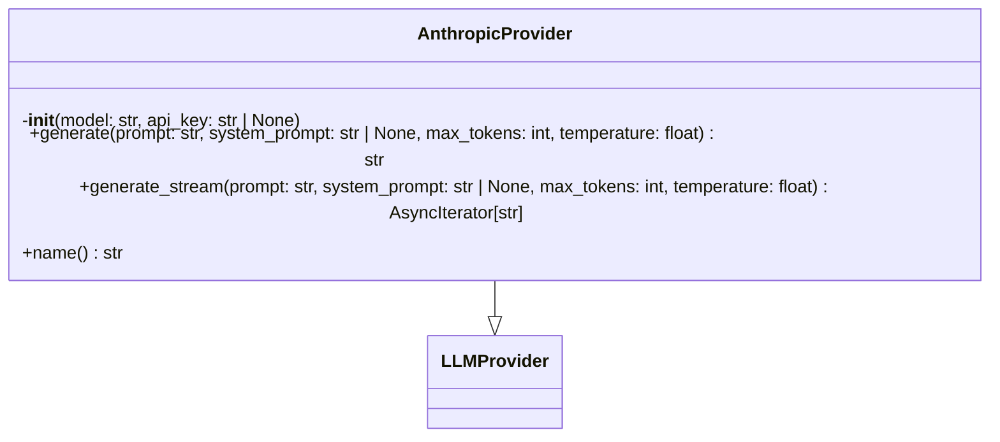
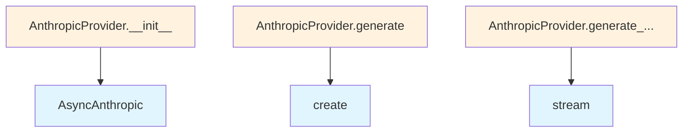

# AnthropicProvider Module

## File Overview

The `anthropic.py` module provides an LLM provider implementation for Anthropic's Claude API. It implements the [LLMProvider](../base.md) interface to enable text generation and streaming capabilities using Anthropic's async client library.

## Classes

### AnthropicProvider

The AnthropicProvider class extends [LLMProvider](../base.md) to provide integration with Anthropic's Claude language models. It handles both standard text generation and streaming responses.

**Key Methods:**
- `__init__`: Initializes the provider with necessary configuration
- `generate`: Performs standard text generation
- `generate_stream`: Provides streaming text generation
- `name`: Returns the provider name identifier

## Dependencies

This module relies on several key components:

- **AsyncAnthropic**: The official Anthropic async client for API communication
- **[LLMProvider](../base.md)**: Base class providing the provider interface
- **[with_retry](../base.md)**: Decorator for handling retry logic on failed requests
- **[get_logger](../../logging.md)**: Logging utility for the application

## Environment Requirements

The module uses `os` for environment variable access, indicating it likely requires API key configuration through environment variables for Anthropic service authentication.

## Usage Context

The AnthropicProvider integrates into the broader local_deepwiki system as one of the available LLM providers. It follows the standard provider pattern, allowing it to be used interchangeably with other LLM providers in the system through the common [LLMProvider](../base.md) interface.

The streaming capability (`generate_stream`) returns an `AsyncIterator`, enabling real-time text generation for applications requiring progressive response handling.

## API Reference

### class `AnthropicProvider`

**Inherits from:** [`LLMProvider`](../base.md)

LLM provider using Anthropic API.

**Methods:**


<details>
<summary>View Source (lines 14-144)</summary>

```python
class AnthropicProvider(LLMProvider):
    # Methods: __init__, generate, generate_stream, name
```

</details>

#### `__init__`

```python
def __init__(model: str = "claude-sonnet-4-20250514", api_key: str | None = None)
```

Initialize the Anthropic provider.


| [Parameter](../../generators/api_docs.md) | Type | Default | Description |
|-----------|------|---------|-------------|
| `model` | `str` | `"claude-sonnet-4-20250514"` | Anthropic model name. |
| `api_key` | `str | None` | `None` | Optional API key. Uses ANTHROPIC_API_KEY env var if not provided. |


<details>
<summary>View Source (lines 17-25)</summary>

```python
def __init__(self, model: str = "claude-sonnet-4-20250514", api_key: str | None = None):
        """Initialize the Anthropic provider.

        Args:
            model: Anthropic model name.
            api_key: Optional API key. Uses ANTHROPIC_API_KEY env var if not provided.
        """
        self._model = model
        self._client = AsyncAnthropic(api_key=api_key or os.environ.get("ANTHROPIC_API_KEY"))
```

</details>

#### `generate`

```python
async def generate(prompt: str, system_prompt: str | None = None, max_tokens: int = 4096, temperature: float = 0.7) -> str
```

Generate text from a prompt.


| [Parameter](../../generators/api_docs.md) | Type | Default | Description |
|-----------|------|---------|-------------|
| `prompt` | `str` | - | The user prompt. |
| `system_prompt` | `str | None` | `None` | Optional system prompt. |
| `max_tokens` | `int` | `4096` | Maximum tokens to generate. |
| `temperature` | `float` | `0.7` | Sampling temperature. |


<details>
<summary>View Source (lines 28-83)</summary>

```python
async def generate(
        self,
        prompt: str,
        system_prompt: str | None = None,
        max_tokens: int = 4096,
        temperature: float = 0.7,
    ) -> str:
        """Generate text from a prompt.

        Args:
            prompt: The user prompt.
            system_prompt: Optional system prompt.
            max_tokens: Maximum tokens to generate.
            temperature: Sampling temperature.

        Returns:
            Generated text.
        """
        logger.debug(f"Generating with Anthropic model {self._model}, prompt length: {len(prompt)}")

        # Use explicit arguments to satisfy type checker
        if system_prompt and temperature > 0:
            response = await self._client.messages.create(
                model=self._model,
                max_tokens=max_tokens,
                messages=[{"role": "user", "content": prompt}],
                system=system_prompt,
                temperature=temperature,
            )
        elif system_prompt:
            response = await self._client.messages.create(
                model=self._model,
                max_tokens=max_tokens,
                messages=[{"role": "user", "content": prompt}],
                system=system_prompt,
            )
        elif temperature > 0:
            response = await self._client.messages.create(
                model=self._model,
                max_tokens=max_tokens,
                messages=[{"role": "user", "content": prompt}],
                temperature=temperature,
            )
        else:
            response = await self._client.messages.create(
                model=self._model,
                max_tokens=max_tokens,
                messages=[{"role": "user", "content": prompt}],
            )

        # Get text from the first content block (should be TextBlock)
        first_block = response.content[0]
        content = first_block.text if hasattr(first_block, "text") else ""

        logger.debug(f"Anthropic response length: {len(content)}")
        return content
```

</details>

#### `generate_stream`

```python
async def generate_stream(prompt: str, system_prompt: str | None = None, max_tokens: int = 4096, temperature: float = 0.7) -> AsyncIterator[str]
```

Generate text from a prompt with streaming.


| [Parameter](../../generators/api_docs.md) | Type | Default | Description |
|-----------|------|---------|-------------|
| `prompt` | `str` | - | The user prompt. |
| `system_prompt` | `str | None` | `None` | Optional system prompt. |
| `max_tokens` | `int` | `4096` | Maximum tokens to generate. |
| `temperature` | `float` | `0.7` | Sampling temperature. |


<details>
<summary>View Source (lines 85-139)</summary>

```python
async def generate_stream(
        self,
        prompt: str,
        system_prompt: str | None = None,
        max_tokens: int = 4096,
        temperature: float = 0.7,
    ) -> AsyncIterator[str]:
        """Generate text from a prompt with streaming.

        Args:
            prompt: The user prompt.
            system_prompt: Optional system prompt.
            max_tokens: Maximum tokens to generate.
            temperature: Sampling temperature.

        Yields:
            Generated text chunks.
        """
        # Use explicit arguments to satisfy type checker
        if system_prompt and temperature > 0:
            async with self._client.messages.stream(
                model=self._model,
                max_tokens=max_tokens,
                messages=[{"role": "user", "content": prompt}],
                system=system_prompt,
                temperature=temperature,
            ) as stream:
                async for text in stream.text_stream:
                    yield text
        elif system_prompt:
            async with self._client.messages.stream(
                model=self._model,
                max_tokens=max_tokens,
                messages=[{"role": "user", "content": prompt}],
                system=system_prompt,
            ) as stream:
                async for text in stream.text_stream:
                    yield text
        elif temperature > 0:
            async with self._client.messages.stream(
                model=self._model,
                max_tokens=max_tokens,
                messages=[{"role": "user", "content": prompt}],
                temperature=temperature,
            ) as stream:
                async for text in stream.text_stream:
                    yield text
        else:
            async with self._client.messages.stream(
                model=self._model,
                max_tokens=max_tokens,
                messages=[{"role": "user", "content": prompt}],
            ) as stream:
                async for text in stream.text_stream:
                    yield text
```

</details>

#### `name`

```python
def name() -> str
```

Get the provider name.


<details>
<summary>View Source (lines 142-144)</summary>

```python
def name(self) -> str:
        """Get the provider name."""
        return f"anthropic:{self._model}"
```

</details>

## Class Diagram



## Call Graph



## Relevant Source Files

- `src/local_deepwiki/providers/llm/anthropic.py:14-144`
