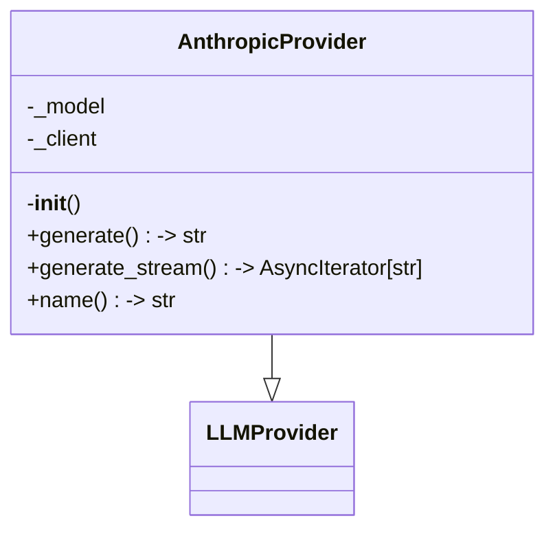
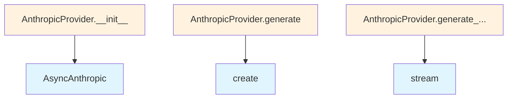

# Anthropic LLM Provider

## File Overview

This module provides an Anthropic LLM provider implementation for the local_deepwiki system. It integrates with Anthropic's API through the AsyncAnthropic client to provide language model capabilities.

## Classes

### AnthropicProvider

The AnthropicProvider class serves as the [main](../../export/pdf.md) interface for interacting with Anthropic's language models within the local_deepwiki system. This class inherits from the [LLMProvider](../base.md) base class and implements Anthropic-specific functionality.

## Dependencies

The module imports the following components:

- `os`: Standard library for environment variable access
- `AsyncIterator` from `typing`: Type hint for asynchronous iteration
- `AsyncAnthropic`: The official Anthropic Python client for API interactions
- [`get_logger`](../../logging.md) from `local_deepwiki.logging`: Logging functionality
- [`LLMProvider`](../base.md) and [`with_retry`](../base.md) from `local_deepwiki.providers.base`: Base provider class and retry [decorator](../base.md)

## Related Components

This provider integrates with the broader local_deepwiki provider system through:

- **[LLMProvider](../base.md)**: The base class that defines the common interface for all LLM providers
- **[with_retry](../base.md)**: A [decorator](../base.md) from the base module that likely provides retry functionality for API calls
- **Logging system**: Uses the centralized logging system for consistent log formatting

## Usage Context

This provider would typically be instantiated and used by other components in the local_deepwiki system that need to interact with Anthropic's language models. The class follows the provider pattern established by the [LLMProvider](../base.md) base class, ensuring consistent interfaces across different LLM implementations.

## API Reference

### class `AnthropicProvider`

**Inherits from:** [`LLMProvider`](../base.md)

LLM provider using Anthropic API.

**Methods:**

#### `__init__`

```python
def __init__(model: str = "claude-sonnet-4-20250514", api_key: str | None = None)
```

Initialize the Anthropic provider.


| [Parameter](../../generators/api_docs.md) | Type | Default | Description |
|-----------|------|---------|-------------|
| `model` | `str` | `"claude-sonnet-4-20250514"` | Anthropic model name. |
| `api_key` | `str | None` | `None` | Optional API key. Uses ANTHROPIC_API_KEY env var if not provided. |

#### `generate`

```python
async def generate(prompt: str, system_prompt: str | None = None, max_tokens: int = 4096, temperature: float = 0.7) -> str
```

Generate text from a prompt.


| [Parameter](../../generators/api_docs.md) | Type | Default | Description |
|-----------|------|---------|-------------|
| `prompt` | `str` | - | The user prompt. |
| `system_prompt` | `str | None` | `None` | Optional system prompt. |
| `max_tokens` | `int` | `4096` | Maximum tokens to generate. |
| `temperature` | `float` | `0.7` | Sampling temperature. |

#### `generate_stream`

```python
async def generate_stream(prompt: str, system_prompt: str | None = None, max_tokens: int = 4096, temperature: float = 0.7) -> AsyncIterator[str]
```

Generate text from a prompt with streaming.


| [Parameter](../../generators/api_docs.md) | Type | Default | Description |
|-----------|------|---------|-------------|
| `prompt` | `str` | - | The user prompt. |
| `system_prompt` | `str | None` | `None` | Optional system prompt. |
| `max_tokens` | `int` | `4096` | Maximum tokens to generate. |
| `temperature` | `float` | `0.7` | Sampling temperature. |

#### `name`

```python
def name() -> str
```

Get the provider name.


## Class Diagram



## Call Graph



## Relevant Source Files

- `src/local_deepwiki/providers/llm/anthropic.py:14-99`
