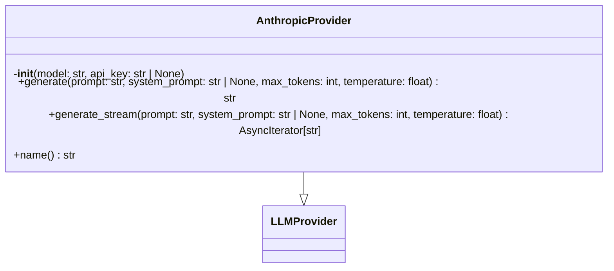
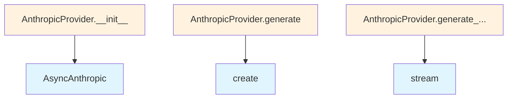

# Anthropic Provider Module

## File Overview

This module provides an Anthropic-based implementation of the LLM provider interface for the local_deepwiki system. It integrates with Anthropic's Claude models through their official Python SDK to provide text generation capabilities.

## Classes

### AnthropicProvider

The AnthropicProvider class implements the [LLMProvider](../base.md) interface to provide access to Anthropic's Claude models. This class handles authentication, request formatting, and response processing for both standard and streaming text generation.

**Key Methods:**
- `__init__` - Initializes the provider with configuration
- `generate` - Performs standard text generation
- `generate_stream` - Performs streaming text generation  
- `name` - Returns the provider identifier

## Dependencies

The module relies on several key dependencies:

- `anthropic.AsyncAnthropic` - Official Anthropic SDK for API communication
- [`local_deepwiki.providers.base.LLMProvider`](../base.md) - Base provider interface
- [`local_deepwiki.providers.base.with_retry`](../base.md) - Retry [decorator](../base.md) for resilient API calls
- [`local_deepwiki.logging.get_logger`](../../logging.md) - Logging functionality

## Usage Example

```python
from local_deepwiki.providers.llm.anthropic import AnthropicProvider

# Initialize the provider
provider = AnthropicProvider()

# Get provider name
print(provider.name())

# Generate text (async)
response = await provider.generate("Your prompt here")

# Generate streaming text (async)
async for chunk in provider.generate_stream("Your prompt here"):
    print(chunk, end="")
```

## Related Components

This module integrates with:

- **[LLMProvider](../base.md)** - The base class that defines the provider interface
- **[with_retry](../base.md)** - Decorator used for implementing retry logic on API calls
- **[get_logger](../../logging.md)** - Logging system for tracking operations and debugging

The AnthropicProvider follows the same interface pattern as other LLM providers in the system, allowing for interchangeable use within the broader local_deepwiki architecture.

## API Reference

### class `AnthropicProvider`

**Inherits from:** [`LLMProvider`](../base.md)

LLM provider using Anthropic API.

**Methods:**


<details>
<summary>View Source (lines 14-144) | <a href="https://github.com/UrbanDiver/local-deepwiki-mcp/blob/[main](../../export/pdf.md)/src/local_deepwiki/providers/llm/anthropic.py#L14-L144">GitHub</a></summary>

```python
class AnthropicProvider(LLMProvider):
    # Methods: __init__, generate, generate_stream, name
```

</details>

#### `__init__`

```python
def __init__(model: str = "claude-sonnet-4-20250514", api_key: str | None = None)
```

Initialize the Anthropic provider.


| [Parameter](../../generators/api_docs.md) | Type | Default | Description |
|-----------|------|---------|-------------|
| `model` | `str` | `"claude-sonnet-4-20250514"` | Anthropic model name. |
| `api_key` | `str | None` | `None` | Optional API key. Uses ANTHROPIC_API_KEY env var if not provided. |


<details>
<summary>View Source (lines 17-25) | <a href="https://github.com/UrbanDiver/local-deepwiki-mcp/blob/[main](../../export/pdf.md)/src/local_deepwiki/providers/llm/anthropic.py#L17-L25">GitHub</a></summary>

```python
def __init__(self, model: str = "claude-sonnet-4-20250514", api_key: str | None = None):
        """Initialize the Anthropic provider.

        Args:
            model: Anthropic model name.
            api_key: Optional API key. Uses ANTHROPIC_API_KEY env var if not provided.
        """
        self._model = model
        self._client = AsyncAnthropic(api_key=api_key or os.environ.get("ANTHROPIC_API_KEY"))
```

</details>

#### `generate`

```python
async def generate(prompt: str, system_prompt: str | None = None, max_tokens: int = 4096, temperature: float = 0.7) -> str
```

Generate text from a prompt.


| [Parameter](../../generators/api_docs.md) | Type | Default | Description |
|-----------|------|---------|-------------|
| `prompt` | `str` | - | The user prompt. |
| `system_prompt` | `str | None` | `None` | Optional system prompt. |
| `max_tokens` | `int` | `4096` | Maximum tokens to generate. |
| `temperature` | `float` | `0.7` | Sampling temperature. |


<details>
<summary>View Source (lines 28-83) | <a href="https://github.com/UrbanDiver/local-deepwiki-mcp/blob/[main](../../export/pdf.md)/src/local_deepwiki/providers/llm/anthropic.py#L28-L83">GitHub</a></summary>

```python
async def generate(
        self,
        prompt: str,
        system_prompt: str | None = None,
        max_tokens: int = 4096,
        temperature: float = 0.7,
    ) -> str:
        """Generate text from a prompt.

        Args:
            prompt: The user prompt.
            system_prompt: Optional system prompt.
            max_tokens: Maximum tokens to generate.
            temperature: Sampling temperature.

        Returns:
            Generated text.
        """
        logger.debug(f"Generating with Anthropic model {self._model}, prompt length: {len(prompt)}")

        # Use explicit arguments to satisfy type checker
        if system_prompt and temperature > 0:
            response = await self._client.messages.create(
                model=self._model,
                max_tokens=max_tokens,
                messages=[{"role": "user", "content": prompt}],
                system=system_prompt,
                temperature=temperature,
            )
        elif system_prompt:
            response = await self._client.messages.create(
                model=self._model,
                max_tokens=max_tokens,
                messages=[{"role": "user", "content": prompt}],
                system=system_prompt,
            )
        elif temperature > 0:
            response = await self._client.messages.create(
                model=self._model,
                max_tokens=max_tokens,
                messages=[{"role": "user", "content": prompt}],
                temperature=temperature,
            )
        else:
            response = await self._client.messages.create(
                model=self._model,
                max_tokens=max_tokens,
                messages=[{"role": "user", "content": prompt}],
            )

        # Get text from the first content block (should be TextBlock)
        first_block = response.content[0]
        content = first_block.text if hasattr(first_block, "text") else ""

        logger.debug(f"Anthropic response length: {len(content)}")
        return content
```

</details>

#### `generate_stream`

```python
async def generate_stream(prompt: str, system_prompt: str | None = None, max_tokens: int = 4096, temperature: float = 0.7) -> AsyncIterator[str]
```

Generate text from a prompt with streaming.


| [Parameter](../../generators/api_docs.md) | Type | Default | Description |
|-----------|------|---------|-------------|
| `prompt` | `str` | - | The user prompt. |
| `system_prompt` | `str | None` | `None` | Optional system prompt. |
| `max_tokens` | `int` | `4096` | Maximum tokens to generate. |
| `temperature` | `float` | `0.7` | Sampling temperature. |


<details>
<summary>View Source (lines 85-139) | <a href="https://github.com/UrbanDiver/local-deepwiki-mcp/blob/[main](../../export/pdf.md)/src/local_deepwiki/providers/llm/anthropic.py#L85-L139">GitHub</a></summary>

```python
async def generate_stream(
        self,
        prompt: str,
        system_prompt: str | None = None,
        max_tokens: int = 4096,
        temperature: float = 0.7,
    ) -> AsyncIterator[str]:
        """Generate text from a prompt with streaming.

        Args:
            prompt: The user prompt.
            system_prompt: Optional system prompt.
            max_tokens: Maximum tokens to generate.
            temperature: Sampling temperature.

        Yields:
            Generated text chunks.
        """
        # Use explicit arguments to satisfy type checker
        if system_prompt and temperature > 0:
            async with self._client.messages.stream(
                model=self._model,
                max_tokens=max_tokens,
                messages=[{"role": "user", "content": prompt}],
                system=system_prompt,
                temperature=temperature,
            ) as stream:
                async for text in stream.text_stream:
                    yield text
        elif system_prompt:
            async with self._client.messages.stream(
                model=self._model,
                max_tokens=max_tokens,
                messages=[{"role": "user", "content": prompt}],
                system=system_prompt,
            ) as stream:
                async for text in stream.text_stream:
                    yield text
        elif temperature > 0:
            async with self._client.messages.stream(
                model=self._model,
                max_tokens=max_tokens,
                messages=[{"role": "user", "content": prompt}],
                temperature=temperature,
            ) as stream:
                async for text in stream.text_stream:
                    yield text
        else:
            async with self._client.messages.stream(
                model=self._model,
                max_tokens=max_tokens,
                messages=[{"role": "user", "content": prompt}],
            ) as stream:
                async for text in stream.text_stream:
                    yield text
```

</details>

#### `name`

```python
def name() -> str
```

Get the provider name.


<details>
<summary>View Source (lines 142-144) | <a href="https://github.com/UrbanDiver/local-deepwiki-mcp/blob/[main](../../export/pdf.md)/src/local_deepwiki/providers/llm/anthropic.py#L142-L144">GitHub</a></summary>

```python
def name(self) -> str:
        """Get the provider name."""
        return f"anthropic:{self._model}"
```

</details>

## Class Diagram



## Call Graph



## Used By

Functions and methods in this file and their callers:

- **`AsyncAnthropic`**: called by `AnthropicProvider.__init__`
- **`create`**: called by `AnthropicProvider.generate`
- **`stream`**: called by `AnthropicProvider.generate_stream`

## Last Modified

| Entity | Type | Author | Date | Commit |
|--------|------|--------|------|--------|
| `AnthropicProvider` | class | Brian Breidenbach | today | `0d91a70` Apply Python best practices... |
| `generate` | method | Brian Breidenbach | today | `0d91a70` Apply Python best practices... |
| `generate_stream` | method | Brian Breidenbach | today | `0d91a70` Apply Python best practices... |
| `__init__` | method | Brian Breidenbach | 5 days ago | `cdae76f` Initial commit: Local DeepW... |
| `name` | method | Brian Breidenbach | 5 days ago | `cdae76f` Initial commit: Local DeepW... |

## Relevant Source Files

- `src/local_deepwiki/providers/llm/anthropic.py:14-144`
