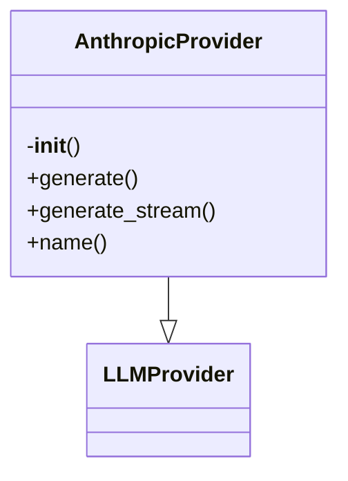

# Anthropic Provider Documentation

## File Overview

This file implements the Anthropic LLM provider for the local_deepwiki system. It provides an asynchronous interface to interact with Anthropic's Claude models through their API, extending the base LLMProvider class to integrate with the system's provider architecture.

## Classes

### `AnthropicProvider`

**Purpose**: 
An asynchronous provider that implements the LLMProvider interface for Anthropic's Claude models. This class handles authentication, model selection, and asynchronous generation of responses from Anthropic's API.

**Key Methods**:

- `__init__(self, model: str = "claude-3-haiku-20240307")`: Initializes the provider with a default model name
- `generate(self, prompt: str) -> AsyncIterator[str]`: Asynchronously generates text responses from the LLM
- `get_model_name(self) -> str`: Returns the name of the configured model

**Usage**:
```python
provider = AnthropicProvider(model="claude-3-sonnet-20240229")
async for chunk in provider.generate("Hello, world!"):
    print(chunk)
```

## Functions

### `__init__(self, model: str = "claude-3-haiku-20240307")`

**Parameters**:
- `model` (str): The name of the Anthropic model to use (default: "claude-3-haiku-20240307")

**Purpose**: 
Initializes the Anthropic provider with the specified model and sets up the AsyncAnthropic client using the API key from the environment.

### `generate(self, prompt: str) -> AsyncIterator[str]`

**Parameters**:
- `prompt` (str): The input prompt to send to the LLM

**Return Value**:
- `AsyncIterator[str]`: An asynchronous iterator that yields response chunks from the LLM

**Purpose**: 
Generates text responses from the configured Anthropic model asynchronously, yielding response chunks as they become available.

### `get_model_name(self) -> str`

**Return Value**:
- `str`: The name of the configured Anthropic model

**Purpose**: 
Returns the name of the model currently configured for use with this provider.

## Usage Examples

### Basic Usage
```python
from local_deepwiki.providers.llm.anthropic import AnthropicProvider

# Initialize provider with default model
provider = AnthropicProvider()

# Generate response
async for chunk in provider.generate("What is the capital of France?"):
    print(chunk)
```

### Custom Model Selection
```python
from local_deepwiki.providers.llm.anthropic import AnthropicProvider

# Initialize provider with specific model
provider = AnthropicProvider(model="claude-3-sonnet-20240229")

# Get model name
model_name = provider.get_model_name()
print(f"Using model: {model_name}")
```

## Dependencies

This file depends on:
- `os`: For accessing environment variables (specifically `ANTHROPIC_API_KEY`)
- `typing.AsyncIterator`: For type hints of asynchronous iterators
- `anthropic.AsyncAnthropic`: The official Anthropic SDK for asynchronous API calls
- `local_deepwiki.providers.base.LLMProvider`: Base class that this provider implements

**Environment Requirements**:
- `ANTHROPIC_API_KEY` must be set in the environment variables for API authentication

## Class Diagram



## See Also

- [base](../base.md) - dependency
- [openai](openai.md) - shares 3 dependencies
- [config](../../config.md) - shares 2 dependencies
- [vectorstore](../../core/vectorstore.md) - shares 2 dependencies
