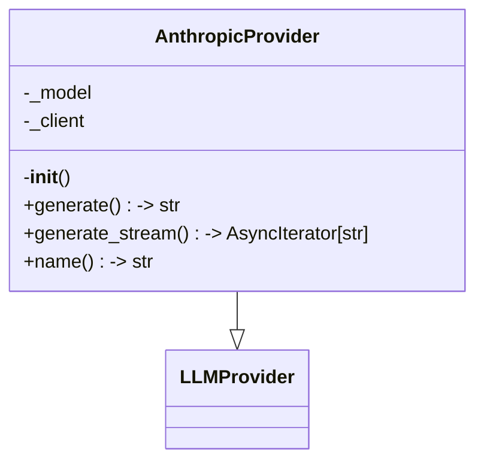
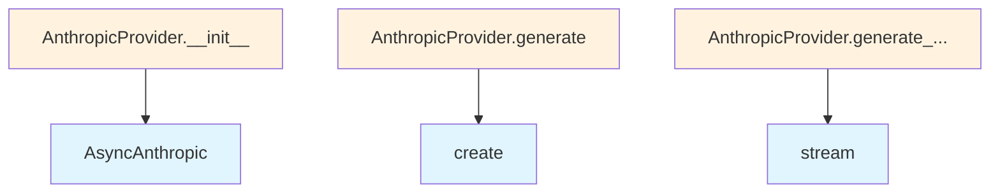

# anthropic.py

## File Overview

This module provides an Anthropic-based implementation of the LLM (Large [Language](../../models.md) Model) provider interface. It integrates with Anthropic's API through the AsyncAnthropic client to provide language model capabilities within the local_deepwiki system.

## Classes

### AnthropicProvider

The AnthropicProvider class implements the [LLMProvider](../base.md) interface to provide access to Anthropic's language models. This class handles authentication and communication with Anthropic's API services.

**Inheritance:**
- Extends: [LLMProvider](../base.md)

**Key Features:**
- Asynchronous API integration with Anthropic
- Built-in retry mechanism through the [`with_retry`](../base.md) [decorator](../base.md)
- Environment-based configuration support

## Dependencies

The module relies on several key components:

- **AsyncAnthropic**: The official Anthropic Python client for asynchronous API calls
- **[LLMProvider](../base.md)**: Base class that defines the provider interface
- **[with_retry](../base.md)**: Decorator for implementing retry logic on API calls
- **[get_logger](../../logging.md)**: Logging utility for the local_deepwiki system

## Environment Configuration

The module uses `os` for environment variable access, suggesting it supports configuration through environment variables for API authentication and settings.

## Related Components

This provider works within the broader local_deepwiki ecosystem:

- Implements the [LLMProvider](../base.md) base class interface
- Integrates with the logging system through [get_logger](../../logging.md)
- Uses the retry mechanism provided by the base provider module

## Usage Context

As an LLM provider implementation, this module would typically be instantiated and used by higher-level components that need to interact with language models for tasks such as content generation, analysis, or processing within the wiki system.

## API Reference

### class `AnthropicProvider`

**Inherits from:** [`LLMProvider`](../base.md)

LLM provider using Anthropic API.

**Methods:**

#### `__init__`

```python
def __init__(model: str = "claude-sonnet-4-20250514", api_key: str | None = None)
```

Initialize the Anthropic provider.


| [Parameter](../../generators/api_docs.md) | Type | Default | Description |
|-----------|------|---------|-------------|
| `model` | `str` | `"claude-sonnet-4-20250514"` | Anthropic model name. |
| `api_key` | `str | None` | `None` | Optional API key. Uses ANTHROPIC_API_KEY env var if not provided. |

#### `generate`

```python
async def generate(prompt: str, system_prompt: str | None = None, max_tokens: int = 4096, temperature: float = 0.7) -> str
```

Generate text from a prompt.


| [Parameter](../../generators/api_docs.md) | Type | Default | Description |
|-----------|------|---------|-------------|
| `prompt` | `str` | - | The user prompt. |
| `system_prompt` | `str | None` | `None` | Optional system prompt. |
| `max_tokens` | `int` | `4096` | Maximum tokens to generate. |
| `temperature` | `float` | `0.7` | Sampling temperature. |

#### `generate_stream`

```python
async def generate_stream(prompt: str, system_prompt: str | None = None, max_tokens: int = 4096, temperature: float = 0.7) -> AsyncIterator[str]
```

Generate text from a prompt with streaming.


| [Parameter](../../generators/api_docs.md) | Type | Default | Description |
|-----------|------|---------|-------------|
| `prompt` | `str` | - | The user prompt. |
| `system_prompt` | `str | None` | `None` | Optional system prompt. |
| `max_tokens` | `int` | `4096` | Maximum tokens to generate. |
| `temperature` | `float` | `0.7` | Sampling temperature. |

#### `name`

```python
def name() -> str
```

Get the provider name.


## Class Diagram



## Call Graph



## Relevant Source Files

- `src/local_deepwiki/providers/llm/anthropic.py:14-99`
