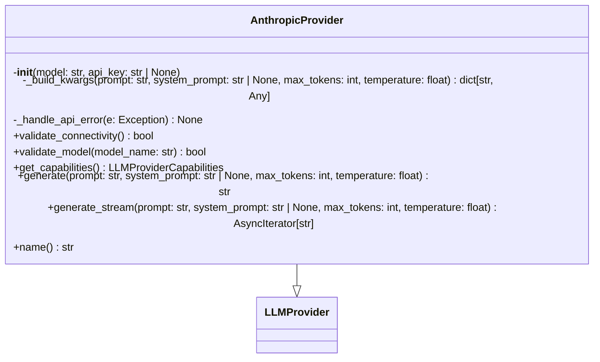

# File Overview

This file implements the `AnthropicProvider` class, which provides an interface to the Anthropic API for generating text using Claude models. It handles authentication, model validation, and integrates with the base [`LLMProvider`](../base.md) class to support standard LLM operations such as text generation and streaming.

The provider uses the `AsyncAnthropic` client from the `anthropic` package and includes error handling for common API issues like authentication failures, rate limits, and model not found errors.

## Dependencies

This file imports:
- `AsyncIterator` and `Any` from `typing`
- `APIConnectionError`, `APIStatusError`, `AsyncAnthropic`, and `AuthenticationError` from `anthropic`
- [`get_logger`](../../logging.md) from `local_deepwiki.logging`
- Base provider classes and exceptions from `local_deepwiki.providers.base`
- [`CredentialManager`](../credentials.md) from `local_deepwiki.providers.credentials`

## Related Files

This provider is part of the local_deepwiki project and integrates with:
- `src/local_deepwiki/core/__init__.py`
- `src/local_deepwiki/generators/source_refs.py`
- `src/local_deepwiki/plugins/base.py`
- Tests in `tests/__init__.py` and `tests/test_plugins.py`

# Class: AnthropicProvider

The `AnthropicProvider` class implements the [`LLMProvider`](../base.md) interface for the Anthropic API. It supports text generation and streaming, and includes methods for validating connectivity and model availability.

## Methods

### `__init__(self, model: str = "claude-sonnet-4-20250514", api_key: str | None = None)`

Initialize the Anthropic provider.

**Parameters:**
- `model` (str): Anthropic model name. Defaults to `"claude-sonnet-4-20250514"`.
- `api_key` (str | None): Optional API key. Uses `ANTHROPIC_API_KEY` environment variable if not provided.

**Raises:**
- [`ProviderAuthenticationError`](../base.md): If no API key is configured or format is invalid.

### `_build_kwargs(self, prompt: str, system_prompt: str | None, max_tokens: int, temperature: float)`

Build kwargs for Anthropic API calls.

**Parameters:**
- `prompt` (str): The user prompt.
- `system_prompt` (str | None): Optional system prompt.
- `max_tokens` (int): Maximum tokens to generate.
- `temperature` (float): Sampling temperature.

**Returns:**
- `dict[str, Any]`: Dict of kwargs for `messages.create`/`stream`.

### `_handle_api_error(self, e: Exception)`

Convert Anthropic API errors to standardized provider errors.

**Parameters:**
- `e` (Exception): The exception from the Anthropic API.

**Raises:**
- [`ProviderAuthenticationError`](../base.md): If authentication fails.
- [`ProviderRateLimitError`](../base.md): If rate limited.
- [`ProviderModelNotFoundError`](../base.md): If model not found.
- [`ProviderConnectionError`](../base.md): If connection fails.

### `validate_connectivity(self)`

Test that the Anthropic API is reachable and configured correctly.

**Returns:**
- `bool`: True if the API is accessible.

**Raises:**
- [`ProviderConnectionError`](../base.md): If the API cannot be reached.
- [`ProviderAuthenticationError`](../base.md): If authentication fails.

### `validate_model(self, model_name: str)`

Test that a specific model is available.

**Parameters:**
- `model_name` (str): The model name to validate.

**Returns:**
- `bool`: True if the model is available.

**Raises:**
- [`ProviderModelNotFoundError`](../base.md): If the model is not available.

### `get_capabilities(self)`

Return Anthropic provider capabilities.

**Returns:**
- [`LLMProviderCapabilities`](../base.md): With Anthropic-specific information.

### `generate(self, prompt: str, system_prompt: str | None = None, max_tokens: int = 4096, temperature: float = 0.7)`

Generate text from a prompt.

**Parameters:**
- `prompt` (str): The user prompt.
- `system_prompt` (str | None): Optional system prompt.
- `max_tokens` (int): Maximum tokens to generate. Defaults to `4096`.
- `temperature` (float): Sampling temperature. Defaults to `0.7`.

**Returns:**
- `str`: Generated text.

**Raises:**
- [`ProviderConnectionError`](../base.md): If the API cannot be reached.
- [`ProviderAuthenticationError`](../base.md): If authentication fails.

### `generate_stream(self, prompt: str, system_prompt: str | None = None, max_tokens: int = 4096, temperature: float = 0.7)`

Generate text from a prompt with streaming.

**Parameters:**
- `prompt` (str): The user prompt.
- `system_prompt` (str | None): Optional system prompt.
- `max_tokens` (int): Maximum tokens to generate. Defaults to `4096`.
- `temperature` (float): Sampling temperature. Defaults to `0.7`.

**Yields:**
- `str`: Generated text chunks.

**Raises:**
- [`ProviderConnectionError`](../base.md): If the API cannot be reached.
- [`ProviderAuthenticationError`](../base.md): If authentication fails.

### `name(self)`

Get the provider name.

**Returns:**
- `str`: Provider name in format `"anthropic:{model}"`.

# Integration

This provider integrates with:
- The [`LLMProvider`](../base.md) base class to provide a consistent interface for LLM operations.
- The [`CredentialManager`](../credentials.md) for retrieving API keys from environment variables.
- The [`ProviderAuthenticationError`](../base.md), [`ProviderConnectionError`](../base.md), [`ProviderModelNotFoundError`](../base.md), and [`ProviderRateLimitError`](../base.md) for standardizing error handling.

It is designed to be used within the local_deepwiki framework as part of a larger system for generating and managing knowledge from local documents.

# Usage Examples

```python
# Initialize the provider
provider = AnthropicProvider(model="claude-3-5-sonnet-20240620")

# Generate text
response = await provider.generate("Hello, world!")

# Stream text generation
async for chunk in provider.generate_stream("Write a story about..."):
    print(chunk)
```

## API Reference

### class `AnthropicProvider`

**Inherits from:** [`LLMProvider`](../base.md)

LLM provider using Anthropic API.

**Methods:**


<details>
<summary>View Source (lines 34-311) | <a href="https://github.com/UrbanDiver/local-deepwiki-mcp/blob/[main](../../export/pdf.md)/src/local_deepwiki/providers/llm/anthropic.py#L34-L311">GitHub</a></summary>

```python
class AnthropicProvider(LLMProvider):
    # Methods: __init__, _build_kwargs, _handle_api_error, validate_connectivity, validate_model, get_capabilities, generate, generate_stream, name
```

</details>

#### `__init__`

```python
def __init__(model: str = "claude-sonnet-4-20250514", api_key: str | None = None)
```

Initialize the Anthropic provider.


| [Parameter](../../generators/api_docs.md) | Type | Default | Description |
|-----------|------|---------|-------------|
| `model` | `str` | `"claude-sonnet-4-20250514"` | Anthropic model name. |
| `api_key` | `str | None` | `None` | Optional API key. Uses ANTHROPIC_API_KEY env var if not provided. |


<details>
<summary>View Source (lines 37-66) | <a href="https://github.com/UrbanDiver/local-deepwiki-mcp/blob/[main](../../export/pdf.md)/src/local_deepwiki/providers/llm/anthropic.py#L37-L66">GitHub</a></summary>

```python
def __init__(self, model: str = "claude-sonnet-4-20250514", api_key: str | None = None):
        """Initialize the Anthropic provider.

        Args:
            model: Anthropic model name.
            api_key: Optional API key. Uses ANTHROPIC_API_KEY env var if not provided.

        Raises:
            ProviderAuthenticationError: If no API key is configured or format is invalid.
        """
        self._model = model

        # Get API key without storing in instance variable
        api_key = api_key or CredentialManager.get_api_key("ANTHROPIC_API_KEY", "anthropic")

        if not api_key:
            raise ProviderAuthenticationError(
                "No Anthropic API key configured. Set ANTHROPIC_API_KEY environment variable.",
                provider_name="anthropic:claude",
            )

        # Validate format
        if not CredentialManager.validate_key_format(api_key, "anthropic"):
            raise ProviderAuthenticationError(
                "Anthropic API key format appears invalid.",
                provider_name="anthropic:claude",
            )

        # Pass directly to client, don't store in self
        self._client = AsyncAnthropic(api_key=api_key)
```

</details>

#### `validate_connectivity`

```python
async def validate_connectivity() -> bool
```

Test that the Anthropic API is reachable and configured correctly.


<details>
<summary>View Source (lines 150-174) | <a href="https://github.com/UrbanDiver/local-deepwiki-mcp/blob/[main](../../export/pdf.md)/src/local_deepwiki/providers/llm/anthropic.py#L150-L174">GitHub</a></summary>

```python
async def validate_connectivity(self) -> bool:
        """Test that the Anthropic API is reachable and configured correctly.

        Returns:
            True if the API is accessible.

        Raises:
            ProviderConnectionError: If the API cannot be reached.
            ProviderAuthenticationError: If authentication fails.
        """
        try:
            # Make a minimal API call to verify connectivity
            await self._client.messages.create(
                model=self._model,
                max_tokens=1,
                messages=[{"role": "user", "content": "Hi"}],
            )
            return True
        except Exception as e:
            self._handle_api_error(e)
            raise ProviderConnectionError(
                f"Failed to validate Anthropic connectivity: {e}",
                provider_name=self.name,
                original_error=e,
            ) from e
```

</details>

#### `validate_model`

```python
async def validate_model(model_name: str) -> bool
```

Test that a specific model is available.


| [Parameter](../../generators/api_docs.md) | Type | Default | Description |
|-----------|------|---------|-------------|
| `model_name` | `str` | - | The model name to validate. |


<details>
<summary>View Source (lines 176-208) | <a href="https://github.com/UrbanDiver/local-deepwiki-mcp/blob/[main](../../export/pdf.md)/src/local_deepwiki/providers/llm/anthropic.py#L176-L208">GitHub</a></summary>

```python
async def validate_model(self, model_name: str) -> bool:
        """Test that a specific model is available.

        Args:
            model_name: The model name to validate.

        Returns:
            True if the model is available.

        Raises:
            ProviderModelNotFoundError: If the model is not available.
        """
        if model_name in ANTHROPIC_MODELS:
            return True

        # Try to make a call with the model to verify
        try:
            await self._client.messages.create(
                model=model_name,
                max_tokens=1,
                messages=[{"role": "user", "content": "Hi"}],
            )
            return True
        except Exception as e:
            error_str = str(e).lower()
            if "not found" in error_str or "invalid" in error_str:
                raise ProviderModelNotFoundError(
                    model_name,
                    provider_name=self.name,
                    available_models=list(ANTHROPIC_MODELS.keys()),
                ) from e
            self._handle_api_error(e)
            raise
```

</details>

#### `get_capabilities`

```python
def get_capabilities() -> LLMProviderCapabilities
```

Return Anthropic provider capabilities.


<details>
<summary>View Source (lines 210-225) | <a href="https://github.com/UrbanDiver/local-deepwiki-mcp/blob/[main](../../export/pdf.md)/src/local_deepwiki/providers/llm/anthropic.py#L210-L225">GitHub</a></summary>

```python
def get_capabilities(self) -> LLMProviderCapabilities:
        """Return Anthropic provider capabilities.

        Returns:
            LLMProviderCapabilities with Anthropic-specific information.
        """
        context_length = ANTHROPIC_MODELS.get(self._model, 200000)
        return LLMProviderCapabilities(
            supports_streaming=True,
            supports_system_prompt=True,
            max_tokens=8192,  # Output limit for most Claude models
            max_context_length=context_length,
            models=list(ANTHROPIC_MODELS.keys()),
            supports_function_calling=True,  # Claude supports tools
            supports_vision=True,  # Claude 3+ supports vision
        )
```

</details>

#### `generate`

```python
async def generate(prompt: str, system_prompt: str | None = None, max_tokens: int = 4096, temperature: float = 0.7) -> str
```

Generate text from a prompt.


| [Parameter](../../generators/api_docs.md) | Type | Default | Description |
|-----------|------|---------|-------------|
| `prompt` | `str` | - | The user prompt. |
| `system_prompt` | `str | None` | `None` | Optional system prompt. |
| `max_tokens` | `int` | `4096` | Maximum tokens to generate. |
| `temperature` | `float` | `0.7` | Sampling temperature. |


<details>
<summary>View Source (lines 228-270) | <a href="https://github.com/UrbanDiver/local-deepwiki-mcp/blob/[main](../../export/pdf.md)/src/local_deepwiki/providers/llm/anthropic.py#L228-L270">GitHub</a></summary>

```python
async def generate(
        self,
        prompt: str,
        system_prompt: str | None = None,
        max_tokens: int = 4096,
        temperature: float = 0.7,
    ) -> str:
        """Generate text from a prompt.

        Args:
            prompt: The user prompt.
            system_prompt: Optional system prompt.
            max_tokens: Maximum tokens to generate.
            temperature: Sampling temperature.

        Returns:
            Generated text.

        Raises:
            ProviderConnectionError: If the API cannot be reached.
            ProviderAuthenticationError: If authentication fails.
            ProviderRateLimitError: If rate limited.
            ProviderModelNotFoundError: If the model is not available.
        """
        logger.debug(f"Generating with Anthropic model {self._model}, prompt length: {len(prompt)}")

        try:
            kwargs = self._build_kwargs(prompt, system_prompt, max_tokens, temperature)
            response = await self._client.messages.create(**kwargs)

            # Get text from the first content block (should be TextBlock)
            first_block = response.content[0]
            content = first_block.text if hasattr(first_block, "text") else ""

            logger.debug(f"Anthropic response length: {len(content)}")
            return content

        except (ProviderConnectionError, ProviderAuthenticationError,
                ProviderRateLimitError, ProviderModelNotFoundError):
            raise
        except Exception as e:
            self._handle_api_error(e)
            raise
```

</details>

#### `generate_stream`

```python
async def generate_stream(prompt: str, system_prompt: str | None = None, max_tokens: int = 4096, temperature: float = 0.7) -> AsyncIterator[str]
```

Generate text from a prompt with streaming.


| [Parameter](../../generators/api_docs.md) | Type | Default | Description |
|-----------|------|---------|-------------|
| `prompt` | `str` | - | The user prompt. |
| `system_prompt` | `str | None` | `None` | Optional system prompt. |
| `max_tokens` | `int` | `4096` | Maximum tokens to generate. |
| `temperature` | `float` | `0.7` | Sampling temperature. |


<details>
<summary>View Source (lines 272-306) | <a href="https://github.com/UrbanDiver/local-deepwiki-mcp/blob/[main](../../export/pdf.md)/src/local_deepwiki/providers/llm/anthropic.py#L272-L306">GitHub</a></summary>

```python
async def generate_stream(
        self,
        prompt: str,
        system_prompt: str | None = None,
        max_tokens: int = 4096,
        temperature: float = 0.7,
    ) -> AsyncIterator[str]:
        """Generate text from a prompt with streaming.

        Args:
            prompt: The user prompt.
            system_prompt: Optional system prompt.
            max_tokens: Maximum tokens to generate.
            temperature: Sampling temperature.

        Yields:
            Generated text chunks.

        Raises:
            ProviderConnectionError: If the API cannot be reached.
            ProviderAuthenticationError: If authentication fails.
            ProviderRateLimitError: If rate limited.
            ProviderModelNotFoundError: If the model is not available.
        """
        try:
            kwargs = self._build_kwargs(prompt, system_prompt, max_tokens, temperature)
            async with self._client.messages.stream(**kwargs) as stream:
                async for text in stream.text_stream:
                    yield text
        except (ProviderConnectionError, ProviderAuthenticationError,
                ProviderRateLimitError, ProviderModelNotFoundError):
            raise
        except Exception as e:
            self._handle_api_error(e)
            raise
```

</details>

#### `name`

```python
def name() -> str
```

Get the provider name.


<details>
<summary>View Source (lines 309-311) | <a href="https://github.com/UrbanDiver/local-deepwiki-mcp/blob/[main](../../export/pdf.md)/src/local_deepwiki/providers/llm/anthropic.py#L309-L311">GitHub</a></summary>

```python
def name(self) -> str:
        """Get the provider name."""
        return f"anthropic:{self._model}"
```

</details>

## Class Diagram


```mermaid
classDiagram
    class AnthropicProvider {
        -__init__(model: str, api_key: str | None)
        -_build_kwargs(prompt: str, system_prompt: str | None, max_tokens: int, temperature: float) dict[str, Any]
        -_handle_api_error(e: Exception) None
        +validate_connectivity() bool
        +validate_model(model_name: str) bool
        +get_capabilities() LLMProviderCapabilities
        +generate(prompt: str, system_prompt: str | None, max_tokens: int, temperature: float) str
        +generate_stream(prompt: str, system_prompt: str | None, max_tokens: int, temperature: float) AsyncIterator[str]
        +name() str
    }
    AnthropicProvider --|> LLMProvider
```

## Call Graph


```mermaid
flowchart TD
    N0[AnthropicProvider.__init__]
    N1[AnthropicProvider._handle_a...]
    N2[AnthropicProvider.generate]
    N3[AnthropicProvider.generate_...]
    N4[AnthropicProvider.get_capab...]
    N5[AnthropicProvider.validate_...]
    N6[AnthropicProvider.validate_...]
    N7[AsyncAnthropic]
    N8[LLMProviderCapabilities]
    N9[ProviderAuthenticationError]
    N10[ProviderConnectionError]
    N11[ProviderModelNotFoundError]
    N12[ProviderRateLimitError]
    N13[_build_kwargs]
    N14[_handle_api_error]
    N15[create]
    N16[get_api_key]
    N17[stream]
    N18[validate_key_format]
    N0 --> N16
    N0 --> N9
    N0 --> N18
    N0 --> N7
    N1 --> N9
    N1 --> N12
    N1 --> N11
    N1 --> N10
    N5 --> N15
    N5 --> N14
    N5 --> N10
    N6 --> N15
    N6 --> N11
    N6 --> N14
    N4 --> N8
    N2 --> N13
    N2 --> N15
    N2 --> N14
    N3 --> N13
    N3 --> N17
    N3 --> N14
    classDef func fill:#e1f5fe
    class N7,N8,N9,N10,N11,N12,N13,N14,N15,N16,N17,N18 func
    classDef method fill:#fff3e0
    class N0,N1,N2,N3,N4,N5,N6 method
```

## Used By

Functions and methods in this file and their callers:

- **`AsyncAnthropic`**: called by `AnthropicProvider.__init__`
- **[`LLMProviderCapabilities`](../base.md)**: called by `AnthropicProvider.get_capabilities`
- **[`ProviderAuthenticationError`](../base.md)**: called by `AnthropicProvider.__init__`, `AnthropicProvider._handle_api_error`
- **[`ProviderConnectionError`](../base.md)**: called by `AnthropicProvider._handle_api_error`, `AnthropicProvider.validate_connectivity`
- **[`ProviderModelNotFoundError`](../base.md)**: called by `AnthropicProvider._handle_api_error`, `AnthropicProvider.validate_model`
- **[`ProviderRateLimitError`](../base.md)**: called by `AnthropicProvider._handle_api_error`
- **`_build_kwargs`**: called by `AnthropicProvider.generate`, `AnthropicProvider.generate_stream`
- **`_handle_api_error`**: called by `AnthropicProvider.generate`, `AnthropicProvider.generate_stream`, `AnthropicProvider.validate_connectivity`, `AnthropicProvider.validate_model`
- **`create`**: called by `AnthropicProvider.generate`, `AnthropicProvider.validate_connectivity`, `AnthropicProvider.validate_model`
- **`get_api_key`**: called by `AnthropicProvider.__init__`
- **`stream`**: called by `AnthropicProvider.generate_stream`
- **`validate_key_format`**: called by `AnthropicProvider.__init__`

## Usage Examples

*Examples extracted from test files*

### Test provider initialization with default model

From `test_anthropic_provider.py::TestAnthropicProviderInitialization::test_initialization_default_model`:

```python
from local_deepwiki.providers.llm.anthropic import AnthropicProvider

provider = AnthropicProvider()
assert provider.name == "anthropic:claude-sonnet-4-20250514"
```

### Test provider initialization with default model

From `test_anthropic_provider.py::TestAnthropicProviderInitialization::test_initialization_default_model`:

```python
from local_deepwiki.providers.llm.anthropic import AnthropicProvider

provider = AnthropicProvider()
assert provider.name == "anthropic:claude-sonnet-4-20250514"
```

### Test provider initialization with default model

From `test_anthropic_provider.py::TestAnthropicProviderInitialization::test_initialization_default_model`:

```python
from local_deepwiki.providers.llm.anthropic import AnthropicProvider

provider = AnthropicProvider()
assert provider.name == "anthropic:claude-sonnet-4-20250514"
```

### Test provider initialization with custom model

From `test_anthropic_provider.py::TestAnthropicProviderInitialization::test_initialization_custom_model`:

```python
from local_deepwiki.providers.llm.anthropic import AnthropicProvider

provider = AnthropicProvider(model="claude-3-opus-20240229")
assert provider.name == "anthropic:claude-3-opus-20240229"
```

### Test provider initialization with custom model

From `test_anthropic_provider.py::TestAnthropicProviderInitialization::test_initialization_custom_model`:

```python
from local_deepwiki.providers.llm.anthropic import AnthropicProvider

provider = AnthropicProvider(model="claude-3-opus-20240229")
assert provider.name == "anthropic:claude-3-opus-20240229"
```


## Last Modified

| Entity | Type | Author | Date | Commit |
|--------|------|--------|------|--------|
| `AnthropicProvider` | class | Brian Breidenbach | 1 week ago | `4eb4353` Phase 2: Implement RBAC, de... |
| `__init__` | method | Brian Breidenbach | 1 week ago | `4eb4353` Phase 2: Implement RBAC, de... |
| `_handle_api_error` | method | Brian Breidenbach | 1 week ago | `a64166a` Add seven medium-priority e... |
| `validate_connectivity` | method | Brian Breidenbach | 1 week ago | `a64166a` Add seven medium-priority e... |
| `validate_model` | method | Brian Breidenbach | 1 week ago | `a64166a` Add seven medium-priority e... |
| `get_capabilities` | method | Brian Breidenbach | 1 week ago | `a64166a` Add seven medium-priority e... |
| `generate` | method | Brian Breidenbach | 1 week ago | `a64166a` Add seven medium-priority e... |
| `generate_stream` | method | Brian Breidenbach | 1 week ago | `a64166a` Add seven medium-priority e... |
| `_build_kwargs` | method | Brian Breidenbach | 2 weeks ago | `d3cbf90` Fix medium priority issues:... |
| `name` | method | Brian Breidenbach | 3 weeks ago | `cdae76f` Initial commit: Local DeepW... |

## Additional Source Code

Source code for functions and methods not listed in the API Reference above.

#### `_build_kwargs`

<details>
<summary>View Source (lines 68-95) | <a href="https://github.com/UrbanDiver/local-deepwiki-mcp/blob/[main](../../export/pdf.md)/src/local_deepwiki/providers/llm/anthropic.py#L68-L95">GitHub</a></summary>

```python
def _build_kwargs(
        self,
        prompt: str,
        system_prompt: str | None,
        max_tokens: int,
        temperature: float,
    ) -> dict[str, Any]:
        """Build kwargs for Anthropic API calls.

        Args:
            prompt: The user prompt.
            system_prompt: Optional system prompt.
            max_tokens: Maximum tokens to generate.
            temperature: Sampling temperature.

        Returns:
            Dict of kwargs for messages.create/stream.
        """
        kwargs: dict[str, Any] = {
            "model": self._model,
            "max_tokens": max_tokens,
            "messages": [{"role": "user", "content": prompt}],
        }
        if system_prompt:
            kwargs["system"] = system_prompt
        if temperature > 0:
            kwargs["temperature"] = temperature
        return kwargs
```

</details>


#### `_handle_api_error`

<details>
<summary>View Source (lines 97-148) | <a href="https://github.com/UrbanDiver/local-deepwiki-mcp/blob/[main](../../export/pdf.md)/src/local_deepwiki/providers/llm/anthropic.py#L97-L148">GitHub</a></summary>

```python
def _handle_api_error(self, e: Exception) -> None:
        """Convert Anthropic API errors to standardized provider errors.

        Args:
            e: The exception from the Anthropic API.

        Raises:
            ProviderAuthenticationError: If authentication fails.
            ProviderRateLimitError: If rate limited.
            ProviderModelNotFoundError: If model not found.
            ProviderConnectionError: If connection fails.
        """
        if isinstance(e, AuthenticationError):
            raise ProviderAuthenticationError(
                "Anthropic API authentication failed. Check your ANTHROPIC_API_KEY.",
                provider_name=self.name,
            ) from e

        if isinstance(e, APIStatusError):
            error_str = str(e).lower()
            if e.status_code == 429 or "rate" in error_str:
                # Try to extract retry-after header
                retry_after = None
                if hasattr(e, "response") and e.response:
                    retry_after_str = e.response.headers.get("retry-after")
                    if retry_after_str:
                        try:
                            retry_after = float(retry_after_str)
                        except ValueError:
                            pass
                raise ProviderRateLimitError(
                    f"Anthropic API rate limit exceeded: {e}",
                    provider_name=self.name,
                    retry_after=retry_after,
                ) from e

            if e.status_code == 404 or "not found" in error_str:
                raise ProviderModelNotFoundError(
                    self._model,
                    provider_name=self.name,
                    available_models=list(ANTHROPIC_MODELS.keys()),
                ) from e

        if isinstance(e, APIConnectionError):
            raise ProviderConnectionError(
                f"Failed to connect to Anthropic API: {e}",
                provider_name=self.name,
                original_error=e,
            ) from e

        # Re-raise unknown errors
        raise
```

</details>

## Relevant Source Files

- `src/local_deepwiki/providers/llm/anthropic.py:34-311`
