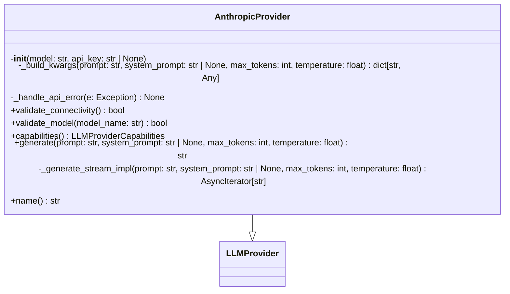

# File: `src/local_deepwiki/providers/llm/anthropic.py`

## File Overview

This file implements the `AnthropicProvider` class, which serves as a provider for the Anthropic LLM API. It enables integration with Anthropic's Claude models, supporting both synchronous and streaming text generation. The implementation follows a consistent pattern of error handling, model validation, and credential management, aligning with the broader `local_deepwiki.providers` framework.

The provider is designed to be a drop-in component for LLM-based workflows, offering a standardized interface for interacting with Anthropic's API while handling common error conditions and API-specific nuances.

## Key Concepts

### LLM Provider Interface
The `AnthropicProvider` inherits from [`LLMProvider`](../base.md), which defines a common interface for LLM providers. This design promotes consistency across different LLM backends and allows for unified handling of capabilities, validation, and generation logic.

### Credential Management
API credentials are managed through the [`CredentialManager`](../credentials.md) and validated using [`validate_provider_credentials`](../errors.md). This abstraction ensures secure handling of API keys and supports environment variable-based configuration, reducing the risk of credential leakage.

### Error Handling
The provider implements a centralized error handling mechanism through `_handle_api_error` and [`handle_api_status_error`](../errors.md). This approach converts Anthropic-specific API errors into standardized provider errors ([`ProviderAuthenticationError`](../errors.md), [`ProviderConnectionError`](../errors.md), etc.), making it easier to manage and respond to different failure modes in a unified way.

### Model Validation
Model availability is validated both via a predefined list (`ANTHROPIC_MODELS`) and by attempting an API call. This dual approach ensures robustness, as it handles cases where a model name might be valid but not yet available or where a model is supported by the API but not yet added to the static list.

### Streaming Support
The provider supports streaming responses via `_generate_stream_impl`, which uses `AsyncIterator[str]`. This enables real-time processing of responses, which is particularly useful for user interfaces or long-running generation tasks.

## Integration

### Within the Codebase
This file is part of the `local_deepwiki.providers.llm` module, integrating with other LLM providers like `openai.py`. It is used by test files such as `test_anthropic_provider` and `test_llm_providers`, indicating its role in testing and validation.

The `AnthropicProvider` class is imported and instantiated by components in:
- `src/local_deepwiki/cli/config_validator.py`
- `src/local_deepwiki/cli/main.py`
- Various LLM-based generators in `src/local_deepwiki/generators/analysis/`

### External Dependencies
- `anthropic.AsyncAnthropic`: The core client for interacting with the Anthropic API.
- `local_deepwiki.providers.base`: Provides base classes and error handling utilities.
- `local_deepwiki.providers.credentials`: Manages secure credential retrieval.

## Design Notes

### Why Standardized Errors?
Standardizing error types allows consumers of the provider to write consistent error handling logic regardless of the underlying LLM provider. This abstraction is crucial for maintainability and scalability when supporting multiple providers.

### Why Predefined Model List?
The `ANTHROPIC_MODELS` dictionary provides a static list of known models, improving performance by avoiding unnecessary API calls. It also serves as documentation of supported models, and the provider falls back to API validation for dynamic model discovery.

### Why Streaming?
Streaming support is implemented to provide real-time feedback and reduce perceived latency. It is enabled by the underlying `AsyncAnthropic` client's streaming capabilities and is a key feature of modern LLM APIs.

### Why Not Store API Key?
The API key is retrieved via [`CredentialManager`](../credentials.md) and passed directly to the `AsyncAnthropic` client without storing it in the instance. This design prevents accidental exposure of credentials in logs or memory dumps.

### Why Specific Exception Handling?
The provider handles specific exceptions like `APIConnectionError`, `APIStatusError`, and `AuthenticationError` explicitly. This granular handling allows for more precise error categorization and user feedback, while still falling back to generic error handling for unexpected cases.

## API Reference

### class `AnthropicProvider`

**Inherits from:** [`LLMProvider`](../base.md)

LLM provider using Anthropic API.

**Methods:**


<details>
<summary>View Source (lines 46-350) | <a href="https://github.com/UrbanDiver/local-deepwiki-mcp/blob/main/src/local_deepwiki/providers/llm/anthropic.py#L46-L350">GitHub</a></summary>

```python
class AnthropicProvider(LLMProvider):
    # Methods: __init__, _build_kwargs, _handle_api_error, validate_connectivity, validate_model, capabilities, generate, _generate_stream_impl, name
```

</details>

#### `__init__`

```python
def __init__(model: str = "claude-sonnet-4-20250514", api_key: str | None = None)
```

Initialize the Anthropic provider.


| Parameter | Type | Default | Description |
|-----------|------|---------|-------------|
| `model` | `str` | `"claude-sonnet-4-20250514"` | Anthropic model name. |
| `api_key` | `str | None` | `None` | Optional API key. Uses ANTHROPIC_API_KEY env var if not provided. |


<details>
<summary>View Source (lines 49-78) | <a href="https://github.com/UrbanDiver/local-deepwiki-mcp/blob/main/src/local_deepwiki/providers/llm/anthropic.py#L49-L78">GitHub</a></summary>

```python
def __init__(
        self, model: str = "claude-sonnet-4-20250514", api_key: str | None = None
    ):
        """Initialize the Anthropic provider.

        Args:
            model: Anthropic model name.
            api_key: Optional API key. Uses ANTHROPIC_API_KEY env var if not provided.

        Raises:
            ProviderAuthenticationError: If no API key is configured or format is invalid.
        """
        self._model = model

        # Get API key without storing in instance variable
        api_key = api_key or CredentialManager.get_api_key(
            "ANTHROPIC_API_KEY", "anthropic"
        )

        # Validate credentials using shared helper
        api_key = validate_provider_credentials(
            provider_name="anthropic:claude",
            api_key=api_key,
            key_type="anthropic",
            env_var="ANTHROPIC_API_KEY",
            display_name="Anthropic",
        )

        # Pass directly to client, don't store in self
        self._client = AsyncAnthropic(api_key=api_key)
```

</details>

#### `validate_connectivity`

```python
async def validate_connectivity() -> bool
```

Test that the Anthropic API is reachable and configured correctly.


<details>
<summary>View Source (lines 124-154) | <a href="https://github.com/UrbanDiver/local-deepwiki-mcp/blob/main/src/local_deepwiki/providers/llm/anthropic.py#L124-L154">GitHub</a></summary>

```python
async def validate_connectivity(self) -> bool:
        """Test that the Anthropic API is reachable and configured correctly.

        Returns:
            True if the API is accessible.

        Raises:
            ProviderConnectionError: If the API cannot be reached.
            ProviderAuthenticationError: If authentication fails.
        """
        try:
            # Make a minimal API call to verify connectivity
            await self._client.messages.create(
                model=self._model,
                max_tokens=1,
                messages=[{"role": "user", "content": "Hi"}],
            )
            return True
        except (
            APIConnectionError,
            APIStatusError,
            AuthenticationError,
            ConnectionError,
            TimeoutError,
        ) as e:
            self._handle_api_error(e)
            raise ProviderConnectionError(
                f"Failed to validate Anthropic connectivity: {e}",
                provider_name=self.name,
                original_error=e,
            ) from e
```

</details>

#### `validate_model`

```python
async def validate_model(model_name: str) -> bool
```

Test that a specific model is available.


| Parameter | Type | Default | Description |
|-----------|------|---------|-------------|
| `model_name` | `str` | - | The model name to validate. |


<details>
<summary>View Source (lines 156-222) | <a href="https://github.com/UrbanDiver/local-deepwiki-mcp/blob/main/src/local_deepwiki/providers/llm/anthropic.py#L156-L222">GitHub</a></summary>

```python
async def validate_model(self, model_name: str) -> bool:
        """Test that a specific model is available.

        Args:
            model_name: The model name to validate.

        Returns:
            True if the model is available.

        Raises:
            ProviderModelNotFoundError: If the model is not available.
        """
        if model_name in ANTHROPIC_MODELS:
            return True

        # Try to make a call with the model to verify
        try:
            await self._client.messages.create(
                model=model_name,
                max_tokens=1,
                messages=[{"role": "user", "content": "Hi"}],
            )
            return True
        except (
            APIConnectionError,
            APIStatusError,
            AuthenticationError,
            ConnectionError,
            TimeoutError,
        ) as e:
            # API-specific exceptions - delegate to error handler or check error message
            error_str = str(e).lower()
            if "not found" in error_str or "invalid" in error_str:
                raise ProviderModelNotFoundError(
                    model_name,
                    provider_name=self.name,
                    available_models=list(ANTHROPIC_MODELS.keys()),
                ) from e
            self._handle_api_error(e)
            raise
        except (ValueError, KeyError) as e:
            # Data validation errors - check if model-related
            error_str = str(e).lower()
            if "not found" in error_str or "invalid" in error_str:
                raise ProviderModelNotFoundError(
                    model_name,
                    provider_name=self.name,
                    available_models=list(ANTHROPIC_MODELS.keys()),
                ) from e
            raise
        except AnthropicError as e:
            # Catch remaining Anthropic library exceptions not matched above
            # Only handle model-related errors, re-raise everything else
            error_str = str(e).lower()
            if "not found" in error_str or "invalid" in error_str:
                logger.warning(
                    "Caught AnthropicError in validate_model, treating as model error: %s",
                    e,
                )
                raise ProviderModelNotFoundError(
                    model_name,
                    provider_name=self.name,
                    available_models=list(ANTHROPIC_MODELS.keys()),
                ) from e
            # For unknown errors, try the error handler first
            self._handle_api_error(e)
            raise
```

</details>

#### `capabilities`

```python
def capabilities() -> LLMProviderCapabilities
```

Return Anthropic provider capabilities.


<details>
<summary>View Source (lines 225-240) | <a href="https://github.com/UrbanDiver/local-deepwiki-mcp/blob/main/src/local_deepwiki/providers/llm/anthropic.py#L225-L240">GitHub</a></summary>

```python
def capabilities(self) -> LLMProviderCapabilities:
        """Return Anthropic provider capabilities.

        Returns:
            LLMProviderCapabilities with Anthropic-specific information.
        """
        context_length = ANTHROPIC_MODELS.get(self._model, 200000)
        return LLMProviderCapabilities(
            supports_streaming=True,
            supports_system_prompt=True,
            max_tokens=8192,  # Output limit for most Claude models
            max_context_length=context_length,
            models=list(ANTHROPIC_MODELS.keys()),
            supports_function_calling=True,  # Claude supports tools
            supports_vision=True,  # Claude 3+ supports vision
        )
```

</details>

#### `generate`

```python
async def generate(prompt: str, system_prompt: str | None = None, max_tokens: int = 4096, temperature: float = 0.7) -> str
```

Generate text from a prompt.


| Parameter | Type | Default | Description |
|-----------|------|---------|-------------|
| `prompt` | `str` | - | The user prompt. |
| `system_prompt` | `str | None` | `None` | Optional system prompt. |
| `max_tokens` | `int` | `4096` | Maximum tokens to generate. |
| `temperature` | `float` | `0.7` | Sampling temperature. |


<details>
<summary>View Source (lines 243-299) | <a href="https://github.com/UrbanDiver/local-deepwiki-mcp/blob/main/src/local_deepwiki/providers/llm/anthropic.py#L243-L299">GitHub</a></summary>

```python
async def generate(
        self,
        prompt: str,
        system_prompt: str | None = None,
        max_tokens: int = 4096,
        temperature: float = 0.7,
    ) -> str:
        """Generate text from a prompt.

        Args:
            prompt: The user prompt.
            system_prompt: Optional system prompt.
            max_tokens: Maximum tokens to generate.
            temperature: Sampling temperature.

        Returns:
            Generated text.

        Raises:
            ProviderConnectionError: If the API cannot be reached.
            ProviderAuthenticationError: If authentication fails.
            ProviderRateLimitError: If rate limited.
            ProviderModelNotFoundError: If the model is not available.
        """
        logger.debug(
            "Generating with Anthropic model %s, prompt length: %d",
            self._model,
            len(prompt),
        )

        try:
            kwargs = self._build_kwargs(prompt, system_prompt, max_tokens, temperature)
            response = await self._client.messages.create(**kwargs)

            # Get text from the first content block (should be TextBlock)
            first_block = response.content[0]
            content = getattr(first_block, "text", "")

            logger.debug("Anthropic response length: %s", len(content))
            return content

        except (
            ProviderConnectionError,
            ProviderAuthenticationError,
            ProviderRateLimitError,
            ProviderModelNotFoundError,
        ):
            raise
        except (
            APIConnectionError,
            APIStatusError,
            AuthenticationError,
            ConnectionError,
            TimeoutError,
        ) as e:
            self._handle_api_error(e)
            raise
```

</details>

#### `name`

```python
def name() -> str
```

Get the provider name.


<details>
<summary>View Source (lines 348-350) | <a href="https://github.com/UrbanDiver/local-deepwiki-mcp/blob/main/src/local_deepwiki/providers/llm/anthropic.py#L348-L350">GitHub</a></summary>

```python
def name(self) -> str:
        """Get the provider name."""
        return f"anthropic:{self._model}"
```

</details>

## Class Diagram


```mermaid
classDiagram
    class AnthropicProvider {
        -__init__(model: str, api_key: str | None)
        -_build_kwargs(prompt: str, system_prompt: str | None, max_tokens: int, temperature: float) dict[str, Any]
        -_handle_api_error(e: Exception) None
        +validate_connectivity() bool
        +validate_model(model_name: str) bool
        +capabilities() LLMProviderCapabilities
        +generate(prompt: str, system_prompt: str | None, max_tokens: int, temperature: float) str
        -_generate_stream_impl(prompt: str, system_prompt: str | None, max_tokens: int, temperature: float) AsyncIterator[str]
        +name() str
    }
    AnthropicProvider --|> LLMProvider
```

## Call Graph


```mermaid
flowchart TD
    N0[AnthropicProvider.__init__]
    N1[AnthropicProvider._generate...]
    N2[AnthropicProvider._handle_a...]
    N3[AnthropicProvider.capabilities]
    N4[AnthropicProvider.generate]
    N5[AnthropicProvider.validate_...]
    N6[AnthropicProvider.validate_...]
    N7[ApiErrorConfig]
    N8[AsyncAnthropic]
    N9[LLMProviderCapabilities]
    N10[ProviderConnectionError]
    N11[ProviderModelNotFoundError]
    N12[_build_kwargs]
    N13[_handle_api_error]
    N14[create]
    N15[get_api_key]
    N16[handle_api_status_error]
    N17[stream]
    N18[validate_provider_credentials]
    N0 --> N15
    N0 --> N18
    N0 --> N8
    N2 --> N7
    N2 --> N16
    N5 --> N14
    N5 --> N13
    N5 --> N10
    N6 --> N14
    N6 --> N11
    N6 --> N13
    N3 --> N9
    N4 --> N12
    N4 --> N14
    N4 --> N13
    N1 --> N12
    N1 --> N17
    N1 --> N13
    classDef func fill:#e1f5fe
    class N7,N8,N9,N10,N11,N12,N13,N14,N15,N16,N17,N18 func
    classDef method fill:#fff3e0
    class N0,N1,N2,N3,N4,N5,N6 method
```

## Used By

Functions and methods in this file and their callers:

- **[`ApiErrorConfig`](../errors.md)**: called by `AnthropicProvider._handle_api_error`
- **`AsyncAnthropic`**: called by `AnthropicProvider.__init__`
- **[`LLMProviderCapabilities`](../base.md)**: called by `AnthropicProvider.capabilities`
- **[`ProviderConnectionError`](../errors.md)**: called by `AnthropicProvider.validate_connectivity`
- **[`ProviderModelNotFoundError`](../errors.md)**: called by `AnthropicProvider.validate_model`
- **`_build_kwargs`**: called by `AnthropicProvider._generate_stream_impl`, `AnthropicProvider.generate`
- **`_handle_api_error`**: called by `AnthropicProvider._generate_stream_impl`, `AnthropicProvider.generate`, `AnthropicProvider.validate_connectivity`, `AnthropicProvider.validate_model`
- **`create`**: called by `AnthropicProvider.generate`, `AnthropicProvider.validate_connectivity`, `AnthropicProvider.validate_model`
- **`get_api_key`**: called by `AnthropicProvider.__init__`
- **[`handle_api_status_error`](../errors.md)**: called by `AnthropicProvider._handle_api_error`
- **`stream`**: called by `AnthropicProvider._generate_stream_impl`
- **[`validate_provider_credentials`](../errors.md)**: called by `AnthropicProvider.__init__`

## Usage Examples

*Examples extracted from test files*

### Test provider initialization with default model

From `test_anthropic_provider.py::TestAnthropicProviderInitialization::test_initialization_default_model`:

```python
from local_deepwiki.providers.llm.anthropic import AnthropicProvider

provider = AnthropicProvider()
assert provider.name == "anthropic:claude-sonnet-4-20250514"
```

### Test provider initialization with default model

From `test_anthropic_provider.py::TestAnthropicProviderInitialization::test_initialization_default_model`:

```python
from local_deepwiki.providers.llm.anthropic import AnthropicProvider

provider = AnthropicProvider()
assert provider.name == "anthropic:claude-sonnet-4-20250514"
```

### Test provider initialization with default model

From `test_anthropic_provider.py::TestAnthropicProviderInitialization::test_initialization_default_model`:

```python
from local_deepwiki.providers.llm.anthropic import AnthropicProvider

provider = AnthropicProvider()
assert provider.name == "anthropic:claude-sonnet-4-20250514"
```

### Test provider initialization with custom model

From `test_anthropic_provider.py::TestAnthropicProviderInitialization::test_initialization_custom_model`:

```python
from local_deepwiki.providers.llm.anthropic import AnthropicProvider

provider = AnthropicProvider(model="claude-3-opus-20240229")
assert provider.name == "anthropic:claude-3-opus-20240229"
```

### Test provider initialization with custom model

From `test_anthropic_provider.py::TestAnthropicProviderInitialization::test_initialization_custom_model`:

```python
from local_deepwiki.providers.llm.anthropic import AnthropicProvider

provider = AnthropicProvider(model="claude-3-opus-20240229")
assert provider.name == "anthropic:claude-3-opus-20240229"
```


## Last Modified

| Entity | Type | Author | Date | Commit |
|--------|------|--------|------|--------|
| `AnthropicProvider` | class | Brian Breidenbach | 1 week ago | `5465a75` refactor: introduce ApiErro... |
| `_handle_api_error` | method | Brian Breidenbach | 1 week ago | `5465a75` refactor: introduce ApiErro... |
| `_generate_stream_impl` | method | Brian Breidenbach | 2 weeks ago | `c850cb5` feat: enforce provider stre... |
| `validate_model` | method | Brian Breidenbach | Feb 21, 2026 | `e45a53a` refactor: apply Pythonic id... |
| `capabilities` | method | Brian Breidenbach | Feb 20, 2026 | `8182b15` refactor: Pythonic API impr... |
| `generate` | method | Brian Breidenbach | Feb 20, 2026 | `b807417` refactor: high-priority Pyt... |
| `validate_connectivity` | method | Brian Breidenbach | Feb 11, 2026 | `74bebaf` fix: improve exception hand... |
| `__init__` | method | Brian Breidenbach | Feb 09, 2026 | `2130136` refactor: Extract duplicate... |
| `_build_kwargs` | method | Brian Breidenbach | Jan 24, 2026 | `d3cbf90` Fix medium priority issues:... |
| `name` | method | Brian Breidenbach | Jan 10, 2026 | `cdae76f` Initial commit: Local DeepW... |

## Additional Source Code

Source code for functions and methods not listed in the API Reference above.

#### `_build_kwargs`

<details>
<summary>View Source (lines 80-107) | <a href="https://github.com/UrbanDiver/local-deepwiki-mcp/blob/main/src/local_deepwiki/providers/llm/anthropic.py#L80-L107">GitHub</a></summary>

```python
def _build_kwargs(
        self,
        prompt: str,
        system_prompt: str | None,
        max_tokens: int,
        temperature: float,
    ) -> dict[str, Any]:
        """Build kwargs for Anthropic API calls.

        Args:
            prompt: The user prompt.
            system_prompt: Optional system prompt.
            max_tokens: Maximum tokens to generate.
            temperature: Sampling temperature.

        Returns:
            Dict of kwargs for messages.create/stream.
        """
        kwargs: dict[str, Any] = {
            "model": self._model,
            "max_tokens": max_tokens,
            "messages": [{"role": "user", "content": prompt}],
        }
        if system_prompt:
            kwargs["system"] = system_prompt
        if temperature > 0:
            kwargs["temperature"] = temperature
        return kwargs
```

</details>


#### `_handle_api_error`

<details>
<summary>View Source (lines 109-122) | <a href="https://github.com/UrbanDiver/local-deepwiki-mcp/blob/main/src/local_deepwiki/providers/llm/anthropic.py#L109-L122">GitHub</a></summary>

```python
def _handle_api_error(self, e: Exception) -> None:
        """Convert Anthropic API errors to standardized provider errors."""
        config = ApiErrorConfig(
            provider_name=self.name,
            api_label="Anthropic API",
            model=self._model,
            available_models=list(ANTHROPIC_MODELS.keys()),
            auth_error_type=AuthenticationError,
            status_error_type=APIStatusError,
            connection_error_type=APIConnectionError,
        )
        handle_api_status_error(e, config)
        # Re-raise unknown errors
        raise
```

</details>


#### `_generate_stream_impl`

<details>
<summary>View Source (lines 301-345) | <a href="https://github.com/UrbanDiver/local-deepwiki-mcp/blob/main/src/local_deepwiki/providers/llm/anthropic.py#L301-L345">GitHub</a></summary>

```python
async def _generate_stream_impl(
        self,
        prompt: str,
        system_prompt: str | None = None,
        max_tokens: int = 4096,
        temperature: float = 0.7,
    ) -> AsyncIterator[str]:
        """Generate text from a prompt with streaming.

        Args:
            prompt: The user prompt.
            system_prompt: Optional system prompt.
            max_tokens: Maximum tokens to generate.
            temperature: Sampling temperature.

        Yields:
            Generated text chunks.

        Raises:
            ProviderConnectionError: If the API cannot be reached.
            ProviderAuthenticationError: If authentication fails.
            ProviderRateLimitError: If rate limited.
            ProviderModelNotFoundError: If the model is not available.
        """
        try:
            kwargs = self._build_kwargs(prompt, system_prompt, max_tokens, temperature)
            async with self._client.messages.stream(**kwargs) as stream:
                async for text in stream.text_stream:
                    yield text
        except (
            ProviderConnectionError,
            ProviderAuthenticationError,
            ProviderRateLimitError,
            ProviderModelNotFoundError,
        ):
            raise
        except (
            APIConnectionError,
            APIStatusError,
            AuthenticationError,
            ConnectionError,
            TimeoutError,
        ) as e:
            self._handle_api_error(e)
            raise
```

</details>

## Relevant Source Files

- `src/local_deepwiki/providers/llm/anthropic.py:46-350`
