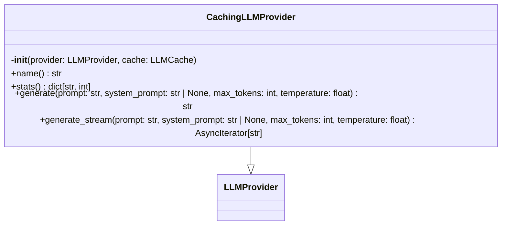
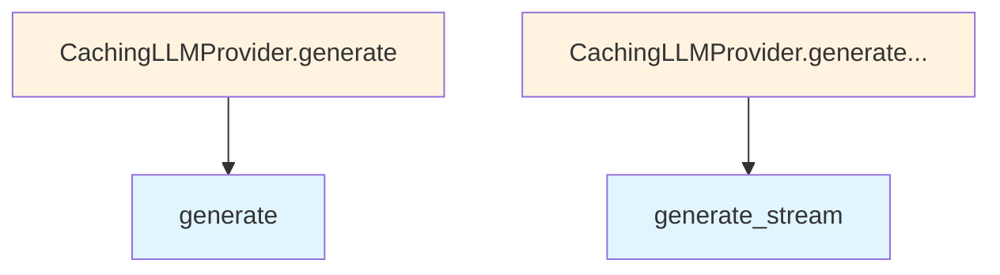

# cached.py

## File Overview

This module provides a caching [wrapper](../base.md) for LLM (Large [Language](../../models.md) Model) providers. The CachingLLMProvider class acts as a [decorator](../base.md) around existing LLM providers to add caching functionality, reducing redundant API calls by storing and retrieving previously computed responses.

## Classes

### CachingLLMProvider

A [wrapper](../base.md) class that adds caching capabilities to any LLM provider. This class implements the [LLMProvider](../base.md) interface while delegating actual LLM operations to an underlying provider and managing response caching through the [LLMCache](../../core/llm_cache.md) system.

The CachingLLMProvider serves as a performance optimization layer, intercepting requests to check for cached responses before forwarding them to the underlying provider.

## Related Components

This module works with several other components in the system:

- **[LLMProvider](../base.md)**: The base interface that CachingLLMProvider implements, ensuring compatibility with other LLM providers
- **[LLMCache](../../core/llm_cache.md)**: Handles the actual caching logic for storing and retrieving LLM responses
- **[get_logger](../../logging.md)**: Provides logging functionality for monitoring cache hits, misses, and other operations

The module uses `AsyncIterator` from the standard library's collections.abc module, indicating support for asynchronous streaming operations.

## Integration

The CachingLLMProvider can wrap any existing LLM provider implementation, making it a drop-in replacement that adds caching without changing the interface. This allows for transparent performance improvements in systems that make repeated or similar LLM requests.

## API Reference

### class `CachingLLMProvider`

**Inherits from:** [`LLMProvider`](../base.md)

LLM provider [wrapper](../base.md) that caches responses.  Wraps any [LLMProvider](../base.md) implementation to add transparent caching. Cache lookups happen before calling the underlying provider, and successful responses are cached for future use.  Only responses generated with temperature <= max_cacheable_temperature are cached, as higher temperatures produce non-deterministic outputs.

**Methods:**

#### `__init__`

```python
def __init__(provider: LLMProvider, cache: LLMCache)
```

Initialize the caching provider.


| [Parameter](../../generators/api_docs.md) | Type | Default | Description |
|-----------|------|---------|-------------|
| `provider` | [`LLMProvider`](../base.md) | - | The underlying LLM provider to wrap. |
| `cache` | [`LLMCache`](../../core/llm_cache.md) | - | The LLM cache instance to use. |

#### `name`

```python
def name() -> str
```

Get the provider name with cache prefix.

#### `stats`

```python
def stats() -> dict[str, int]
```

Get cache statistics.

#### `generate`

```python
async def generate(prompt: str, system_prompt: str | None = None, max_tokens: int = 4096, temperature: float = 0.7) -> str
```

Generate text with caching.  Checks cache first, generates from provider on miss, and caches the response.


| [Parameter](../../generators/api_docs.md) | Type | Default | Description |
|-----------|------|---------|-------------|
| `prompt` | `str` | - | The user prompt. |
| `system_prompt` | `str | None` | `None` | Optional system prompt. |
| `max_tokens` | `int` | `4096` | Maximum tokens to generate. |
| `temperature` | `float` | `0.7` | Sampling temperature. |

#### `generate_stream`

```python
async def generate_stream(prompt: str, system_prompt: str | None = None, max_tokens: int = 4096, temperature: float = 0.7) -> AsyncIterator[str]
```

Stream generation with caching.  For cache hits, simulates streaming by yielding chunks. For cache misses, streams from provider and caches the complete response.


| [Parameter](../../generators/api_docs.md) | Type | Default | Description |
|-----------|------|---------|-------------|
| `prompt` | `str` | - | The user prompt. |
| `system_prompt` | `str | None` | `None` | Optional system prompt. |
| `max_tokens` | `int` | `4096` | Maximum tokens to generate. |
| `temperature` | `float` | `0.7` | Sampling temperature. |


## Class Diagram



## Call Graph



## Relevant Source Files

- `src/local_deepwiki/providers/llm/cached.py:12-158`
