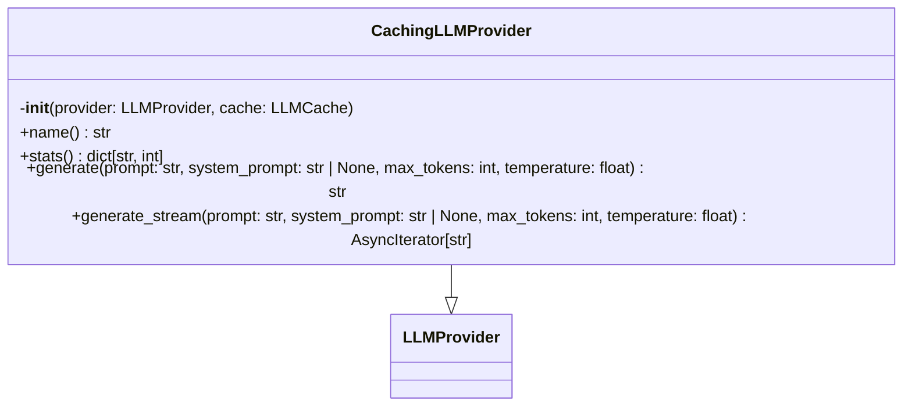
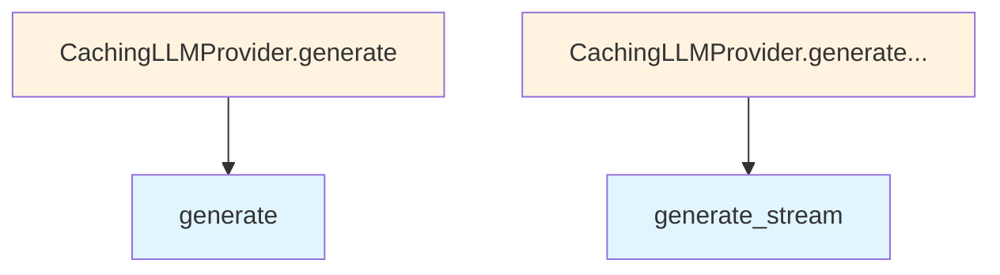

# cached.py

## File Overview

This module provides a caching [wrapper](../base.md) for LLM providers, implementing a [decorator](../base.md) pattern to add caching capabilities to any LLM provider implementation.

## Classes

### CachingLLMProvider

A [wrapper](../base.md) class that adds caching functionality to LLM providers. This class implements the [LLMProvider](../base.md) interface while delegating actual LLM operations to an underlying provider and caching the results.

**Purpose**: Reduces redundant API calls by caching LLM responses, improving performance and reducing costs for repeated queries.

**Key Features**:
- Wraps any existing [LLMProvider](../base.md) implementation
- Provides transparent caching without changing the provider interface
- Uses the [LLMCache](../../core/llm_cache.md) system for persistent storage of responses

## Related Components

This module integrates with several other components:

- **[LLMProvider](../base.md)**: Base interface that this class implements
- **[LLMCache](../../core/llm_cache.md)**: Core caching system used for storing and retrieving cached responses
- **[get_logger](../../logging.md)**: Logging utility for debugging and monitoring cache operations

The module uses `AsyncIterator` from the collections.abc module, indicating it supports asynchronous streaming operations typical of LLM providers.

## Usage Context

The CachingLLMProvider serves as a middleware layer that can wrap any LLM provider to add caching capabilities. This allows the application to benefit from caching without modifying existing provider implementations.

## API Reference

### class `CachingLLMProvider`

**Inherits from:** [`LLMProvider`](../base.md)

LLM provider [wrapper](../base.md) that caches responses.  Wraps any [LLMProvider](../base.md) implementation to add transparent caching. Cache lookups happen before calling the underlying provider, and successful responses are cached for future use.  Only responses generated with temperature <= max_cacheable_temperature are cached, as higher temperatures produce non-deterministic outputs.

**Methods:**


<details>
<summary>View Source (lines 12-158) | <a href="https://github.com/UrbanDiver/local-deepwiki-mcp/blob/feature/wiki-enhancements/src/local_deepwiki/providers/llm/cached.py#L12-L158">GitHub</a></summary>

```python
class CachingLLMProvider(LLMProvider):
    # Methods: __init__, name, stats, generate, generate_stream
```

</details>

#### `__init__`

```python
def __init__(provider: LLMProvider, cache: LLMCache)
```

Initialize the caching provider.


| [Parameter](../../generators/api_docs.md) | Type | Default | Description |
|-----------|------|---------|-------------|
| `provider` | [`LLMProvider`](../base.md) | - | The underlying LLM provider to wrap. |
| `cache` | [`LLMCache`](../../core/llm_cache.md) | - | The LLM cache instance to use. |


<details>
<summary>View Source (lines 23-35) | <a href="https://github.com/UrbanDiver/local-deepwiki-mcp/blob/feature/wiki-enhancements/src/local_deepwiki/providers/llm/cached.py#L23-L35">GitHub</a></summary>

```python
def __init__(
        self,
        provider: LLMProvider,
        cache: LLMCache,
    ):
        """Initialize the caching provider.

        Args:
            provider: The underlying LLM provider to wrap.
            cache: The LLM cache instance to use.
        """
        self._provider = provider
        self._cache = cache
```

</details>

#### `name`

```python
def name() -> str
```

Get the provider name with cache prefix.


<details>
<summary>View Source (lines 38-40) | <a href="https://github.com/UrbanDiver/local-deepwiki-mcp/blob/feature/wiki-enhancements/src/local_deepwiki/providers/llm/cached.py#L38-L40">GitHub</a></summary>

```python
def name(self) -> str:
        """Get the provider name with cache prefix."""
        return f"cached:{self._provider.name}"
```

</details>

#### `stats`

```python
def stats() -> dict[str, int]
```

Get cache statistics.


<details>
<summary>View Source (lines 43-45) | <a href="https://github.com/UrbanDiver/local-deepwiki-mcp/blob/feature/wiki-enhancements/src/local_deepwiki/providers/llm/cached.py#L43-L45">GitHub</a></summary>

```python
def stats(self) -> dict[str, int]:
        """Get cache statistics."""
        return self._cache.stats
```

</details>

#### `generate`

```python
async def generate(prompt: str, system_prompt: str | None = None, max_tokens: int = 4096, temperature: float = 0.7) -> str
```

Generate text with caching.  Checks cache first, generates from provider on miss, and caches the response.


| [Parameter](../../generators/api_docs.md) | Type | Default | Description |
|-----------|------|---------|-------------|
| `prompt` | `str` | - | The user prompt. |
| `system_prompt` | `str | None` | `None` | Optional system prompt. |
| `max_tokens` | `int` | `4096` | Maximum tokens to generate. |
| `temperature` | `float` | `0.7` | Sampling temperature. |


<details>
<summary>View Source (lines 47-98) | <a href="https://github.com/UrbanDiver/local-deepwiki-mcp/blob/feature/wiki-enhancements/src/local_deepwiki/providers/llm/cached.py#L47-L98">GitHub</a></summary>

```python
async def generate(
        self,
        prompt: str,
        system_prompt: str | None = None,
        max_tokens: int = 4096,
        temperature: float = 0.7,
    ) -> str:
        """Generate text with caching.

        Checks cache first, generates from provider on miss,
        and caches the response.

        Args:
            prompt: The user prompt.
            system_prompt: Optional system prompt.
            max_tokens: Maximum tokens to generate.
            temperature: Sampling temperature.

        Returns:
            Generated text (from cache or provider).
        """
        # Try cache first
        cached = await self._cache.get(
            prompt=prompt,
            system_prompt=system_prompt,
            temperature=temperature,
            model_name=self._provider.name,
        )

        if cached is not None:
            logger.debug(f"Cache hit for prompt: {prompt[:50]}...")
            return cached

        # Generate from provider
        logger.debug(f"Cache miss, generating for prompt: {prompt[:50]}...")
        response = await self._provider.generate(
            prompt=prompt,
            system_prompt=system_prompt,
            max_tokens=max_tokens,
            temperature=temperature,
        )

        # Cache the response
        await self._cache.set(
            prompt=prompt,
            response=response,
            system_prompt=system_prompt,
            temperature=temperature,
            model_name=self._provider.name,
        )

        return response
```

</details>

#### `generate_stream`

```python
async def generate_stream(prompt: str, system_prompt: str | None = None, max_tokens: int = 4096, temperature: float = 0.7) -> AsyncIterator[str]
```

Stream generation with caching.  For cache hits, simulates streaming by yielding chunks. For cache misses, streams from provider and caches the complete response.


| [Parameter](../../generators/api_docs.md) | Type | Default | Description |
|-----------|------|---------|-------------|
| `prompt` | `str` | - | The user prompt. |
| `system_prompt` | `str | None` | `None` | Optional system prompt. |
| `max_tokens` | `int` | `4096` | Maximum tokens to generate. |
| `temperature` | `float` | `0.7` | Sampling temperature. |


<details>
<summary>View Source (lines 100-158) | <a href="https://github.com/UrbanDiver/local-deepwiki-mcp/blob/feature/wiki-enhancements/src/local_deepwiki/providers/llm/cached.py#L100-L158">GitHub</a></summary>

```python
async def generate_stream(
        self,
        prompt: str,
        system_prompt: str | None = None,
        max_tokens: int = 4096,
        temperature: float = 0.7,
    ) -> AsyncIterator[str]:
        """Stream generation with caching.

        For cache hits, simulates streaming by yielding chunks.
        For cache misses, streams from provider and caches the complete response.

        Args:
            prompt: The user prompt.
            system_prompt: Optional system prompt.
            max_tokens: Maximum tokens to generate.
            temperature: Sampling temperature.

        Yields:
            Text chunks.
        """
        # Try cache first
        cached = await self._cache.get(
            prompt=prompt,
            system_prompt=system_prompt,
            temperature=temperature,
            model_name=self._provider.name,
        )

        if cached is not None:
            logger.debug(f"Cache hit (stream) for prompt: {prompt[:50]}...")
            # Simulate streaming for cached response
            chunk_size = 100
            for i in range(0, len(cached), chunk_size):
                yield cached[i : i + chunk_size]
            return

        # Stream from provider and collect for caching
        logger.debug(f"Cache miss (stream), generating for prompt: {prompt[:50]}...")
        chunks: list[str] = []

        async for chunk in self._provider.generate_stream(
            prompt=prompt,
            system_prompt=system_prompt,
            max_tokens=max_tokens,
            temperature=temperature,
        ):
            chunks.append(chunk)
            yield chunk

        # Cache complete response
        complete_response = "".join(chunks)
        await self._cache.set(
            prompt=prompt,
            response=complete_response,
            system_prompt=system_prompt,
            temperature=temperature,
            model_name=self._provider.name,
        )
```

</details>

## Class Diagram



## Call Graph



## Used By

Functions and methods in this file and their callers:

- **`generate`**: called by `CachingLLMProvider.generate`
- **`generate_stream`**: called by `CachingLLMProvider.generate_stream`

## Relevant Source Files

- `src/local_deepwiki/providers/llm/cached.py:12-158`
