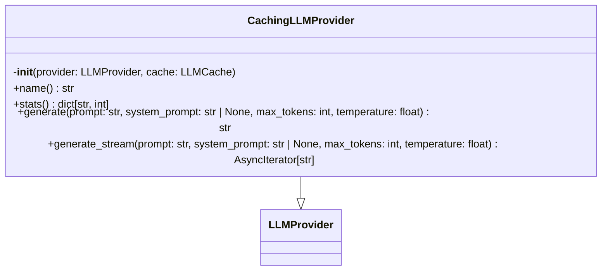
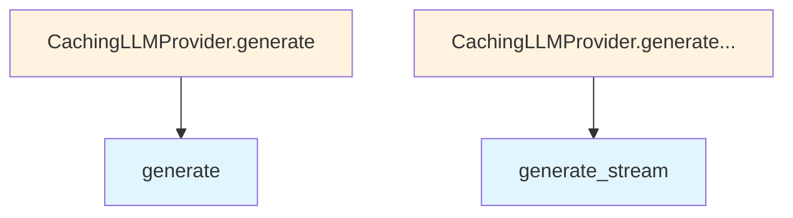

# Cached LLM Provider

## File Overview

The `cached.py` module provides a caching [wrapper](../base.md) for LLM providers. It implements the CachingLLMProvider class that adds caching capabilities to any underlying LLM provider, helping to reduce redundant API calls and improve performance.

## Classes

### CachingLLMProvider

A [wrapper](../base.md) class that adds caching functionality to LLM providers. The CachingLLMProvider inherits from [LLMProvider](../base.md) and decorates another LLM provider with caching capabilities.

**Purpose**: Intercepts calls to an underlying LLM provider and caches responses to avoid repeated API calls for identical requests.

## Related Components

This module integrates with several other components:

- **[LLMProvider](../base.md)**: The base class that CachingLLMProvider extends
- **[LLMCache](../../core/llm_cache.md)**: Core caching functionality for storing and retrieving LLM responses
- **AsyncIterator**: Used for handling streaming responses from collections.abc
- **Logging**: Uses the project's logging system via [`get_logger`](../../logging.md)

## Dependencies

Based on the imports shown, this module depends on:

- `collections.abc.AsyncIterator` - For async iteration support
- [`local_deepwiki.core.llm_cache.LLMCache`](../../core/llm_cache.md) - Core caching implementation
- [`local_deepwiki.logging.get_logger`](../../logging.md) - Logging functionality
- [`local_deepwiki.providers.base.LLMProvider`](../base.md) - Base LLM provider interface

## API Reference

### class `CachingLLMProvider`

**Inherits from:** [`LLMProvider`](../base.md)

LLM provider [wrapper](../base.md) that caches responses.  Wraps any [LLMProvider](../base.md) implementation to add transparent caching. Cache lookups happen before calling the underlying provider, and successful responses are cached for future use.  Only responses generated with temperature <= max_cacheable_temperature are cached, as higher temperatures produce non-deterministic outputs.

**Methods:**

#### `__init__`

```python
def __init__(provider: LLMProvider, cache: LLMCache)
```

Initialize the caching provider.


| [Parameter](../../generators/api_docs.md) | Type | Default | Description |
|-----------|------|---------|-------------|
| `provider` | [`LLMProvider`](../base.md) | - | The underlying LLM provider to wrap. |
| `cache` | [`LLMCache`](../../core/llm_cache.md) | - | The LLM cache instance to use. |

#### `name`

```python
def name() -> str
```

Get the provider name with cache prefix.

#### `stats`

```python
def stats() -> dict[str, int]
```

Get cache statistics.

#### `generate`

```python
async def generate(prompt: str, system_prompt: str | None = None, max_tokens: int = 4096, temperature: float = 0.7) -> str
```

Generate text with caching.  Checks cache first, generates from provider on miss, and caches the response.


| [Parameter](../../generators/api_docs.md) | Type | Default | Description |
|-----------|------|---------|-------------|
| `prompt` | `str` | - | The user prompt. |
| `system_prompt` | `str | None` | `None` | Optional system prompt. |
| `max_tokens` | `int` | `4096` | Maximum tokens to generate. |
| `temperature` | `float` | `0.7` | Sampling temperature. |

#### `generate_stream`

```python
async def generate_stream(prompt: str, system_prompt: str | None = None, max_tokens: int = 4096, temperature: float = 0.7) -> AsyncIterator[str]
```

Stream generation with caching.  For cache hits, simulates streaming by yielding chunks. For cache misses, streams from provider and caches the complete response.


| [Parameter](../../generators/api_docs.md) | Type | Default | Description |
|-----------|------|---------|-------------|
| `prompt` | `str` | - | The user prompt. |
| `system_prompt` | `str | None` | `None` | Optional system prompt. |
| `max_tokens` | `int` | `4096` | Maximum tokens to generate. |
| `temperature` | `float` | `0.7` | Sampling temperature. |


## Class Diagram



## Call Graph



## Relevant Source Files

- `src/local_deepwiki/providers/llm/cached.py:12-158`
