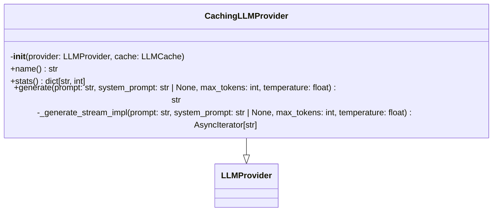
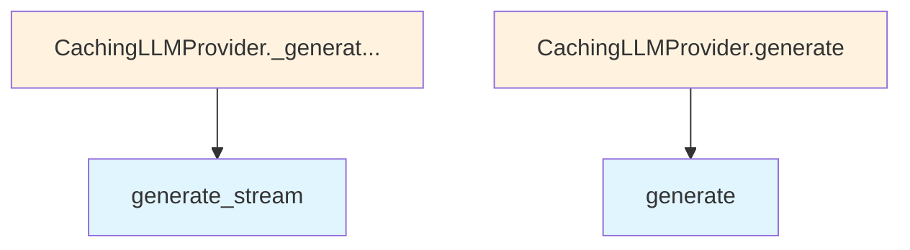

# File: `src/local_deepwiki/providers/llm/cached.py`

## File Overview

This file implements a caching [wrapper](../../handlers/_error_handling.md) for LLM providers, enabling efficient reuse of previously generated responses. The `CachingLLMProvider` class wraps an underlying [`LLMProvider`](../base.md) and integrates with an [`LLMCache`](../../core/llm_cache.md) to store and retrieve responses based on prompt, system prompt, temperature, and model name.

The primary responsibility of this module is to reduce redundant LLM calls by checking a cache before invoking the underlying provider. It supports both synchronous and streaming generation modes, ensuring that cached results are handled consistently in both cases.

## Key Concepts

### Caching Strategy
The caching strategy uses a key derived from:
- `prompt`
- `system_prompt`
- `temperature`
- `model_name` (from the underlying provider)

This ensures that different configurations result in distinct cache entries, which is critical for maintaining correctness in LLM interactions.

### Streaming vs. Synchronous Generation
The implementation supports both:
- `generate`: For full response retrieval
- `_generate_stream_impl`: For streaming responses

For cached responses, streaming is simulated by yielding chunks of the cached text. For uncached responses, the underlying provider is invoked, and the complete response is cached after streaming.

### Design Rationale
This design allows developers to layer caching on top of any [`LLMProvider`](../base.md) without modifying the provider's logic. It promotes reusability and performance optimization without sacrificing flexibility.

## Integration

This file is part of the LLM provider ecosystem in `local_deepwiki`. It integrates with:
- [`LLMProvider`](../base.md) base class for defining the expected interface
- [`LLMCache`](../../core/llm_cache.md) for managing cached responses
- [`get_logger`](../../logging.md) for logging cache hits/misses

It is used by `CachingLLMProvider` in test scenarios (`test_llm_cache`), indicating that it's a core component for testing LLM caching behavior.

This module is not directly used by CLI entrypoints or generators, but it underpins the caching infrastructure that supports other parts of the system that rely on LLMs.

## Design Notes

### Cache Hit Handling
When a cache hit occurs:
- The response is returned immediately.
- For streaming, the cached response is split into chunks and yielded one by one to simulate streaming behavior.
- This ensures that callers using streaming do not observe a difference in behavior between cached and uncached responses.

### Cache Miss Handling
When a cache miss occurs:
- The underlying provider is invoked.
- The full response is collected (especially for streaming) and then cached for future use.
- This ensures that even streaming operations benefit from caching.

### Logging
The module uses `logger.debug` to indicate cache hits and misses. This is helpful for debugging and performance monitoring in development or testing environments.

### Asynchronous Support
All methods are asynchronous, supporting the async/await pattern used throughout the codebase for LLM interactions. This allows for non-blocking I/O and better scalability.

### Edge Cases
- The module assumes that `LLMCache.get()` and `LLMCache.set()` are correctly implemented and handle concurrency.
- It does not handle cache invalidation or TTL (time-to-live) logic — this is delegated to the [`LLMCache`](../../core/llm_cache.md) implementation.
- The streaming simulation for cached responses assumes that the cached string can be split into chunks of arbitrary size; this is acceptable for most use cases but may not be ideal for very large responses where chunking logic is more complex.

## API Reference

### class `CachingLLMProvider`

**Inherits from:** [`LLMProvider`](../base.md)

LLM provider [wrapper](../../handlers/_error_handling.md) that caches responses.  Wraps any [LLMProvider](../base.md) implementation to add transparent caching. Cache lookups happen before calling the underlying provider, and successful responses are cached for future use.  Only responses generated with temperature <= max_cacheable_temperature are cached, as higher temperatures produce non-deterministic outputs.

**Methods:**


<details>
<summary>View Source (lines 14-160) | <a href="https://github.com/UrbanDiver/local-deepwiki-mcp/blob/main/src/local_deepwiki/providers/llm/cached.py#L14-L160">GitHub</a></summary>

```python
class CachingLLMProvider(LLMProvider):
    # Methods: __init__, name, stats, generate, _generate_stream_impl
```

</details>

#### `__init__`

```python
def __init__(provider: LLMProvider, cache: LLMCache)
```

Initialize the caching provider.


| Parameter | Type | Default | Description |
|-----------|------|---------|-------------|
| `provider` | `LLMProvider` | - | The underlying LLM provider to wrap. |
| `cache` | `LLMCache` | - | The LLM cache instance to use. |


<details>
<summary>View Source (lines 25-37) | <a href="https://github.com/UrbanDiver/local-deepwiki-mcp/blob/main/src/local_deepwiki/providers/llm/cached.py#L25-L37">GitHub</a></summary>

```python
def __init__(
        self,
        provider: LLMProvider,
        cache: LLMCache,
    ):
        """Initialize the caching provider.

        Args:
            provider: The underlying LLM provider to wrap.
            cache: The LLM cache instance to use.
        """
        self._provider = provider
        self._cache = cache
```

</details>

#### `name`

```python
def name() -> str
```

Get the provider name with cache prefix.


<details>
<summary>View Source (lines 40-42) | <a href="https://github.com/UrbanDiver/local-deepwiki-mcp/blob/main/src/local_deepwiki/providers/llm/cached.py#L40-L42">GitHub</a></summary>

```python
def name(self) -> str:
        """Get the provider name with cache prefix."""
        return f"cached:{self._provider.name}"
```

</details>

#### `stats`

```python
def stats() -> dict[str, int]
```

Get cache statistics.


<details>
<summary>View Source (lines 45-47) | <a href="https://github.com/UrbanDiver/local-deepwiki-mcp/blob/main/src/local_deepwiki/providers/llm/cached.py#L45-L47">GitHub</a></summary>

```python
def stats(self) -> dict[str, int]:
        """Get cache statistics."""
        return self._cache.stats
```

</details>

#### `generate`

```python
async def generate(prompt: str, system_prompt: str | None = None, max_tokens: int = 4096, temperature: float = 0.7) -> str
```

Generate text with caching.  Checks cache first, generates from provider on miss, and caches the response.


| Parameter | Type | Default | Description |
|-----------|------|---------|-------------|
| `prompt` | `str` | - | The user prompt. |
| `system_prompt` | `str | None` | `None` | Optional system prompt. |
| `max_tokens` | `int` | `4096` | Maximum tokens to generate. |
| `temperature` | `float` | `0.7` | Sampling temperature. |


<details>
<summary>View Source (lines 49-100) | <a href="https://github.com/UrbanDiver/local-deepwiki-mcp/blob/main/src/local_deepwiki/providers/llm/cached.py#L49-L100">GitHub</a></summary>

```python
async def generate(
        self,
        prompt: str,
        system_prompt: str | None = None,
        max_tokens: int = 4096,
        temperature: float = 0.7,
    ) -> str:
        """Generate text with caching.

        Checks cache first, generates from provider on miss,
        and caches the response.

        Args:
            prompt: The user prompt.
            system_prompt: Optional system prompt.
            max_tokens: Maximum tokens to generate.
            temperature: Sampling temperature.

        Returns:
            Generated text (from cache or provider).
        """
        # Try cache first
        cached = await self._cache.get(
            prompt=prompt,
            system_prompt=system_prompt,
            temperature=temperature,
            model_name=self._provider.name,
        )

        if cached is not None:
            logger.debug("Cache hit for prompt: %s...", prompt[:50])
            return cached

        # Generate from provider
        logger.debug("Cache miss, generating for prompt: %s...", prompt[:50])
        response = await self._provider.generate(
            prompt=prompt,
            system_prompt=system_prompt,
            max_tokens=max_tokens,
            temperature=temperature,
        )

        # Cache the response
        await self._cache.set(
            prompt=prompt,
            response=response,
            system_prompt=system_prompt,
            temperature=temperature,
            model_name=self._provider.name,
        )

        return response
```

</details>

## Class Diagram


```mermaid
classDiagram
    class CachingLLMProvider {
        -__init__(provider: LLMProvider, cache: LLMCache)
        +name() str
        +stats() dict[str, int]
        +generate(prompt: str, system_prompt: str | None, max_tokens: int, temperature: float) str
        -_generate_stream_impl(prompt: str, system_prompt: str | None, max_tokens: int, temperature: float) AsyncIterator[str]
    }
    CachingLLMProvider --|> LLMProvider
```

## Call Graph


```mermaid
flowchart TD
    N0[CachingLLMProvider._generat...]
    N1[CachingLLMProvider.generate]
    N2[generate]
    N3[generate_stream]
    N1 --> N2
    N0 --> N3
    classDef func fill:#e1f5fe
    class N2,N3 func
    classDef method fill:#fff3e0
    class N0,N1 method
```

## Used By

Functions and methods in this file and their callers:

- **`generate`**: called by `CachingLLMProvider.generate`
- **`generate_stream`**: called by `CachingLLMProvider._generate_stream_impl`

## Last Modified

| Entity | Type | Author | Date | Commit |
|--------|------|--------|------|--------|
| `CachingLLMProvider` | class | Brian Breidenbach | 2 weeks ago | `c850cb5` feat: enforce provider stre... |
| `_generate_stream_impl` | method | Brian Breidenbach | 2 weeks ago | `c850cb5` feat: enforce provider stre... |
| `generate` | method | Brian Breidenbach | Feb 11, 2026 | `ba96da1` fix: publication plan P0-P2... |
| `__init__` | method | Brian Breidenbach | Jan 14, 2026 | `ac906d4` Add LLM response caching wi... |
| `name` | method | Brian Breidenbach | Jan 14, 2026 | `ac906d4` Add LLM response caching wi... |
| `stats` | method | Brian Breidenbach | Jan 14, 2026 | `ac906d4` Add LLM response caching wi... |

## Additional Source Code

Source code for functions and methods not listed in the API Reference above.

#### `_generate_stream_impl`

<details>
<summary>View Source (lines 102-160) | <a href="https://github.com/UrbanDiver/local-deepwiki-mcp/blob/main/src/local_deepwiki/providers/llm/cached.py#L102-L160">GitHub</a></summary>

```python
async def _generate_stream_impl(
        self,
        prompt: str,
        system_prompt: str | None = None,
        max_tokens: int = 4096,
        temperature: float = 0.7,
    ) -> AsyncIterator[str]:
        """Stream generation with caching.

        For cache hits, simulates streaming by yielding chunks.
        For cache misses, streams from provider and caches the complete response.

        Args:
            prompt: The user prompt.
            system_prompt: Optional system prompt.
            max_tokens: Maximum tokens to generate.
            temperature: Sampling temperature.

        Yields:
            Text chunks.
        """
        # Try cache first
        cached = await self._cache.get(
            prompt=prompt,
            system_prompt=system_prompt,
            temperature=temperature,
            model_name=self._provider.name,
        )

        if cached is not None:
            logger.debug("Cache hit (stream) for prompt: %s...", prompt[:50])
            # Simulate streaming for cached response
            chunk_size = 100
            for i in range(0, len(cached), chunk_size):
                yield cached[i : i + chunk_size]
            return

        # Stream from provider and collect for caching
        logger.debug("Cache miss (stream), generating for prompt: %s...", prompt[:50])
        chunks: list[str] = []

        async for chunk in self._provider.generate_stream(
            prompt=prompt,
            system_prompt=system_prompt,
            max_tokens=max_tokens,
            temperature=temperature,
        ):
            chunks.append(chunk)
            yield chunk

        # Cache complete response
        complete_response = "".join(chunks)
        await self._cache.set(
            prompt=prompt,
            response=complete_response,
            system_prompt=system_prompt,
            temperature=temperature,
            model_name=self._provider.name,
        )
```

</details>

## Relevant Source Files

- `src/local_deepwiki/providers/llm/cached.py:14-160`
