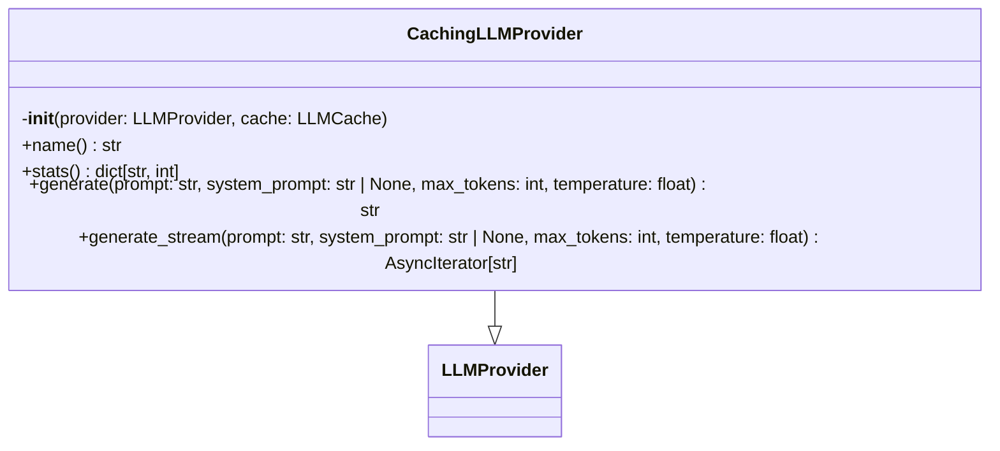
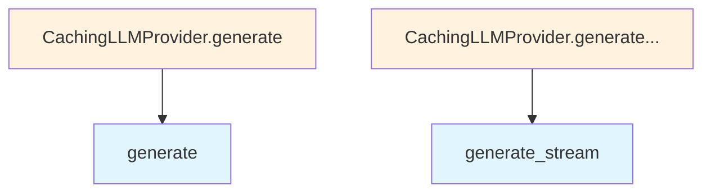

# File Overview

This file defines the `CachingLLMProvider` class, which wraps an existing [`LLMProvider`](../base.md) to add caching functionality. It uses an [`LLMCache`](../../core/llm_cache.md) instance to store and retrieve generated responses, improving performance by avoiding redundant computations.

## Dependencies

- `collections.abc.AsyncIterator`: Used for type hinting the stream generator.
- [`local_deepwiki.core.llm_cache.LLMCache`](../../core/llm_cache.md): Provides the caching mechanism.
- [`local_deepwiki.logging.get_logger`](../../logging.md): For logging within the provider.
- [`local_deepwiki.providers.base.LLMProvider`](../base.md): Base class for LLM providers.

## Integration

This file integrates with:

- [`local_deepwiki.core.llm_cache.LLMCache`](../../core/llm_cache.md): The core caching logic is delegated to this class.
- [`local_deepwiki.providers.base.LLMProvider`](../base.md): This class wraps another provider to add caching behavior.

It is likely used by components in the `local_deepwiki.generators` module or CLI tools that require efficient LLM usage with caching.

---

# Classes

## CachingLLMProvider

A [wrapper](../base.md) around an [`LLMProvider`](../base.md) that adds caching capabilities. It delegates generation requests to the underlying provider, but caches responses to avoid re-computation.

### Methods

#### `__init__(self, provider: LLMProvider, cache: LLMCache)`

Initialize the caching provider.

**Parameters:**
- `provider`: The underlying LLM provider to wrap.
- `cache`: The LLM cache instance to use.

#### `name(self) -> str`

Get the provider name with cache prefix.

**Returns:**
- A string in the format `cached:{provider_name}`.

#### `stats(self) -> dict[str, int]`

Get cache statistics.

**Returns:**
- A dictionary containing cache statistics (e.g., hits, misses).

#### `generate(self, prompt: str, system_prompt: str | None = None, max_tokens: int = 4096, temperature: float = 0.7) -> str`

Generate text with caching.

Checks cache first, generates from provider on miss, and caches the response.

**Parameters:**
- `prompt`: The user prompt.
- `system_prompt`: Optional system prompt.
- `max_tokens`: Maximum tokens to generate.
- `temperature`: Sampling temperature.

**Returns:**
- Generated text (from cache or provider).

#### `generate_stream(self, prompt: str, system_prompt: str | None = None, max_tokens: int = 4096, temperature: float = 0.7) -> AsyncIterator[str]`

Stream generation with caching.

For cache hits, simulates streaming by yielding chunks. For cache misses, streams from provider and caches the complete response.

**Parameters:**
- `prompt`: The user prompt.
- `system_prompt`: Optional system prompt.
- `max_tokens`: Maximum tokens to generate.
- `temperature`: Sampling temperature.

**Returns:**
- An async iterator of strings representing the generated text chunks.

## API Reference

### class `CachingLLMProvider`

**Inherits from:** [`LLMProvider`](../base.md)

LLM provider [wrapper](../base.md) that caches responses.  Wraps any [LLMProvider](../base.md) implementation to add transparent caching. Cache lookups happen before calling the underlying provider, and successful responses are cached for future use.  Only responses generated with temperature <= max_cacheable_temperature are cached, as higher temperatures produce non-deterministic outputs.

**Methods:**


<details>
<summary>View Source (lines 12-158) | <a href="https://github.com/UrbanDiver/local-deepwiki-mcp/blob/[main](../../export/pdf.md)/src/local_deepwiki/providers/llm/cached.py#L12-L158">GitHub</a></summary>

```python
class CachingLLMProvider(LLMProvider):
    # Methods: __init__, name, stats, generate, generate_stream
```

</details>

#### `__init__`

```python
def __init__(provider: LLMProvider, cache: LLMCache)
```

Initialize the caching provider.


| [Parameter](../../generators/api_docs.md) | Type | Default | Description |
|-----------|------|---------|-------------|
| `provider` | [`LLMProvider`](../base.md) | - | The underlying LLM provider to wrap. |
| `cache` | [`LLMCache`](../../core/llm_cache.md) | - | The LLM cache instance to use. |


<details>
<summary>View Source (lines 23-35) | <a href="https://github.com/UrbanDiver/local-deepwiki-mcp/blob/[main](../../export/pdf.md)/src/local_deepwiki/providers/llm/cached.py#L23-L35">GitHub</a></summary>

```python
def __init__(
        self,
        provider: LLMProvider,
        cache: LLMCache,
    ):
        """Initialize the caching provider.

        Args:
            provider: The underlying LLM provider to wrap.
            cache: The LLM cache instance to use.
        """
        self._provider = provider
        self._cache = cache
```

</details>

#### `name`

```python
def name() -> str
```

Get the provider name with cache prefix.


<details>
<summary>View Source (lines 38-40) | <a href="https://github.com/UrbanDiver/local-deepwiki-mcp/blob/[main](../../export/pdf.md)/src/local_deepwiki/providers/llm/cached.py#L38-L40">GitHub</a></summary>

```python
def name(self) -> str:
        """Get the provider name with cache prefix."""
        return f"cached:{self._provider.name}"
```

</details>

#### `stats`

```python
def stats() -> dict[str, int]
```

Get cache statistics.


<details>
<summary>View Source (lines 43-45) | <a href="https://github.com/UrbanDiver/local-deepwiki-mcp/blob/[main](../../export/pdf.md)/src/local_deepwiki/providers/llm/cached.py#L43-L45">GitHub</a></summary>

```python
def stats(self) -> dict[str, int]:
        """Get cache statistics."""
        return self._cache.stats
```

</details>

#### `generate`

```python
async def generate(prompt: str, system_prompt: str | None = None, max_tokens: int = 4096, temperature: float = 0.7) -> str
```

Generate text with caching.  Checks cache first, generates from provider on miss, and caches the response.


| [Parameter](../../generators/api_docs.md) | Type | Default | Description |
|-----------|------|---------|-------------|
| `prompt` | `str` | - | The user prompt. |
| `system_prompt` | `str | None` | `None` | Optional system prompt. |
| `max_tokens` | `int` | `4096` | Maximum tokens to generate. |
| `temperature` | `float` | `0.7` | Sampling temperature. |


<details>
<summary>View Source (lines 47-98) | <a href="https://github.com/UrbanDiver/local-deepwiki-mcp/blob/[main](../../export/pdf.md)/src/local_deepwiki/providers/llm/cached.py#L47-L98">GitHub</a></summary>

```python
async def generate(
        self,
        prompt: str,
        system_prompt: str | None = None,
        max_tokens: int = 4096,
        temperature: float = 0.7,
    ) -> str:
        """Generate text with caching.

        Checks cache first, generates from provider on miss,
        and caches the response.

        Args:
            prompt: The user prompt.
            system_prompt: Optional system prompt.
            max_tokens: Maximum tokens to generate.
            temperature: Sampling temperature.

        Returns:
            Generated text (from cache or provider).
        """
        # Try cache first
        cached = await self._cache.get(
            prompt=prompt,
            system_prompt=system_prompt,
            temperature=temperature,
            model_name=self._provider.name,
        )

        if cached is not None:
            logger.debug(f"Cache hit for prompt: {prompt[:50]}...")
            return cached

        # Generate from provider
        logger.debug(f"Cache miss, generating for prompt: {prompt[:50]}...")
        response = await self._provider.generate(
            prompt=prompt,
            system_prompt=system_prompt,
            max_tokens=max_tokens,
            temperature=temperature,
        )

        # Cache the response
        await self._cache.set(
            prompt=prompt,
            response=response,
            system_prompt=system_prompt,
            temperature=temperature,
            model_name=self._provider.name,
        )

        return response
```

</details>

#### `generate_stream`

```python
async def generate_stream(prompt: str, system_prompt: str | None = None, max_tokens: int = 4096, temperature: float = 0.7) -> AsyncIterator[str]
```

Stream generation with caching.  For cache hits, simulates streaming by yielding chunks. For cache misses, streams from provider and caches the complete response.


| [Parameter](../../generators/api_docs.md) | Type | Default | Description |
|-----------|------|---------|-------------|
| `prompt` | `str` | - | The user prompt. |
| `system_prompt` | `str | None` | `None` | Optional system prompt. |
| `max_tokens` | `int` | `4096` | Maximum tokens to generate. |
| `temperature` | `float` | `0.7` | Sampling temperature. |


<details>
<summary>View Source (lines 100-158) | <a href="https://github.com/UrbanDiver/local-deepwiki-mcp/blob/[main](../../export/pdf.md)/src/local_deepwiki/providers/llm/cached.py#L100-L158">GitHub</a></summary>

```python
async def generate_stream(
        self,
        prompt: str,
        system_prompt: str | None = None,
        max_tokens: int = 4096,
        temperature: float = 0.7,
    ) -> AsyncIterator[str]:
        """Stream generation with caching.

        For cache hits, simulates streaming by yielding chunks.
        For cache misses, streams from provider and caches the complete response.

        Args:
            prompt: The user prompt.
            system_prompt: Optional system prompt.
            max_tokens: Maximum tokens to generate.
            temperature: Sampling temperature.

        Yields:
            Text chunks.
        """
        # Try cache first
        cached = await self._cache.get(
            prompt=prompt,
            system_prompt=system_prompt,
            temperature=temperature,
            model_name=self._provider.name,
        )

        if cached is not None:
            logger.debug(f"Cache hit (stream) for prompt: {prompt[:50]}...")
            # Simulate streaming for cached response
            chunk_size = 100
            for i in range(0, len(cached), chunk_size):
                yield cached[i : i + chunk_size]
            return

        # Stream from provider and collect for caching
        logger.debug(f"Cache miss (stream), generating for prompt: {prompt[:50]}...")
        chunks: list[str] = []

        async for chunk in self._provider.generate_stream(
            prompt=prompt,
            system_prompt=system_prompt,
            max_tokens=max_tokens,
            temperature=temperature,
        ):
            chunks.append(chunk)
            yield chunk

        # Cache complete response
        complete_response = "".join(chunks)
        await self._cache.set(
            prompt=prompt,
            response=complete_response,
            system_prompt=system_prompt,
            temperature=temperature,
            model_name=self._provider.name,
        )
```

</details>

## Class Diagram


```mermaid
classDiagram
    class CachingLLMProvider {
        -__init__(provider: LLMProvider, cache: LLMCache)
        +name() str
        +stats() dict[str, int]
        +generate(prompt: str, system_prompt: str | None, max_tokens: int, temperature: float) str
        +generate_stream(prompt: str, system_prompt: str | None, max_tokens: int, temperature: float) AsyncIterator[str]
    }
    CachingLLMProvider --|> LLMProvider
```

## Call Graph


```mermaid
flowchart TD
    N0[CachingLLMProvider.generate]
    N1[CachingLLMProvider.generate...]
    N2[generate]
    N3[generate_stream]
    N0 --> N2
    N1 --> N3
    classDef func fill:#e1f5fe
    class N2,N3 func
    classDef method fill:#fff3e0
    class N0,N1 method
```

## Used By

Functions and methods in this file and their callers:

- **`generate`**: called by `CachingLLMProvider.generate`
- **`generate_stream`**: called by `CachingLLMProvider.generate_stream`

## Last Modified

| Entity | Type | Author | Date | Commit |
|--------|------|--------|------|--------|
| `CachingLLMProvider` | class | Brian Breidenbach | 3 weeks ago | `ac906d4` Add LLM response caching wi... |
| `__init__` | method | Brian Breidenbach | 3 weeks ago | `ac906d4` Add LLM response caching wi... |
| `name` | method | Brian Breidenbach | 3 weeks ago | `ac906d4` Add LLM response caching wi... |
| `stats` | method | Brian Breidenbach | 3 weeks ago | `ac906d4` Add LLM response caching wi... |
| `generate` | method | Brian Breidenbach | 3 weeks ago | `ac906d4` Add LLM response caching wi... |
| `generate_stream` | method | Brian Breidenbach | 3 weeks ago | `ac906d4` Add LLM response caching wi... |

## Relevant Source Files

- `src/local_deepwiki/providers/llm/cached.py:12-158`
