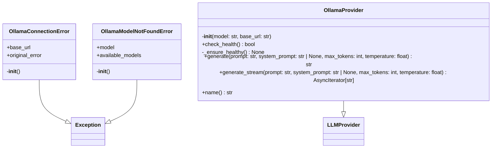

# Ollama Provider Documentation

## File Overview

The `ollama.py` file implements an Ollama-based LLM provider for the local_deepwiki system. This module provides integration with Ollama's local language model server, handling connection management, health checks, and both streaming and non-streaming text generation.

## Classes

### OllamaConnectionError

A custom exception class that handles connection failures to the Ollama server.

**Purpose**: Provides detailed error messages and troubleshooting guidance when the Ollama server cannot be reached.

**Constructor Parameters**:
- `base_url` (str): The Ollama server URL that failed to connect
- `original_error` (Exception | None): The underlying exception that caused the connection failure

**Features**:
- Includes helpful troubleshooting instructions in the error message
- References Ollama installation and setup steps
- Provides verification commands for debugging

### OllamaModelNotFoundError

A custom exception class for handling missing model errors (referenced in imports but implementation not shown in provided code).

### OllamaProvider

The [main](../../export/html.md) provider class that implements the [LLMProvider](../base.md) interface for Ollama integration.

**Purpose**: Manages communication with Ollama server for text generation tasks, including health monitoring and retry logic.

**Constructor Parameters**:
- `model` (str): Ollama model name (defaults to "llama3.2")
- `base_url` (str): Ollama API base URL (defaults to "http://localhost:11434")

**Key Methods**:

#### `__init__`
Initializes the Ollama provider with specified model and server configuration.

```python
provider = OllamaProvider(model="llama3.2", base_url="http://localhost:11434")
```

#### Additional Methods
The class includes several other methods (check_health, _ensure_healthy, generate, generate_stream, name) but their implementations are not shown in the provided code.

## Usage Examples

### Basic Provider Initialization

```python
from local_deepwiki.providers.llm.ollama import OllamaProvider

# Initialize with default settings
provider = OllamaProvider()

# Initialize with custom model and URL
provider = OllamaProvider(
    model="mistral",
    base_url="http://192.168.1.100:11434"
)
```

### Error Handling

```python
from local_deepwiki.providers.llm.ollama import OllamaConnectionError

try:
    provider = OllamaProvider(base_url="http://invalid-url:11434")
    # Perform operations...
except OllamaConnectionError as e:
    print(f"Connection failed to {e.base_url}")
    print("Original error:", e.original_error)
```

## Related Components

The OllamaProvider integrates with several other components:

- **[LLMProvider](../base.md)**: Base class that defines the provider interface
- **[with_retry](../base.md)**: Decorator for implementing retry logic on failed operations
- **AsyncClient**: Ollama's async client for API communication
- **ResponseError**: Ollama's error type for API response failures
- **[get_logger](../../logging.md)**: Logging utility from the local_deepwiki system

## Dependencies

The module relies on:
- `ollama` package: Provides AsyncClient and ResponseError for Ollama API communication
- `typing`: For type hints including AsyncIterator
- Local modules: Base provider classes and logging utilities

## API Reference

### class `OllamaConnectionError`

**Inherits from:** `Exception`

Raised when Ollama server is not accessible.

**Methods:**

#### `__init__`

```python
def __init__(base_url: str, original_error: Exception | None = None)
```


| [Parameter](../../generators/api_docs.md) | Type | Default | Description |
|-----------|------|---------|-------------|
| `base_url` | `str` | - | - |
| `original_error` | `Exception | None` | `None` | - |


### class `OllamaModelNotFoundError`

**Inherits from:** `Exception`

Raised when the requested model is not available in Ollama.

**Methods:**

#### `__init__`

```python
def __init__(model: str, available_models: list[str] | None = None)
```


| [Parameter](../../generators/api_docs.md) | Type | Default | Description |
|-----------|------|---------|-------------|
| `model` | `str` | - | - |
| `available_models` | `list[str] | None` | `None` | - |


### class `OllamaProvider`

**Inherits from:** [`LLMProvider`](../base.md)

LLM provider using local Ollama.

**Methods:**

#### `__init__`

```python
def __init__(model: str = "llama3.2", base_url: str = "http://localhost:11434")
```

Initialize the Ollama provider.


| [Parameter](../../generators/api_docs.md) | Type | Default | Description |
|-----------|------|---------|-------------|
| `model` | `str` | `"llama3.2"` | Ollama model name. |
| `base_url` | `str` | `"http://localhost:11434"` | Ollama API base URL. |

#### `check_health`

```python
async def check_health() -> bool
```

Check if Ollama is running and the model is available.

#### `generate`

```python
async def generate(prompt: str, system_prompt: str | None = None, max_tokens: int = 4096, temperature: float = 0.7) -> str
```

Generate text from a prompt.


| [Parameter](../../generators/api_docs.md) | Type | Default | Description |
|-----------|------|---------|-------------|
| `prompt` | `str` | - | The user prompt. |
| `system_prompt` | `str | None` | `None` | Optional system prompt. |
| `max_tokens` | `int` | `4096` | Maximum tokens to generate. |
| `temperature` | `float` | `0.7` | Sampling temperature. |

#### `generate_stream`

```python
async def generate_stream(prompt: str, system_prompt: str | None = None, max_tokens: int = 4096, temperature: float = 0.7) -> AsyncIterator[str]
```

Generate text from a prompt with streaming.


| [Parameter](../../generators/api_docs.md) | Type | Default | Description |
|-----------|------|---------|-------------|
| `prompt` | `str` | - | The user prompt. |
| `system_prompt` | `str | None` | `None` | Optional system prompt. |
| `max_tokens` | `int` | `4096` | Maximum tokens to generate. |
| `temperature` | `float` | `0.7` | Sampling temperature. |

#### `name`

```python
def name() -> str
```

Get the provider name.


## Class Diagram



## Call Graph

```mermaid
flowchart TD
    N0[AsyncClient]
    N1[OllamaConnectionError]
    N2[OllamaConnectionError.__init__]
    N3[OllamaModelNotFoundError]
    N4[OllamaModelNotFoundError.__...]
    N5[OllamaProvider.__init__]
    N6[OllamaProvider._ensure_healthy]
    N7[OllamaProvider.check_health]
    N8[OllamaProvider.generate]
    N9[OllamaProvider.generate_stream]
    N10[__init__]
    N11[_ensure_healthy]
    N12[chat]
    N13[check_health]
    N2 --> N10
    N4 --> N10
    N5 --> N0
    N7 --> N3
    N7 --> N1
    N6 --> N13
    N8 --> N11
    N8 --> N12
    N8 --> N3
    N8 --> N1
    N9 --> N11
    N9 --> N12
    N9 --> N3
    N9 --> N1
    classDef func fill:#e1f5fe
    class N0,N1,N3,N10,N11,N12,N13 func
    classDef method fill:#fff3e0
    class N2,N4,N5,N6,N7,N8,N9 method
```



## Relevant Source Files

- `src/local_deepwiki/providers/llm/ollama.py:13-26`

## See Also

- [test_provider_errors](../../../../tests/test_provider_errors.md) - uses this
