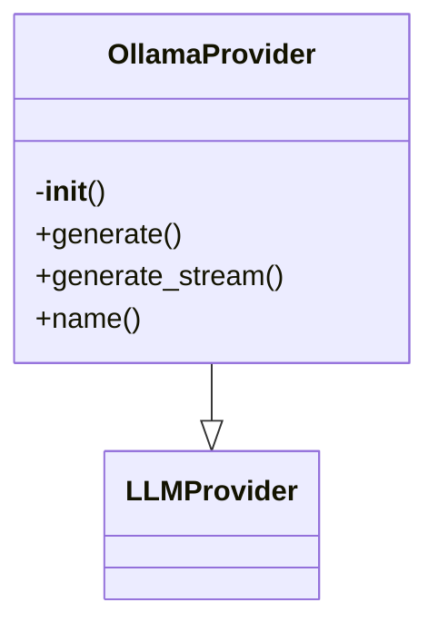

# Ollama Provider Documentation

## File Overview

This file implements an LLM provider that interfaces with local Ollama instances. It provides an asynchronous interface for generating text using local large language models through the Ollama API.

## Classes

### `OllamaProvider`

**Purpose**: 
An asynchronous LLM provider that communicates with a local Ollama instance to generate text responses.

**Key Methods**:

- `__init__(model: str = "llama3.2", base_url: str = "http://localhost:11434")`
- `generate(prompt: str, system_prompt: str | None = None, max_tokens: int = 4096, temperature: float = 0.7, top_p: float = 0.9) -> AsyncIterator[str]`

**Usage**:
```python
provider = OllamaProvider(model="llama3.2", base_url="http://localhost:11434")
async for chunk in provider.generate("Hello, world!"):
    print(chunk)
```

## Functions

### `generate`

**Purpose**: 
Asynchronously generates text using the configured Ollama model.

**Parameters**:
- `prompt` (str): The user prompt to send to the LLM
- `system_prompt` (str | None, optional): System prompt to prepend to the conversation. Defaults to `None`
- `max_tokens` (int, optional): Maximum number of tokens to generate. Defaults to `4096`
- `temperature` (float, optional): Sampling temperature for response randomness. Defaults to `0.7`
- `top_p` (float, optional): Nucleus sampling parameter. Defaults to `0.9`

**Return Value**:
- `AsyncIterator[str]`: An asynchronous iterator yielding text chunks as they are generated

**Usage**:
```python
async for chunk in provider.generate("What is AI?", max_tokens=1000, temperature=0.5):
    print(chunk)
```

## Usage Examples

### Basic Usage
```python
from local_deepwiki.providers.llm.ollama import OllamaProvider

# Initialize provider
provider = OllamaProvider()

# Generate text
async for chunk in provider.generate("Write a poem about technology"):
    print(chunk)
```

### Custom Configuration
```python
from local_deepwiki.providers.llm.ollama import OllamaProvider

# Initialize with custom model and URL
provider = OllamaProvider(
    model="mistral",
    base_url="http://192.168.1.100:11434"
)

# Generate with custom parameters
async for chunk in provider.generate(
    prompt="Explain quantum computing",
    max_tokens=500,
    temperature=0.3,
    top_p=0.8
):
    print(chunk)
```

## Dependencies

This file imports:
- `AsyncIterator` from `typing` - For type hinting asynchronous iterators
- `AsyncClient` from `ollama` - For asynchronous communication with Ollama API
- `LLMProvider` from `local_deepwiki.providers.base` - Base class for LLM providers

The provider requires a running Ollama instance accessible at the specified `base_url` and the requested `model` to be available locally.

## Class Diagram



## See Also

- [base](../base.md) - dependency
- [vectorstore](../../core/vectorstore.md) - shares 2 dependencies
- [anthropic](anthropic.md) - shares 2 dependencies
- [openai](openai.md) - shares 2 dependencies
