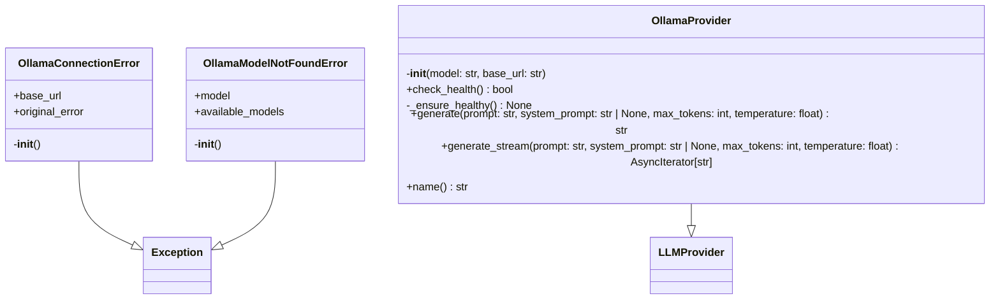

# Ollama Provider Module

## File Overview

The `ollama.py` module provides an LLM provider implementation for integrating with Ollama, a local AI model server. This module implements the [LLMProvider](../base.md) interface to enable communication with Ollama models running on a local or remote server.

## Classes

### OllamaConnectionError

A custom exception class that handles connection failures to the Ollama server.

**Purpose**: Raised when the Ollama server is not accessible, providing helpful diagnostic information and setup instructions.

**Constructor Parameters**:
- `base_url` (str): The Ollama server URL that failed to connect
- `original_error` (Exception | None, optional): The underlying exception that caused the connection failure

The exception message includes step-by-step instructions for installing and starting Ollama, along with a verification command.

### OllamaModelNotFoundError

A custom exception class for handling cases where a requested model is not available on the Ollama server.

### OllamaProvider

The [main](../../export/pdf.md) provider class that implements the [LLMProvider](../base.md) interface for Ollama integration.

**Purpose**: Provides async methods for generating text using Ollama models, with built-in health checking and error handling.

#### Methods

##### `__init__`

```python
def __init__(self, model: str = "llama3.2", base_url: str = "http://localhost:11434")
```

Initializes the Ollama provider with connection settings.

**Parameters**:
- `model` (str): Ollama model name (defaults to "llama3.2")
- `base_url` (str): Ollama API base URL (defaults to "http://localhost:11434")

**Behavior**:
- Creates an AsyncClient instance for communicating with Ollama
- Sets up internal state tracking for health checks
- Does not immediately connect to the server

##### `check_health`

Verifies that the Ollama server is accessible and the specified model is available.

##### `_ensure_healthy`

Internal method that performs health checks before API calls.

##### `generate`

Generates text completion using the configured Ollama model.

##### `generate_stream`

Generates streaming text completion, returning an AsyncIterator for real-time response processing.

##### `name`

Returns the provider name identifier.

## Usage Examples

### Basic Provider Setup

```python
from local_deepwiki.providers.llm.ollama import OllamaProvider

# Use default settings (llama3.2 model on localhost:11434)
provider = OllamaProvider()

# Use custom model and server
provider = OllamaProvider(
    model="mistral",
    base_url="http://192.168.1.100:11434"
)
```

### Error Handling

```python
from local_deepwiki.providers.llm.ollama import OllamaConnectionError, OllamaModelNotFoundError

try:
    provider = OllamaProvider()
    await provider.check_health()
except OllamaConnectionError as e:
    print(f"Cannot connect to Ollama at {e.base_url}")
    print("Follow the setup instructions in the error message")
except OllamaModelNotFoundError:
    print("The requested model is not available")
```

## Related Components

This module integrates with several other components:

- **[LLMProvider](../base.md)**: Base class that defines the provider interface
- **[with_retry](../base.md)**: Decorator for implementing retry logic on provider methods
- **AsyncClient**: From the `ollama` library, handles HTTP communication with Ollama server
- **ResponseError**: Exception type from the `ollama` library for API errors
- **[get_logger](../../logging.md)**: Logging utility from the local_deepwiki.logging module

The provider is designed to work within the larger local_deepwiki framework as a pluggable LLM backend for generating documentation content.

## API Reference

### class `OllamaConnectionError`

**Inherits from:** `Exception`

Raised when Ollama server is not accessible.

**Methods:**


<details>
<summary>View Source (lines 13-26) | <a href="https://github.com/UrbanDiver/local-deepwiki-mcp/blob/feature/wiki-enhancements/src/local_deepwiki/providers/llm/ollama.py#L13-L26">GitHub</a></summary>

```python
class OllamaConnectionError(Exception):
    """Raised when Ollama server is not accessible."""

    def __init__(self, base_url: str, original_error: Exception | None = None):
        self.base_url = base_url
        self.original_error = original_error
        message = (
            f"Cannot connect to Ollama at {base_url}. "
            "Please ensure Ollama is running:\n"
            "  1. Install Ollama: https://ollama.ai/download\n"
            "  2. Start Ollama: `ollama serve`\n"
            "  3. Verify it's running: `curl {base_url}/api/tags`"
        )
        super().__init__(message)
```

</details>

#### `__init__`

```python
def __init__(base_url: str, original_error: Exception | None = None)
```


| [Parameter](../../generators/api_docs.md) | Type | Default | Description |
|-----------|------|---------|-------------|
| `base_url` | `str` | - | - |
| `original_error` | `Exception | None` | `None` | - |


<details>
<summary>View Source (lines 13-26) | <a href="https://github.com/UrbanDiver/local-deepwiki-mcp/blob/feature/wiki-enhancements/src/local_deepwiki/providers/llm/ollama.py#L13-L26">GitHub</a></summary>

```python
class OllamaConnectionError(Exception):
    """Raised when Ollama server is not accessible."""

    def __init__(self, base_url: str, original_error: Exception | None = None):
        self.base_url = base_url
        self.original_error = original_error
        message = (
            f"Cannot connect to Ollama at {base_url}. "
            "Please ensure Ollama is running:\n"
            "  1. Install Ollama: https://ollama.ai/download\n"
            "  2. Start Ollama: `ollama serve`\n"
            "  3. Verify it's running: `curl {base_url}/api/tags`"
        )
        super().__init__(message)
```

</details>

### class `OllamaModelNotFoundError`

**Inherits from:** `Exception`

Raised when the requested model is not available in Ollama.

**Methods:**


<details>
<summary>View Source (lines 29-49) | <a href="https://github.com/UrbanDiver/local-deepwiki-mcp/blob/feature/wiki-enhancements/src/local_deepwiki/providers/llm/ollama.py#L29-L49">GitHub</a></summary>

```python
class OllamaModelNotFoundError(Exception):
    """Raised when the requested model is not available in Ollama."""

    def __init__(self, model: str, available_models: list[str] | None = None):
        self.model = model
        self.available_models = available_models or []
        if available_models:
            models_str = ", ".join(available_models[:10])
            if len(available_models) > 10:
                models_str += f"... ({len(available_models)} total)"
            message = (
                f"Model '{model}' not found in Ollama. "
                f"Available models: {models_str}\n"
                f"To download the model, run: `ollama pull {model}`"
            )
        else:
            message = (
                f"Model '{model}' not found in Ollama.\n"
                f"To download the model, run: `ollama pull {model}`"
            )
        super().__init__(message)
```

</details>

#### `__init__`

```python
def __init__(model: str, available_models: list[str] | None = None)
```


| [Parameter](../../generators/api_docs.md) | Type | Default | Description |
|-----------|------|---------|-------------|
| `model` | `str` | - | - |
| `available_models` | `list[str] | None` | `None` | - |


<details>
<summary>View Source (lines 29-49) | <a href="https://github.com/UrbanDiver/local-deepwiki-mcp/blob/feature/wiki-enhancements/src/local_deepwiki/providers/llm/ollama.py#L29-L49">GitHub</a></summary>

```python
class OllamaModelNotFoundError(Exception):
    """Raised when the requested model is not available in Ollama."""

    def __init__(self, model: str, available_models: list[str] | None = None):
        self.model = model
        self.available_models = available_models or []
        if available_models:
            models_str = ", ".join(available_models[:10])
            if len(available_models) > 10:
                models_str += f"... ({len(available_models)} total)"
            message = (
                f"Model '{model}' not found in Ollama. "
                f"Available models: {models_str}\n"
                f"To download the model, run: `ollama pull {model}`"
            )
        else:
            message = (
                f"Model '{model}' not found in Ollama.\n"
                f"To download the model, run: `ollama pull {model}`"
            )
        super().__init__(message)
```

</details>

### class `OllamaProvider`

**Inherits from:** [`LLMProvider`](../base.md)

LLM provider using local Ollama.

**Methods:**


<details>
<summary>View Source (lines 52-241) | <a href="https://github.com/UrbanDiver/local-deepwiki-mcp/blob/feature/wiki-enhancements/src/local_deepwiki/providers/llm/ollama.py#L52-L241">GitHub</a></summary>

```python
class OllamaProvider(LLMProvider):
    # Methods: __init__, check_health, _ensure_healthy, generate, generate_stream, name
```

</details>

#### `__init__`

```python
def __init__(model: str = "llama3.2", base_url: str = "http://localhost:11434")
```

Initialize the Ollama provider.


| [Parameter](../../generators/api_docs.md) | Type | Default | Description |
|-----------|------|---------|-------------|
| `model` | `str` | `"llama3.2"` | Ollama model name. |
| `base_url` | `str` | `"http://localhost:11434"` | Ollama API base URL. |


<details>
<summary>View Source (lines 55-65) | <a href="https://github.com/UrbanDiver/local-deepwiki-mcp/blob/feature/wiki-enhancements/src/local_deepwiki/providers/llm/ollama.py#L55-L65">GitHub</a></summary>

```python
def __init__(self, model: str = "llama3.2", base_url: str = "http://localhost:11434"):
        """Initialize the Ollama provider.

        Args:
            model: Ollama model name.
            base_url: Ollama API base URL.
        """
        self._model = model
        self._base_url = base_url
        self._client = AsyncClient(host=base_url)
        self._health_checked = False
```

</details>

#### `check_health`

```python
async def check_health() -> bool
```

Check if Ollama is running and the model is available.


<details>
<summary>View Source (lines 67-110) | <a href="https://github.com/UrbanDiver/local-deepwiki-mcp/blob/feature/wiki-enhancements/src/local_deepwiki/providers/llm/ollama.py#L67-L110">GitHub</a></summary>

```python
async def check_health(self) -> bool:
        """Check if Ollama is running and the model is available.

        Returns:
            True if Ollama is healthy and model is available.

        Raises:
            OllamaConnectionError: If Ollama server is not accessible.
            OllamaModelNotFoundError: If the requested model is not available.
        """
        logger.debug(f"Checking Ollama health at {self._base_url}")

        try:
            # Try to list models to verify connection
            models_response = await self._client.list()
            # ollama library returns typed objects with .models list and .model attribute
            available_models: list[str] = [
                m.model for m in models_response.models if m.model is not None
            ]
            logger.debug(f"Ollama available models: {available_models}")

            # Check if our model is available (handle both "model" and "model:tag" formats)
            model_base = self._model.split(":")[0]
            model_found = any(
                m == self._model or m.startswith(f"{self._model}:") or m.split(":")[0] == model_base
                for m in available_models
            )

            if not model_found:
                logger.error(f"Model '{self._model}' not found in Ollama")
                raise OllamaModelNotFoundError(self._model, available_models)

            logger.info(f"Ollama health check passed: model '{self._model}' available")
            self._health_checked = True
            return True

        except OllamaModelNotFoundError:
            raise
        except (
            Exception
        ) as e:  # noqa: BLE001 - Wrap any connection/library error in OllamaConnectionError
            # Connection errors, timeouts, etc.
            logger.error(f"Failed to connect to Ollama at {self._base_url}: {e}")
            raise OllamaConnectionError(self._base_url, e) from e
```

</details>

#### `generate`

```python
async def generate(prompt: str, system_prompt: str | None = None, max_tokens: int = 4096, temperature: float = 0.7) -> str
```

Generate text from a prompt.


| [Parameter](../../generators/api_docs.md) | Type | Default | Description |
|-----------|------|---------|-------------|
| `prompt` | `str` | - | The user prompt. |
| `system_prompt` | `str | None` | `None` | Optional system prompt. |
| `max_tokens` | `int` | `4096` | Maximum tokens to generate. |
| `temperature` | `float` | `0.7` | Sampling temperature. |


<details>
<summary>View Source (lines 121-180) | <a href="https://github.com/UrbanDiver/local-deepwiki-mcp/blob/feature/wiki-enhancements/src/local_deepwiki/providers/llm/ollama.py#L121-L180">GitHub</a></summary>

```python
async def generate(
        self,
        prompt: str,
        system_prompt: str | None = None,
        max_tokens: int = 4096,
        temperature: float = 0.7,
    ) -> str:
        """Generate text from a prompt.

        Args:
            prompt: The user prompt.
            system_prompt: Optional system prompt.
            max_tokens: Maximum tokens to generate.
            temperature: Sampling temperature.

        Returns:
            Generated text.

        Raises:
            OllamaConnectionError: If Ollama server is not accessible.
            OllamaModelNotFoundError: If the requested model is not available.
        """
        # Check health on first call
        await self._ensure_healthy()

        messages = []
        if system_prompt:
            messages.append({"role": "system", "content": system_prompt})
        messages.append({"role": "user", "content": prompt})

        logger.debug(f"Generating with Ollama model {self._model}, prompt length: {len(prompt)}")

        try:
            response = await self._client.chat(
                model=self._model,
                messages=messages,
                options={
                    "num_predict": max_tokens,
                    "temperature": temperature,
                },
            )

            content = cast(str, response["message"]["content"])
            logger.debug(f"Ollama response length: {len(content)}")
            return content

        except ResponseError as e:
            # Handle model not found during generation (e.g., model was deleted)
            if "not found" in str(e).lower():
                logger.error(f"Model '{self._model}' not found during generation")
                raise OllamaModelNotFoundError(self._model) from e
            raise
        except Exception as e:  # noqa: BLE001 - Wrap connection errors, re-raise others
            # Check if it's a connection error
            error_str = str(e).lower()
            if any(x in error_str for x in ["connection", "refused", "timeout", "unreachable"]):
                logger.error(f"Lost connection to Ollama: {e}")
                self._health_checked = False  # Reset health check
                raise OllamaConnectionError(self._base_url, e) from e
            raise
```

</details>

#### `generate_stream`

```python
async def generate_stream(prompt: str, system_prompt: str | None = None, max_tokens: int = 4096, temperature: float = 0.7) -> AsyncIterator[str]
```

Generate text from a prompt with streaming.


| [Parameter](../../generators/api_docs.md) | Type | Default | Description |
|-----------|------|---------|-------------|
| `prompt` | `str` | - | The user prompt. |
| `system_prompt` | `str | None` | `None` | Optional system prompt. |
| `max_tokens` | `int` | `4096` | Maximum tokens to generate. |
| `temperature` | `float` | `0.7` | Sampling temperature. |


<details>
<summary>View Source (lines 182-236) | <a href="https://github.com/UrbanDiver/local-deepwiki-mcp/blob/feature/wiki-enhancements/src/local_deepwiki/providers/llm/ollama.py#L182-L236">GitHub</a></summary>

```python
async def generate_stream(
        self,
        prompt: str,
        system_prompt: str | None = None,
        max_tokens: int = 4096,
        temperature: float = 0.7,
    ) -> AsyncIterator[str]:
        """Generate text from a prompt with streaming.

        Args:
            prompt: The user prompt.
            system_prompt: Optional system prompt.
            max_tokens: Maximum tokens to generate.
            temperature: Sampling temperature.

        Yields:
            Generated text chunks.

        Raises:
            OllamaConnectionError: If Ollama server is not accessible.
            OllamaModelNotFoundError: If the requested model is not available.
        """
        # Check health on first call
        await self._ensure_healthy()

        messages = []
        if system_prompt:
            messages.append({"role": "system", "content": system_prompt})
        messages.append({"role": "user", "content": prompt})

        try:
            async for chunk in await self._client.chat(
                model=self._model,
                messages=messages,
                options={
                    "num_predict": max_tokens,
                    "temperature": temperature,
                },
                stream=True,
            ):
                if chunk["message"]["content"]:
                    yield chunk["message"]["content"]

        except ResponseError as e:
            if "not found" in str(e).lower():
                logger.error(f"Model '{self._model}' not found during streaming")
                raise OllamaModelNotFoundError(self._model) from e
            raise
        except Exception as e:  # noqa: BLE001 - Wrap connection errors, re-raise others
            error_str = str(e).lower()
            if any(x in error_str for x in ["connection", "refused", "timeout", "unreachable"]):
                logger.error(f"Lost connection to Ollama during streaming: {e}")
                self._health_checked = False
                raise OllamaConnectionError(self._base_url, e) from e
            raise
```

</details>

#### `name`

```python
def name() -> str
```

Get the provider name.


<details>
<summary>View Source (lines 239-241) | <a href="https://github.com/UrbanDiver/local-deepwiki-mcp/blob/feature/wiki-enhancements/src/local_deepwiki/providers/llm/ollama.py#L239-L241">GitHub</a></summary>

```python
def name(self) -> str:
        """Get the provider name."""
        return f"ollama:{self._model}"
```

</details>

## Class Diagram



## Call Graph

```mermaid
flowchart TD
    N0[AsyncClient]
    N1[OllamaConnectionError]
    N2[OllamaConnectionError.__init__]
    N3[OllamaModelNotFoundError]
    N4[OllamaModelNotFoundError.__...]
    N5[OllamaProvider.__init__]
    N6[OllamaProvider._ensure_healthy]
    N7[OllamaProvider.check_health]
    N8[OllamaProvider.generate]
    N9[OllamaProvider.generate_stream]
    N10[__init__]
    N11[_ensure_healthy]
    N12[cast]
    N13[chat]
    N14[check_health]
    N2 --> N10
    N4 --> N10
    N5 --> N0
    N7 --> N3
    N7 --> N1
    N6 --> N14
    N8 --> N11
    N8 --> N13
    N8 --> N12
    N8 --> N3
    N8 --> N1
    N9 --> N11
    N9 --> N13
    N9 --> N3
    N9 --> N1
    classDef func fill:#e1f5fe
    class N0,N1,N3,N10,N11,N12,N13,N14 func
    classDef method fill:#fff3e0
    class N2,N4,N5,N6,N7,N8,N9 method
```



## Used By

Functions and methods in this file and their callers:

- **`AsyncClient`**: called by `OllamaProvider.__init__`
- **`OllamaConnectionError`**: called by `OllamaProvider.check_health`, `OllamaProvider.generate`, `OllamaProvider.generate_stream`
- **`OllamaModelNotFoundError`**: called by `OllamaProvider.check_health`, `OllamaProvider.generate`, `OllamaProvider.generate_stream`
- **`__init__`**: called by `OllamaConnectionError.__init__`, `OllamaModelNotFoundError.__init__`
- **`_ensure_healthy`**: called by `OllamaProvider.generate`, `OllamaProvider.generate_stream`
- **`cast`**: called by `OllamaProvider.generate`
- **`chat`**: called by `OllamaProvider.generate`, `OllamaProvider.generate_stream`
- **`check_health`**: called by `OllamaProvider._ensure_healthy`

## Additional Source Code

Source code for functions and methods not listed in the API Reference above.

#### `_ensure_healthy`

<details>
<summary>View Source (lines 112-118) | <a href="https://github.com/UrbanDiver/local-deepwiki-mcp/blob/feature/wiki-enhancements/src/local_deepwiki/providers/llm/ollama.py#L112-L118">GitHub</a></summary>

```python
async def _ensure_healthy(self) -> None:
        """Ensure Ollama is healthy before making requests.

        Only performs the check once per instance.
        """
        if not self._health_checked:
            await self.check_health()
```

</details>

## Relevant Source Files

- `src/local_deepwiki/providers/llm/ollama.py:13-26`
