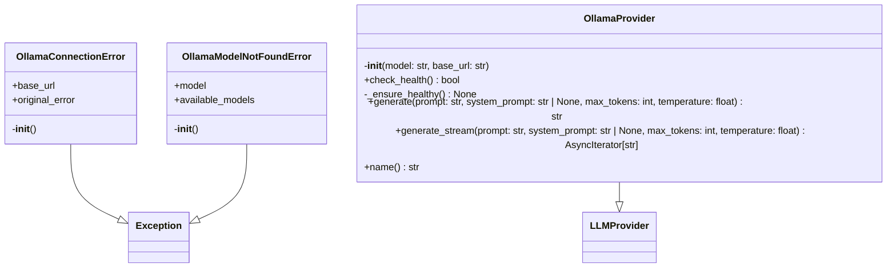

# Ollama Provider Module

## File Overview

The `ollama.py` module provides an Ollama-based implementation of the LLM provider interface for the local_deepwiki system. It enables integration with Ollama's local language model server, handling connection management, health checks, and text generation operations.

## Classes

### OllamaConnectionError

A custom exception class that handles connection failures to the Ollama server.

**Purpose**: Provides detailed error information when the Ollama server cannot be reached, including helpful troubleshooting guidance.

**Attributes**:
- `base_url`: The URL that failed to connect
- `original_error`: The underlying exception that caused the connection failure

**Constructor Parameters**:
- `base_url` (str): The Ollama server URL that couldn't be reached
- `original_error` (Exception | None): Optional underlying exception

### OllamaModelNotFoundError

A custom exception class for handling cases when a requested model is not available on the Ollama server.

### OllamaProvider

The [main](../../export/pdf.md) provider class that implements the [LLMProvider](../base.md) interface for Ollama integration.

**Purpose**: Manages communication with an Ollama server to perform language model operations including text generation and streaming.

#### Methods

##### `__init__`

Initializes the Ollama provider with connection settings.

**Parameters**:
- `model` (str): Ollama model name (default: "llama3.2")
- `base_url` (str): Ollama API base URL (default: "http://localhost:11434")

**Behavior**: Sets up the AsyncClient connection and initializes health check tracking.

##### `check_health`

Performs a health check to verify the Ollama server is accessible and the specified model is available.

##### `generate`

Generates text responses using the specified Ollama model.

##### `generate_stream`

Provides streaming text generation, yielding results as they become available.

**Returns**: `AsyncIterator` for streaming responses

##### `name`

Returns the provider name identifier.

## Usage Examples

### Basic Provider Setup

```python
from local_deepwiki.providers.llm.ollama import OllamaProvider

# Initialize with default settings
provider = OllamaProvider()

# Initialize with custom model and URL
provider = OllamaProvider(
    model="codellama",
    base_url="http://localhost:11434"
)
```

### Error Handling

```python
from local_deepwiki.providers.llm.ollama import (
    OllamaProvider, 
    OllamaConnectionError,
    OllamaModelNotFoundError
)

try:
    provider = OllamaProvider(base_url="http://localhost:11434")
    await provider.check_health()
except OllamaConnectionError as e:
    print(f"Connection failed to {e.base_url}")
    if e.original_error:
        print(f"Original error: {e.original_error}")
```

## Related Components

This module integrates with several other components:

- **[LLMProvider](../base.md)**: Base class that defines the provider interface
- **AsyncClient**: Ollama's async client for server communication
- **ResponseError**: Ollama's error handling for API responses
- **[with_retry](../base.md)**: Decorator for implementing retry logic on operations
- **[get_logger](../../logging.md)**: Logging utility from the local_deepwiki logging system

The provider follows the established pattern of extending [LLMProvider](../base.md) to provide a consistent interface while handling Ollama-specific implementation details like connection management and model availability checking.

## API Reference

### class `OllamaConnectionError`

**Inherits from:** `Exception`

Raised when Ollama server is not accessible.

**Methods:**

#### `__init__`

```python
def __init__(base_url: str, original_error: Exception | None = None)
```


| [Parameter](../../generators/api_docs.md) | Type | Default | Description |
|-----------|------|---------|-------------|
| `base_url` | `str` | - | - |
| `original_error` | `Exception | None` | `None` | - |


### class `OllamaModelNotFoundError`

**Inherits from:** `Exception`

Raised when the requested model is not available in Ollama.

**Methods:**

#### `__init__`

```python
def __init__(model: str, available_models: list[str] | None = None)
```


| [Parameter](../../generators/api_docs.md) | Type | Default | Description |
|-----------|------|---------|-------------|
| `model` | `str` | - | - |
| `available_models` | `list[str] | None` | `None` | - |


### class `OllamaProvider`

**Inherits from:** [`LLMProvider`](../base.md)

LLM provider using local Ollama.

**Methods:**

#### `__init__`

```python
def __init__(model: str = "llama3.2", base_url: str = "http://localhost:11434")
```

Initialize the Ollama provider.


| [Parameter](../../generators/api_docs.md) | Type | Default | Description |
|-----------|------|---------|-------------|
| `model` | `str` | `"llama3.2"` | Ollama model name. |
| `base_url` | `str` | `"http://localhost:11434"` | Ollama API base URL. |

#### `check_health`

```python
async def check_health() -> bool
```

Check if Ollama is running and the model is available.

#### `generate`

```python
async def generate(prompt: str, system_prompt: str | None = None, max_tokens: int = 4096, temperature: float = 0.7) -> str
```

Generate text from a prompt.


| [Parameter](../../generators/api_docs.md) | Type | Default | Description |
|-----------|------|---------|-------------|
| `prompt` | `str` | - | The user prompt. |
| `system_prompt` | `str | None` | `None` | Optional system prompt. |
| `max_tokens` | `int` | `4096` | Maximum tokens to generate. |
| `temperature` | `float` | `0.7` | Sampling temperature. |

#### `generate_stream`

```python
async def generate_stream(prompt: str, system_prompt: str | None = None, max_tokens: int = 4096, temperature: float = 0.7) -> AsyncIterator[str]
```

Generate text from a prompt with streaming.


| [Parameter](../../generators/api_docs.md) | Type | Default | Description |
|-----------|------|---------|-------------|
| `prompt` | `str` | - | The user prompt. |
| `system_prompt` | `str | None` | `None` | Optional system prompt. |
| `max_tokens` | `int` | `4096` | Maximum tokens to generate. |
| `temperature` | `float` | `0.7` | Sampling temperature. |

#### `name`

```python
def name() -> str
```

Get the provider name.


## Class Diagram



## Call Graph

```mermaid
flowchart TD
    N0[AsyncClient]
    N1[OllamaConnectionError]
    N2[OllamaConnectionError.__init__]
    N3[OllamaModelNotFoundError]
    N4[OllamaModelNotFoundError.__...]
    N5[OllamaProvider.__init__]
    N6[OllamaProvider._ensure_healthy]
    N7[OllamaProvider.check_health]
    N8[OllamaProvider.generate]
    N9[OllamaProvider.generate_stream]
    N10[__init__]
    N11[_ensure_healthy]
    N12[chat]
    N13[check_health]
    N2 --> N10
    N4 --> N10
    N5 --> N0
    N7 --> N3
    N7 --> N1
    N6 --> N13
    N8 --> N11
    N8 --> N12
    N8 --> N3
    N8 --> N1
    N9 --> N11
    N9 --> N12
    N9 --> N3
    N9 --> N1
    classDef func fill:#e1f5fe
    class N0,N1,N3,N10,N11,N12,N13 func
    classDef method fill:#fff3e0
    class N2,N4,N5,N6,N7,N8,N9 method
```



## Relevant Source Files

- `src/local_deepwiki/providers/llm/ollama.py:13-26`
