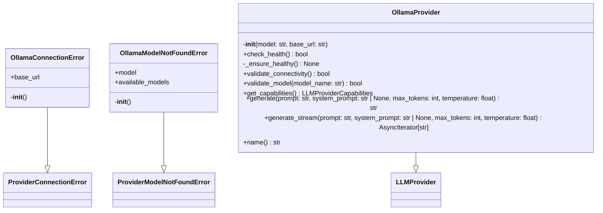

# File Overview

This file implements the `OllamaProvider` class, which provides an interface to interact with the Ollama LLM server. It allows for generating text and streaming responses using Ollama models. The provider supports health checks, model validation, and integrates with the base `LLMProvider` class to ensure consistent behavior across different LLM providers.

Dependencies:
- `typing.AsyncIterator`, `typing.cast`
- `ollama.AsyncClient`, `ollama.ResponseError`
- `local_deepwiki.logging.get_logger`
- `local_deepwiki.providers.base` components

## Classes

### OllamaConnectionError

A specialized version of `ProviderConnectionError` for handling cases where the Ollama server is not accessible.

**Constructor Parameters:**
- `base_url` (str): The URL of the Ollama server.
- `original_error` (Exception | None): The underlying error that caused the connection failure.

**Message Format:**
```
Cannot connect to Ollama at {base_url}. Please ensure Ollama is running:
  1. Install Ollama: https://ollama.ai/download
  2. Start Ollama: `ollama serve`
  3. Verify it's running: `curl {base_url}/api
```

### OllamaModelNotFoundError

A specialized version of `ProviderModelNotFoundError` for handling cases where the requested model is not available in Ollama.

**Constructor Parameters:**
- `model` (str): The name of the requested model.
- `available_models` (list[str] | None): List of models currently available in Ollama.

**Message Format:**
```
Model '{model}' not found in Ollama. Available models: {models_str}
```

### OllamaProvider

The main class for interacting with Ollama LLMs. It inherits from `LLMProvider` and implements methods for generating text, validating connectivity and models, and checking health.

#### Methods

##### `__init__(self, model: str = "llama3.2", base_url: str = "http://localhost:11434")`

Initialize the Ollama provider.

**Parameters:**
- `model` (str): Ollama model name.
- `base_url` (str): Ollama API base URL.

##### `check_health(self) -> bool`

Check if Ollama is running and the model is available.

**Returns:**
- `bool`: True if Ollama is healthy and model is available.

**Raises:**
- `OllamaConnectionError`: If Ollama server is not accessible.
- `OllamaModelNotFoundError`: If the requested model is not available.

##### `_ensure_healthy(self) -> None`

Ensure Ollama is healthy before making requests. Only performs the check once per instance.

##### `validate_connectivity(self) -> bool`

Test that Ollama is reachable and configured correctly.

**Returns:**
- `bool`: True if Ollama is accessible.

**Raises:**
- `ProviderConnectionError`: If Ollama cannot be reached.

##### `validate_model(self, model_name: str) -> bool`

Test that a specific model is available in Ollama.

**Parameters:**
- `model_name` (str): The model name to validate.

**Returns:**
- `bool`: True if the model is available.

**Raises:**
- `ProviderModelNotFoundError`: If the model is not available.
- `ProviderConnectionError`: If Ollama cannot be reached.

##### `get_capabilities(self) -> LLMProviderCapabilities`

Return Ollama provider capabilities.

**Returns:**
- `LLMProviderCapabilities`: With Ollama-specific information.

##### `generate(self, prompt: str, system_prompt: str | None = None, max_tokens: int = 4096, temperature: float = 0.7) -> str`

Generate text from a prompt.

**Parameters:**
- `prompt` (str): The user prompt.
- `system_prompt` (str | None): Optional system prompt.
- `max_tokens` (int): Maximum tokens to generate.
- `temperature` (float): Sampling temperature.

**Returns:**
- `str`: Generated text.

**Raises:**
- `OllamaConnectionError`: If Ollama server is not accessible.
- `OllamaModelNotFoundError`: If the requested model is not available.

##### `generate_stream(self, prompt: str, system_prompt: str | None = None, max_tokens: int = 4096, temperature: float = 0.7) -> AsyncIterator[str]`

Generate text from a prompt with streaming.

**Parameters:**
- `prompt` (str): The user prompt.
- `system_prompt` (str | None): Optional system prompt.
- `max_tokens` (int): Maximum tokens to generate.
- `temperature` (float): Sampling temperature.

**Yields:**
- `str`: Generated text chunks.

**Raises:**
- `OllamaConnectionError`: If Ollama server is not accessible.
- `OllamaModelNotFoundError`: If the requested model is not available.

##### `name(self) -> str`

Get the provider name.

**Returns:**
- `str`: A string in the format `"ollama:{model_name}"`.

## Integration

This file is part of the `local_deepwiki.providers.llm` module and is used to provide Ollama-specific LLM capabilities. It is called by:

- `test_ollama_health`
- `test_provider_errors`

It depends on:
- `local_deepwiki.providers.base` for base provider classes and error handling
- `ollama.AsyncClient` for asynchronous communication with Ollama
- `local_deepwiki.logging` for logging

The file integrates with the broader codebase by extending the `LLMProvider` base class, ensuring consistent interfaces for different LLM providers.

## Usage Examples

### Initialize Ollama Provider

```python
provider = OllamaProvider(model="llama3.2", base_url="http://localhost:11434")
```

### Generate Text

```python
response = await provider.generate(
    prompt="Explain quantum computing",
    system_prompt="You are an expert in physics",
    max_tokens=1024,
    temperature=0.7
)
```

### Stream Text Generation

```python
async for chunk in provider.generate_stream(
    prompt="Write a poem about technology",
    max_tokens=512,
    temperature=0.8
):
    print(chunk)
```

### Validate Connectivity

```python
is_connected = await provider.validate_connectivity()
```

### Validate Model

```python
is_model_available = await provider.validate_model("llama3.2")
```

### Check Health

```python
is_healthy = await provider.check_health()
```

## API Reference

### class `OllamaConnectionError`

**Inherits from:** `ProviderConnectionError`

Raised when Ollama server is not accessible.  This is a specialized version of ProviderConnectionError for Ollama.

**Methods:**


<details>
<summary>View Source (lines 20-35) | <a href="https://github.com/UrbanDiver/local-deepwiki-mcp/blob/main/src/local_deepwiki/providers/llm/ollama.py#L20-L35">GitHub</a></summary>

```python
class OllamaConnectionError(ProviderConnectionError):
    """Raised when Ollama server is not accessible.

    This is a specialized version of ProviderConnectionError for Ollama.
    """

    def __init__(self, base_url: str, original_error: Exception | None = None):
        self.base_url = base_url
        message = (
            f"Cannot connect to Ollama at {base_url}. "
            "Please ensure Ollama is running:\n"
            "  1. Install Ollama: https://ollama.ai/download\n"
            "  2. Start Ollama: `ollama serve`\n"
            "  3. Verify it's running: `curl {base_url}/api/tags`"
        )
        super().__init__(message, provider_name="ollama", original_error=original_error)
```

</details>

#### `__init__`

```python
def __init__(base_url: str, original_error: Exception | None = None)
```


| Parameter | Type | Default | Description |
|-----------|------|---------|-------------|
| `base_url` | `str` | - | - |
| `original_error` | `Exception | None` | `None` | - |


<details>
<summary>View Source (lines 20-35) | <a href="https://github.com/UrbanDiver/local-deepwiki-mcp/blob/main/src/local_deepwiki/providers/llm/ollama.py#L20-L35">GitHub</a></summary>

```python
class OllamaConnectionError(ProviderConnectionError):
    """Raised when Ollama server is not accessible.

    This is a specialized version of ProviderConnectionError for Ollama.
    """

    def __init__(self, base_url: str, original_error: Exception | None = None):
        self.base_url = base_url
        message = (
            f"Cannot connect to Ollama at {base_url}. "
            "Please ensure Ollama is running:\n"
            "  1. Install Ollama: https://ollama.ai/download\n"
            "  2. Start Ollama: `ollama serve`\n"
            "  3. Verify it's running: `curl {base_url}/api/tags`"
        )
        super().__init__(message, provider_name="ollama", original_error=original_error)
```

</details>

### class `OllamaModelNotFoundError`

**Inherits from:** `ProviderModelNotFoundError`

Raised when the requested model is not available in Ollama.  This is a specialized version of ProviderModelNotFoundError for Ollama.

**Methods:**


<details>
<summary>View Source (lines 38-66) | <a href="https://github.com/UrbanDiver/local-deepwiki-mcp/blob/main/src/local_deepwiki/providers/llm/ollama.py#L38-L66">GitHub</a></summary>

```python
class OllamaModelNotFoundError(ProviderModelNotFoundError):
    """Raised when the requested model is not available in Ollama.

    This is a specialized version of ProviderModelNotFoundError for Ollama.
    """

    def __init__(self, model: str, available_models: list[str] | None = None):
        # Build a custom message with pull command
        self.model = model
        self.available_models = available_models or []
        if available_models:
            models_str = ", ".join(available_models[:10])
            if len(available_models) > 10:
                models_str += f"... ({len(available_models)} total)"
            message = (
                f"Model '{model}' not found in Ollama. "
                f"Available models: {models_str}\n"
                f"To download the model, run: `ollama pull {model}`"
            )
        else:
            message = (
                f"Model '{model}' not found in Ollama.\n"
                f"To download the model, run: `ollama pull {model}`"
            )
        # Call ProviderError.__init__ directly to set message
        super(ProviderModelNotFoundError, self).__init__(message, provider_name="ollama")
        # Re-set attributes since parent __init__ may overwrite
        self.model = model
        self.available_models = available_models or []
```

</details>

#### `__init__`

```python
def __init__(model: str, available_models: list[str] | None = None)
```


| Parameter | Type | Default | Description |
|-----------|------|---------|-------------|
| `model` | `str` | - | - |
| `available_models` | `list[str] | None` | `None` | - |


<details>
<summary>View Source (lines 38-66) | <a href="https://github.com/UrbanDiver/local-deepwiki-mcp/blob/main/src/local_deepwiki/providers/llm/ollama.py#L38-L66">GitHub</a></summary>

```python
class OllamaModelNotFoundError(ProviderModelNotFoundError):
    """Raised when the requested model is not available in Ollama.

    This is a specialized version of ProviderModelNotFoundError for Ollama.
    """

    def __init__(self, model: str, available_models: list[str] | None = None):
        # Build a custom message with pull command
        self.model = model
        self.available_models = available_models or []
        if available_models:
            models_str = ", ".join(available_models[:10])
            if len(available_models) > 10:
                models_str += f"... ({len(available_models)} total)"
            message = (
                f"Model '{model}' not found in Ollama. "
                f"Available models: {models_str}\n"
                f"To download the model, run: `ollama pull {model}`"
            )
        else:
            message = (
                f"Model '{model}' not found in Ollama.\n"
                f"To download the model, run: `ollama pull {model}`"
            )
        # Call ProviderError.__init__ directly to set message
        super(ProviderModelNotFoundError, self).__init__(message, provider_name="ollama")
        # Re-set attributes since parent __init__ may overwrite
        self.model = model
        self.available_models = available_models or []
```

</details>

### class `OllamaProvider`

**Inherits from:** `LLMProvider`

LLM provider using local Ollama.

**Methods:**


<details>
<summary>View Source (lines 69-324) | <a href="https://github.com/UrbanDiver/local-deepwiki-mcp/blob/main/src/local_deepwiki/providers/llm/ollama.py#L69-L324">GitHub</a></summary>

```python
class OllamaProvider(LLMProvider):
    # Methods: __init__, check_health, _ensure_healthy, validate_connectivity, validate_model, get_capabilities, generate, generate_stream, name
```

</details>

#### `__init__`

```python
def __init__(model: str = "llama3.2", base_url: str = "http://localhost:11434")
```

Initialize the Ollama provider.


| Parameter | Type | Default | Description |
|-----------|------|---------|-------------|
| `model` | `str` | `"llama3.2"` | Ollama model name. |
| `base_url` | `str` | `"http://localhost:11434"` | Ollama API base URL. |


<details>
<summary>View Source (lines 72-83) | <a href="https://github.com/UrbanDiver/local-deepwiki-mcp/blob/main/src/local_deepwiki/providers/llm/ollama.py#L72-L83">GitHub</a></summary>

```python
def __init__(self, model: str = "llama3.2", base_url: str = "http://localhost:11434"):
        """Initialize the Ollama provider.

        Args:
            model: Ollama model name.
            base_url: Ollama API base URL.
        """
        self._model = model
        self._base_url = base_url
        self._client = AsyncClient(host=base_url)
        self._health_checked = False
        self._available_models: list[str] = []
```

</details>

#### `check_health`

```python
async def check_health() -> bool
```

Check if Ollama is running and the model is available.


<details>
<summary>View Source (lines 85-128) | <a href="https://github.com/UrbanDiver/local-deepwiki-mcp/blob/main/src/local_deepwiki/providers/llm/ollama.py#L85-L128">GitHub</a></summary>

```python
async def check_health(self) -> bool:
        """Check if Ollama is running and the model is available.

        Returns:
            True if Ollama is healthy and model is available.

        Raises:
            OllamaConnectionError: If Ollama server is not accessible.
            OllamaModelNotFoundError: If the requested model is not available.
        """
        logger.debug(f"Checking Ollama health at {self._base_url}")

        try:
            # Try to list models to verify connection
            models_response = await self._client.list()
            # ollama library returns typed objects with .models list and .model attribute
            self._available_models = [
                m.model for m in models_response.models if m.model is not None
            ]
            logger.debug(f"Ollama available models: {self._available_models}")

            # Check if our model is available (handle both "model" and "model:tag" formats)
            model_base = self._model.split(":")[0]
            model_found = any(
                m == self._model or m.startswith(f"{self._model}:") or m.split(":")[0] == model_base
                for m in self._available_models
            )

            if not model_found:
                logger.error(f"Model '{self._model}' not found in Ollama")
                raise OllamaModelNotFoundError(self._model, self._available_models)

            logger.info(f"Ollama health check passed: model '{self._model}' available")
            self._health_checked = True
            return True

        except OllamaModelNotFoundError:
            raise
        except (
            Exception
        ) as e:  # noqa: BLE001 - Wrap any connection/library error in OllamaConnectionError
            # Connection errors, timeouts, etc.
            logger.error(f"Failed to connect to Ollama at {self._base_url}: {e}")
            raise OllamaConnectionError(self._base_url, e) from e
```

</details>

#### `validate_connectivity`

```python
async def validate_connectivity() -> bool
```

Test that Ollama is reachable and configured correctly.


<details>
<summary>View Source (lines 138-151) | <a href="https://github.com/UrbanDiver/local-deepwiki-mcp/blob/main/src/local_deepwiki/providers/llm/ollama.py#L138-L151">GitHub</a></summary>

```python
async def validate_connectivity(self) -> bool:
        """Test that Ollama is reachable and configured correctly.

        Returns:
            True if Ollama is accessible.

        Raises:
            ProviderConnectionError: If Ollama cannot be reached.
        """
        try:
            await self._client.list()
            return True
        except Exception as e:
            raise OllamaConnectionError(self._base_url, e) from e
```

</details>

#### `validate_model`

```python
async def validate_model(model_name: str) -> bool
```

Test that a specific model is available in Ollama.


| Parameter | Type | Default | Description |
|-----------|------|---------|-------------|
| `model_name` | `str` | - | The model name to validate. |


<details>
<summary>View Source (lines 153-185) | <a href="https://github.com/UrbanDiver/local-deepwiki-mcp/blob/main/src/local_deepwiki/providers/llm/ollama.py#L153-L185">GitHub</a></summary>

```python
async def validate_model(self, model_name: str) -> bool:
        """Test that a specific model is available in Ollama.

        Args:
            model_name: The model name to validate.

        Returns:
            True if the model is available.

        Raises:
            ProviderModelNotFoundError: If the model is not available.
            ProviderConnectionError: If Ollama cannot be reached.
        """
        try:
            models_response = await self._client.list()
            available_models = [
                m.model for m in models_response.models if m.model is not None
            ]

            model_base = model_name.split(":")[0]
            model_found = any(
                m == model_name or m.startswith(f"{model_name}:") or m.split(":")[0] == model_base
                for m in available_models
            )

            if not model_found:
                raise OllamaModelNotFoundError(model_name, available_models)

            return True
        except OllamaModelNotFoundError:
            raise
        except Exception as e:
            raise OllamaConnectionError(self._base_url, e) from e
```

</details>

#### `get_capabilities`

```python
def get_capabilities() -> LLMProviderCapabilities
```

Return Ollama provider capabilities.


<details>
<summary>View Source (lines 187-201) | <a href="https://github.com/UrbanDiver/local-deepwiki-mcp/blob/main/src/local_deepwiki/providers/llm/ollama.py#L187-L201">GitHub</a></summary>

```python
def get_capabilities(self) -> LLMProviderCapabilities:
        """Return Ollama provider capabilities.

        Returns:
            LLMProviderCapabilities with Ollama-specific information.
        """
        return LLMProviderCapabilities(
            supports_streaming=True,
            supports_system_prompt=True,
            max_tokens=4096,  # Depends on model
            max_context_length=128000,  # Depends on model
            models=self._available_models,
            supports_function_calling=False,
            supports_vision=False,  # Some models support it
        )
```

</details>

#### `generate`

```python
async def generate(prompt: str, system_prompt: str | None = None, max_tokens: int = 4096, temperature: float = 0.7) -> str
```

Generate text from a prompt.


| Parameter | Type | Default | Description |
|-----------|------|---------|-------------|
| `prompt` | `str` | - | The user prompt. |
| `system_prompt` | `str | None` | `None` | Optional system prompt. |
| `max_tokens` | `int` | `4096` | Maximum tokens to generate. |
| `temperature` | `float` | `0.7` | Sampling temperature. |


<details>
<summary>View Source (lines 204-263) | <a href="https://github.com/UrbanDiver/local-deepwiki-mcp/blob/main/src/local_deepwiki/providers/llm/ollama.py#L204-L263">GitHub</a></summary>

```python
async def generate(
        self,
        prompt: str,
        system_prompt: str | None = None,
        max_tokens: int = 4096,
        temperature: float = 0.7,
    ) -> str:
        """Generate text from a prompt.

        Args:
            prompt: The user prompt.
            system_prompt: Optional system prompt.
            max_tokens: Maximum tokens to generate.
            temperature: Sampling temperature.

        Returns:
            Generated text.

        Raises:
            OllamaConnectionError: If Ollama server is not accessible.
            OllamaModelNotFoundError: If the requested model is not available.
        """
        # Check health on first call
        await self._ensure_healthy()

        messages = []
        if system_prompt:
            messages.append({"role": "system", "content": system_prompt})
        messages.append({"role": "user", "content": prompt})

        logger.debug(f"Generating with Ollama model {self._model}, prompt length: {len(prompt)}")

        try:
            response = await self._client.chat(
                model=self._model,
                messages=messages,
                options={
                    "num_predict": max_tokens,
                    "temperature": temperature,
                },
            )

            content = cast(str, response["message"]["content"])
            logger.debug(f"Ollama response length: {len(content)}")
            return content

        except ResponseError as e:
            # Handle model not found during generation (e.g., model was deleted)
            if "not found" in str(e).lower():
                logger.error(f"Model '{self._model}' not found during generation")
                raise OllamaModelNotFoundError(self._model) from e
            raise
        except Exception as e:  # noqa: BLE001 - Wrap connection errors, re-raise others
            # Check if it's a connection error
            error_str = str(e).lower()
            if any(x in error_str for x in ["connection", "refused", "timeout", "unreachable"]):
                logger.error(f"Lost connection to Ollama: {e}")
                self._health_checked = False  # Reset health check
                raise OllamaConnectionError(self._base_url, e) from e
            raise
```

</details>

#### `generate_stream`

```python
async def generate_stream(prompt: str, system_prompt: str | None = None, max_tokens: int = 4096, temperature: float = 0.7) -> AsyncIterator[str]
```

Generate text from a prompt with streaming.


| Parameter | Type | Default | Description |
|-----------|------|---------|-------------|
| `prompt` | `str` | - | The user prompt. |
| `system_prompt` | `str | None` | `None` | Optional system prompt. |
| `max_tokens` | `int` | `4096` | Maximum tokens to generate. |
| `temperature` | `float` | `0.7` | Sampling temperature. |


<details>
<summary>View Source (lines 265-319) | <a href="https://github.com/UrbanDiver/local-deepwiki-mcp/blob/main/src/local_deepwiki/providers/llm/ollama.py#L265-L319">GitHub</a></summary>

```python
async def generate_stream(
        self,
        prompt: str,
        system_prompt: str | None = None,
        max_tokens: int = 4096,
        temperature: float = 0.7,
    ) -> AsyncIterator[str]:
        """Generate text from a prompt with streaming.

        Args:
            prompt: The user prompt.
            system_prompt: Optional system prompt.
            max_tokens: Maximum tokens to generate.
            temperature: Sampling temperature.

        Yields:
            Generated text chunks.

        Raises:
            OllamaConnectionError: If Ollama server is not accessible.
            OllamaModelNotFoundError: If the requested model is not available.
        """
        # Check health on first call
        await self._ensure_healthy()

        messages = []
        if system_prompt:
            messages.append({"role": "system", "content": system_prompt})
        messages.append({"role": "user", "content": prompt})

        try:
            async for chunk in await self._client.chat(
                model=self._model,
                messages=messages,
                options={
                    "num_predict": max_tokens,
                    "temperature": temperature,
                },
                stream=True,
            ):
                if chunk["message"]["content"]:
                    yield chunk["message"]["content"]

        except ResponseError as e:
            if "not found" in str(e).lower():
                logger.error(f"Model '{self._model}' not found during streaming")
                raise OllamaModelNotFoundError(self._model) from e
            raise
        except Exception as e:  # noqa: BLE001 - Wrap connection errors, re-raise others
            error_str = str(e).lower()
            if any(x in error_str for x in ["connection", "refused", "timeout", "unreachable"]):
                logger.error(f"Lost connection to Ollama during streaming: {e}")
                self._health_checked = False
                raise OllamaConnectionError(self._base_url, e) from e
            raise
```

</details>

#### `name`

```python
def name() -> str
```

Get the provider name.


<details>
<summary>View Source (lines 322-324) | <a href="https://github.com/UrbanDiver/local-deepwiki-mcp/blob/main/src/local_deepwiki/providers/llm/ollama.py#L322-L324">GitHub</a></summary>

```python
def name(self) -> str:
        """Get the provider name."""
        return f"ollama:{self._model}"
```

</details>

## Class Diagram


```mermaid
classDiagram
    class OllamaConnectionError {
        +base_url
        -__init__()
    }
    class OllamaModelNotFoundError {
        +model
        +available_models
        -__init__()
    }
    class OllamaProvider {
        -__init__(model: str, base_url: str)
        +check_health() bool
        -_ensure_healthy() None
        +validate_connectivity() bool
        +validate_model(model_name: str) bool
        +get_capabilities() LLMProviderCapabilities
        +generate(prompt: str, system_prompt: str | None, max_tokens: int, temperature: float) str
        +generate_stream(prompt: str, system_prompt: str | None, max_tokens: int, temperature: float) AsyncIterator[str]
        +name() str
    }
    OllamaConnectionError --|> ProviderConnectionError
    OllamaModelNotFoundError --|> ProviderModelNotFoundError
    OllamaProvider --|> LLMProvider
```

## Call Graph


```mermaid
flowchart TD
    N0[AsyncClient]
    N1[LLMProviderCapabilities]
    N2[OllamaConnectionError]
    N3[OllamaConnectionError.__init__]
    N4[OllamaModelNotFoundError]
    N5[OllamaModelNotFoundError.__...]
    N6[OllamaProvider.__init__]
    N7[OllamaProvider._ensure_healthy]
    N8[OllamaProvider.check_health]
    N9[OllamaProvider.generate]
    N10[OllamaProvider.generate_stream]
    N11[OllamaProvider.get_capabili...]
    N12[OllamaProvider.validate_con...]
    N13[OllamaProvider.validate_model]
    N14[__init__]
    N15[_ensure_healthy]
    N16[cast]
    N17[chat]
    N18[check_health]
    N3 --> N14
    N5 --> N14
    N6 --> N0
    N8 --> N4
    N8 --> N2
    N7 --> N18
    N12 --> N2
    N13 --> N4
    N13 --> N2
    N11 --> N1
    N9 --> N15
    N9 --> N17
    N9 --> N16
    N9 --> N4
    N9 --> N2
    N10 --> N15
    N10 --> N17
    N10 --> N4
    N10 --> N2
    classDef func fill:#e1f5fe
    class N0,N1,N2,N4,N14,N15,N16,N17,N18 func
    classDef method fill:#fff3e0
    class N3,N5,N6,N7,N8,N9,N10,N11,N12,N13 method
```

## Used By

Functions and methods in this file and their callers:

- **`AsyncClient`**: called by `OllamaProvider.__init__`
- **`LLMProviderCapabilities`**: called by `OllamaProvider.get_capabilities`
- **`OllamaConnectionError`**: called by `OllamaProvider.check_health`, `OllamaProvider.generate`, `OllamaProvider.generate_stream`, `OllamaProvider.validate_connectivity`, `OllamaProvider.validate_model`
- **`OllamaModelNotFoundError`**: called by `OllamaProvider.check_health`, `OllamaProvider.generate`, `OllamaProvider.generate_stream`, `OllamaProvider.validate_model`
- **`__init__`**: called by `OllamaConnectionError.__init__`, `OllamaModelNotFoundError.__init__`
- **`_ensure_healthy`**: called by `OllamaProvider.generate`, `OllamaProvider.generate_stream`
- **`cast`**: called by `OllamaProvider.generate`
- **`chat`**: called by `OllamaProvider.generate`, `OllamaProvider.generate_stream`
- **`check_health`**: called by `OllamaProvider._ensure_healthy`

## Usage Examples

*Examples extracted from test files*

### Error message should include the base URL

From `test_ollama_health.py::TestOllamaConnectionError::test_error_message_includes_url`:

```python
error = OllamaConnectionError("http://localhost:11434")
assert "http://localhost:11434" in str(error)
```

### Error message should include helpful instructions

From `test_ollama_health.py::TestOllamaConnectionError::test_error_message_includes_instructions`:

```python
error = OllamaConnectionError("http://localhost:11434")
message = str(error)
assert "ollama serve" in message
assert "Install Ollama" in message
```

### Error message should include helpful instructions

From `test_ollama_health.py::TestOllamaConnectionError::test_error_message_includes_instructions`:

```python
error = OllamaConnectionError("http://localhost:11434")
message = str(error)
assert "ollama serve" in message
assert "Install Ollama" in message
```

### Error message should include the model name

From `test_ollama_health.py::TestOllamaModelNotFoundError::test_error_message_includes_model_name`:

```python
error = OllamaModelNotFoundError("llama3.2")
assert "llama3.2" in str(error)
```

### Error message should include the pull command

From `test_ollama_health.py::TestOllamaModelNotFoundError::test_error_message_includes_pull_command`:

```python
error = OllamaModelNotFoundError("llama3.2")
assert "ollama pull llama3.2" in str(error)
```


## Last Modified

| Entity | Type | Author | Date | Commit |
|--------|------|--------|------|--------|
| `OllamaConnectionError` | class | Brian Breidenbach | 1 week ago | `a64166a` Add seven medium-priority e... |
| `OllamaModelNotFoundError` | class | Brian Breidenbach | 1 week ago | `a64166a` Add seven medium-priority e... |
| `OllamaProvider` | class | Brian Breidenbach | 1 week ago | `a64166a` Add seven medium-priority e... |
| `__init__` | method | Brian Breidenbach | 1 week ago | `a64166a` Add seven medium-priority e... |
| `check_health` | method | Brian Breidenbach | 1 week ago | `a64166a` Add seven medium-priority e... |
| `validate_connectivity` | method | Brian Breidenbach | 1 week ago | `a64166a` Add seven medium-priority e... |
| `validate_model` | method | Brian Breidenbach | 1 week ago | `a64166a` Add seven medium-priority e... |
| `get_capabilities` | method | Brian Breidenbach | 1 week ago | `a64166a` Add seven medium-priority e... |
| `generate` | method | Brian Breidenbach | 3 weeks ago | `0d91a70` Apply Python best practices... |
| `generate_stream` | method | Brian Breidenbach | 3 weeks ago | `815ed5f` Fix remaining generic excep... |
| `_ensure_healthy` | method | Brian Breidenbach | 3 weeks ago | `c568951` Add input validation, type ... |
| `name` | method | Brian Breidenbach | 3 weeks ago | `cdae76f` Initial commit: Local DeepW... |

## Additional Source Code

Source code for functions and methods not listed in the API Reference above.

#### `_ensure_healthy`

<details>
<summary>View Source (lines 130-136) | <a href="https://github.com/UrbanDiver/local-deepwiki-mcp/blob/main/src/local_deepwiki/providers/llm/ollama.py#L130-L136">GitHub</a></summary>

```python
async def _ensure_healthy(self) -> None:
        """Ensure Ollama is healthy before making requests.

        Only performs the check once per instance.
        """
        if not self._health_checked:
            await self.check_health()
```

</details>

