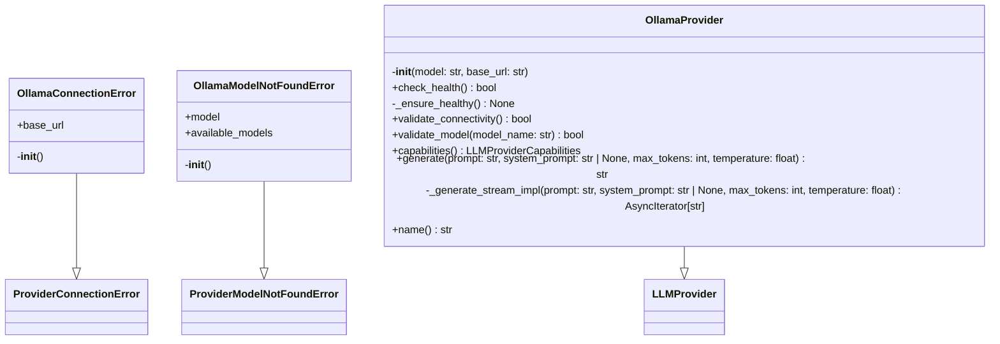

# File: `src/local_deepwiki/providers/llm/ollama.py`

## File Overview

This file implements an Ollama LLM provider for the `local_deepwiki` project. It provides a concrete implementation of the [`LLMProvider`](../base.md) base class, enabling integration with the Ollama inference engine for local LLM usage. The provider supports both synchronous and streaming text generation, handles model availability checks, and manages connection errors specific to Ollama.

The design rationale centers on encapsulating Ollama-specific logic, including error handling for common issues like connection failures or missing models, while exposing a standardized interface that integrates seamlessly with the broader LLM provider framework.

## Key Concepts

### Provider Abstraction
The `OllamaProvider` class is built on top of the [`LLMProvider`](../base.md) base class, following a consistent pattern for defining LLM providers within the codebase. This allows uniform interaction with different LLM backends (e.g., Ollama, OpenAI) through a shared interface.

### Error Specialization
Two custom exception classes — `OllamaConnectionError` and `OllamaModelNotFoundError` — are defined to provide more context-specific error handling for Ollama-specific issues. This enhances debugging and user feedback when integrating with Ollama.

### Health and Model Validation
The provider implements robust health checking and model validation logic to ensure that:
- The Ollama server is reachable.
- The requested model is available.
- These checks are performed efficiently by caching results and only running once per instance.

### Streaming Support
The provider supports streaming responses via the `_generate_stream_impl` method, which leverages Ollama's streaming capabilities. This is essential for real-time or partial response generation in interactive applications.

### Retry Decorator Usage
The [`with_retry`](../retry.md) [decorator](../retry.md) from the base provider module is used to wrap critical operations (e.g., health checks), providing resilience against transient network issues or temporary server unavailability.

## Integration

This file is part of the `local_deepwiki.providers.llm` module and integrates with the broader LLM infrastructure by:
- Extending [`LLMProvider`](../base.md) to provide concrete Ollama functionality.
- Relying on `local_deepwiki.providers.base` for shared abstractions like [`LLMProvider`](../base.md), [`ProviderConnectionError`](../errors.md), and [`with_retry`](../retry.md).
- Using `ollama.AsyncClient` to communicate with the Ollama API.
- Logging via [`get_logger`](../../logging.md) from `local_deepwiki.logging`.

The provider is consumed by:
- The main CLI entrypoint (`src/local_deepwiki/cli/main.py`) for LLM-based operations.
- Test suites (`test_provider_factories`, `test_providers`) that validate provider instantiation and behavior.
- Other components that require a standardized way to interact with local LLMs, such as the `AnalysisGenerator` in `src/local_deepwiki/generators/analysis/api_docs.py`.

## Design Notes

### Caching Health Checks
Health checks (`check_health`, `_ensure_healthy`) are designed to run only once per provider instance. This avoids redundant network calls during multiple generations or validations, improving performance.

### Model Format Handling
The provider normalizes model names by handling both full names (e.g., `llama3.2:latest`) and base names (e.g., `llama3.2`) when validating availability. This flexibility allows users to specify models in various formats without breaking compatibility.

### Streaming vs Non-Streaming
The implementation separates streaming and non-streaming logic (`generate` vs `_generate_stream_impl`) to support both immediate and progressive response generation, catering to different use cases in the application.

### Error Propagation
When errors occur during generation or streaming, they are caught and re-raised as specialized `OllamaConnectionError` or `OllamaModelNotFoundError` to provide clear context to calling code and avoid generic exceptions.

### Connection Reset on Failure
In the event of a connection loss during generation or streaming, the provider resets its internal `_health_checked` flag. This ensures that subsequent calls will re-validate connectivity, handling scenarios where the Ollama server might have restarted or become temporarily unavailable.

### Asynchronous Design
All methods are implemented asynchronously (`async def`) to align with modern Python async/await patterns and to support concurrent operations within the application, particularly useful in web or API contexts.

## API Reference

### class `OllamaConnectionError`

**Inherits from:** [`ProviderConnectionError`](../errors.md)

Raised when Ollama server is not accessible.  This is a specialized version of [ProviderConnectionError](../errors.md) for Ollama.

**Methods:**


<details>
<summary>View Source (lines 23-38) | <a href="https://github.com/UrbanDiver/local-deepwiki-mcp/blob/main/src/local_deepwiki/providers/llm/ollama.py#L23-L38">GitHub</a></summary>

```python
class OllamaConnectionError(ProviderConnectionError):
    """Raised when Ollama server is not accessible.

    This is a specialized version of ProviderConnectionError for Ollama.
    """

    def __init__(self, base_url: str, original_error: Exception | None = None):
        self.base_url = base_url
        message = (
            f"Cannot connect to Ollama at {base_url}. "
            "Please ensure Ollama is running:\n"
            "  1. Install Ollama: https://ollama.ai/download\n"
            "  2. Start Ollama: `ollama serve`\n"
            "  3. Verify it's running: `curl {base_url}/api/tags`"
        )
        super().__init__(message, provider_name="ollama", original_error=original_error)
```

</details>

#### `__init__`

```python
def __init__(base_url: str, original_error: Exception | None = None)
```


| Parameter | Type | Default | Description |
|-----------|------|---------|-------------|
| `base_url` | `str` | - | - |
| `original_error` | `Exception | None` | `None` | - |


<details>
<summary>View Source (lines 23-38) | <a href="https://github.com/UrbanDiver/local-deepwiki-mcp/blob/main/src/local_deepwiki/providers/llm/ollama.py#L23-L38">GitHub</a></summary>

```python
class OllamaConnectionError(ProviderConnectionError):
    """Raised when Ollama server is not accessible.

    This is a specialized version of ProviderConnectionError for Ollama.
    """

    def __init__(self, base_url: str, original_error: Exception | None = None):
        self.base_url = base_url
        message = (
            f"Cannot connect to Ollama at {base_url}. "
            "Please ensure Ollama is running:\n"
            "  1. Install Ollama: https://ollama.ai/download\n"
            "  2. Start Ollama: `ollama serve`\n"
            "  3. Verify it's running: `curl {base_url}/api/tags`"
        )
        super().__init__(message, provider_name="ollama", original_error=original_error)
```

</details>

### class `OllamaModelNotFoundError`

**Inherits from:** [`ProviderModelNotFoundError`](../errors.md)

Raised when the requested model is not available in Ollama.  This is a specialized version of [ProviderModelNotFoundError](../errors.md) for Ollama.

**Methods:**


<details>
<summary>View Source (lines 41-71) | <a href="https://github.com/UrbanDiver/local-deepwiki-mcp/blob/main/src/local_deepwiki/providers/llm/ollama.py#L41-L71">GitHub</a></summary>

```python
class OllamaModelNotFoundError(ProviderModelNotFoundError):
    """Raised when the requested model is not available in Ollama.

    This is a specialized version of ProviderModelNotFoundError for Ollama.
    """

    def __init__(self, model: str, available_models: list[str] | None = None):
        # Build a custom message with pull command
        self.model = model
        self.available_models = available_models or []
        if available_models:
            models_str = ", ".join(available_models[:10])
            if len(available_models) > 10:
                models_str += f"... ({len(available_models)} total)"
            message = (
                f"Model '{model}' not found in Ollama. "
                f"Available models: {models_str}\n"
                f"To download the model, run: `ollama pull {model}`"
            )
        else:
            message = (
                f"Model '{model}' not found in Ollama.\n"
                f"To download the model, run: `ollama pull {model}`"
            )
        # Call ProviderError.__init__ directly to set message
        super(ProviderModelNotFoundError, self).__init__(
            message, provider_name="ollama"
        )
        # Re-set attributes since parent __init__ may overwrite
        self.model = model
        self.available_models = available_models or []
```

</details>

#### `__init__`

```python
def __init__(model: str, available_models: list[str] | None = None)
```


| Parameter | Type | Default | Description |
|-----------|------|---------|-------------|
| `model` | `str` | - | - |
| `available_models` | `list[str] | None` | `None` | - |


<details>
<summary>View Source (lines 41-71) | <a href="https://github.com/UrbanDiver/local-deepwiki-mcp/blob/main/src/local_deepwiki/providers/llm/ollama.py#L41-L71">GitHub</a></summary>

```python
class OllamaModelNotFoundError(ProviderModelNotFoundError):
    """Raised when the requested model is not available in Ollama.

    This is a specialized version of ProviderModelNotFoundError for Ollama.
    """

    def __init__(self, model: str, available_models: list[str] | None = None):
        # Build a custom message with pull command
        self.model = model
        self.available_models = available_models or []
        if available_models:
            models_str = ", ".join(available_models[:10])
            if len(available_models) > 10:
                models_str += f"... ({len(available_models)} total)"
            message = (
                f"Model '{model}' not found in Ollama. "
                f"Available models: {models_str}\n"
                f"To download the model, run: `ollama pull {model}`"
            )
        else:
            message = (
                f"Model '{model}' not found in Ollama.\n"
                f"To download the model, run: `ollama pull {model}`"
            )
        # Call ProviderError.__init__ directly to set message
        super(ProviderModelNotFoundError, self).__init__(
            message, provider_name="ollama"
        )
        # Re-set attributes since parent __init__ may overwrite
        self.model = model
        self.available_models = available_models or []
```

</details>

### class `OllamaProvider`

**Inherits from:** [`LLMProvider`](../base.md)

LLM provider using local Ollama.

**Methods:**


<details>
<summary>View Source (lines 74-336) | <a href="https://github.com/UrbanDiver/local-deepwiki-mcp/blob/main/src/local_deepwiki/providers/llm/ollama.py#L74-L336">GitHub</a></summary>

```python
class OllamaProvider(LLMProvider):
    # Methods: __init__, check_health, _ensure_healthy, validate_connectivity, validate_model, capabilities, generate, _generate_stream_impl, name
```

</details>

#### `__init__`

```python
def __init__(model: str = "llama3.2", base_url: str = "http://localhost:11434")
```

Initialize the Ollama provider.


| Parameter | Type | Default | Description |
|-----------|------|---------|-------------|
| `model` | `str` | `"llama3.2"` | Ollama model name. |
| `base_url` | `str` | `"http://localhost:11434"` | Ollama API base URL. |


<details>
<summary>View Source (lines 77-90) | <a href="https://github.com/UrbanDiver/local-deepwiki-mcp/blob/main/src/local_deepwiki/providers/llm/ollama.py#L77-L90">GitHub</a></summary>

```python
def __init__(
        self, model: str = "llama3.2", base_url: str = "http://localhost:11434"
    ):
        """Initialize the Ollama provider.

        Args:
            model: Ollama model name.
            base_url: Ollama API base URL.
        """
        self._model = model
        self._base_url = base_url
        self._client = AsyncClient(host=base_url)
        self._health_checked = False
        self._available_models: list[str] = []
```

</details>

#### `check_health`

```python
async def check_health() -> bool
```

Check if Ollama is running and the model is available.


<details>
<summary>View Source (lines 92-135) | <a href="https://github.com/UrbanDiver/local-deepwiki-mcp/blob/main/src/local_deepwiki/providers/llm/ollama.py#L92-L135">GitHub</a></summary>

```python
async def check_health(self) -> bool:
        """Check if Ollama is running and the model is available.

        Returns:
            True if Ollama is healthy and model is available.

        Raises:
            OllamaConnectionError: If Ollama server is not accessible.
            OllamaModelNotFoundError: If the requested model is not available.
        """
        logger.debug("Checking Ollama health at %s", self._base_url)

        try:
            # Try to list models to verify connection
            models_response = await self._client.list()
            # ollama library returns typed objects with .models list and .model attribute
            self._available_models = [
                m.model for m in models_response.models if m.model is not None
            ]
            logger.debug("Ollama available models: %s", self._available_models)

            # Check if our model is available (handle both "model" and "model:tag" formats)
            model_base = self._model.split(":")[0]
            model_found = any(
                m == self._model
                or m.startswith(f"{self._model}:")
                or m.split(":")[0] == model_base
                for m in self._available_models
            )

            if not model_found:
                logger.error("Model '%s' not found in Ollama", self._model)
                raise OllamaModelNotFoundError(self._model, self._available_models)

            logger.info("Ollama health check passed: model '%s' available", self._model)
            self._health_checked = True
            return True

        except OllamaModelNotFoundError:
            raise
        except (ConnectionError, TimeoutError, OSError, ResponseError) as e:
            # Connection errors, timeouts, network errors, and Ollama API errors
            logger.error("Failed to connect to Ollama at %s: %s", self._base_url, e)
            raise OllamaConnectionError(self._base_url, e) from e
```

</details>

#### `validate_connectivity`

```python
async def validate_connectivity() -> bool
```

Test that Ollama is reachable and configured correctly.


<details>
<summary>View Source (lines 145-158) | <a href="https://github.com/UrbanDiver/local-deepwiki-mcp/blob/main/src/local_deepwiki/providers/llm/ollama.py#L145-L158">GitHub</a></summary>

```python
async def validate_connectivity(self) -> bool:
        """Test that Ollama is reachable and configured correctly.

        Returns:
            True if Ollama is accessible.

        Raises:
            ProviderConnectionError: If Ollama cannot be reached.
        """
        try:
            await self._client.list()
            return True
        except (ConnectionError, TimeoutError, OSError, ResponseError) as e:
            raise OllamaConnectionError(self._base_url, e) from e
```

</details>

#### `validate_model`

```python
async def validate_model(model_name: str) -> bool
```

Test that a specific model is available in Ollama.


| Parameter | Type | Default | Description |
|-----------|------|---------|-------------|
| `model_name` | `str` | - | The model name to validate. |


<details>
<summary>View Source (lines 160-195) | <a href="https://github.com/UrbanDiver/local-deepwiki-mcp/blob/main/src/local_deepwiki/providers/llm/ollama.py#L160-L195">GitHub</a></summary>

```python
async def validate_model(self, model_name: str) -> bool:
        """Test that a specific model is available in Ollama.

        Args:
            model_name: The model name to validate.

        Returns:
            True if the model is available.

        Raises:
            ProviderModelNotFoundError: If the model is not available.
            ProviderConnectionError: If Ollama cannot be reached.
        """
        try:
            models_response = await self._client.list()
            available_models = [
                m.model for m in models_response.models if m.model is not None
            ]

            model_base = model_name.split(":")[0]
            model_found = any(
                m == model_name
                or m.startswith(f"{model_name}:")
                or m.split(":")[0] == model_base
                for m in available_models
            )

            if not model_found:
                raise OllamaModelNotFoundError(model_name, available_models)

            return True
        except OllamaModelNotFoundError:
            raise
        except (ConnectionError, TimeoutError, OSError, ResponseError) as e:
            # Connection errors, timeouts, network errors, and Ollama API errors
            raise OllamaConnectionError(self._base_url, e) from e
```

</details>

#### `capabilities`

```python
def capabilities() -> LLMProviderCapabilities
```

Return Ollama provider capabilities.


<details>
<summary>View Source (lines 198-212) | <a href="https://github.com/UrbanDiver/local-deepwiki-mcp/blob/main/src/local_deepwiki/providers/llm/ollama.py#L198-L212">GitHub</a></summary>

```python
def capabilities(self) -> LLMProviderCapabilities:
        """Return Ollama provider capabilities.

        Returns:
            LLMProviderCapabilities with Ollama-specific information.
        """
        return LLMProviderCapabilities(
            supports_streaming=True,
            supports_system_prompt=True,
            max_tokens=4096,  # Depends on model
            max_context_length=128000,  # Depends on model
            models=self._available_models,
            supports_function_calling=False,
            supports_vision=False,  # Some models support it
        )
```

</details>

#### `generate`

```python
async def generate(prompt: str, system_prompt: str | None = None, max_tokens: int = 4096, temperature: float = 0.7) -> str
```

Generate text from a prompt.


| Parameter | Type | Default | Description |
|-----------|------|---------|-------------|
| `prompt` | `str` | - | The user prompt. |
| `system_prompt` | `str | None` | `None` | Optional system prompt. |
| `max_tokens` | `int` | `4096` | Maximum tokens to generate. |
| `temperature` | `float` | `0.7` | Sampling temperature. |


<details>
<summary>View Source (lines 215-276) | <a href="https://github.com/UrbanDiver/local-deepwiki-mcp/blob/main/src/local_deepwiki/providers/llm/ollama.py#L215-L276">GitHub</a></summary>

```python
async def generate(
        self,
        prompt: str,
        system_prompt: str | None = None,
        max_tokens: int = 4096,
        temperature: float = 0.7,
    ) -> str:
        """Generate text from a prompt.

        Args:
            prompt: The user prompt.
            system_prompt: Optional system prompt.
            max_tokens: Maximum tokens to generate.
            temperature: Sampling temperature.

        Returns:
            Generated text.

        Raises:
            OllamaConnectionError: If Ollama server is not accessible.
            OllamaModelNotFoundError: If the requested model is not available.
        """
        # Check health on first call
        await self._ensure_healthy()

        messages = []
        if system_prompt:
            messages.append({"role": "system", "content": system_prompt})
        messages.append({"role": "user", "content": prompt})

        logger.debug(
            "Generating with Ollama model %s, prompt length: %d",
            self._model,
            len(prompt),
        )

        try:
            response = await self._client.chat(
                model=self._model,
                messages=messages,
                options={
                    "num_predict": max_tokens,
                    "temperature": temperature,
                },
                keep_alive="60m",
            )

            content = cast(str, response["message"]["content"])
            logger.debug("Ollama response length: %s", len(content))
            return content

        except ResponseError as e:
            # Handle model not found during generation (e.g., model was deleted)
            if "not found" in str(e).lower():
                logger.error("Model '%s' not found during generation", self._model)
                raise OllamaModelNotFoundError(self._model) from e
            raise
        except (ConnectionError, TimeoutError, OSError) as e:
            # Connection errors, timeouts, and network-related OS errors
            logger.error("Lost connection to Ollama: %s", e)
            self._health_checked = False  # Reset health check
            raise OllamaConnectionError(self._base_url, e) from e
```

</details>

#### `name`

```python
def name() -> str
```

Get the provider name.


<details>
<summary>View Source (lines 334-336) | <a href="https://github.com/UrbanDiver/local-deepwiki-mcp/blob/main/src/local_deepwiki/providers/llm/ollama.py#L334-L336">GitHub</a></summary>

```python
def name(self) -> str:
        """Get the provider name."""
        return f"ollama:{self._model}"
```

</details>

## Class Diagram


```mermaid
classDiagram
    class OllamaConnectionError {
        +base_url
        -__init__()
    }
    class OllamaModelNotFoundError {
        +model
        +available_models
        -__init__()
    }
    class OllamaProvider {
        -__init__(model: str, base_url: str)
        +check_health() bool
        -_ensure_healthy() None
        +validate_connectivity() bool
        +validate_model(model_name: str) bool
        +capabilities() LLMProviderCapabilities
        +generate(prompt: str, system_prompt: str | None, max_tokens: int, temperature: float) str
        -_generate_stream_impl(prompt: str, system_prompt: str | None, max_tokens: int, temperature: float) AsyncIterator[str]
        +name() str
    }
    OllamaConnectionError --|> ProviderConnectionError
    OllamaModelNotFoundError --|> ProviderModelNotFoundError
    OllamaProvider --|> LLMProvider
```

## Call Graph


```mermaid
flowchart TD
    N0[AsyncClient]
    N1[LLMProviderCapabilities]
    N2[OllamaConnectionError]
    N3[OllamaConnectionError.__init__]
    N4[OllamaModelNotFoundError]
    N5[OllamaModelNotFoundError.__...]
    N6[OllamaProvider.__init__]
    N7[OllamaProvider._ensure_healthy]
    N8[OllamaProvider._generate_st...]
    N9[OllamaProvider.capabilities]
    N10[OllamaProvider.check_health]
    N11[OllamaProvider.generate]
    N12[OllamaProvider.validate_con...]
    N13[OllamaProvider.validate_model]
    N14[__init__]
    N15[_ensure_healthy]
    N16[cast]
    N17[chat]
    N18[check_health]
    N3 --> N14
    N5 --> N14
    N6 --> N0
    N10 --> N4
    N10 --> N2
    N7 --> N18
    N12 --> N2
    N13 --> N4
    N13 --> N2
    N9 --> N1
    N11 --> N15
    N11 --> N17
    N11 --> N16
    N11 --> N4
    N11 --> N2
    N8 --> N15
    N8 --> N17
    N8 --> N4
    N8 --> N2
    classDef func fill:#e1f5fe
    class N0,N1,N2,N4,N14,N15,N16,N17,N18 func
    classDef method fill:#fff3e0
    class N3,N5,N6,N7,N8,N9,N10,N11,N12,N13 method
```

## Used By

Functions and methods in this file and their callers:

- **`AsyncClient`**: called by `OllamaProvider.__init__`
- **[`LLMProviderCapabilities`](../base.md)**: called by `OllamaProvider.capabilities`
- **`OllamaConnectionError`**: called by `OllamaProvider._generate_stream_impl`, `OllamaProvider.check_health`, `OllamaProvider.generate`, `OllamaProvider.validate_connectivity`, `OllamaProvider.validate_model`
- **`OllamaModelNotFoundError`**: called by `OllamaProvider._generate_stream_impl`, `OllamaProvider.check_health`, `OllamaProvider.generate`, `OllamaProvider.validate_model`
- **`__init__`**: called by `OllamaConnectionError.__init__`, `OllamaModelNotFoundError.__init__`
- **`_ensure_healthy`**: called by `OllamaProvider._generate_stream_impl`, `OllamaProvider.generate`
- **`cast`**: called by `OllamaProvider.generate`
- **`chat`**: called by `OllamaProvider._generate_stream_impl`, `OllamaProvider.generate`
- **`check_health`**: called by `OllamaProvider._ensure_healthy`

## Usage Examples

*Examples extracted from test files*

### Error message should include the base URL

From `test_ollama_health.py::TestOllamaConnectionError::test_error_message_includes_url`:

```python
error = OllamaConnectionError("http://localhost:11434")
assert "http://localhost:11434" in str(error)
```

### Error message should include helpful instructions

From `test_ollama_health.py::TestOllamaConnectionError::test_error_message_includes_instructions`:

```python
error = OllamaConnectionError("http://localhost:11434")
message = str(error)
assert "ollama serve" in message
assert "Install Ollama" in message
```

### Error message should include helpful instructions

From `test_ollama_health.py::TestOllamaConnectionError::test_error_message_includes_instructions`:

```python
error = OllamaConnectionError("http://localhost:11434")
message = str(error)
assert "ollama serve" in message
assert "Install Ollama" in message
```

### Error message should include the model name

From `test_ollama_health.py::TestOllamaModelNotFoundError::test_error_message_includes_model_name`:

```python
error = OllamaModelNotFoundError("llama3.2")
assert "llama3.2" in str(error)
```

### Error message should include the pull command

From `test_ollama_health.py::TestOllamaModelNotFoundError::test_error_message_includes_pull_command`:

```python
error = OllamaModelNotFoundError("llama3.2")
assert "ollama pull llama3.2" in str(error)
```


## Last Modified

| Entity | Type | Author | Date | Commit |
|--------|------|--------|------|--------|
| `OllamaProvider` | class | Brian Breidenbach | 2 weeks ago | `c850cb5` feat: enforce provider stre... |
| `_generate_stream_impl` | method | Brian Breidenbach | 2 weeks ago | `c850cb5` feat: enforce provider stre... |
| `validate_connectivity` | method | Brian Breidenbach | Feb 21, 2026 | `e45a53a` refactor: apply Pythonic id... |
| `capabilities` | method | Brian Breidenbach | Feb 20, 2026 | `8182b15` refactor: Pythonic API impr... |
| `generate` | method | Brian Breidenbach | Feb 20, 2026 | `b807417` refactor: high-priority Pyt... |
| `check_health` | method | Brian Breidenbach | Feb 11, 2026 | `ba96da1` fix: publication plan P0-P2... |
| `validate_model` | method | Brian Breidenbach | Feb 11, 2026 | `74bebaf` fix: improve exception hand... |
| `OllamaModelNotFoundError` | class | Brian Breidenbach | Feb 09, 2026 | `ac01653` refactor: extract magic num... |
| `__init__` | method | Brian Breidenbach | Feb 09, 2026 | `ac01653` refactor: extract magic num... |
| `OllamaConnectionError` | class | Brian Breidenbach | Jan 26, 2026 | `a64166a` Add seven medium-priority e... |
| `_ensure_healthy` | method | Brian Breidenbach | Jan 13, 2026 | `c568951` Add input validation, type ... |
| `name` | method | Brian Breidenbach | Jan 10, 2026 | `cdae76f` Initial commit: Local DeepW... |

## Additional Source Code

Source code for functions and methods not listed in the API Reference above.

#### `_ensure_healthy`

<details>
<summary>View Source (lines 137-143) | <a href="https://github.com/UrbanDiver/local-deepwiki-mcp/blob/main/src/local_deepwiki/providers/llm/ollama.py#L137-L143">GitHub</a></summary>

```python
async def _ensure_healthy(self) -> None:
        """Ensure Ollama is healthy before making requests.

        Only performs the check once per instance.
        """
        if not self._health_checked:
            await self.check_health()
```

</details>


#### `_generate_stream_impl`

<details>
<summary>View Source (lines 278-331) | <a href="https://github.com/UrbanDiver/local-deepwiki-mcp/blob/main/src/local_deepwiki/providers/llm/ollama.py#L278-L331">GitHub</a></summary>

```python
async def _generate_stream_impl(
        self,
        prompt: str,
        system_prompt: str | None = None,
        max_tokens: int = 4096,
        temperature: float = 0.7,
    ) -> AsyncIterator[str]:
        """Generate text from a prompt with streaming.

        Args:
            prompt: The user prompt.
            system_prompt: Optional system prompt.
            max_tokens: Maximum tokens to generate.
            temperature: Sampling temperature.

        Yields:
            Generated text chunks.

        Raises:
            OllamaConnectionError: If Ollama server is not accessible.
            OllamaModelNotFoundError: If the requested model is not available.
        """
        # Check health on first call
        await self._ensure_healthy()

        messages = []
        if system_prompt:
            messages.append({"role": "system", "content": system_prompt})
        messages.append({"role": "user", "content": prompt})

        try:
            async for chunk in await self._client.chat(
                model=self._model,
                messages=messages,
                options={
                    "num_predict": max_tokens,
                    "temperature": temperature,
                },
                keep_alive="60m",
                stream=True,
            ):
                if chunk["message"]["content"]:
                    yield chunk["message"]["content"]

        except ResponseError as e:
            if "not found" in str(e).lower():
                logger.error("Model '%s' not found during streaming", self._model)
                raise OllamaModelNotFoundError(self._model) from e
            raise
        except (ConnectionError, TimeoutError, OSError) as e:
            # Connection errors, timeouts, and network-related OS errors
            logger.error("Lost connection to Ollama during streaming: %s", e)
            self._health_checked = False
            raise OllamaConnectionError(self._base_url, e) from e
```

</details>

## Relevant Source Files

- `src/local_deepwiki/providers/llm/ollama.py:23-38`
