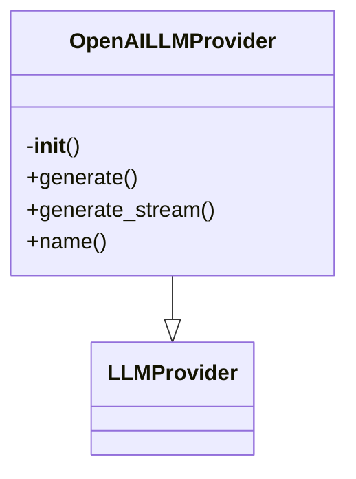

# OpenAI LLM Provider

## File Overview

This file implements an OpenAI LLM provider that extends the base LLM provider interface. It provides asynchronous access to OpenAI's language models through the `AsyncOpenAI` client, enabling text generation with configurable models and API keys.

## Classes

### `OpenAILLMProvider`

**Purpose**: An asynchronous LLM provider that interfaces with OpenAI's API to generate text responses.

**Key Methods**:

- `__init__(model: str = "gpt-4o", api_key: str | None = None)`: Initializes the provider with a model name and optional API key
- `generate(prompt: str, system_prompt: str | None = None, max_tokens: int = 4096, temperature: float = 0.7) -> AsyncIterator[str]`: Asynchronously generates text from a prompt

**Usage**:
```python
provider = OpenAILLMProvider(model="gpt-4-turbo", api_key="your-api-key")
async for chunk in provider.generate("Hello, world!"):
    print(chunk)
```

## Functions

### `__init__(self, model: str = "gpt-4o", api_key: str | None = None)`

Initializes the OpenAI LLM provider.

**Parameters**:
- `model` (str): The OpenAI model to use (default: "gpt-4o")
- `api_key` (str | None): Optional API key. If not provided, uses the `OPENAI_API_KEY` environment variable

**Returns**: None

### `generate(self, prompt: str, system_prompt: str | None = None, max_tokens: int = 4096, temperature: float = 0.7) -> AsyncIterator[str]`

Asynchronously generates text from a given prompt.

**Parameters**:
- `prompt` (str): The user prompt to generate text from
- `system_prompt` (str | None): Optional system prompt to guide the model's behavior
- `max_tokens` (int): Maximum number of tokens to generate (default: 4096)
- `temperature` (float): Sampling temperature (default: 0.7)

**Returns**: AsyncIterator[str] - An asynchronous iterator yielding text chunks as they are generated

## Usage Examples

### Basic Usage
```python
from local_deepwiki.providers.llm.openai import OpenAILLMProvider

# Initialize provider (uses OPENAI_API_KEY from environment)
provider = OpenAILLMProvider()

# Generate text
async for chunk in provider.generate("Explain quantum computing in simple terms"):
    print(chunk)
```

### With Custom Model and API Key
```python
provider = OpenAILLMProvider(
    model="gpt-4-turbo",
    api_key="sk-your-api-key-here"
)

async for chunk in provider.generate(
    prompt="Write a poem about technology",
    max_tokens=500,
    temperature=0.8
):
    print(chunk)
```

### With System Prompt
```python
async for chunk in provider.generate(
    prompt="What is the capital of France?",
    system_prompt="You are a helpful assistant that provides concise answers."
):
    print(chunk)
```

## Dependencies

This file imports:
- `os` - For accessing environment variables
- `AsyncIterator` - From `typing` - Type hint for asynchronous iterators
- `AsyncOpenAI` - From `openai` - OpenAI async client
- `LLMProvider` - From `local_deepwiki.providers.base` - Base provider interface

The provider requires the `openai` Python package to be installed and the `OPENAI_API_KEY` environment variable to be set for basic functionality.

## Class Diagram



## See Also

- [openai](../embeddings/openai.md) - dependency
- [base](../base.md) - dependency
- [anthropic](anthropic.md) - shares 3 dependencies
- [config](../../config.md) - shares 2 dependencies
