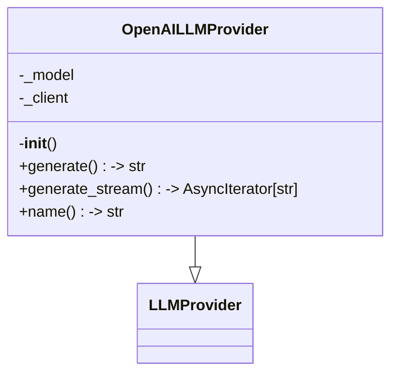
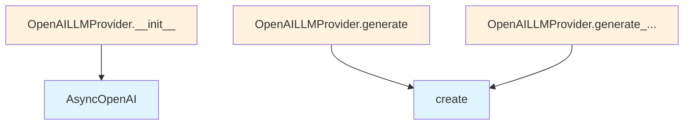

# OpenAI LLM Provider

## File Overview

This module provides an OpenAI-based implementation of the LLM provider interface for the local_deepwiki system. It integrates with OpenAI's API to provide language model capabilities through the AsyncOpenAI client.

## Classes

### OpenAILLMProvider

The OpenAILLMProvider class implements the [LLMProvider](../base.md) interface to provide OpenAI-based language model functionality. This class serves as the concrete implementation for interacting with OpenAI's API services within the local_deepwiki framework.

## Dependencies

The module relies on several key dependencies:

- **openai**: Provides the `AsyncOpenAI` client for asynchronous communication with OpenAI's API
- **local_deepwiki.logging**: Supplies logging functionality through the [`get_logger`](../../logging.md) function
- **local_deepwiki.providers.base**: Provides the base [`LLMProvider`](../base.md) interface and [`with_retry`](../base.md) [decorator](../base.md) for error handling

## Related Components

This module works with:

- **[LLMProvider](../base.md)**: The base interface that OpenAILLMProvider implements
- **[with_retry](../base.md)**: A [decorator](../base.md) from the base module for handling retry logic
- **AsyncOpenAI**: The OpenAI client used for API communication

## Usage Context

The OpenAILLMProvider class is designed to be used as part of the local_deepwiki system's provider architecture, offering OpenAI-specific language model capabilities while conforming to the standard [LLMProvider](../base.md) interface.

## API Reference

### class `OpenAILLMProvider`

**Inherits from:** [`LLMProvider`](../base.md)

LLM provider using OpenAI API.

**Methods:**

#### `__init__`

```python
def __init__(model: str = "gpt-4o", api_key: str | None = None)
```

Initialize the OpenAI provider.


| [Parameter](../../generators/api_docs.md) | Type | Default | Description |
|-----------|------|---------|-------------|
| `model` | `str` | `"gpt-4o"` | OpenAI model name. |
| `api_key` | `str | None` | `None` | Optional API key. Uses OPENAI_API_KEY env var if not provided. |

#### `generate`

```python
async def generate(prompt: str, system_prompt: str | None = None, max_tokens: int = 4096, temperature: float = 0.7) -> str
```

Generate text from a prompt.


| [Parameter](../../generators/api_docs.md) | Type | Default | Description |
|-----------|------|---------|-------------|
| `prompt` | `str` | - | The user prompt. |
| `system_prompt` | `str | None` | `None` | Optional system prompt. |
| `max_tokens` | `int` | `4096` | Maximum tokens to generate. |
| `temperature` | `float` | `0.7` | Sampling temperature. |

#### `generate_stream`

```python
async def generate_stream(prompt: str, system_prompt: str | None = None, max_tokens: int = 4096, temperature: float = 0.7) -> AsyncIterator[str]
```

Generate text from a prompt with streaming.


| [Parameter](../../generators/api_docs.md) | Type | Default | Description |
|-----------|------|---------|-------------|
| `prompt` | `str` | - | The user prompt. |
| `system_prompt` | `str | None` | `None` | Optional system prompt. |
| `max_tokens` | `int` | `4096` | Maximum tokens to generate. |
| `temperature` | `float` | `0.7` | Sampling temperature. |

#### `name`

```python
def name() -> str
```

Get the provider name.


## Class Diagram



## Call Graph



## Relevant Source Files

- `src/local_deepwiki/providers/llm/openai.py:14-101`
