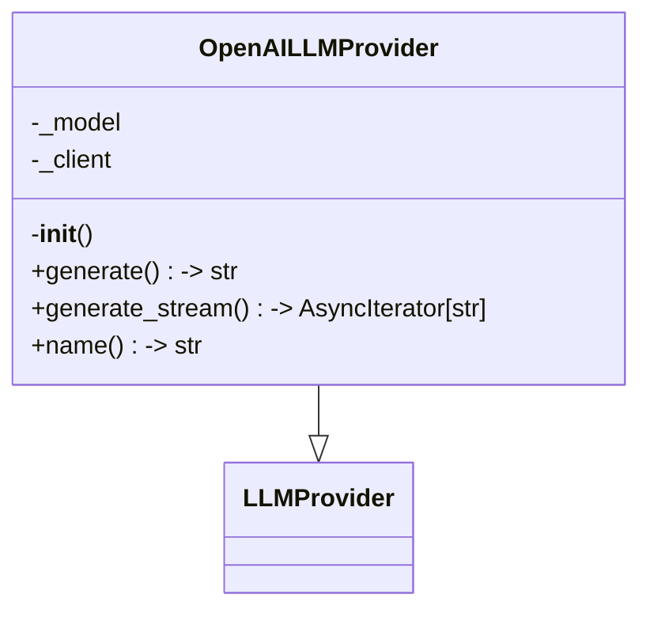
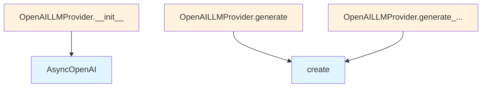

# OpenAI LLM Provider

## File Overview

This file implements an OpenAI-specific LLM provider for the local_deepwiki system. It provides integration with OpenAI's API through the AsyncOpenAI client, implementing the base [LLMProvider](../base.md) interface with retry functionality.

## Classes

### OpenAILLMProvider

The OpenAILLMProvider class extends the base [LLMProvider](../base.md) to provide OpenAI-specific language model functionality. This class handles asynchronous communication with OpenAI's API services.

**Inheritance:**
- Inherits from: [LLMProvider](../base.md)

**Key Features:**
- Asynchronous OpenAI API integration
- Built-in retry mechanism via the [`with_retry`](../base.md) [decorator](../base.md)
- Environment-based configuration support

## Dependencies

The module relies on several key dependencies:

- **openai**: Provides the AsyncOpenAI client for API communication
- **local_deepwiki.logging**: Supplies logging functionality through [get_logger](../../logging.md)
- **local_deepwiki.providers.base**: Provides the base [LLMProvider](../base.md) class and [with_retry](../base.md) [decorator](../base.md)

## Related Components

This provider works within the local_deepwiki ecosystem by:

- Implementing the [LLMProvider](../base.md) interface from the base providers module
- Utilizing the centralized logging system
- Supporting the retry mechanism for robust API interactions

## Environment Configuration

The module imports the `os` module, indicating it likely uses environment variables for configuration, though the specific variables are not visible in the provided code.

## Type Support

The module includes proper type annotations, importing `AsyncIterator` from the typing module to support asynchronous iteration patterns typical in streaming LLM responses.

## API Reference

### class `OpenAILLMProvider`

**Inherits from:** [`LLMProvider`](../base.md)

LLM provider using OpenAI API.

**Methods:**

#### `__init__`

```python
def __init__(model: str = "gpt-4o", api_key: str | None = None)
```

Initialize the OpenAI provider.


| [Parameter](../../generators/api_docs.md) | Type | Default | Description |
|-----------|------|---------|-------------|
| `model` | `str` | `"gpt-4o"` | OpenAI model name. |
| `api_key` | `str | None` | `None` | Optional API key. Uses OPENAI_API_KEY env var if not provided. |

#### `generate`

```python
async def generate(prompt: str, system_prompt: str | None = None, max_tokens: int = 4096, temperature: float = 0.7) -> str
```

Generate text from a prompt.


| [Parameter](../../generators/api_docs.md) | Type | Default | Description |
|-----------|------|---------|-------------|
| `prompt` | `str` | - | The user prompt. |
| `system_prompt` | `str | None` | `None` | Optional system prompt. |
| `max_tokens` | `int` | `4096` | Maximum tokens to generate. |
| `temperature` | `float` | `0.7` | Sampling temperature. |

#### `generate_stream`

```python
async def generate_stream(prompt: str, system_prompt: str | None = None, max_tokens: int = 4096, temperature: float = 0.7) -> AsyncIterator[str]
```

Generate text from a prompt with streaming.


| [Parameter](../../generators/api_docs.md) | Type | Default | Description |
|-----------|------|---------|-------------|
| `prompt` | `str` | - | The user prompt. |
| `system_prompt` | `str | None` | `None` | Optional system prompt. |
| `max_tokens` | `int` | `4096` | Maximum tokens to generate. |
| `temperature` | `float` | `0.7` | Sampling temperature. |

#### `name`

```python
def name() -> str
```

Get the provider name.


## Class Diagram



## Call Graph



## Relevant Source Files

- `src/local_deepwiki/providers/llm/openai.py:14-101`
