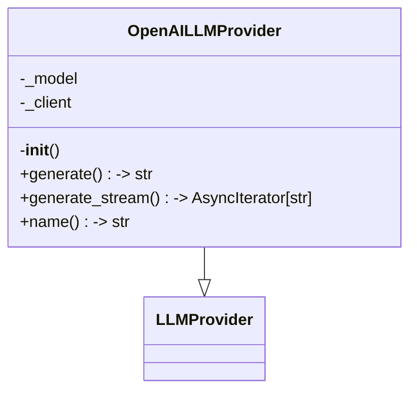
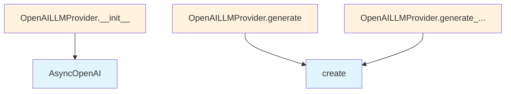

# OpenAI LLM Provider

## File Overview

This module provides an OpenAI-based implementation of the LLM provider interface for the local_deepwiki system. It integrates with OpenAI's API to provide language model capabilities for generating documentation content.

## Classes

### OpenAILLMProvider

The OpenAILLMProvider class implements the [LLMProvider](../base.md) interface to provide OpenAI-based language model functionality. This class handles communication with OpenAI's API services and manages the asynchronous generation of text content.

**Key Features:**
- Inherits from the [LLMProvider](../base.md) base class
- Utilizes the [`with_retry`](../base.md) [decorator](../base.md) for robust API interactions
- Supports asynchronous operations through AsyncOpenAI client
- Integrates with the logging system for monitoring and debugging

## Dependencies

The module relies on several key components:

- **AsyncOpenAI**: The official OpenAI Python client for asynchronous API interactions
- **[LLMProvider](../base.md)**: Base class that defines the interface for language model providers
- **[with_retry](../base.md)**: Decorator from the base providers module that adds retry logic for API calls
- **[get_logger](../../logging.md)**: Logging utility from the local_deepwiki logging system

## Related Components

This provider works within the broader local_deepwiki ecosystem:

- Implements the [LLMProvider](../base.md) interface defined in `local_deepwiki.providers.base`
- Uses the logging infrastructure from `local_deepwiki.logging`
- Integrates with the retry mechanism provided by the base provider system

## Environment Requirements

The module imports the `os` module, suggesting it likely uses environment variables for configuration, though the specific variables are not visible in the provided code.

## Usage Context

As an LLM provider implementation, this class would typically be instantiated and used by higher-level components in the local_deepwiki system that need to generate text content using OpenAI's language models. The asynchronous nature (indicated by AsyncIterator typing and AsyncOpenAI usage) suggests it's designed for efficient handling of multiple concurrent requests.

## API Reference

### class `OpenAILLMProvider`

**Inherits from:** [`LLMProvider`](../base.md)

LLM provider using OpenAI API.

**Methods:**

#### `__init__`

```python
def __init__(model: str = "gpt-4o", api_key: str | None = None)
```

Initialize the OpenAI provider.


| [Parameter](../../generators/api_docs.md) | Type | Default | Description |
|-----------|------|---------|-------------|
| `model` | `str` | `"gpt-4o"` | OpenAI model name. |
| `api_key` | `str | None` | `None` | Optional API key. Uses OPENAI_API_KEY env var if not provided. |

#### `generate`

```python
async def generate(prompt: str, system_prompt: str | None = None, max_tokens: int = 4096, temperature: float = 0.7) -> str
```

Generate text from a prompt.


| [Parameter](../../generators/api_docs.md) | Type | Default | Description |
|-----------|------|---------|-------------|
| `prompt` | `str` | - | The user prompt. |
| `system_prompt` | `str | None` | `None` | Optional system prompt. |
| `max_tokens` | `int` | `4096` | Maximum tokens to generate. |
| `temperature` | `float` | `0.7` | Sampling temperature. |

#### `generate_stream`

```python
async def generate_stream(prompt: str, system_prompt: str | None = None, max_tokens: int = 4096, temperature: float = 0.7) -> AsyncIterator[str]
```

Generate text from a prompt with streaming.


| [Parameter](../../generators/api_docs.md) | Type | Default | Description |
|-----------|------|---------|-------------|
| `prompt` | `str` | - | The user prompt. |
| `system_prompt` | `str | None` | `None` | Optional system prompt. |
| `max_tokens` | `int` | `4096` | Maximum tokens to generate. |
| `temperature` | `float` | `0.7` | Sampling temperature. |

#### `name`

```python
def name() -> str
```

Get the provider name.


## Class Diagram



## Call Graph



## Relevant Source Files

- `src/local_deepwiki/providers/llm/openai.py:14-101`
