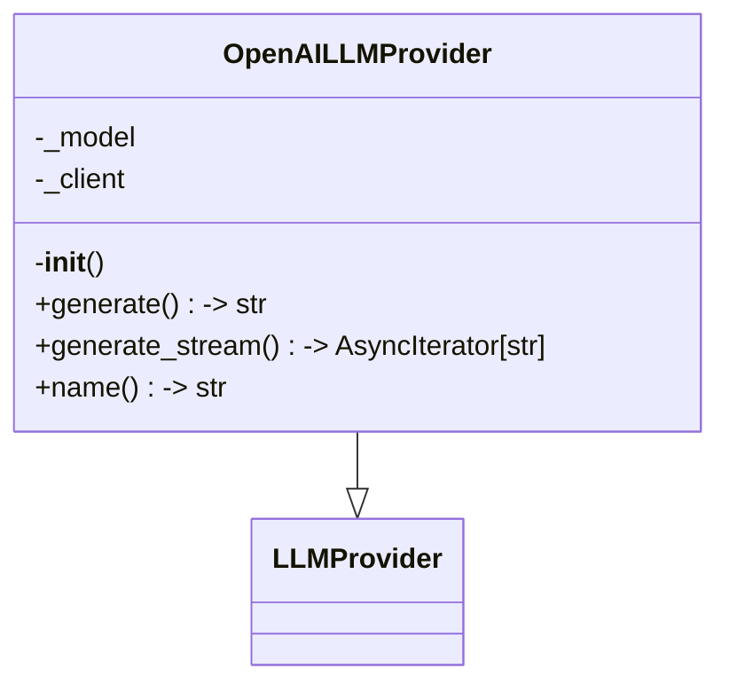
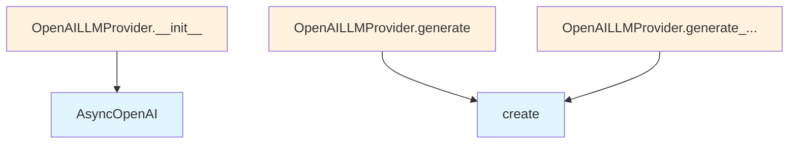

# OpenAI Provider Module

## File Overview

This module provides an OpenAI-based implementation of the LLM provider interface for the local_deepwiki system. It implements the [LLMProvider](../base.md) base class to enable integration with OpenAI's language models through their AsyncOpenAI client.

## Classes

### OpenAILLMProvider

The OpenAILLMProvider class serves as the concrete implementation of the [LLMProvider](../base.md) interface for OpenAI's language models. This class handles authentication and communication with OpenAI's API services.

**Inheritance**: Extends [LLMProvider](../base.md) base class

**Key Features**:
- Asynchronous OpenAI API integration
- Built-in retry mechanism through the [with_retry](../base.md) [decorator](../base.md)
- Environment-based configuration support

## Dependencies

The module relies on several key dependencies:

- **openai**: Official OpenAI Python client library for API communication
- **AsyncOpenAI**: Asynchronous client for non-blocking API calls
- **ChatCompletionMessageParam**: Type definitions for chat completion messages
- **[LLMProvider](../base.md)**: Base provider interface from the local_deepwiki framework
- **[with_retry](../base.md)**: Retry [decorator](../base.md) for handling transient failures
- **[get_logger](../../logging.md)**: Logging utility for the application

## Related Components

This module integrates with the following components from the local_deepwiki system:

- **[LLMProvider](../base.md)**: The base class that defines the provider interface
- **Logging system**: Uses the application's logging infrastructure
- **Retry mechanism**: Leverages the shared retry functionality for robust API calls

## Environment Configuration

The module uses the `os` module, suggesting it likely reads configuration from environment variables for API authentication and settings.

## Usage Context

This provider implementation enables the local_deepwiki system to utilize OpenAI's language models for text generation tasks. It follows the established provider pattern, allowing for easy swapping between different LLM backends while maintaining a consistent interface.

## API Reference

### class `OpenAILLMProvider`

**Inherits from:** [`LLMProvider`](../base.md)

LLM provider using OpenAI API.

**Methods:**


<details>
<summary>View Source (lines 15-102) | <a href="https://github.com/UrbanDiver/local-deepwiki-mcp/blob/feature/wiki-enhancements-round2/src/local_deepwiki/providers/llm/openai.py#L15-L102">GitHub</a></summary>

```python
class OpenAILLMProvider(LLMProvider):
    """LLM provider using OpenAI API."""

    def __init__(self, model: str = "gpt-4o", api_key: str | None = None):
        """Initialize the OpenAI provider.

        Args:
            model: OpenAI model name.
            api_key: Optional API key. Uses OPENAI_API_KEY env var if not provided.
        """
        self._model = model
        self._client = AsyncOpenAI(api_key=api_key or os.environ.get("OPENAI_API_KEY"))

    @with_retry(max_attempts=3, base_delay=1.0, max_delay=30.0)
    async def generate(
        self,
        prompt: str,
        system_prompt: str | None = None,
        max_tokens: int = 4096,
        temperature: float = 0.7,
    ) -> str:
        """Generate text from a prompt.

        Args:
            prompt: The user prompt.
            system_prompt: Optional system prompt.
            max_tokens: Maximum tokens to generate.
            temperature: Sampling temperature.

        Returns:
            Generated text.
        """
        messages: list[ChatCompletionMessageParam] = []
        if system_prompt:
            messages.append({"role": "system", "content": system_prompt})
        messages.append({"role": "user", "content": prompt})

        logger.debug(f"Generating with OpenAI model {self._model}, prompt length: {len(prompt)}")

        response = await self._client.chat.completions.create(
            model=self._model,
            messages=messages,
            max_tokens=max_tokens,
            temperature=temperature,
        )
        content = response.choices[0].message.content or ""

        logger.debug(f"OpenAI response length: {len(content)}")
        return content

    async def generate_stream(
        self,
        prompt: str,
        system_prompt: str | None = None,
        max_tokens: int = 4096,
        temperature: float = 0.7,
    ) -> AsyncIterator[str]:
        """Generate text from a prompt with streaming.

        Args:
            prompt: The user prompt.
            system_prompt: Optional system prompt.
            max_tokens: Maximum tokens to generate.
            temperature: Sampling temperature.

        Yields:
            Generated text chunks.
        """
        messages: list[ChatCompletionMessageParam] = []
        if system_prompt:
            messages.append({"role": "system", "content": system_prompt})
        messages.append({"role": "user", "content": prompt})

        stream = await self._client.chat.completions.create(
            model=self._model,
            messages=messages,
            max_tokens=max_tokens,
            temperature=temperature,
            stream=True,
        )
        async for chunk in stream:
            if chunk.choices[0].delta.content:
                yield chunk.choices[0].delta.content

    @property
    def name(self) -> str:
        """Get the provider name."""
        return f"openai:{self._model}"
```

</details>

#### `__init__`

```python
def __init__(model: str = "gpt-4o", api_key: str | None = None)
```

Initialize the OpenAI provider.


| [Parameter](../../generators/api_docs.md) | Type | Default | Description |
|-----------|------|---------|-------------|
| `model` | `str` | `"gpt-4o"` | OpenAI model name. |
| `api_key` | `str | None` | `None` | Optional API key. Uses OPENAI_API_KEY env var if not provided. |


<details>
<summary>View Source (lines 15-102) | <a href="https://github.com/UrbanDiver/local-deepwiki-mcp/blob/feature/wiki-enhancements-round2/src/local_deepwiki/providers/llm/openai.py#L15-L102">GitHub</a></summary>

```python
class OpenAILLMProvider(LLMProvider):
    """LLM provider using OpenAI API."""

    def __init__(self, model: str = "gpt-4o", api_key: str | None = None):
        """Initialize the OpenAI provider.

        Args:
            model: OpenAI model name.
            api_key: Optional API key. Uses OPENAI_API_KEY env var if not provided.
        """
        self._model = model
        self._client = AsyncOpenAI(api_key=api_key or os.environ.get("OPENAI_API_KEY"))

    @with_retry(max_attempts=3, base_delay=1.0, max_delay=30.0)
    async def generate(
        self,
        prompt: str,
        system_prompt: str | None = None,
        max_tokens: int = 4096,
        temperature: float = 0.7,
    ) -> str:
        """Generate text from a prompt.

        Args:
            prompt: The user prompt.
            system_prompt: Optional system prompt.
            max_tokens: Maximum tokens to generate.
            temperature: Sampling temperature.

        Returns:
            Generated text.
        """
        messages: list[ChatCompletionMessageParam] = []
        if system_prompt:
            messages.append({"role": "system", "content": system_prompt})
        messages.append({"role": "user", "content": prompt})

        logger.debug(f"Generating with OpenAI model {self._model}, prompt length: {len(prompt)}")

        response = await self._client.chat.completions.create(
            model=self._model,
            messages=messages,
            max_tokens=max_tokens,
            temperature=temperature,
        )
        content = response.choices[0].message.content or ""

        logger.debug(f"OpenAI response length: {len(content)}")
        return content

    async def generate_stream(
        self,
        prompt: str,
        system_prompt: str | None = None,
        max_tokens: int = 4096,
        temperature: float = 0.7,
    ) -> AsyncIterator[str]:
        """Generate text from a prompt with streaming.

        Args:
            prompt: The user prompt.
            system_prompt: Optional system prompt.
            max_tokens: Maximum tokens to generate.
            temperature: Sampling temperature.

        Yields:
            Generated text chunks.
        """
        messages: list[ChatCompletionMessageParam] = []
        if system_prompt:
            messages.append({"role": "system", "content": system_prompt})
        messages.append({"role": "user", "content": prompt})

        stream = await self._client.chat.completions.create(
            model=self._model,
            messages=messages,
            max_tokens=max_tokens,
            temperature=temperature,
            stream=True,
        )
        async for chunk in stream:
            if chunk.choices[0].delta.content:
                yield chunk.choices[0].delta.content

    @property
    def name(self) -> str:
        """Get the provider name."""
        return f"openai:{self._model}"
```

</details>

#### `generate`

```python
async def generate(prompt: str, system_prompt: str | None = None, max_tokens: int = 4096, temperature: float = 0.7) -> str
```

Generate text from a prompt.


| [Parameter](../../generators/api_docs.md) | Type | Default | Description |
|-----------|------|---------|-------------|
| `prompt` | `str` | - | The user prompt. |
| `system_prompt` | `str | None` | `None` | Optional system prompt. |
| `max_tokens` | `int` | `4096` | Maximum tokens to generate. |
| `temperature` | `float` | `0.7` | Sampling temperature. |


<details>
<summary>View Source (lines 15-102) | <a href="https://github.com/UrbanDiver/local-deepwiki-mcp/blob/feature/wiki-enhancements-round2/src/local_deepwiki/providers/llm/openai.py#L15-L102">GitHub</a></summary>

```python
class OpenAILLMProvider(LLMProvider):
    """LLM provider using OpenAI API."""

    def __init__(self, model: str = "gpt-4o", api_key: str | None = None):
        """Initialize the OpenAI provider.

        Args:
            model: OpenAI model name.
            api_key: Optional API key. Uses OPENAI_API_KEY env var if not provided.
        """
        self._model = model
        self._client = AsyncOpenAI(api_key=api_key or os.environ.get("OPENAI_API_KEY"))

    @with_retry(max_attempts=3, base_delay=1.0, max_delay=30.0)
    async def generate(
        self,
        prompt: str,
        system_prompt: str | None = None,
        max_tokens: int = 4096,
        temperature: float = 0.7,
    ) -> str:
        """Generate text from a prompt.

        Args:
            prompt: The user prompt.
            system_prompt: Optional system prompt.
            max_tokens: Maximum tokens to generate.
            temperature: Sampling temperature.

        Returns:
            Generated text.
        """
        messages: list[ChatCompletionMessageParam] = []
        if system_prompt:
            messages.append({"role": "system", "content": system_prompt})
        messages.append({"role": "user", "content": prompt})

        logger.debug(f"Generating with OpenAI model {self._model}, prompt length: {len(prompt)}")

        response = await self._client.chat.completions.create(
            model=self._model,
            messages=messages,
            max_tokens=max_tokens,
            temperature=temperature,
        )
        content = response.choices[0].message.content or ""

        logger.debug(f"OpenAI response length: {len(content)}")
        return content

    async def generate_stream(
        self,
        prompt: str,
        system_prompt: str | None = None,
        max_tokens: int = 4096,
        temperature: float = 0.7,
    ) -> AsyncIterator[str]:
        """Generate text from a prompt with streaming.

        Args:
            prompt: The user prompt.
            system_prompt: Optional system prompt.
            max_tokens: Maximum tokens to generate.
            temperature: Sampling temperature.

        Yields:
            Generated text chunks.
        """
        messages: list[ChatCompletionMessageParam] = []
        if system_prompt:
            messages.append({"role": "system", "content": system_prompt})
        messages.append({"role": "user", "content": prompt})

        stream = await self._client.chat.completions.create(
            model=self._model,
            messages=messages,
            max_tokens=max_tokens,
            temperature=temperature,
            stream=True,
        )
        async for chunk in stream:
            if chunk.choices[0].delta.content:
                yield chunk.choices[0].delta.content

    @property
    def name(self) -> str:
        """Get the provider name."""
        return f"openai:{self._model}"
```

</details>

#### `generate_stream`

```python
async def generate_stream(prompt: str, system_prompt: str | None = None, max_tokens: int = 4096, temperature: float = 0.7) -> AsyncIterator[str]
```

Generate text from a prompt with streaming.


| [Parameter](../../generators/api_docs.md) | Type | Default | Description |
|-----------|------|---------|-------------|
| `prompt` | `str` | - | The user prompt. |
| `system_prompt` | `str | None` | `None` | Optional system prompt. |
| `max_tokens` | `int` | `4096` | Maximum tokens to generate. |
| `temperature` | `float` | `0.7` | Sampling temperature. |


<details>
<summary>View Source (lines 15-102) | <a href="https://github.com/UrbanDiver/local-deepwiki-mcp/blob/feature/wiki-enhancements-round2/src/local_deepwiki/providers/llm/openai.py#L15-L102">GitHub</a></summary>

```python
class OpenAILLMProvider(LLMProvider):
    """LLM provider using OpenAI API."""

    def __init__(self, model: str = "gpt-4o", api_key: str | None = None):
        """Initialize the OpenAI provider.

        Args:
            model: OpenAI model name.
            api_key: Optional API key. Uses OPENAI_API_KEY env var if not provided.
        """
        self._model = model
        self._client = AsyncOpenAI(api_key=api_key or os.environ.get("OPENAI_API_KEY"))

    @with_retry(max_attempts=3, base_delay=1.0, max_delay=30.0)
    async def generate(
        self,
        prompt: str,
        system_prompt: str | None = None,
        max_tokens: int = 4096,
        temperature: float = 0.7,
    ) -> str:
        """Generate text from a prompt.

        Args:
            prompt: The user prompt.
            system_prompt: Optional system prompt.
            max_tokens: Maximum tokens to generate.
            temperature: Sampling temperature.

        Returns:
            Generated text.
        """
        messages: list[ChatCompletionMessageParam] = []
        if system_prompt:
            messages.append({"role": "system", "content": system_prompt})
        messages.append({"role": "user", "content": prompt})

        logger.debug(f"Generating with OpenAI model {self._model}, prompt length: {len(prompt)}")

        response = await self._client.chat.completions.create(
            model=self._model,
            messages=messages,
            max_tokens=max_tokens,
            temperature=temperature,
        )
        content = response.choices[0].message.content or ""

        logger.debug(f"OpenAI response length: {len(content)}")
        return content

    async def generate_stream(
        self,
        prompt: str,
        system_prompt: str | None = None,
        max_tokens: int = 4096,
        temperature: float = 0.7,
    ) -> AsyncIterator[str]:
        """Generate text from a prompt with streaming.

        Args:
            prompt: The user prompt.
            system_prompt: Optional system prompt.
            max_tokens: Maximum tokens to generate.
            temperature: Sampling temperature.

        Yields:
            Generated text chunks.
        """
        messages: list[ChatCompletionMessageParam] = []
        if system_prompt:
            messages.append({"role": "system", "content": system_prompt})
        messages.append({"role": "user", "content": prompt})

        stream = await self._client.chat.completions.create(
            model=self._model,
            messages=messages,
            max_tokens=max_tokens,
            temperature=temperature,
            stream=True,
        )
        async for chunk in stream:
            if chunk.choices[0].delta.content:
                yield chunk.choices[0].delta.content

    @property
    def name(self) -> str:
        """Get the provider name."""
        return f"openai:{self._model}"
```

</details>

#### `name`

```python
def name() -> str
```

Get the provider name.


<details>
<summary>View Source (lines 15-102) | <a href="https://github.com/UrbanDiver/local-deepwiki-mcp/blob/feature/wiki-enhancements-round2/src/local_deepwiki/providers/llm/openai.py#L15-L102">GitHub</a></summary>

```python
class OpenAILLMProvider(LLMProvider):
    """LLM provider using OpenAI API."""

    def __init__(self, model: str = "gpt-4o", api_key: str | None = None):
        """Initialize the OpenAI provider.

        Args:
            model: OpenAI model name.
            api_key: Optional API key. Uses OPENAI_API_KEY env var if not provided.
        """
        self._model = model
        self._client = AsyncOpenAI(api_key=api_key or os.environ.get("OPENAI_API_KEY"))

    @with_retry(max_attempts=3, base_delay=1.0, max_delay=30.0)
    async def generate(
        self,
        prompt: str,
        system_prompt: str | None = None,
        max_tokens: int = 4096,
        temperature: float = 0.7,
    ) -> str:
        """Generate text from a prompt.

        Args:
            prompt: The user prompt.
            system_prompt: Optional system prompt.
            max_tokens: Maximum tokens to generate.
            temperature: Sampling temperature.

        Returns:
            Generated text.
        """
        messages: list[ChatCompletionMessageParam] = []
        if system_prompt:
            messages.append({"role": "system", "content": system_prompt})
        messages.append({"role": "user", "content": prompt})

        logger.debug(f"Generating with OpenAI model {self._model}, prompt length: {len(prompt)}")

        response = await self._client.chat.completions.create(
            model=self._model,
            messages=messages,
            max_tokens=max_tokens,
            temperature=temperature,
        )
        content = response.choices[0].message.content or ""

        logger.debug(f"OpenAI response length: {len(content)}")
        return content

    async def generate_stream(
        self,
        prompt: str,
        system_prompt: str | None = None,
        max_tokens: int = 4096,
        temperature: float = 0.7,
    ) -> AsyncIterator[str]:
        """Generate text from a prompt with streaming.

        Args:
            prompt: The user prompt.
            system_prompt: Optional system prompt.
            max_tokens: Maximum tokens to generate.
            temperature: Sampling temperature.

        Yields:
            Generated text chunks.
        """
        messages: list[ChatCompletionMessageParam] = []
        if system_prompt:
            messages.append({"role": "system", "content": system_prompt})
        messages.append({"role": "user", "content": prompt})

        stream = await self._client.chat.completions.create(
            model=self._model,
            messages=messages,
            max_tokens=max_tokens,
            temperature=temperature,
            stream=True,
        )
        async for chunk in stream:
            if chunk.choices[0].delta.content:
                yield chunk.choices[0].delta.content

    @property
    def name(self) -> str:
        """Get the provider name."""
        return f"openai:{self._model}"
```

</details>

## Class Diagram



## Call Graph



## Used By

Functions and methods in this file and their callers:

- **`AsyncOpenAI`**: called by `OpenAILLMProvider.__init__`
- **`create`**: called by `OpenAILLMProvider.generate`, `OpenAILLMProvider.generate_stream`

## Relevant Source Files

- `src/local_deepwiki/providers/llm/openai.py:15-102`
