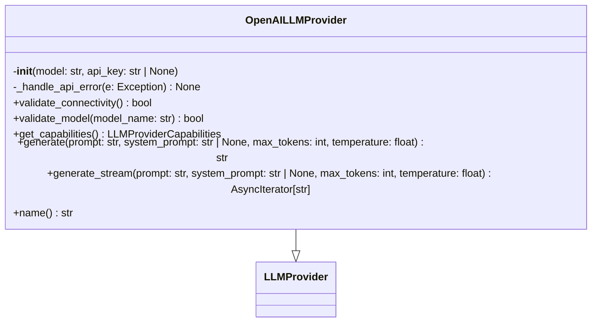

# File Overview

This file implements the `OpenAILLMProvider` class, which provides an interface to the OpenAI API for generating text and streaming responses. It handles authentication, model validation, and error conversion to standardized provider errors. The class integrates with the `CredentialManager` for API key handling and uses the `local_deepwiki.providers.base` module for base provider functionality and error types.

# Classes

## OpenAILLMProvider

The `OpenAILLMProvider` class implements the `LLMProvider` interface for interacting with OpenAI's language models. It supports text generation and streaming, and handles authentication and model validation.

### Methods

#### `__init__(self, model: str = "gpt-4o", api_key: str | None = None)`

Initialize the OpenAI provider.

**Parameters:**
- `model`: OpenAI model name.
- `api_key`: Optional API key. Uses `OPENAI_API_KEY` environment variable if not provided.

**Raises:**
- `ProviderAuthenticationError`: If no API key is configured or format is invalid.

#### `_handle_api_error(self, e: Exception)`

Convert OpenAI API errors to standardized provider errors.

**Parameters:**
- `e`: The exception from the OpenAI API.

**Raises:**
- `ProviderAuthenticationError`: If authentication fails.
- `ProviderRateLimitError`: If rate limited.
- `ProviderModelNotFoundError`: If model not found.
- `ProviderConnectionError`: If connection fails.

#### `validate_connectivity(self)`

Test that the OpenAI API is reachable and configured correctly.

**Returns:**
- `True` if the API is accessible.

**Raises:**
- `ProviderConnectionError`: If the API cannot be reached.
- `ProviderAuthenticationError`: If authentication fails.

#### `validate_model(self, model_name: str)`

Test that a specific model is available.

**Parameters:**
- `model_name`: The model name to validate.

**Returns:**
- `True` if the model is available.

**Raises:**
- `ProviderModelNotFoundError`: If the model is not available.

#### `get_capabilities(self)`

Return OpenAI provider capabilities.

**Returns:**
- `LLMProviderCapabilities` with OpenAI-specific information.

#### `generate(self, prompt: str, system_prompt: str | None = None, max_tokens: int = 4096, temperature: float = 0.7)`

Generate text from a prompt.

**Parameters:**
- `prompt`: The user prompt.
- `system_prompt`: Optional system prompt.
- `max_tokens`: Maximum tokens to generate.
- `temperature`: Sampling temperature.

**Returns:**
- Generated text.

**Raises:**
- `ProviderConnectionError`: If the API cannot be reached.
- `ProviderAuthenticationError`: If authentication fails.

#### `generate_stream(self, prompt: str, system_prompt: str | None = None, max_tokens: int = 4096, temperature: float = 0.7)`

Generate text from a prompt with streaming.

**Parameters:**
- `prompt`: The user prompt.
- `system_prompt`: Optional system prompt.
- `max_tokens`: Maximum tokens to generate.
- `temperature`: Sampling temperature.

**Yields:**
- Generated text chunks.

**Raises:**
- `ProviderConnectionError`: If the API cannot be reached.
- `ProviderAuthenticationError`: If authentication fails.

#### `name(self)`

Get the provider name.

**Returns:**
- A string identifier for the provider, formatted as `openai:{model_name}`.

# Integration

This file is part of the `local_deepwiki.providers.llm` module and integrates with:

- `local_deepwiki.providers.base` for base provider classes and error handling
- `local_deepwiki.providers.credentials` for managing API keys
- `local_deepwiki.logging` for logging

It is used by components such as `WikiGenerator` and `SourceRefsGenerator` in the `local_deepwiki.generators` module, as indicated by related files.

# Usage Examples

```python
# Initialize the OpenAI provider
provider = OpenAILLMProvider(model="gpt-4o", api_key="your-api-key")

# Generate text
response = await provider.generate("Hello, world!")

# Stream text
async for chunk in provider.generate_stream("Hello, world!"):
    print(chunk)
```

## API Reference

### class `OpenAILLMProvider`

**Inherits from:** `LLMProvider`

LLM provider using OpenAI API.

**Methods:**


<details>
<summary>View Source (lines 38-312) | <a href="https://github.com/UrbanDiver/local-deepwiki-mcp/blob/main/src/local_deepwiki/providers/llm/openai.py#L38-L312">GitHub</a></summary>

```python
class OpenAILLMProvider(LLMProvider):
    # Methods: __init__, _handle_api_error, validate_connectivity, validate_model, get_capabilities, generate, generate_stream, name
```

</details>

#### `__init__`

```python
def __init__(model: str = "gpt-4o", api_key: str | None = None)
```

Initialize the OpenAI provider.


| Parameter | Type | Default | Description |
|-----------|------|---------|-------------|
| `model` | `str` | `"gpt-4o"` | OpenAI model name. |
| `api_key` | `str | None` | `None` | Optional API key. Uses OPENAI_API_KEY env var if not provided. |


<details>
<summary>View Source (lines 41-70) | <a href="https://github.com/UrbanDiver/local-deepwiki-mcp/blob/main/src/local_deepwiki/providers/llm/openai.py#L41-L70">GitHub</a></summary>

```python
def __init__(self, model: str = "gpt-4o", api_key: str | None = None):
        """Initialize the OpenAI provider.

        Args:
            model: OpenAI model name.
            api_key: Optional API key. Uses OPENAI_API_KEY env var if not provided.

        Raises:
            ProviderAuthenticationError: If no API key is configured or format is invalid.
        """
        self._model = model

        # Get API key without storing in instance variable
        api_key = api_key or CredentialManager.get_api_key("OPENAI_API_KEY", "openai")

        if not api_key:
            raise ProviderAuthenticationError(
                "No OpenAI API key configured. Set OPENAI_API_KEY environment variable.",
                provider_name="openai:gpt",
            )

        # Validate format
        if not CredentialManager.validate_key_format(api_key, "openai"):
            raise ProviderAuthenticationError(
                "OpenAI API key format appears invalid.",
                provider_name="openai:gpt",
            )

        # Pass directly to client, don't store in self
        self._client = AsyncOpenAI(api_key=api_key)
```

</details>

#### `validate_connectivity`

```python
async def validate_connectivity() -> bool
```

Test that the OpenAI API is reachable and configured correctly.


<details>
<summary>View Source (lines 125-155) | <a href="https://github.com/UrbanDiver/local-deepwiki-mcp/blob/main/src/local_deepwiki/providers/llm/openai.py#L125-L155">GitHub</a></summary>

```python
async def validate_connectivity(self) -> bool:
        """Test that the OpenAI API is reachable and configured correctly.

        Returns:
            True if the API is accessible.

        Raises:
            ProviderConnectionError: If the API cannot be reached.
            ProviderAuthenticationError: If authentication fails.
        """
        if not self._api_key:
            raise ProviderAuthenticationError(
                "No OpenAI API key configured. Set OPENAI_API_KEY environment variable.",
                provider_name=self.name,
            )

        try:
            # Make a minimal API call to verify connectivity
            await self._client.chat.completions.create(
                model=self._model,
                max_tokens=1,
                messages=[{"role": "user", "content": "Hi"}],
            )
            return True
        except Exception as e:
            self._handle_api_error(e)
            raise ProviderConnectionError(
                f"Failed to validate OpenAI connectivity: {e}",
                provider_name=self.name,
                original_error=e,
            ) from e
```

</details>

#### `validate_model`

```python
async def validate_model(model_name: str) -> bool
```

Test that a specific model is available.


| Parameter | Type | Default | Description |
|-----------|------|---------|-------------|
| `model_name` | `str` | - | The model name to validate. |


<details>
<summary>View Source (lines 157-189) | <a href="https://github.com/UrbanDiver/local-deepwiki-mcp/blob/main/src/local_deepwiki/providers/llm/openai.py#L157-L189">GitHub</a></summary>

```python
async def validate_model(self, model_name: str) -> bool:
        """Test that a specific model is available.

        Args:
            model_name: The model name to validate.

        Returns:
            True if the model is available.

        Raises:
            ProviderModelNotFoundError: If the model is not available.
        """
        if model_name in OPENAI_MODELS:
            return True

        # Try to make a call with the model to verify
        try:
            await self._client.chat.completions.create(
                model=model_name,
                max_tokens=1,
                messages=[{"role": "user", "content": "Hi"}],
            )
            return True
        except Exception as e:
            error_str = str(e).lower()
            if "not found" in error_str or "does not exist" in error_str or "invalid" in error_str:
                raise ProviderModelNotFoundError(
                    model_name,
                    provider_name=self.name,
                    available_models=list(OPENAI_MODELS.keys()),
                ) from e
            self._handle_api_error(e)
            raise
```

</details>

#### `get_capabilities`

```python
def get_capabilities() -> LLMProviderCapabilities
```

Return OpenAI provider capabilities.


<details>
<summary>View Source (lines 191-208) | <a href="https://github.com/UrbanDiver/local-deepwiki-mcp/blob/main/src/local_deepwiki/providers/llm/openai.py#L191-L208">GitHub</a></summary>

```python
def get_capabilities(self) -> LLMProviderCapabilities:
        """Return OpenAI provider capabilities.

        Returns:
            LLMProviderCapabilities with OpenAI-specific information.
        """
        context_length = OPENAI_MODELS.get(self._model, 128000)
        # O1 models don't support system prompts or streaming the same way
        is_o1_model = self._model.startswith("o1")
        return LLMProviderCapabilities(
            supports_streaming=not is_o1_model,  # O1 models have limited streaming
            supports_system_prompt=not is_o1_model,  # O1 models use developer messages
            max_tokens=16384 if "gpt-4o" in self._model else 4096,
            max_context_length=context_length,
            models=list(OPENAI_MODELS.keys()),
            supports_function_calling=True,
            supports_vision="gpt-4o" in self._model or "gpt-4-turbo" in self._model,
        )
```

</details>

#### `generate`

```python
async def generate(prompt: str, system_prompt: str | None = None, max_tokens: int = 4096, temperature: float = 0.7) -> str
```

Generate text from a prompt.


| Parameter | Type | Default | Description |
|-----------|------|---------|-------------|
| `prompt` | `str` | - | The user prompt. |
| `system_prompt` | `str | None` | `None` | Optional system prompt. |
| `max_tokens` | `int` | `4096` | Maximum tokens to generate. |
| `temperature` | `float` | `0.7` | Sampling temperature. |


<details>
<summary>View Source (lines 211-259) | <a href="https://github.com/UrbanDiver/local-deepwiki-mcp/blob/main/src/local_deepwiki/providers/llm/openai.py#L211-L259">GitHub</a></summary>

```python
async def generate(
        self,
        prompt: str,
        system_prompt: str | None = None,
        max_tokens: int = 4096,
        temperature: float = 0.7,
    ) -> str:
        """Generate text from a prompt.

        Args:
            prompt: The user prompt.
            system_prompt: Optional system prompt.
            max_tokens: Maximum tokens to generate.
            temperature: Sampling temperature.

        Returns:
            Generated text.

        Raises:
            ProviderConnectionError: If the API cannot be reached.
            ProviderAuthenticationError: If authentication fails.
            ProviderRateLimitError: If rate limited.
            ProviderModelNotFoundError: If the model is not available.
        """
        messages: list[ChatCompletionMessageParam] = []
        if system_prompt:
            messages.append({"role": "system", "content": system_prompt})
        messages.append({"role": "user", "content": prompt})

        logger.debug(f"Generating with OpenAI model {self._model}, prompt length: {len(prompt)}")

        try:
            response = await self._client.chat.completions.create(
                model=self._model,
                messages=messages,
                max_tokens=max_tokens,
                temperature=temperature,
            )
            content = response.choices[0].message.content or ""

            logger.debug(f"OpenAI response length: {len(content)}")
            return content

        except (ProviderConnectionError, ProviderAuthenticationError,
                ProviderRateLimitError, ProviderModelNotFoundError):
            raise
        except Exception as e:
            self._handle_api_error(e)
            raise
```

</details>

#### `generate_stream`

```python
async def generate_stream(prompt: str, system_prompt: str | None = None, max_tokens: int = 4096, temperature: float = 0.7) -> AsyncIterator[str]
```

Generate text from a prompt with streaming.


| Parameter | Type | Default | Description |
|-----------|------|---------|-------------|
| `prompt` | `str` | - | The user prompt. |
| `system_prompt` | `str | None` | `None` | Optional system prompt. |
| `max_tokens` | `int` | `4096` | Maximum tokens to generate. |
| `temperature` | `float` | `0.7` | Sampling temperature. |


<details>
<summary>View Source (lines 261-307) | <a href="https://github.com/UrbanDiver/local-deepwiki-mcp/blob/main/src/local_deepwiki/providers/llm/openai.py#L261-L307">GitHub</a></summary>

```python
async def generate_stream(
        self,
        prompt: str,
        system_prompt: str | None = None,
        max_tokens: int = 4096,
        temperature: float = 0.7,
    ) -> AsyncIterator[str]:
        """Generate text from a prompt with streaming.

        Args:
            prompt: The user prompt.
            system_prompt: Optional system prompt.
            max_tokens: Maximum tokens to generate.
            temperature: Sampling temperature.

        Yields:
            Generated text chunks.

        Raises:
            ProviderConnectionError: If the API cannot be reached.
            ProviderAuthenticationError: If authentication fails.
            ProviderRateLimitError: If rate limited.
            ProviderModelNotFoundError: If the model is not available.
        """
        messages: list[ChatCompletionMessageParam] = []
        if system_prompt:
            messages.append({"role": "system", "content": system_prompt})
        messages.append({"role": "user", "content": prompt})

        try:
            stream = await self._client.chat.completions.create(
                model=self._model,
                messages=messages,
                max_tokens=max_tokens,
                temperature=temperature,
                stream=True,
            )
            async for chunk in stream:
                if chunk.choices[0].delta.content:
                    yield chunk.choices[0].delta.content

        except (ProviderConnectionError, ProviderAuthenticationError,
                ProviderRateLimitError, ProviderModelNotFoundError):
            raise
        except Exception as e:
            self._handle_api_error(e)
            raise
```

</details>

#### `name`

```python
def name() -> str
```

Get the provider name.


<details>
<summary>View Source (lines 310-312) | <a href="https://github.com/UrbanDiver/local-deepwiki-mcp/blob/main/src/local_deepwiki/providers/llm/openai.py#L310-L312">GitHub</a></summary>

```python
def name(self) -> str:
        """Get the provider name."""
        return f"openai:{self._model}"
```

</details>

## Class Diagram


```mermaid
classDiagram
    class OpenAILLMProvider {
        -__init__(model: str, api_key: str | None)
        -_handle_api_error(e: Exception) None
        +validate_connectivity() bool
        +validate_model(model_name: str) bool
        +get_capabilities() LLMProviderCapabilities
        +generate(prompt: str, system_prompt: str | None, max_tokens: int, temperature: float) str
        +generate_stream(prompt: str, system_prompt: str | None, max_tokens: int, temperature: float) AsyncIterator[str]
        +name() str
    }
    OpenAILLMProvider --|> LLMProvider
```

## Call Graph


```mermaid
flowchart TD
    N0[AsyncOpenAI]
    N1[LLMProviderCapabilities]
    N2[OpenAILLMProvider.__init__]
    N3[OpenAILLMProvider._handle_a...]
    N4[OpenAILLMProvider.generate]
    N5[OpenAILLMProvider.generate_...]
    N6[OpenAILLMProvider.get_capab...]
    N7[OpenAILLMProvider.validate_...]
    N8[OpenAILLMProvider.validate_...]
    N9[ProviderAuthenticationError]
    N10[ProviderConnectionError]
    N11[ProviderModelNotFoundError]
    N12[ProviderRateLimitError]
    N13[_handle_api_error]
    N14[create]
    N15[get_api_key]
    N16[validate_key_format]
    N2 --> N15
    N2 --> N9
    N2 --> N16
    N2 --> N0
    N3 --> N9
    N3 --> N12
    N3 --> N11
    N3 --> N10
    N7 --> N9
    N7 --> N14
    N7 --> N13
    N7 --> N10
    N8 --> N14
    N8 --> N11
    N8 --> N13
    N6 --> N1
    N4 --> N14
    N4 --> N13
    N5 --> N14
    N5 --> N13
    classDef func fill:#e1f5fe
    class N0,N1,N9,N10,N11,N12,N13,N14,N15,N16 func
    classDef method fill:#fff3e0
    class N2,N3,N4,N5,N6,N7,N8 method
```

## Used By

Functions and methods in this file and their callers:

- **`AsyncOpenAI`**: called by `OpenAILLMProvider.__init__`
- **`LLMProviderCapabilities`**: called by `OpenAILLMProvider.get_capabilities`
- **`ProviderAuthenticationError`**: called by `OpenAILLMProvider.__init__`, `OpenAILLMProvider._handle_api_error`, `OpenAILLMProvider.validate_connectivity`
- **`ProviderConnectionError`**: called by `OpenAILLMProvider._handle_api_error`, `OpenAILLMProvider.validate_connectivity`
- **`ProviderModelNotFoundError`**: called by `OpenAILLMProvider._handle_api_error`, `OpenAILLMProvider.validate_model`
- **`ProviderRateLimitError`**: called by `OpenAILLMProvider._handle_api_error`
- **`_handle_api_error`**: called by `OpenAILLMProvider.generate`, `OpenAILLMProvider.generate_stream`, `OpenAILLMProvider.validate_connectivity`, `OpenAILLMProvider.validate_model`
- **`create`**: called by `OpenAILLMProvider.generate`, `OpenAILLMProvider.generate_stream`, `OpenAILLMProvider.validate_connectivity`, `OpenAILLMProvider.validate_model`
- **`get_api_key`**: called by `OpenAILLMProvider.__init__`
- **`validate_key_format`**: called by `OpenAILLMProvider.__init__`

## Usage Examples

*Examples extracted from test files*

### Test initialization fails without API key

From `test_openai_provider.py::TestOpenAIProviderInitialization::test_initialization_no_api_key_raises_error`:

```python
from local_deepwiki.providers.llm.openai import OpenAILLMProvider

with patch.dict(os.environ, {}, clear=True):
    # Remove OPENAI_API_KEY from environment
    os.environ.pop("OPENAI_API_KEY", None)
    with pytest.raises(ProviderAuthenticationError) as exc_info:
        OpenAILLMProvider(model="gpt-4o")

    assert "No OpenAI API key configured" in str(exc_info.value)
    assert "OPENAI_API_KEY" in str(exc_info.value)
```

### Test initialization fails without API key

From `test_openai_provider.py::TestOpenAIProviderInitialization::test_initialization_no_api_key_raises_error`:

```python
from local_deepwiki.providers.llm.openai import OpenAILLMProvider

with patch.dict(os.environ, {}, clear=True):
    # Remove OPENAI_API_KEY from environment
    os.environ.pop("OPENAI_API_KEY", None)
    with pytest.raises(ProviderAuthenticationError) as exc_info:
        OpenAILLMProvider(model="gpt-4o")

    assert "No OpenAI API key configured" in str(exc_info.value)
    assert "OPENAI_API_KEY" in str(exc_info.value)
```

### Test initialization fails with invalid API key format

From `test_openai_provider.py::TestOpenAIProviderInitialization::test_initialization_invalid_key_format_raises_error`:

```python
from local_deepwiki.providers.llm.openai import OpenAILLMProvider

# Mock validate_key_format to return False
with patch(
    "local_deepwiki.providers.llm.openai.CredentialManager.get_api_key",
    return_value="invalid",
):
    with patch(
        "local_deepwiki.providers.llm.openai.CredentialManager.validate_key_format",
        return_value=False,
    ):
        with pytest.raises(ProviderAuthenticationError) as exc_info:
            OpenAILLMProvider(model="gpt-4o")

        assert "format appears invalid" in str(exc_info.value)
```

### Test initialization fails with invalid API key format

From `test_openai_provider.py::TestOpenAIProviderInitialization::test_initialization_invalid_key_format_raises_error`:

```python
from local_deepwiki.providers.llm.openai import OpenAILLMProvider

# Mock validate_key_format to return False
with patch(
    "local_deepwiki.providers.llm.openai.CredentialManager.get_api_key",
    return_value="invalid",
):
    with patch(
        "local_deepwiki.providers.llm.openai.CredentialManager.validate_key_format",
        return_value=False,
    ):
        with pytest.raises(ProviderAuthenticationError) as exc_info:
            OpenAILLMProvider(model="gpt-4o")

        assert "format appears invalid" in str(exc_info.value)
```

### Test handling of APIConnectionError

From `test_openai_provider.py::TestOpenAIProviderHandleApiError::test_handle_connection_error`:

```python
from local_deepwiki.providers.base import ProviderConnectionError
from local_deepwiki.providers.llm.openai import OpenAILLMProvider

provider = OpenAILLMProvider(model="gpt-4o")

conn_error = APIConnectionError(request=MagicMock())

with pytest.raises(ProviderConnectionError) as exc_info:
    provider._handle_api_error(conn_error)

assert "Failed to connect to OpenAI API" in str(exc_info.value)
```


## Last Modified

| Entity | Type | Author | Date | Commit |
|--------|------|--------|------|--------|
| `OpenAILLMProvider` | class | Brian Breidenbach | 1 week ago | `4eb4353` Phase 2: Implement RBAC, de... |
| `__init__` | method | Brian Breidenbach | 1 week ago | `4eb4353` Phase 2: Implement RBAC, de... |
| `_handle_api_error` | method | Brian Breidenbach | 1 week ago | `a64166a` Add seven medium-priority e... |
| `validate_connectivity` | method | Brian Breidenbach | 1 week ago | `a64166a` Add seven medium-priority e... |
| `validate_model` | method | Brian Breidenbach | 1 week ago | `a64166a` Add seven medium-priority e... |
| `get_capabilities` | method | Brian Breidenbach | 1 week ago | `a64166a` Add seven medium-priority e... |
| `generate` | method | Brian Breidenbach | 1 week ago | `a64166a` Add seven medium-priority e... |
| `generate_stream` | method | Brian Breidenbach | 1 week ago | `a64166a` Add seven medium-priority e... |
| `name` | method | Brian Breidenbach | 3 weeks ago | `cdae76f` Initial commit: Local DeepW... |

## Additional Source Code

Source code for functions and methods not listed in the API Reference above.

#### `_handle_api_error`

<details>
<summary>View Source (lines 72-123) | <a href="https://github.com/UrbanDiver/local-deepwiki-mcp/blob/main/src/local_deepwiki/providers/llm/openai.py#L72-L123">GitHub</a></summary>

```python
def _handle_api_error(self, e: Exception) -> None:
        """Convert OpenAI API errors to standardized provider errors.

        Args:
            e: The exception from the OpenAI API.

        Raises:
            ProviderAuthenticationError: If authentication fails.
            ProviderRateLimitError: If rate limited.
            ProviderModelNotFoundError: If model not found.
            ProviderConnectionError: If connection fails.
        """
        if isinstance(e, AuthenticationError):
            raise ProviderAuthenticationError(
                "OpenAI API authentication failed. Check your OPENAI_API_KEY.",
                provider_name=self.name,
            ) from e

        if isinstance(e, APIStatusError):
            error_str = str(e).lower()
            if e.status_code == 429 or "rate" in error_str:
                # Try to extract retry-after header
                retry_after = None
                if hasattr(e, "response") and e.response:
                    retry_after_str = e.response.headers.get("retry-after")
                    if retry_after_str:
                        try:
                            retry_after = float(retry_after_str)
                        except ValueError:
                            pass
                raise ProviderRateLimitError(
                    f"OpenAI API rate limit exceeded: {e}",
                    provider_name=self.name,
                    retry_after=retry_after,
                ) from e

            if e.status_code == 404 or "not found" in error_str or "does not exist" in error_str:
                raise ProviderModelNotFoundError(
                    self._model,
                    provider_name=self.name,
                    available_models=list(OPENAI_MODELS.keys()),
                ) from e

        if isinstance(e, APIConnectionError):
            raise ProviderConnectionError(
                f"Failed to connect to OpenAI API: {e}",
                provider_name=self.name,
                original_error=e,
            ) from e

        # Re-raise unknown errors
        raise
```

</details>

