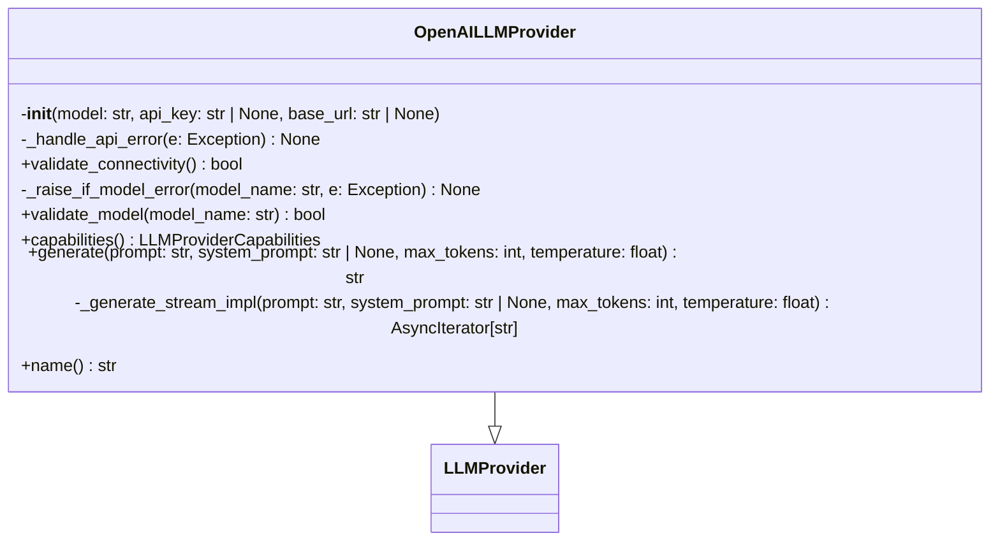

# File: `src/local_deepwiki/providers/llm/openai.py`

## File Overview

This file implements the `OpenAILLMProvider` class, which provides an interface for interacting with OpenAI's language models via the `openai` Python SDK. It abstracts the complexity of API calls, error handling, and model validation, and integrates with the project's provider framework to support consistent LLM interactions.

The primary responsibility of this file is to:
- Manage API credentials and client instantiation
- Validate connectivity and model availability
- Generate text using OpenAI's chat completions API
- Support streaming generation for real-time responses
- Convert OpenAI-specific API errors into standardized provider errors

This design allows the application to use OpenAI models as a backend while maintaining consistent error handling and extensibility for other LLM providers.

## Key Concepts

### Provider Abstraction
The `OpenAILLMProvider` inherits from [`LLMProvider`](../base.md), which defines a common interface for LLM interactions. This abstraction allows the system to support multiple LLM providers (e.g., OpenAI, Azure, local models) with a unified API, promoting flexibility and decoupling.

### Error Handling Strategy
This provider implements a centralized error handling mechanism:
- Uses [`handle_api_status_error`](../errors.md) to standardize OpenAI API errors
- Raises provider-specific exceptions ([`ProviderAuthenticationError`](../errors.md), [`ProviderModelNotFoundError`](../errors.md), etc.) to maintain a consistent error interface
- Ensures that unknown or unexpected errors are not silently ignored

### Credential Management
Credentials are managed using [`CredentialManager`](../credentials.md), which supports environment variables and potentially other secure storage methods. This approach keeps sensitive data out of the codebase while allowing configuration flexibility.

### Model Validation
The provider includes logic to validate both:
- Model availability using API calls
- Connectivity to the API endpoint

This ensures that misconfigured or outdated models do not silently fail during runtime.

### Streaming Support
The `_generate_stream_impl` method supports streaming responses, which is essential for real-time or interactive applications. It respects model-specific limitations (e.g., O1 models do not support streaming in the same way).

## Integration

### External Usage
This file is used by:
- `OpenAILLMProvider` class itself (via `__init__`, `validate_connectivity`, `generate`, etc.)
- Test functions like `test_llm_providers`, `test_openai_provider`, and potentially others in the CLI or configuration system

### Related Files
- `src/local_deepwiki/cli/init_cli.py`: Likely uses this provider to initialize LLM configurations
- `src/local_deepwiki/config/provider_models.py`: May reference `OPENAI_MODELS` to validate models
- `src/local_deepwiki/generators/diagrams/sequence_diagram.py`: Possibly uses this provider for LLM-backed diagram generation
- `src/local_deepwiki/plugins/__init__.py`: Could integrate this provider as part of plugin-based LLM support

### Dependencies
- `openai.AsyncOpenAI`: Core SDK for asynchronous API interactions
- `local_deepwiki.providers.base`: Provides base classes and error handling utilities
- `local_deepwiki.providers.credentials`: Manages secure credential retrieval
- `local_deepwiki.logging`: For structured logging

## Design Notes

### Why Use `AsyncOpenAI`?
The provider uses `AsyncOpenAI` instead of the synchronous `OpenAI` client to support non-blocking API calls, which is critical for performance in web or event-driven applications.

### Why Not Store API Key in Instance Variables?
The API key is retrieved via [`CredentialManager`](../credentials.md) and passed directly to `AsyncOpenAI` without storing it in `self`. This avoids potential security issues and keeps credentials in a single, managed location.

### Model Capability Logic
The `capabilities` method dynamically adjusts supported features based on the model name:
- O1 models are treated specially due to their distinct behavior (e.g., no system prompts)
- Vision support is tied to specific models (`gpt-4o`, `gpt-4-turbo`)
- Streaming is disabled for O1 models

### Error Propagation
The provider ensures that exceptions are not silently consumed:
- `validate_model` and `generate` methods explicitly re-raise provider-specific errors
- Unknown errors are passed to `_handle_api_error`, which raises them after logging

### Why Not Use `with_retry` Decorator?
While [`with_retry`](../retry.md) is imported, it is not applied to methods in this file. This may be intentional to allow the calling code to apply retries or handle them at a higher level, or it may be an oversight in the current implementation.

## API Reference

### class `OpenAILLMProvider`

**Inherits from:** [`LLMProvider`](../base.md)

LLM provider using OpenAI API.

**Methods:**


<details>
<summary>View Source (lines 49-348) | <a href="https://github.com/UrbanDiver/local-deepwiki-mcp/blob/main/src/local_deepwiki/providers/llm/openai.py#L49-L348">GitHub</a></summary>

```python
class OpenAILLMProvider(LLMProvider):
    # Methods: __init__, _handle_api_error, validate_connectivity, _raise_if_model_error, validate_model, capabilities, generate, _generate_stream_impl, name
```

</details>

#### `__init__`

```python
def __init__(model: str = "gpt-4o", api_key: str | None = None, base_url: str | None = None)
```

Initialize the OpenAI provider.


| Parameter | Type | Default | Description |
|-----------|------|---------|-------------|
| `model` | `str` | `"gpt-4o"` | OpenAI model name. |
| `api_key` | `str | None` | `None` | Optional API key. Uses OPENAI_API_KEY env var if not provided. |
| `base_url` | `str | None` | `None` | Optional custom API base URL for OpenAI-compatible proxies. |


<details>
<summary>View Source (lines 52-83) | <a href="https://github.com/UrbanDiver/local-deepwiki-mcp/blob/main/src/local_deepwiki/providers/llm/openai.py#L52-L83">GitHub</a></summary>

```python
def __init__(
        self,
        model: str = "gpt-4o",
        api_key: str | None = None,
        base_url: str | None = None,
    ):
        """Initialize the OpenAI provider.

        Args:
            model: OpenAI model name.
            api_key: Optional API key. Uses OPENAI_API_KEY env var if not provided.
            base_url: Optional custom API base URL for OpenAI-compatible proxies.

        Raises:
            ProviderAuthenticationError: If no API key is configured or format is invalid.
        """
        self._model = model

        # Get API key without storing in instance variable
        api_key = api_key or CredentialManager.get_api_key("OPENAI_API_KEY", "openai")

        # Validate credentials using shared helper
        api_key = validate_provider_credentials(
            provider_name="openai:gpt",
            api_key=api_key,
            key_type="openai",
            env_var="OPENAI_API_KEY",
            display_name="OpenAI",
        )

        # Pass directly to client, don't store in self
        self._client = AsyncOpenAI(api_key=api_key, base_url=base_url)
```

</details>

#### `validate_connectivity`

```python
async def validate_connectivity() -> bool
```

Test that the OpenAI API is reachable and configured correctly.


<details>
<summary>View Source (lines 101-131) | <a href="https://github.com/UrbanDiver/local-deepwiki-mcp/blob/main/src/local_deepwiki/providers/llm/openai.py#L101-L131">GitHub</a></summary>

```python
async def validate_connectivity(self) -> bool:
        """Test that the OpenAI API is reachable and configured correctly.

        Returns:
            True if the API is accessible.

        Raises:
            ProviderConnectionError: If the API cannot be reached.
            ProviderAuthenticationError: If authentication fails.
        """
        try:
            # Make a minimal API call to verify connectivity
            await self._client.chat.completions.create(
                model=self._model,
                max_tokens=1,
                messages=[{"role": "user", "content": "Hi"}],
            )
            return True
        except (
            APIConnectionError,
            APIStatusError,
            AuthenticationError,
            ConnectionError,
            TimeoutError,
        ) as e:
            self._handle_api_error(e)
            raise ProviderConnectionError(
                f"Failed to validate OpenAI connectivity: {e}",
                provider_name=self.name,
                original_error=e,
            ) from e
```

</details>

#### `validate_model`

```python
async def validate_model(model_name: str) -> bool
```

Test that a specific model is available.


| Parameter | Type | Default | Description |
|-----------|------|---------|-------------|
| `model_name` | `str` | - | The model name to validate. |


<details>
<summary>View Source (lines 147-200) | <a href="https://github.com/UrbanDiver/local-deepwiki-mcp/blob/main/src/local_deepwiki/providers/llm/openai.py#L147-L200">GitHub</a></summary>

```python
async def validate_model(self, model_name: str) -> bool:
        """Test that a specific model is available.

        Args:
            model_name: The model name to validate.

        Returns:
            True if the model is available.

        Raises:
            ProviderModelNotFoundError: If the model is not available.
        """
        if model_name in OPENAI_MODELS:
            return True

        # Try to make a call with the model to verify
        try:
            await self._client.chat.completions.create(
                model=model_name,
                max_tokens=1,
                messages=[{"role": "user", "content": "Hi"}],
            )
            return True
        except (
            APIConnectionError,
            APIStatusError,
            AuthenticationError,
            ConnectionError,
            TimeoutError,
        ) as e:
            # API-specific exceptions - delegate to error handler or check error message
            self._raise_if_model_error(model_name, e)
            self._handle_api_error(e)
            raise
        except (ValueError, KeyError) as e:
            # Data validation errors - check if model-related
            self._raise_if_model_error(model_name, e)
            raise
        except OpenAIError as e:
            # Catch remaining OpenAI library exceptions not matched above
            # Only handle model-related errors, re-raise everything else
            if (
                "not found" in str(e).lower()
                or "does not exist" in str(e).lower()
                or "invalid" in str(e).lower()
            ):
                logger.warning(
                    "Caught OpenAIError in validate_model, treating as model error: %s",
                    e,
                )
            self._raise_if_model_error(model_name, e)
            # For unknown errors, try the error handler first
            self._handle_api_error(e)
            raise
```

</details>

#### `capabilities`

```python
def capabilities() -> LLMProviderCapabilities
```

Return OpenAI provider capabilities.


<details>
<summary>View Source (lines 203-220) | <a href="https://github.com/UrbanDiver/local-deepwiki-mcp/blob/main/src/local_deepwiki/providers/llm/openai.py#L203-L220">GitHub</a></summary>

```python
def capabilities(self) -> LLMProviderCapabilities:
        """Return OpenAI provider capabilities.

        Returns:
            LLMProviderCapabilities with OpenAI-specific information.
        """
        context_length = OPENAI_MODELS.get(self._model, 128000)
        # O1 models don't support system prompts or streaming the same way
        is_o1_model = self._model.startswith("o1")
        return LLMProviderCapabilities(
            supports_streaming=not is_o1_model,  # O1 models have limited streaming
            supports_system_prompt=not is_o1_model,  # O1 models use developer messages
            max_tokens=16384 if "gpt-4o" in self._model else 4096,
            max_context_length=context_length,
            models=list(OPENAI_MODELS.keys()),
            supports_function_calling=True,
            supports_vision="gpt-4o" in self._model or "gpt-4-turbo" in self._model,
        )
```

</details>

#### `generate`

```python
async def generate(prompt: str, system_prompt: str | None = None, max_tokens: int = 4096, temperature: float = 0.7) -> str
```

Generate text from a prompt.


| Parameter | Type | Default | Description |
|-----------|------|---------|-------------|
| `prompt` | `str` | - | The user prompt. |
| `system_prompt` | `str | None` | `None` | Optional system prompt. |
| `max_tokens` | `int` | `4096` | Maximum tokens to generate. |
| `temperature` | `float` | `0.7` | Sampling temperature. |


<details>
<summary>View Source (lines 223-285) | <a href="https://github.com/UrbanDiver/local-deepwiki-mcp/blob/main/src/local_deepwiki/providers/llm/openai.py#L223-L285">GitHub</a></summary>

```python
async def generate(
        self,
        prompt: str,
        system_prompt: str | None = None,
        max_tokens: int = 4096,
        temperature: float = 0.7,
    ) -> str:
        """Generate text from a prompt.

        Args:
            prompt: The user prompt.
            system_prompt: Optional system prompt.
            max_tokens: Maximum tokens to generate.
            temperature: Sampling temperature.

        Returns:
            Generated text.

        Raises:
            ProviderConnectionError: If the API cannot be reached.
            ProviderAuthenticationError: If authentication fails.
            ProviderRateLimitError: If rate limited.
            ProviderModelNotFoundError: If the model is not available.
        """
        messages: list[ChatCompletionMessageParam] = []
        if system_prompt:
            messages.append({"role": "system", "content": system_prompt})
        messages.append({"role": "user", "content": prompt})

        logger.debug(
            "Generating with OpenAI model %s, prompt length: %d",
            self._model,
            len(prompt),
        )

        try:
            response = await self._client.chat.completions.create(
                model=self._model,
                messages=messages,
                max_tokens=max_tokens,
                temperature=temperature,
            )
            content = response.choices[0].message.content or ""

            logger.debug("OpenAI response length: %s", len(content))
            return content

        except (
            ProviderConnectionError,
            ProviderAuthenticationError,
            ProviderRateLimitError,
            ProviderModelNotFoundError,
        ):
            raise
        except (
            APIConnectionError,
            APIStatusError,
            AuthenticationError,
            ConnectionError,
            TimeoutError,
        ) as e:
            self._handle_api_error(e)
            raise
```

</details>

#### `name`

```python
def name() -> str
```

Get the provider name.


<details>
<summary>View Source (lines 346-348) | <a href="https://github.com/UrbanDiver/local-deepwiki-mcp/blob/main/src/local_deepwiki/providers/llm/openai.py#L346-L348">GitHub</a></summary>

```python
def name(self) -> str:
        """Get the provider name."""
        return f"openai:{self._model}"
```

</details>

## Class Diagram


```mermaid
classDiagram
    class OpenAILLMProvider {
        -__init__(model: str, api_key: str | None, base_url: str | None)
        -_handle_api_error(e: Exception) None
        +validate_connectivity() bool
        -_raise_if_model_error(model_name: str, e: Exception) None
        +validate_model(model_name: str) bool
        +capabilities() LLMProviderCapabilities
        +generate(prompt: str, system_prompt: str | None, max_tokens: int, temperature: float) str
        -_generate_stream_impl(prompt: str, system_prompt: str | None, max_tokens: int, temperature: float) AsyncIterator[str]
        +name() str
    }
    OpenAILLMProvider --|> LLMProvider
```

## Call Graph


```mermaid
flowchart TD
    N0[ApiErrorConfig]
    N1[AsyncOpenAI]
    N2[LLMProviderCapabilities]
    N3[OpenAILLMProvider.__init__]
    N4[OpenAILLMProvider._generate...]
    N5[OpenAILLMProvider._handle_a...]
    N6[OpenAILLMProvider._raise_if...]
    N7[OpenAILLMProvider.capabilities]
    N8[OpenAILLMProvider.generate]
    N9[OpenAILLMProvider.validate_...]
    N10[OpenAILLMProvider.validate_...]
    N11[ProviderConnectionError]
    N12[ProviderModelNotFoundError]
    N13[_handle_api_error]
    N14[_raise_if_model_error]
    N15[create]
    N16[get_api_key]
    N17[handle_api_status_error]
    N18[validate_provider_credentials]
    N3 --> N16
    N3 --> N18
    N3 --> N1
    N5 --> N0
    N5 --> N17
    N9 --> N15
    N9 --> N13
    N9 --> N11
    N6 --> N12
    N10 --> N15
    N10 --> N14
    N10 --> N13
    N7 --> N2
    N8 --> N15
    N8 --> N13
    N4 --> N15
    N4 --> N13
    classDef func fill:#e1f5fe
    class N0,N1,N2,N11,N12,N13,N14,N15,N16,N17,N18 func
    classDef method fill:#fff3e0
    class N3,N4,N5,N6,N7,N8,N9,N10 method
```

## Used By

Functions and methods in this file and their callers:

- **[`ApiErrorConfig`](../errors.md)**: called by `OpenAILLMProvider._handle_api_error`
- **`AsyncOpenAI`**: called by `OpenAILLMProvider.__init__`
- **[`LLMProviderCapabilities`](../base.md)**: called by `OpenAILLMProvider.capabilities`
- **[`ProviderConnectionError`](../errors.md)**: called by `OpenAILLMProvider.validate_connectivity`
- **[`ProviderModelNotFoundError`](../errors.md)**: called by `OpenAILLMProvider._raise_if_model_error`
- **`_handle_api_error`**: called by `OpenAILLMProvider._generate_stream_impl`, `OpenAILLMProvider.generate`, `OpenAILLMProvider.validate_connectivity`, `OpenAILLMProvider.validate_model`
- **`_raise_if_model_error`**: called by `OpenAILLMProvider.validate_model`
- **`create`**: called by `OpenAILLMProvider._generate_stream_impl`, `OpenAILLMProvider.generate`, `OpenAILLMProvider.validate_connectivity`, `OpenAILLMProvider.validate_model`
- **`get_api_key`**: called by `OpenAILLMProvider.__init__`
- **[`handle_api_status_error`](../errors.md)**: called by `OpenAILLMProvider._handle_api_error`
- **[`validate_provider_credentials`](../errors.md)**: called by `OpenAILLMProvider.__init__`

## Usage Examples

*Examples extracted from test files*

### Test initialization fails without API key

From `test_openai_provider.py::TestOpenAIProviderInitialization::test_initialization_no_api_key_raises_error`:

```python
from local_deepwiki.providers.llm.openai import OpenAILLMProvider

with patch.dict(os.environ, {}, clear=True):
    # Remove OPENAI_API_KEY from environment
    os.environ.pop("OPENAI_API_KEY", None)
    with pytest.raises(ProviderAuthenticationError) as exc_info:
        OpenAILLMProvider(model="gpt-4o")

    assert "No OpenAI API key configured" in str(exc_info.value)
    assert "OPENAI_API_KEY" in str(exc_info.value)
```

### Test initialization fails without API key

From `test_openai_provider.py::TestOpenAIProviderInitialization::test_initialization_no_api_key_raises_error`:

```python
from local_deepwiki.providers.llm.openai import OpenAILLMProvider

with patch.dict(os.environ, {}, clear=True):
    # Remove OPENAI_API_KEY from environment
    os.environ.pop("OPENAI_API_KEY", None)
    with pytest.raises(ProviderAuthenticationError) as exc_info:
        OpenAILLMProvider(model="gpt-4o")

    assert "No OpenAI API key configured" in str(exc_info.value)
    assert "OPENAI_API_KEY" in str(exc_info.value)
```

### Test initialization fails with invalid API key format

From `test_openai_provider.py::TestOpenAIProviderInitialization::test_initialization_invalid_key_format_raises_error`:

```python
from local_deepwiki.providers.llm.openai import OpenAILLMProvider

# Mock validate_key_format to return False
with patch(
    "local_deepwiki.providers.llm.openai.CredentialManager.get_api_key",
    return_value="invalid",
):
    with patch(
        "local_deepwiki.providers.llm.openai.CredentialManager.validate_key_format",
        return_value=False,
    ):
        with pytest.raises(ProviderAuthenticationError) as exc_info:
            OpenAILLMProvider(model="gpt-4o")

        assert "format appears invalid" in str(exc_info.value)
```

### Test handling of APIConnectionError

From `test_openai_provider.py::TestOpenAIProviderHandleApiError::test_handle_connection_error`:

```python
from local_deepwiki.providers.base import ProviderConnectionError
from local_deepwiki.providers.llm.openai import OpenAILLMProvider

provider = OpenAILLMProvider(model="gpt-4o")

conn_error = APIConnectionError(request=MagicMock())

with pytest.raises(ProviderConnectionError) as exc_info:
    provider._handle_api_error(conn_error)

assert "Failed to connect to OpenAI API" in str(exc_info.value)
```

### Test that unknown errors are re-raised when called within exception context

From `test_openai_provider.py::TestOpenAIProviderHandleApiError::test_handle_unknown_error_reraises`:

```python
# _handle_api_error uses bare 'raise' so must be called within exception handler
with pytest.raises(ValueError):
    try:
        raise unknown_error
    except ValueError as e:
        provider._handle_api_error(e)
        raise  # This mirrors the actual usage pattern
```


## Last Modified

| Entity | Type | Author | Date | Commit |
|--------|------|--------|------|--------|
| `OpenAILLMProvider` | class | Brian Breidenbach | today | `27e3cd1` feat: release readiness — O... |
| `__init__` | method | Brian Breidenbach | today | `27e3cd1` feat: release readiness — O... |
| `_raise_if_model_error` | method | Brian Breidenbach | 2 days ago | `512fa22` refactor: decompose CC > 15... |
| `validate_model` | method | Brian Breidenbach | 2 days ago | `512fa22` refactor: decompose CC > 15... |
| `_handle_api_error` | method | Brian Breidenbach | 1 week ago | `5465a75` refactor: introduce ApiErro... |
| `_generate_stream_impl` | method | Brian Breidenbach | 2 weeks ago | `c850cb5` feat: enforce provider stre... |
| `capabilities` | method | Brian Breidenbach | Feb 20, 2026 | `8182b15` refactor: Pythonic API impr... |
| `generate` | method | Brian Breidenbach | Feb 20, 2026 | `b807417` refactor: high-priority Pyt... |
| `validate_connectivity` | method | Brian Breidenbach | Feb 11, 2026 | `74bebaf` fix: improve exception hand... |
| `name` | method | Brian Breidenbach | Jan 10, 2026 | `cdae76f` Initial commit: Local DeepW... |

## Additional Source Code

Source code for functions and methods not listed in the API Reference above.

#### `_handle_api_error`

<details>
<summary>View Source (lines 85-99) | <a href="https://github.com/UrbanDiver/local-deepwiki-mcp/blob/main/src/local_deepwiki/providers/llm/openai.py#L85-L99">GitHub</a></summary>

```python
def _handle_api_error(self, e: Exception) -> None:
        """Convert OpenAI API errors to standardized provider errors."""
        config = ApiErrorConfig(
            provider_name=self.name,
            api_label="OpenAI API",
            model=self._model,
            available_models=list(OPENAI_MODELS.keys()),
            not_found_extra_patterns=("does not exist",),
            auth_error_type=AuthenticationError,
            status_error_type=APIStatusError,
            connection_error_type=APIConnectionError,
        )
        handle_api_status_error(e, config)
        # Re-raise unknown errors
        raise
```

</details>


#### `_raise_if_model_error`

<details>
<summary>View Source (lines 133-145) | <a href="https://github.com/UrbanDiver/local-deepwiki-mcp/blob/main/src/local_deepwiki/providers/llm/openai.py#L133-L145">GitHub</a></summary>

```python
def _raise_if_model_error(self, model_name: str, e: Exception) -> None:
        """Raise ProviderModelNotFoundError if *e* looks like a model-not-found error."""
        error_str = str(e).lower()
        if (
            "not found" in error_str
            or "does not exist" in error_str
            or "invalid" in error_str
        ):
            raise ProviderModelNotFoundError(
                model_name,
                provider_name=self.name,
                available_models=list(OPENAI_MODELS.keys()),
            ) from e
```

</details>


#### `_generate_stream_impl`

<details>
<summary>View Source (lines 287-343) | <a href="https://github.com/UrbanDiver/local-deepwiki-mcp/blob/main/src/local_deepwiki/providers/llm/openai.py#L287-L343">GitHub</a></summary>

```python
async def _generate_stream_impl(
        self,
        prompt: str,
        system_prompt: str | None = None,
        max_tokens: int = 4096,
        temperature: float = 0.7,
    ) -> AsyncIterator[str]:
        """Generate text from a prompt with streaming.

        Args:
            prompt: The user prompt.
            system_prompt: Optional system prompt.
            max_tokens: Maximum tokens to generate.
            temperature: Sampling temperature.

        Yields:
            Generated text chunks.

        Raises:
            ProviderConnectionError: If the API cannot be reached.
            ProviderAuthenticationError: If authentication fails.
            ProviderRateLimitError: If rate limited.
            ProviderModelNotFoundError: If the model is not available.
        """
        messages: list[ChatCompletionMessageParam] = []
        if system_prompt:
            messages.append({"role": "system", "content": system_prompt})
        messages.append({"role": "user", "content": prompt})

        try:
            stream = await self._client.chat.completions.create(
                model=self._model,
                messages=messages,
                max_tokens=max_tokens,
                temperature=temperature,
                stream=True,
            )
            async for chunk in stream:
                if chunk.choices[0].delta.content:
                    yield chunk.choices[0].delta.content

        except (
            ProviderConnectionError,
            ProviderAuthenticationError,
            ProviderRateLimitError,
            ProviderModelNotFoundError,
        ):
            raise
        except (
            APIConnectionError,
            APIStatusError,
            AuthenticationError,
            ConnectionError,
            TimeoutError,
        ) as e:
            self._handle_api_error(e)
            raise
```

</details>

## Relevant Source Files

- `src/local_deepwiki/providers/llm/openai.py:49-348`
