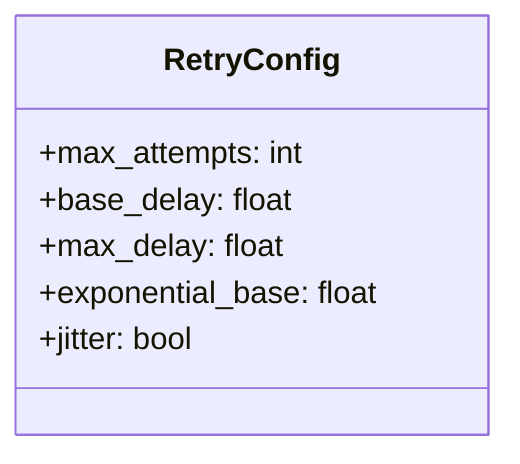
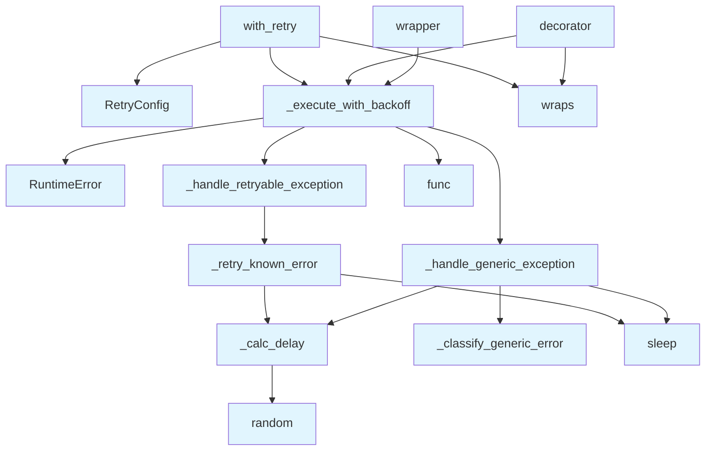

# File: `src/local_deepwiki/providers/retry.py`

## File Overview

This file implements a retry decorator with exponential backoff for asynchronous provider calls. It provides a robust mechanism to handle transient failures such as network errors, rate limits, and server overloads by automatically retrying failed operations with increasing delays between attempts.

The module is designed to be used across various provider implementations within the `local_deepwiki` project to improve resilience against intermittent issues. It encapsulates the retry logic in a reusable and configurable way, ensuring consistent behavior across different asynchronous operations.

## Key Concepts

### Retry Strategy with Exponential Backoff

The core retry mechanism uses exponential backoff with optional jitter to prevent thundering herd issues when many requests are retried simultaneously. The delay between retries increases exponentially according to the formula:

```
delay = min(base_delay * (exponential_base ** (attempt - 1)), max_delay)
```

Jitter is added to the delay to randomize retry times and reduce contention.

### Exception Classification

The system distinguishes between known retryable exceptions and generic exceptions. Known retryable exceptions are defined by `RETRYABLE_EXCEPTIONS`, which typically include connection errors and timeouts. Generic exceptions are classified based on their string representations to detect rate-limiting or server overload conditions.

This classification allows for granular handling:
- For known exceptions, a standard retry behavior is applied.
- For generic exceptions, the system inspects the error message to decide whether it's retryable (e.g., "rate limit", "overloaded", or HTTP 502/503).

### Configuration Abstraction

The `RetryConfig` class centralizes all retry parameters (`max_attempts`, `base_delay`, `max_delay`, `exponential_base`, `jitter`) into a single immutable configuration object. This design avoids long parameter lists and makes it easy to share consistent retry settings across different retry handlers.

## Integration

This file is part of the `local_deepwiki.providers` module and integrates with other core components of the system. It imports logging utilities and provider-specific error types, enabling it to work seamlessly with the error handling infrastructure.

### External Usage

The main entry point for users is the `with_retry` decorator, which is called by:
- `test_base_provider`
- `test_provider_errors`
- `test_providers` and other provider-related test cases
- Internal decorators in modules like `events`, `api_docs`, `access_control`, etc.

These integrations suggest that the retry logic is a foundational component used throughout the application to ensure that external API calls (especially those involving LLMs or external services) are resilient to temporary failures.

### Related Files

This module is closely related to:
- `src/local_deepwiki/core/rate_limiter.py` — Both handle resilience against service overload
- `src/local_deepwiki/events.py` — Likely uses retry logic for event processing or external integrations

## Design Notes

### Why Exponential Backoff?

Exponential backoff is chosen over fixed delays because it provides a better balance between responsiveness and system load. It allows immediate retries for transient failures while gradually reducing the frequency of retries to avoid overwhelming the target service.

### Why Jitter?

Adding jitter to the delay helps prevent multiple clients from retrying at the same time, reducing the risk of cascading failures and improving overall system stability.

### Handling Generic Exceptions

The broad `except Exception` clause is intentional, allowing the system to inspect error messages from different providers (Anthropic, OpenAI, Ollama, etc.) and determine retryability. This approach provides resilience without needing to know every possible exception type ahead of time.

### Exception Re-raising

If an exception is not retryable, it's immediately re-raised. If a retryable exception is encountered but the maximum number of attempts is reached, the last exception is re-raised to propagate the failure upward. This ensures that transient failures don't mask underlying issues.

### Why Not Use Third-Party Libraries?

While libraries like `tenacity` exist for retry logic, this implementation is custom-built to:
- Keep dependencies minimal
- Tailor behavior to the specific needs of this project (e.g., custom error classification)
- Ensure tight integration with existing logging and error handling mechanisms

This custom approach also allows for fine-grained control over behavior, such as how rate limits and server overloads are detected and handled.

## API Reference

### class `RetryConfig`

Immutable retry/backoff configuration.  Bundles the retry parameters shared across the internal helper functions (_retry_known_error, _handle_retryable_exception, _handle_generic_exception, _execute_with_backoff) to avoid long parameter lists.

---


<details>
<summary>View Source (lines 38-50) | <a href="https://github.com/UrbanDiver/local-deepwiki-mcp/blob/main/src/local_deepwiki/providers/retry.py#L38-L50">GitHub</a></summary>

```python
class RetryConfig:
    """Immutable retry/backoff configuration.

    Bundles the retry parameters shared across the internal helper functions
    (_retry_known_error, _handle_retryable_exception, _handle_generic_exception,
    _execute_with_backoff) to avoid long parameter lists.
    """

    max_attempts: int = 3
    base_delay: float = 1.0
    max_delay: float = 30.0
    exponential_base: float = 2.0
    jitter: bool = True
```

</details>

### Functions

#### `with_retry`

```python
def with_retry(max_attempts: int = 3, base_delay: float = 1.0, max_delay: float = 30.0, exponential_base: float = 2.0, jitter: bool = True) -> Callable[[Callable[..., Any]], Callable[..., Any]]
```

Decorator for adding retry logic with exponential backoff to async functions.


| Parameter | Type | Default | Description |
|-----------|------|---------|-------------|
| `max_attempts` | `int` | `3` | Maximum number of attempts before giving up. |
| `base_delay` | `float` | `1.0` | Initial delay between retries in seconds. |
| `max_delay` | `float` | `30.0` | Maximum delay between retries in seconds. |
| `exponential_base` | `float` | `2.0` | Base for exponential backoff calculation. |
| `jitter` | `bool` | `True` | Whether to add random jitter to delays. |

**Returns:** `Callable[[Callable[..., Any]], Callable[..., Any]]`


<details>
<summary>View Source (lines 190-225) | <a href="https://github.com/UrbanDiver/local-deepwiki-mcp/blob/main/src/local_deepwiki/providers/retry.py#L190-L225">GitHub</a></summary>

```python
def with_retry(
    *,
    max_attempts: int = 3,
    base_delay: float = 1.0,
    max_delay: float = 30.0,
    exponential_base: float = 2.0,
    jitter: bool = True,
) -> Callable[[Callable[..., Any]], Callable[..., Any]]:
    """Decorator for adding retry logic with exponential backoff to async functions.

    Args:
        max_attempts: Maximum number of attempts before giving up.
        base_delay: Initial delay between retries in seconds.
        max_delay: Maximum delay between retries in seconds.
        exponential_base: Base for exponential backoff calculation.
        jitter: Whether to add random jitter to delays.

    Returns:
        Decorated function with retry logic.
    """
    cfg = RetryConfig(
        max_attempts=max_attempts,
        base_delay=base_delay,
        max_delay=max_delay,
        exponential_base=exponential_base,
        jitter=jitter,
    )

    def decorator(func: Callable[..., Any]) -> Callable[..., Any]:
        @wraps(func)
        async def wrapper(*args: Any, **kwargs: Any) -> Any:
            return await _execute_with_backoff(func, args, kwargs, cfg)

        return wrapper

    return decorator
```

</details>

#### `decorator`

```python
def decorator(func: Callable[..., Any]) -> Callable[..., Any]
```


| Parameter | Type | Default | Description |
|-----------|------|---------|-------------|
| `func` | `Callable[..., Any]` | - | - |

**Returns:** `Callable[..., Any]`


<details>
<summary>View Source (lines 218-223) | <a href="https://github.com/UrbanDiver/local-deepwiki-mcp/blob/main/src/local_deepwiki/providers/retry.py#L218-L223">GitHub</a></summary>

```python
def decorator(func: Callable[..., Any]) -> Callable[..., Any]:
        @wraps(func)
        async def wrapper(*args: Any, **kwargs: Any) -> Any:
            return await _execute_with_backoff(func, args, kwargs, cfg)

        return wrapper
```

</details>

#### `wrapper`

`@wraps(func)`

```python
async def wrapper() -> Any
```

**Returns:** `Any`


<details>
<summary>View Source (lines 220-221) | <a href="https://github.com/UrbanDiver/local-deepwiki-mcp/blob/main/src/local_deepwiki/providers/retry.py#L220-L221">GitHub</a></summary>

```python
async def wrapper(*args: Any, **kwargs: Any) -> Any:
            return await _execute_with_backoff(func, args, kwargs, cfg)
```

</details>

## Class Diagram



## Call Graph



## Used By

Functions and methods in this file and their callers:

- **`RetryConfig`**: called by `with_retry`
- **`RuntimeError`**: called by `_execute_with_backoff`
- **`_calc_delay`**: called by `_handle_generic_exception`, `_retry_known_error`
- **`_classify_generic_error`**: called by `_handle_generic_exception`
- **`_execute_with_backoff`**: called by `decorator`, `with_retry`, `wrapper`
- **`_handle_generic_exception`**: called by `_execute_with_backoff`
- **`_handle_retryable_exception`**: called by `_execute_with_backoff`
- **`_retry_known_error`**: called by `_handle_retryable_exception`
- **`func`**: called by `_execute_with_backoff`
- **`random`**: called by `_calc_delay`
- **`sleep`**: called by `_handle_generic_exception`, `_retry_known_error`
- **`wraps`**: called by `decorator`, `with_retry`

## Usage Examples

*Examples extracted from test files*

### Test that successful calls work normally

From `test_retry.py::TestWithRetry::test_succeeds_on_first_attempt`:

```python
@with_retry(max_attempts=3)
async def successful_func():
    nonlocal call_count
    call_count += 1
    return "success"

result = await successful_func()
assert result == "success"
assert call_count == 1
```

### Test that successful calls work normally

From `test_retry.py::TestWithRetry::test_succeeds_on_first_attempt`:

```python
@with_retry(max_attempts=3)
async def successful_func():
    nonlocal call_count
    call_count += 1
    return "success"

result = await successful_func()
assert result == "success"
assert call_count == 1
```

### Test that connection errors trigger retry

From `test_retry.py::TestWithRetry::test_retries_on_connection_error`:

```python
@with_retry(max_attempts=3, base_delay=0.01)
async def flaky_func():
    nonlocal call_count
    call_count += 1
    if call_count < 3:
        raise ConnectionError("Connection refused")
    return "success"

result = await flaky_func()
assert result == "success"
assert call_count == 3
```

### Example: `retry`

From `test_retry_handler_params.py::TestRetryConfig::test_defaults`:

```python
from local_deepwiki.providers.retry import RetryConfig

        cfg = RetryConfig()
        assert cfg.max_attempts == 3
        assert cfg.base_delay == 1.0
```

### Example: `RetryConfig`

From `test_retry_handler_params.py::TestRetryConfig::test_defaults`:

```python
from local_deepwiki.providers.retry import RetryConfig

        cfg = RetryConfig()
        assert cfg.max_attempts == 3
        assert cfg.base_delay == 1.0
```


## Last Modified

| Entity | Type | Author | Date | Commit |
|--------|------|--------|------|--------|
| `RetryConfig` | class | Brian Breidenbach | yesterday | `1eef062` refactor: complete Grade A ... |
| `_retry_known_error` | function | Brian Breidenbach | yesterday | `1eef062` refactor: complete Grade A ... |
| `_handle_retryable_exception` | function | Brian Breidenbach | yesterday | `1eef062` refactor: complete Grade A ... |
| `_handle_generic_exception` | function | Brian Breidenbach | yesterday | `1eef062` refactor: complete Grade A ... |
| `_execute_with_backoff` | function | Brian Breidenbach | yesterday | `1eef062` refactor: complete Grade A ... |
| `with_retry` | function | Brian Breidenbach | yesterday | `1eef062` refactor: complete Grade A ... |
| `decorator` | function | Brian Breidenbach | yesterday | `1eef062` refactor: complete Grade A ... |
| `wrapper` | function | Brian Breidenbach | yesterday | `1eef062` refactor: complete Grade A ... |
| `_classify_generic_error` | function | Brian Breidenbach | 2 days ago | `512fa22` refactor: decompose CC > 15... |
| `_calc_delay` | function | Brian Breidenbach | 1 week ago | `af244a5` refactor: split core hotspo... |

## Additional Source Code

Source code for functions and methods not listed in the API Reference above.

#### `_calc_delay`

<details>
<summary>View Source (lines 53-62) | <a href="https://github.com/UrbanDiver/local-deepwiki-mcp/blob/main/src/local_deepwiki/providers/retry.py#L53-L62">GitHub</a></summary>

```python
def _calc_delay(
    base_delay: float,
    exponential_base: float,
    attempt: int,
    max_delay: float,
    jitter: bool,
) -> float:
    """Compute the backoff delay for a given attempt number."""
    delay = min(base_delay * (exponential_base ** (attempt - 1)), max_delay)
    return delay * (0.5 + random.random()) if jitter else delay
```

</details>


#### `_classify_generic_error`

<details>
<summary>View Source (lines 65-76) | <a href="https://github.com/UrbanDiver/local-deepwiki-mcp/blob/main/src/local_deepwiki/providers/retry.py#L65-L76">GitHub</a></summary>

```python
def _classify_generic_error(e: Exception) -> tuple[bool, bool]:
    """Classify a generic exception as rate-limit and/or server-overload.

    Returns:
        (is_rate_limit, is_overloaded) boolean tuple.
    """
    error_str = str(e).lower()
    is_rate_limit = "rate" in error_str and "limit" in error_str
    is_overloaded = (
        "overloaded" in error_str or "503" in error_str or "502" in error_str
    )
    return is_rate_limit, is_overloaded
```

</details>


#### `_retry_known_error`

<details>
<summary>View Source (lines 79-97) | <a href="https://github.com/UrbanDiver/local-deepwiki-mcp/blob/main/src/local_deepwiki/providers/retry.py#L79-L97">GitHub</a></summary>

```python
async def _retry_known_error(
    func: Callable[..., Any],
    e: Exception,
    attempt: int,
    cfg: RetryConfig,
    label: str,
) -> None:
    """Log and sleep before the next retry attempt for a known retryable error."""
    delay = _calc_delay(
        cfg.base_delay, cfg.exponential_base, attempt, cfg.max_delay, cfg.jitter
    )
    logger.warning(
        "%s attempt %d failed: %s. Retrying in %.2fs...",
        func.__name__,
        attempt,
        e,
        delay,
    )
    await asyncio.sleep(delay)
```

</details>


#### `_handle_retryable_exception`

<details>
<summary>View Source (lines 100-118) | <a href="https://github.com/UrbanDiver/local-deepwiki-mcp/blob/main/src/local_deepwiki/providers/retry.py#L100-L118">GitHub</a></summary>

```python
async def _handle_retryable_exception(
    func: Callable[..., Any],
    e: Exception,
    attempt: int,
    cfg: RetryConfig,
) -> None:
    """Handle a known retryable exception: log and sleep before next attempt."""
    if attempt == cfg.max_attempts:
        logger.warning(
            "%s failed after %d attempts: %s", func.__name__, cfg.max_attempts, e
        )
        raise
    await _retry_known_error(
        func,
        e,
        attempt,
        cfg,
        "failed",
    )
```

</details>


#### `_handle_generic_exception`

<details>
<summary>View Source (lines 121-142) | <a href="https://github.com/UrbanDiver/local-deepwiki-mcp/blob/main/src/local_deepwiki/providers/retry.py#L121-L142">GitHub</a></summary>

```python
async def _handle_generic_exception(
    func: Callable[..., Any],
    e: Exception,
    attempt: int,
    cfg: RetryConfig,
) -> None:
    """Handle an unclassified exception: re-raise if not retryable, else sleep."""
    is_rate_limit, is_overloaded = _classify_generic_error(e)
    if not (is_rate_limit or is_overloaded):
        raise
    if attempt == cfg.max_attempts:
        if is_rate_limit:
            logger.warning(
                "%s rate limited after %d attempts", func.__name__, cfg.max_attempts
            )
        raise
    label = "rate limited" if is_rate_limit else "server overloaded"
    delay = _calc_delay(
        cfg.base_delay, cfg.exponential_base, attempt, cfg.max_delay, cfg.jitter
    )
    logger.warning("%s %s. Retrying in %.2fs...", func.__name__, label, delay)
    await asyncio.sleep(delay)
```

</details>


#### `_execute_with_backoff`

<details>
<summary>View Source (lines 145-187) | <a href="https://github.com/UrbanDiver/local-deepwiki-mcp/blob/main/src/local_deepwiki/providers/retry.py#L145-L187">GitHub</a></summary>

```python
async def _execute_with_backoff(
    func: Callable[..., Any],
    args: tuple[Any, ...],
    kwargs: dict[str, Any],
    cfg: RetryConfig,
) -> Any:
    """Execute *func* with retry/backoff logic.

    Handles three categories of errors:
    - ``RETRYABLE_EXCEPTIONS``: network/connection errors — retry with backoff.
    - Rate-limit / server-overload messages in generic exceptions — retry with backoff.
    - Everything else — re-raise immediately.

    Args:
        func: The async callable to invoke.
        args: Positional arguments.
        kwargs: Keyword arguments.
        cfg: Retry configuration (max_attempts, delays, jitter, etc.).

    Returns:
        Return value of *func* on success.

    Raises:
        The last exception after exhausting retries, or the first non-retryable error.
    """
    last_exception: Exception | None = None

    for attempt in range(1, cfg.max_attempts + 1):
        try:
            return await func(*args, **kwargs)

        except RETRYABLE_EXCEPTIONS as e:
            last_exception = e
            await _handle_retryable_exception(func, e, attempt, cfg)

        except Exception as e:  # noqa: BLE001 - Intentional broad catch for API resilience: different providers (Anthropic, OpenAI, Ollama) raise different exception types for rate limits and server errors. We inspect error messages to detect retryable conditions and re-raise immediately if not recognized.
            last_exception = e
            await _handle_generic_exception(func, e, attempt, cfg)

    # Should not reach here, but just in case
    if last_exception:  # pragma: no cover
        raise last_exception  # pragma: no cover
    raise RuntimeError(f"{func.__name__} failed unexpectedly")  # pragma: no cover
```

</details>

## Relevant Source Files

- `src/local_deepwiki/providers/retry.py:38-50`
