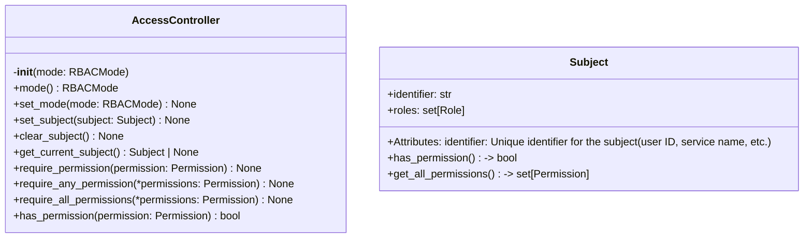

# File: `src/local_deepwiki/security/access_control.py`

## File Overview

This file implements a role-based access control (RBAC) system for the `local-deepwiki` application. It provides the core infrastructure for managing permissions and enforcing access policies across various system operations. The module defines the necessary data types, access control logic, and decorators for securing functions based on user roles and permissions.

The design rationale centers around flexibility in enforcement modes (`DISABLED`, `PERMISSIVE`, `ENFORCED`) and seamless integration with both synchronous and asynchronous function calls. It leverages context variables for thread-safe per-request subject tracking, enabling secure and scalable access control throughout the application.

## Key Concepts

### Role-Based Access Control (RBAC)

The module implements a standard RBAC model using:
- **Roles** (`Role` enum): Predefined roles such as `ADMIN`, `EDITOR`, `VIEWER`, and `GUEST`.
- **Permissions** (`Permission` enum): Granular capabilities like `INDEX_READ`, `QUERY_SEARCH`, etc.
- **Subjects** (`Subject` class): Represent users or services with an identifier and assigned roles.

This structure allows fine-grained control over what actions different types of users can perform.

### RBAC Enforcement Modes

The system supports three enforcement modes:
- `DISABLED`: No access checks are performed.
- `PERMISSIVE`: Access checks are skipped if no subject is authenticated; otherwise, strict checks apply.
- `ENFORCED`: Always requires an authenticated subject and enforces permission checks.

This design enables different deployment scenarios:
- Development environments can disable checks for ease of testing.
- Production deployments can enforce strict access control.

### Decorators for Permission Checking

Functions are secured using decorators:
- `require_permission`: Ensures a single permission.
- `require_any_permission`: Allows access if the subject has any one of the specified permissions.
- `require_all_permissions`: Requires the subject to have all specified permissions.

These decorators automatically detect whether a function is synchronous or asynchronous and wrap it accordingly, ensuring consistent behavior across the codebase.

### Context-Aware Access Control

The `AccessController` uses a `ContextVar` (`_access_controller_var`) to maintain a thread-local instance of itself. This allows access control decisions to be made within the context of a request without needing to pass the controller explicitly through function calls.

## Integration

This module is a core security component that integrates with:
- **Server entrypoints**: The `get_access_controller` function is used by server components to retrieve the global access controller.
- **Test infrastructure**: Functions like `reset_access_controller` and `_rbac_mode_from_env` are used in test files to configure and reset access control states.
- **Repository access**: The `AccessController` is used by repository access logic to validate permissions before allowing operations.
- **CLI and configuration**: The RBAC mode is read from the `DEEPWIKI_RBAC_MODE` environment variable, making it configurable via deployment settings.

The `AccessController` and its associated functions are imported and used throughout the system to enforce access policies in both synchronous and asynchronous contexts.

## Design Notes

### Thread Safety and Context Isolation

Using `ContextVar` for storing the `AccessController` instance ensures that each thread or async task maintains its own access control state. This prevents cross-contamination of subjects between concurrent requests, which is essential in multi-threaded or async environments.

### Asynchronous Support

All permission-checking functions and decorators are designed to support both synchronous and asynchronous functions. This is achieved by:
- Detecting the function type using `asyncio.iscoroutinefunction`.
- Wrapping the function with either an async or sync [wrapper](../handlers/_error_handling.md).

This design choice allows the same access control logic to be applied uniformly across both sync and async code paths.

### Environment-Based Configuration

The RBAC mode is read from the `DEEPWIKI_RBAC_MODE` environment variable. This supports flexible deployment strategies:
- Development: Set to `disabled` for rapid prototyping.
- Staging/Production: Set to `enforced` for strict access control.

Fallback to `PERMISSIVE` ensures backward compatibility and graceful degradation if an invalid value is provided.

### Error Handling

The module defines two custom exceptions:
- `AccessDeniedException`: Raised when a subject lacks required permissions.
- `AuthenticationException`: Raised when no subject is authenticated in `ENFORCED` mode or when a subject is invalid.

These exceptions provide clear, actionable feedback for access control failures, aiding in debugging and secure error responses.

### Flexible Permission Checks

The `AccessController` provides three methods for checking permissions:
- `require_permission`: For single permission checks.
- `require_any_permission`: For allowing access with any one of several permissions.
- `require_all_permissions`: For requiring all specified permissions.

This flexibility allows fine-grained control over access policies for different operations, such as allowing editors to perform certain actions or requiring admin privileges for system-level tasks.

### Extensibility

The design is extensible:
- New roles can be added to the `Role` enum.
- New permissions can be added to the `Permission` enum.
- Additional enforcement modes can be introduced by extending `RBACMode`.

This makes the system adaptable to evolving security requirements without requiring major refactoring.

## API Reference

### class `RBACMode`

**Inherits from:** `StrEnum`

RBAC enforcement modes.


<details>
<summary>View Source (lines 21-26) | <a href="https://github.com/UrbanDiver/local-deepwiki-mcp/blob/main/src/local_deepwiki/security/access_control.py#L21-L26">GitHub</a></summary>

```python
class RBACMode(StrEnum):
    """RBAC enforcement modes."""

    DISABLED = "disabled"  # No permission checks
    PERMISSIVE = "permissive"  # Check if subject set, allow if not (default)
    ENFORCED = "enforced"  # Always require authenticated subject
```

</details>

### class `Permission`

**Inherits from:** `StrEnum`

Available permissions in the system.


<details>
<summary>View Source (lines 29-50) | <a href="https://github.com/UrbanDiver/local-deepwiki-mcp/blob/main/src/local_deepwiki/security/access_control.py#L29-L50">GitHub</a></summary>

```python
class Permission(StrEnum):
    """Available permissions in the system."""

    # Index management
    INDEX_READ = "index:read"
    INDEX_WRITE = "index:write"
    INDEX_DELETE = "index:delete"

    # Configuration
    CONFIG_READ = "config:read"
    CONFIG_WRITE = "config:write"

    # Query operations
    QUERY_SEARCH = "query:search"
    QUERY_DEEP_RESEARCH = "query:deep_research"

    # Export operations
    EXPORT_HTML = "export:html"
    EXPORT_PDF = "export:pdf"

    # System operations
    SYSTEM_ADMIN = "system:admin"
```

</details>

### class `Role`

**Inherits from:** `StrEnum`

Predefined roles in the system.


<details>
<summary>View Source (lines 53-59) | <a href="https://github.com/UrbanDiver/local-deepwiki-mcp/blob/main/src/local_deepwiki/security/access_control.py#L53-L59">GitHub</a></summary>

```python
class Role(StrEnum):
    """Predefined roles in the system."""

    ADMIN = "admin"
    EDITOR = "editor"
    VIEWER = "viewer"
    GUEST = "guest"
```

</details>

### class `AccessDeniedException`

**Inherits from:** `Exception`

Raised when access is denied due to insufficient permissions.


<details>
<summary>View Source (lines 97-100) | <a href="https://github.com/UrbanDiver/local-deepwiki-mcp/blob/main/src/local_deepwiki/security/access_control.py#L97-L100">GitHub</a></summary>

```python
class AccessDeniedException(Exception):
    """Raised when access is denied due to insufficient permissions."""

    pass
```

</details>

### class `AuthenticationException`

**Inherits from:** `Exception`

Raised when authentication fails.


<details>
<summary>View Source (lines 103-106) | <a href="https://github.com/UrbanDiver/local-deepwiki-mcp/blob/main/src/local_deepwiki/security/access_control.py#L103-L106">GitHub</a></summary>

```python
class AuthenticationException(Exception):
    """Raised when authentication fails."""

    pass
```

</details>

### class `Subject`

Represents a user or service making a request.  Attributes: identifier: Unique identifier for the subject (user ID, service name, etc.) roles: Set of roles assigned to the subject.

**Methods:**


<details>
<summary>View Source (lines 110-140) | <a href="https://github.com/UrbanDiver/local-deepwiki-mcp/blob/main/src/local_deepwiki/security/access_control.py#L110-L140">GitHub</a></summary>

```python
class Subject:
    """Represents a user or service making a request.

    Attributes:
        identifier: Unique identifier for the subject (user ID, service name, etc.)
        roles: Set of roles assigned to the subject.
    """

    identifier: str
    roles: set[Role]

    def has_permission(self, permission: Permission) -> bool:
        """Check if this subject has the required permission.

        Args:
            permission: The permission to check.

        Returns:
            True if the subject has the permission through any of its roles.
        """
        return any(
            permission in ROLE_PERMISSIONS.get(role, set()) for role in self.roles
        )

    def get_all_permissions(self) -> set[Permission]:
        """Get all permissions for this subject.

        Returns:
            Set of all permissions granted through assigned roles.
        """
        return {p for role in self.roles for p in ROLE_PERMISSIONS.get(role, set())}
```

</details>

#### `has_permission`

```python
def has_permission(permission: Permission) -> bool
```

Check if this subject has the required permission.


| Parameter | Type | Default | Description |
|-----------|------|---------|-------------|
| `permission` | `Permission` | - | The permission to check. |


<details>
<summary>View Source (lines 110-140) | <a href="https://github.com/UrbanDiver/local-deepwiki-mcp/blob/main/src/local_deepwiki/security/access_control.py#L110-L140">GitHub</a></summary>

```python
class Subject:
    """Represents a user or service making a request.

    Attributes:
        identifier: Unique identifier for the subject (user ID, service name, etc.)
        roles: Set of roles assigned to the subject.
    """

    identifier: str
    roles: set[Role]

    def has_permission(self, permission: Permission) -> bool:
        """Check if this subject has the required permission.

        Args:
            permission: The permission to check.

        Returns:
            True if the subject has the permission through any of its roles.
        """
        return any(
            permission in ROLE_PERMISSIONS.get(role, set()) for role in self.roles
        )

    def get_all_permissions(self) -> set[Permission]:
        """Get all permissions for this subject.

        Returns:
            Set of all permissions granted through assigned roles.
        """
        return {p for role in self.roles for p in ROLE_PERMISSIONS.get(role, set())}
```

</details>

#### `get_all_permissions`

```python
def get_all_permissions() -> set[Permission]
```

Get all permissions for this subject.


<details>
<summary>View Source (lines 110-140) | <a href="https://github.com/UrbanDiver/local-deepwiki-mcp/blob/main/src/local_deepwiki/security/access_control.py#L110-L140">GitHub</a></summary>

```python
class Subject:
    """Represents a user or service making a request.

    Attributes:
        identifier: Unique identifier for the subject (user ID, service name, etc.)
        roles: Set of roles assigned to the subject.
    """

    identifier: str
    roles: set[Role]

    def has_permission(self, permission: Permission) -> bool:
        """Check if this subject has the required permission.

        Args:
            permission: The permission to check.

        Returns:
            True if the subject has the permission through any of its roles.
        """
        return any(
            permission in ROLE_PERMISSIONS.get(role, set()) for role in self.roles
        )

    def get_all_permissions(self) -> set[Permission]:
        """Get all permissions for this subject.

        Returns:
            Set of all permissions granted through assigned roles.
        """
        return {p for role in self.roles for p in ROLE_PERMISSIONS.get(role, set())}
```

</details>

### class `AccessController`

Manages access control and authorization.  This class provides centralized access control for the system, allowing permission checks and enforcement of access policies.  The controller supports three RBAC modes: - DISABLED: No permission checks are performed - PERMISSIVE: Checks only if a subject is set, allows if not (default) - ENFORCED: Always requires an authenticated subject

**Methods:**


<details>
<summary>View Source (lines 143-319) | <a href="https://github.com/UrbanDiver/local-deepwiki-mcp/blob/main/src/local_deepwiki/security/access_control.py#L143-L319">GitHub</a></summary>

```python
class AccessController:
    # Methods: __init__, mode, set_mode, set_subject, clear_subject, get_current_subject, require_permission, require_any_permission, require_all_permissions, has_permission
```

</details>

#### `__init__`

```python
def __init__(mode: RBACMode = RBACMode.PERMISSIVE)
```

Initialize the access controller.


| Parameter | Type | Default | Description |
|-----------|------|---------|-------------|
| `mode` | `RBACMode` | `RBACMode.PERMISSIVE` | The RBAC enforcement mode. Defaults to PERMISSIVE. |


<details>
<summary>View Source (lines 155-162) | <a href="https://github.com/UrbanDiver/local-deepwiki-mcp/blob/main/src/local_deepwiki/security/access_control.py#L155-L162">GitHub</a></summary>

```python
def __init__(self, mode: RBACMode = RBACMode.PERMISSIVE):
        """Initialize the access controller.

        Args:
            mode: The RBAC enforcement mode. Defaults to PERMISSIVE.
        """
        self._current_subject: Subject | None = None
        self._mode = mode
```

</details>

#### `mode`

```python
def mode() -> RBACMode
```

Get the current RBAC mode.


<details>
<summary>View Source (lines 165-167) | <a href="https://github.com/UrbanDiver/local-deepwiki-mcp/blob/main/src/local_deepwiki/security/access_control.py#L165-L167">GitHub</a></summary>

```python
def mode(self) -> RBACMode:
        """Get the current RBAC mode."""
        return self._mode
```

</details>

#### `set_mode`

```python
def set_mode(mode: RBACMode) -> None
```

Set the RBAC enforcement mode.


| Parameter | Type | Default | Description |
|-----------|------|---------|-------------|
| `mode` | `RBACMode` | - | The new RBAC mode. |


<details>
<summary>View Source (lines 169-175) | <a href="https://github.com/UrbanDiver/local-deepwiki-mcp/blob/main/src/local_deepwiki/security/access_control.py#L169-L175">GitHub</a></summary>

```python
def set_mode(self, mode: RBACMode) -> None:
        """Set the RBAC enforcement mode.

        Args:
            mode: The new RBAC mode.
        """
        self._mode = mode
```

</details>

#### `set_subject`

```python
def set_subject(subject: Subject) -> None
```

Set the current subject for access checks.


| Parameter | Type | Default | Description |
|-----------|------|---------|-------------|
| `subject` | `Subject` | - | The subject making the request. |


<details>
<summary>View Source (lines 177-189) | <a href="https://github.com/UrbanDiver/local-deepwiki-mcp/blob/main/src/local_deepwiki/security/access_control.py#L177-L189">GitHub</a></summary>

```python
def set_subject(self, subject: Subject) -> None:
        """Set the current subject for access checks.

        Args:
            subject: The subject making the request.
        """
        if not subject or not subject.identifier:
            raise AuthenticationException("Invalid subject: identifier is required")
        if not subject.roles:
            raise AuthenticationException(
                "Invalid subject: at least one role is required"
            )
        self._current_subject = subject
```

</details>

#### `clear_subject`

```python
def clear_subject() -> None
```

Clear the current subject.


<details>
<summary>View Source (lines 191-193) | <a href="https://github.com/UrbanDiver/local-deepwiki-mcp/blob/main/src/local_deepwiki/security/access_control.py#L191-L193">GitHub</a></summary>

```python
def clear_subject(self) -> None:
        """Clear the current subject."""
        self._current_subject = None
```

</details>

#### `get_current_subject`

```python
def get_current_subject() -> Subject | None
```

Get the currently authenticated subject.


<details>
<summary>View Source (lines 195-201) | <a href="https://github.com/UrbanDiver/local-deepwiki-mcp/blob/main/src/local_deepwiki/security/access_control.py#L195-L201">GitHub</a></summary>

```python
def get_current_subject(self) -> Subject | None:
        """Get the currently authenticated subject.

        Returns:
            The current subject, or None if no subject is set.
        """
        return self._current_subject
```

</details>

#### `require_permission`

```python
def require_permission(permission: Permission) -> None
```

Check that the current subject has the required permission.  The behavior depends on the current RBAC mode: - DISABLED: Skip all checks - PERMISSIVE: Check only if subject is set, allow if not - ENFORCED: Always require an authenticated subject


| Parameter | Type | Default | Description |
|-----------|------|---------|-------------|
| `permission` | `Permission` | - | The required permission. |


<details>
<summary>View Source (lines 203-234) | <a href="https://github.com/UrbanDiver/local-deepwiki-mcp/blob/main/src/local_deepwiki/security/access_control.py#L203-L234">GitHub</a></summary>

```python
def require_permission(self, permission: Permission) -> None:
        """Check that the current subject has the required permission.

        The behavior depends on the current RBAC mode:
        - DISABLED: Skip all checks
        - PERMISSIVE: Check only if subject is set, allow if not
        - ENFORCED: Always require an authenticated subject

        Args:
            permission: The required permission.

        Raises:
            AuthenticationException: If no subject is authenticated (ENFORCED mode
                or when subject is set in PERMISSIVE mode).
            AccessDeniedException: If the subject lacks the required permission.
        """
        # If disabled, skip all checks
        if self._mode == RBACMode.DISABLED:
            return

        # If permissive and no subject, allow
        if self._mode == RBACMode.PERMISSIVE and not self._current_subject:
            return

        # Enforced mode or subject is set - do the check
        if not self._current_subject:
            raise AuthenticationException("No subject authenticated")

        if not self._current_subject.has_permission(permission):
            raise AccessDeniedException(
                f"Subject '{self._current_subject.identifier}' lacks permission: {permission}"
            )
```

</details>

#### `require_any_permission`

```python
def require_any_permission() -> None
```

Check that the current subject has any of the required permissions.  The behavior depends on the current RBAC mode: - DISABLED: Skip all checks - PERMISSIVE: Check only if subject is set, allow if not - ENFORCED: Always require an authenticated subject


<details>
<summary>View Source (lines 236-271) | <a href="https://github.com/UrbanDiver/local-deepwiki-mcp/blob/main/src/local_deepwiki/security/access_control.py#L236-L271">GitHub</a></summary>

```python
def require_any_permission(self, *permissions: Permission) -> None:
        """Check that the current subject has any of the required permissions.

        The behavior depends on the current RBAC mode:
        - DISABLED: Skip all checks
        - PERMISSIVE: Check only if subject is set, allow if not
        - ENFORCED: Always require an authenticated subject

        Args:
            *permissions: One or more permissions, any of which will satisfy the check.

        Raises:
            AuthenticationException: If no subject is authenticated (ENFORCED mode
                or when subject is set in PERMISSIVE mode).
            AccessDeniedException: If the subject lacks all specified permissions.
        """
        # If disabled, skip all checks
        if self._mode == RBACMode.DISABLED:
            return

        # If permissive and no subject, allow
        if self._mode == RBACMode.PERMISSIVE and not self._current_subject:
            return

        # Enforced mode or subject is set - do the check
        if not self._current_subject:
            raise AuthenticationException("No subject authenticated")

        for permission in permissions:
            if self._current_subject.has_permission(permission):
                return

        permission_list = ", ".join(str(p) for p in permissions)
        raise AccessDeniedException(
            f"Subject '{self._current_subject.identifier}' lacks any of: {permission_list}"
        )
```

</details>

#### `require_all_permissions`

```python
def require_all_permissions() -> None
```

Check that the current subject has all required permissions.  The behavior depends on the current RBAC mode: - DISABLED: Skip all checks - PERMISSIVE: Check only if subject is set, allow if not - ENFORCED: Always require an authenticated subject


<details>
<summary>View Source (lines 273-305) | <a href="https://github.com/UrbanDiver/local-deepwiki-mcp/blob/main/src/local_deepwiki/security/access_control.py#L273-L305">GitHub</a></summary>

```python
def require_all_permissions(self, *permissions: Permission) -> None:
        """Check that the current subject has all required permissions.

        The behavior depends on the current RBAC mode:
        - DISABLED: Skip all checks
        - PERMISSIVE: Check only if subject is set, allow if not
        - ENFORCED: Always require an authenticated subject

        Args:
            *permissions: Permissions that are all required.

        Raises:
            AuthenticationException: If no subject is authenticated (ENFORCED mode
                or when subject is set in PERMISSIVE mode).
            AccessDeniedException: If the subject lacks any required permission.
        """
        # If disabled, skip all checks
        if self._mode == RBACMode.DISABLED:
            return

        # If permissive and no subject, allow
        if self._mode == RBACMode.PERMISSIVE and not self._current_subject:
            return

        # Enforced mode or subject is set - do the check
        if not self._current_subject:
            raise AuthenticationException("No subject authenticated")

        for permission in permissions:
            if not self._current_subject.has_permission(permission):
                raise AccessDeniedException(
                    f"Subject '{self._current_subject.identifier}' lacks permission: {permission}"
                )
```

</details>

#### `has_permission`

```python
def has_permission(permission: Permission) -> bool
```

Check if the current subject has the required permission.


| Parameter | Type | Default | Description |
|-----------|------|---------|-------------|
| `permission` | `Permission` | - | The permission to check. |


---


<details>
<summary>View Source (lines 307-319) | <a href="https://github.com/UrbanDiver/local-deepwiki-mcp/blob/main/src/local_deepwiki/security/access_control.py#L307-L319">GitHub</a></summary>

```python
def has_permission(self, permission: Permission) -> bool:
        """Check if the current subject has the required permission.

        Args:
            permission: The permission to check.

        Returns:
            True if the current subject has the permission, False otherwise.
            Returns False if no subject is authenticated.
        """
        if not self._current_subject:
            return False
        return self._current_subject.has_permission(permission)
```

</details>

### Functions

#### `get_access_controller`

```python
def get_access_controller() -> AccessController
```

Get the global access controller instance.  The RBAC mode is read from the ``DEEPWIKI_RBAC_MODE`` environment variable on first access.  Set it to ``enforced`` to require authenticated subjects for every request.

**Returns:** `AccessController`


<details>
<summary>View Source (lines 347-361) | <a href="https://github.com/UrbanDiver/local-deepwiki-mcp/blob/main/src/local_deepwiki/security/access_control.py#L347-L361">GitHub</a></summary>

```python
def get_access_controller() -> AccessController:
    """Get the global access controller instance.

    The RBAC mode is read from the ``DEEPWIKI_RBAC_MODE`` environment
    variable on first access.  Set it to ``enforced`` to require
    authenticated subjects for every request.

    Returns:
        The global AccessController instance.
    """
    val = _access_controller_var.get()
    if val is None:
        val = AccessController(mode=_rbac_mode_from_env())
        _access_controller_var.set(val)
    return val
```

</details>

#### `reset_access_controller`

```python
def reset_access_controller() -> None
```

Reset the global access controller (for testing only).  This clears the global instance, allowing a fresh controller to be created on the next call to get_access_controller().

**Returns:** `None`


<details>
<summary>View Source (lines 364-370) | <a href="https://github.com/UrbanDiver/local-deepwiki-mcp/blob/main/src/local_deepwiki/security/access_control.py#L364-L370">GitHub</a></summary>

```python
def reset_access_controller() -> None:
    """Reset the global access controller (for testing only).

    This clears the global instance, allowing a fresh controller
    to be created on the next call to get_access_controller().
    """
    _access_controller_var.set(None)
```

</details>

#### `require_permission`

```python
def require_permission(permission: Permission) -> Callable[[F], F]
```

Decorator to require a specific permission for a function.  Supports both sync and async functions.


| Parameter | Type | Default | Description |
|-----------|------|---------|-------------|
| `permission` | `Permission` | - | The required permission. |

**Returns:** `Callable[[F], F]`


<details>
<summary>View Source (lines 203-234) | <a href="https://github.com/UrbanDiver/local-deepwiki-mcp/blob/main/src/local_deepwiki/security/access_control.py#L203-L234">GitHub</a></summary>

```python
def require_permission(self, permission: Permission) -> None:
        """Check that the current subject has the required permission.

        The behavior depends on the current RBAC mode:
        - DISABLED: Skip all checks
        - PERMISSIVE: Check only if subject is set, allow if not
        - ENFORCED: Always require an authenticated subject

        Args:
            permission: The required permission.

        Raises:
            AuthenticationException: If no subject is authenticated (ENFORCED mode
                or when subject is set in PERMISSIVE mode).
            AccessDeniedException: If the subject lacks the required permission.
        """
        # If disabled, skip all checks
        if self._mode == RBACMode.DISABLED:
            return

        # If permissive and no subject, allow
        if self._mode == RBACMode.PERMISSIVE and not self._current_subject:
            return

        # Enforced mode or subject is set - do the check
        if not self._current_subject:
            raise AuthenticationException("No subject authenticated")

        if not self._current_subject.has_permission(permission):
            raise AccessDeniedException(
                f"Subject '{self._current_subject.identifier}' lacks permission: {permission}"
            )
```

</details>

#### `decorator`

```python
def decorator(func: F) -> F
```


| Parameter | Type | Default | Description |
|-----------|------|---------|-------------|
| `func` | `F` | - | - |

**Returns:** `F`


<details>
<summary>View Source (lines 467-485) | <a href="https://github.com/UrbanDiver/local-deepwiki-mcp/blob/main/src/local_deepwiki/security/access_control.py#L467-L485">GitHub</a></summary>

```python
def decorator(func: F) -> F:
        if asyncio.iscoroutinefunction(func):

            @wraps(func)
            async def async_wrapper(*args: Any, **kwargs: Any) -> Any:
                controller = get_access_controller()
                controller.require_all_permissions(*permissions)
                return await func(*args, **kwargs)

            return async_wrapper  # type: ignore[return-value]
        else:

            @wraps(func)
            def sync_wrapper(*args: Any, **kwargs: Any) -> Any:
                controller = get_access_controller()
                controller.require_all_permissions(*permissions)
                return func(*args, **kwargs)

            return sync_wrapper  # type: ignore[return-value]
```

</details>

#### `async_wrapper`

`@wraps(func)`

```python
async def async_wrapper() -> Any
```

**Returns:** `Any`


<details>
<summary>View Source (lines 471-474) | <a href="https://github.com/UrbanDiver/local-deepwiki-mcp/blob/main/src/local_deepwiki/security/access_control.py#L471-L474">GitHub</a></summary>

```python
async def async_wrapper(*args: Any, **kwargs: Any) -> Any:
                controller = get_access_controller()
                controller.require_all_permissions(*permissions)
                return await func(*args, **kwargs)
```

</details>

#### `sync_wrapper`

`@wraps(func)`

```python
def sync_wrapper() -> Any
```

**Returns:** `Any`


<details>
<summary>View Source (lines 480-483) | <a href="https://github.com/UrbanDiver/local-deepwiki-mcp/blob/main/src/local_deepwiki/security/access_control.py#L480-L483">GitHub</a></summary>

```python
def sync_wrapper(*args: Any, **kwargs: Any) -> Any:
                controller = get_access_controller()
                controller.require_all_permissions(*permissions)
                return func(*args, **kwargs)
```

</details>

#### `require_any_permission`

```python
def require_any_permission() -> Callable[[F], F]
```

Decorator to require any of the specified permissions.  Supports both sync and async functions.

**Returns:** `Callable[[F], F]`


<details>
<summary>View Source (lines 236-271) | <a href="https://github.com/UrbanDiver/local-deepwiki-mcp/blob/main/src/local_deepwiki/security/access_control.py#L236-L271">GitHub</a></summary>

```python
def require_any_permission(self, *permissions: Permission) -> None:
        """Check that the current subject has any of the required permissions.

        The behavior depends on the current RBAC mode:
        - DISABLED: Skip all checks
        - PERMISSIVE: Check only if subject is set, allow if not
        - ENFORCED: Always require an authenticated subject

        Args:
            *permissions: One or more permissions, any of which will satisfy the check.

        Raises:
            AuthenticationException: If no subject is authenticated (ENFORCED mode
                or when subject is set in PERMISSIVE mode).
            AccessDeniedException: If the subject lacks all specified permissions.
        """
        # If disabled, skip all checks
        if self._mode == RBACMode.DISABLED:
            return

        # If permissive and no subject, allow
        if self._mode == RBACMode.PERMISSIVE and not self._current_subject:
            return

        # Enforced mode or subject is set - do the check
        if not self._current_subject:
            raise AuthenticationException("No subject authenticated")

        for permission in permissions:
            if self._current_subject.has_permission(permission):
                return

        permission_list = ", ".join(str(p) for p in permissions)
        raise AccessDeniedException(
            f"Subject '{self._current_subject.identifier}' lacks any of: {permission_list}"
        )
```

</details>

#### `decorator`

```python
def decorator(func: F) -> F
```


| Parameter | Type | Default | Description |
|-----------|------|---------|-------------|
| `func` | `F` | - | - |

**Returns:** `F`


<details>
<summary>View Source (lines 467-485) | <a href="https://github.com/UrbanDiver/local-deepwiki-mcp/blob/main/src/local_deepwiki/security/access_control.py#L467-L485">GitHub</a></summary>

```python
def decorator(func: F) -> F:
        if asyncio.iscoroutinefunction(func):

            @wraps(func)
            async def async_wrapper(*args: Any, **kwargs: Any) -> Any:
                controller = get_access_controller()
                controller.require_all_permissions(*permissions)
                return await func(*args, **kwargs)

            return async_wrapper  # type: ignore[return-value]
        else:

            @wraps(func)
            def sync_wrapper(*args: Any, **kwargs: Any) -> Any:
                controller = get_access_controller()
                controller.require_all_permissions(*permissions)
                return func(*args, **kwargs)

            return sync_wrapper  # type: ignore[return-value]
```

</details>

#### `async_wrapper`

`@wraps(func)`

```python
async def async_wrapper() -> Any
```

**Returns:** `Any`


<details>
<summary>View Source (lines 471-474) | <a href="https://github.com/UrbanDiver/local-deepwiki-mcp/blob/main/src/local_deepwiki/security/access_control.py#L471-L474">GitHub</a></summary>

```python
async def async_wrapper(*args: Any, **kwargs: Any) -> Any:
                controller = get_access_controller()
                controller.require_all_permissions(*permissions)
                return await func(*args, **kwargs)
```

</details>

#### `sync_wrapper`

`@wraps(func)`

```python
def sync_wrapper() -> Any
```

**Returns:** `Any`


<details>
<summary>View Source (lines 480-483) | <a href="https://github.com/UrbanDiver/local-deepwiki-mcp/blob/main/src/local_deepwiki/security/access_control.py#L480-L483">GitHub</a></summary>

```python
def sync_wrapper(*args: Any, **kwargs: Any) -> Any:
                controller = get_access_controller()
                controller.require_all_permissions(*permissions)
                return func(*args, **kwargs)
```

</details>

#### `require_all_permissions`

```python
def require_all_permissions() -> Callable[[F], F]
```

Decorator to require all of the specified permissions.  Supports both sync and async functions.

**Returns:** `Callable[[F], F]`


<details>
<summary>View Source (lines 273-305) | <a href="https://github.com/UrbanDiver/local-deepwiki-mcp/blob/main/src/local_deepwiki/security/access_control.py#L273-L305">GitHub</a></summary>

```python
def require_all_permissions(self, *permissions: Permission) -> None:
        """Check that the current subject has all required permissions.

        The behavior depends on the current RBAC mode:
        - DISABLED: Skip all checks
        - PERMISSIVE: Check only if subject is set, allow if not
        - ENFORCED: Always require an authenticated subject

        Args:
            *permissions: Permissions that are all required.

        Raises:
            AuthenticationException: If no subject is authenticated (ENFORCED mode
                or when subject is set in PERMISSIVE mode).
            AccessDeniedException: If the subject lacks any required permission.
        """
        # If disabled, skip all checks
        if self._mode == RBACMode.DISABLED:
            return

        # If permissive and no subject, allow
        if self._mode == RBACMode.PERMISSIVE and not self._current_subject:
            return

        # Enforced mode or subject is set - do the check
        if not self._current_subject:
            raise AuthenticationException("No subject authenticated")

        for permission in permissions:
            if not self._current_subject.has_permission(permission):
                raise AccessDeniedException(
                    f"Subject '{self._current_subject.identifier}' lacks permission: {permission}"
                )
```

</details>

#### `decorator`

```python
def decorator(func: F) -> F
```


| Parameter | Type | Default | Description |
|-----------|------|---------|-------------|
| `func` | `F` | - | - |

**Returns:** `F`


<details>
<summary>View Source (lines 467-485) | <a href="https://github.com/UrbanDiver/local-deepwiki-mcp/blob/main/src/local_deepwiki/security/access_control.py#L467-L485">GitHub</a></summary>

```python
def decorator(func: F) -> F:
        if asyncio.iscoroutinefunction(func):

            @wraps(func)
            async def async_wrapper(*args: Any, **kwargs: Any) -> Any:
                controller = get_access_controller()
                controller.require_all_permissions(*permissions)
                return await func(*args, **kwargs)

            return async_wrapper  # type: ignore[return-value]
        else:

            @wraps(func)
            def sync_wrapper(*args: Any, **kwargs: Any) -> Any:
                controller = get_access_controller()
                controller.require_all_permissions(*permissions)
                return func(*args, **kwargs)

            return sync_wrapper  # type: ignore[return-value]
```

</details>

#### `async_wrapper`

`@wraps(func)`

```python
async def async_wrapper() -> Any
```

**Returns:** `Any`


<details>
<summary>View Source (lines 471-474) | <a href="https://github.com/UrbanDiver/local-deepwiki-mcp/blob/main/src/local_deepwiki/security/access_control.py#L471-L474">GitHub</a></summary>

```python
async def async_wrapper(*args: Any, **kwargs: Any) -> Any:
                controller = get_access_controller()
                controller.require_all_permissions(*permissions)
                return await func(*args, **kwargs)
```

</details>

#### `sync_wrapper`

`@wraps(func)`

```python
def sync_wrapper() -> Any
```

**Returns:** `Any`


<details>
<summary>View Source (lines 480-483) | <a href="https://github.com/UrbanDiver/local-deepwiki-mcp/blob/main/src/local_deepwiki/security/access_control.py#L480-L483">GitHub</a></summary>

```python
def sync_wrapper(*args: Any, **kwargs: Any) -> Any:
                controller = get_access_controller()
                controller.require_all_permissions(*permissions)
                return func(*args, **kwargs)
```

</details>

## Class Diagram



## Call Graph

```mermaid
flowchart TD
    N0[AccessController]
    N1[AccessController.has_permis...]
    N2[AccessController.require_al...]
    N3[AccessController.require_an...]
    N4[AccessController.require_pe...]
    N5[AccessController.set_subject]
    N6[AccessDeniedException]
    N7[AuthenticationException]
    N8[_rbac_mode_from_env]
    N9[async_wrapper]
    N10[decorator]
    N11[func]
    N12[get_access_controller]
    N13[has_permission]
    N14[iscoroutinefunction]
    N15[require_all_permissions]
    N16[require_any_permission]
    N17[require_permission]
    N18[sync_wrapper]
    N19[wraps]
    N12 --> N0
    N12 --> N8
    N17 --> N14
    N17 --> N19
    N17 --> N12
    N17 --> N17
    N17 --> N11
    N10 --> N14
    N10 --> N19
    N10 --> N12
    N10 --> N15
    N10 --> N11
    N9 --> N12
    N9 --> N15
    N9 --> N11
    N18 --> N12
    N18 --> N15
    N18 --> N11
    N16 --> N14
    N16 --> N19
    N16 --> N12
    N16 --> N16
    N16 --> N11
    N15 --> N14
    N15 --> N19
    N15 --> N12
    N15 --> N15
    N15 --> N11
    N5 --> N7
    N4 --> N7
    N4 --> N13
    N4 --> N6
    N3 --> N7
    N3 --> N13
    N3 --> N6
    N2 --> N7
    N2 --> N13
    N2 --> N6
    N1 --> N13
    classDef func fill:#e1f5fe
    class N0,N6,N7,N8,N9,N10,N11,N12,N13,N14,N15,N16,N17,N18,N19 func
    classDef method fill:#fff3e0
    class N1,N2,N3,N4,N5 method
```



## Used By

Functions and methods in this file and their callers:

- **`AccessController`**: called by `get_access_controller`
- **`AccessDeniedException`**: called by `AccessController.require_all_permissions`, `AccessController.require_any_permission`, `AccessController.require_permission`
- **`AuthenticationException`**: called by `AccessController.require_all_permissions`, `AccessController.require_any_permission`, `AccessController.require_permission`, `AccessController.set_subject`
- **`_rbac_mode_from_env`**: called by `get_access_controller`
- **`func`**: called by `async_wrapper`, `decorator`, `require_all_permissions`, `require_any_permission`, `require_permission`, `sync_wrapper`
- **`get_access_controller`**: called by `async_wrapper`, `decorator`, `require_all_permissions`, `require_any_permission`, `require_permission`, `sync_wrapper`
- **`has_permission`**: called by `AccessController.has_permission`, `AccessController.require_all_permissions`, `AccessController.require_any_permission`, `AccessController.require_permission`
- **`iscoroutinefunction`**: called by `decorator`, `require_all_permissions`, `require_any_permission`, `require_permission`
- **`require_all_permissions`**: called by `async_wrapper`, `decorator`, `require_all_permissions`, `sync_wrapper`
- **`require_any_permission`**: called by `require_any_permission`
- **`require_permission`**: called by `require_permission`
- **`wraps`**: called by `decorator`, `require_all_permissions`, `require_any_permission`, `require_permission`

## Usage Examples

*Examples extracted from test files*

### Verify all expected permission values are defined

From `test_access_control.py::TestPermissionEnum::test_all_permission_values_exist`:

```python
expected_permissions = [
    "INDEX_READ",
    "INDEX_WRITE",
    "INDEX_DELETE",
    "CONFIG_READ",
    "CONFIG_WRITE",
    "QUERY_SEARCH",
    "QUERY_DEEP_RESEARCH",
    "EXPORT_HTML",
    "EXPORT_PDF",
    "SYSTEM_ADMIN",
]
for perm_name in expected_permissions:
    assert hasattr(Permission, perm_name), (
        f"Permission.{perm_name} should exist"
    )
```

### Verify permission string values are formatted correctly

From `test_access_control.py::TestPermissionEnum::test_permission_string_representation`:

```python
assert Permission.INDEX_READ == "index:read"
assert Permission.INDEX_WRITE == "index:write"
assert Permission.INDEX_DELETE == "index:delete"
assert Permission.CONFIG_READ == "config:read"
assert Permission.CONFIG_WRITE == "config:write"
assert Permission.QUERY_SEARCH == "query:search"
assert Permission.QUERY_DEEP_RESEARCH == "query:deep_research"
assert Permission.EXPORT_HTML == "export:html"
assert Permission.EXPORT_PDF == "export:pdf"
assert Permission.SYSTEM_ADMIN == "system:admin"
```

### Verify all expected role values are defined

From `test_access_control.py::TestRoleEnum::test_all_role_values_exist`:

```python
expected_roles = ["ADMIN", "EDITOR", "VIEWER", "GUEST"]
for role_name in expected_roles:
    assert hasattr(Role, role_name), f"Role.{role_name} should exist"
```

### Verify role string values are lowercase

From `test_access_control.py::TestRoleEnum::test_role_string_representation`:

```python
assert Role.ADMIN == "admin"
assert Role.EDITOR == "editor"
assert Role.VIEWER == "viewer"
assert Role.GUEST == "guest"
```

### Verify has_permission works with a single role

From `test_access_control.py::TestSubject::test_has_permission_with_single_role`:

```python
assert admin_subject.has_permission(Permission.SYSTEM_ADMIN)
assert admin_subject.has_permission(Permission.INDEX_READ)
assert admin_subject.has_permission(Permission.INDEX_WRITE)
```


## Last Modified

| Entity | Type | Author | Date | Commit |
|--------|------|--------|------|--------|
| `require_permission` | function | Brian Breidenbach | Feb 23, 2026 | `c6fe2bd` refactor: split oversized m... |
| `decorator` | function | Brian Breidenbach | Feb 23, 2026 | `c6fe2bd` refactor: split oversized m... |
| `async_wrapper` | function | Brian Breidenbach | Feb 23, 2026 | `c6fe2bd` refactor: split oversized m... |
| `sync_wrapper` | function | Brian Breidenbach | Feb 23, 2026 | `c6fe2bd` refactor: split oversized m... |
| `require_any_permission` | function | Brian Breidenbach | Feb 23, 2026 | `c6fe2bd` refactor: split oversized m... |
| `decorator` | function | Brian Breidenbach | Feb 23, 2026 | `c6fe2bd` refactor: split oversized m... |
| `async_wrapper` | function | Brian Breidenbach | Feb 23, 2026 | `c6fe2bd` refactor: split oversized m... |
| `sync_wrapper` | function | Brian Breidenbach | Feb 23, 2026 | `c6fe2bd` refactor: split oversized m... |
| `require_all_permissions` | function | Brian Breidenbach | Feb 23, 2026 | `c6fe2bd` refactor: split oversized m... |
| `decorator` | function | Brian Breidenbach | Feb 23, 2026 | `c6fe2bd` refactor: split oversized m... |
| `async_wrapper` | function | Brian Breidenbach | Feb 23, 2026 | `c6fe2bd` refactor: split oversized m... |
| `sync_wrapper` | function | Brian Breidenbach | Feb 23, 2026 | `c6fe2bd` refactor: split oversized m... |
| `get_access_controller` | function | Brian Breidenbach | Feb 22, 2026 | `78abcdc` refactor: replace global si... |
| `reset_access_controller` | function | Brian Breidenbach | Feb 22, 2026 | `78abcdc` refactor: replace global si... |
| `RBACMode` | class | Brian Breidenbach | Feb 20, 2026 | `b807417` refactor: high-priority Pyt... |
| `Permission` | class | Brian Breidenbach | Feb 20, 2026 | `b807417` refactor: high-priority Pyt... |
| `Role` | class | Brian Breidenbach | Feb 20, 2026 | `b807417` refactor: high-priority Pyt... |
| `Subject` | class | Brian Breidenbach | Feb 20, 2026 | `b807417` refactor: high-priority Pyt... |
| `AccessController` | class | Brian Breidenbach | Feb 11, 2026 | `ba96da1` fix: publication plan P0-P2... |
| `__init__` | method | Brian Breidenbach | Feb 11, 2026 | `ba96da1` fix: publication plan P0-P2... |
| `get_current_subject` | method | Brian Breidenbach | Feb 11, 2026 | `ba96da1` fix: publication plan P0-P2... |
| `_rbac_mode_from_env` | function | Brian Breidenbach | Feb 10, 2026 | `74fe5a3` fix: harden credential vali... |
| `set_subject` | method | Brian Breidenbach | Feb 09, 2026 | `c79a754` fix: improve type safety ac... |
| `mode` | method | Brian Breidenbach | Jan 26, 2026 | `5717c3a` Phase 4: RBAC hardening wit... |
| `set_mode` | method | Brian Breidenbach | Jan 26, 2026 | `5717c3a` Phase 4: RBAC hardening wit... |
| `require_permission` | method | Brian Breidenbach | Jan 26, 2026 | `5717c3a` Phase 4: RBAC hardening wit... |
| `require_any_permission` | method | Brian Breidenbach | Jan 26, 2026 | `5717c3a` Phase 4: RBAC hardening wit... |
| `require_all_permissions` | method | Brian Breidenbach | Jan 26, 2026 | `5717c3a` Phase 4: RBAC hardening wit... |
| `AccessDeniedException` | class | Brian Breidenbach | Jan 26, 2026 | `4eb4353` Phase 2: Implement RBAC, de... |
| `AuthenticationException` | class | Brian Breidenbach | Jan 26, 2026 | `4eb4353` Phase 2: Implement RBAC, de... |
| `clear_subject` | method | Brian Breidenbach | Jan 26, 2026 | `4eb4353` Phase 2: Implement RBAC, de... |
| `has_permission` | method | Brian Breidenbach | Jan 26, 2026 | `4eb4353` Phase 2: Implement RBAC, de... |

## Additional Source Code

Source code for functions and methods not listed in the API Reference above.

#### `_rbac_mode_from_env`

<details>
<summary>View Source (lines 328-344) | <a href="https://github.com/UrbanDiver/local-deepwiki-mcp/blob/main/src/local_deepwiki/security/access_control.py#L328-L344">GitHub</a></summary>

```python
def _rbac_mode_from_env() -> RBACMode:
    """Read RBAC mode from the ``DEEPWIKI_RBAC_MODE`` environment variable.

    Supported values (case-insensitive): ``disabled``, ``permissive``,
    ``enforced``.  Falls back to ``permissive`` when the variable is unset
    or contains an unrecognised value.

    Returns:
        The RBACMode matching the environment variable.
    """
    import os

    raw = os.environ.get("DEEPWIKI_RBAC_MODE", "").strip().lower()
    for mode in RBACMode:
        if mode.value == raw:
            return mode
    return RBACMode.PERMISSIVE
```

</details>


#### `require_permission`

<details>
<summary>View Source (lines 373-409) | <a href="https://github.com/UrbanDiver/local-deepwiki-mcp/blob/main/src/local_deepwiki/security/access_control.py#L373-L409">GitHub</a></summary>

```python
def require_permission(permission: Permission) -> Callable[[F], F]:
    """Decorator to require a specific permission for a function.

    Supports both sync and async functions.

    Args:
        permission: The required permission.

    Returns:
        A decorator function that checks permissions before execution.

    Raises:
        AccessDeniedException: If the current subject lacks the permission.
        AuthenticationException: If no subject is authenticated.
    """

    def decorator(func: F) -> F:
        if asyncio.iscoroutinefunction(func):

            @wraps(func)
            async def async_wrapper(*args: Any, **kwargs: Any) -> Any:
                controller = get_access_controller()
                controller.require_permission(permission)
                return await func(*args, **kwargs)

            return async_wrapper  # type: ignore[return-value]
        else:

            @wraps(func)
            def sync_wrapper(*args: Any, **kwargs: Any) -> Any:
                controller = get_access_controller()
                controller.require_permission(permission)
                return func(*args, **kwargs)

            return sync_wrapper  # type: ignore[return-value]

    return decorator
```

</details>


#### `decorator`

<details>
<summary>View Source (lines 389-407) | <a href="https://github.com/UrbanDiver/local-deepwiki-mcp/blob/main/src/local_deepwiki/security/access_control.py#L389-L407">GitHub</a></summary>

```python
def decorator(func: F) -> F:
        if asyncio.iscoroutinefunction(func):

            @wraps(func)
            async def async_wrapper(*args: Any, **kwargs: Any) -> Any:
                controller = get_access_controller()
                controller.require_permission(permission)
                return await func(*args, **kwargs)

            return async_wrapper  # type: ignore[return-value]
        else:

            @wraps(func)
            def sync_wrapper(*args: Any, **kwargs: Any) -> Any:
                controller = get_access_controller()
                controller.require_permission(permission)
                return func(*args, **kwargs)

            return sync_wrapper  # type: ignore[return-value]
```

</details>


#### `async_wrapper`

<details>
<summary>View Source (lines 393-396) | <a href="https://github.com/UrbanDiver/local-deepwiki-mcp/blob/main/src/local_deepwiki/security/access_control.py#L393-L396">GitHub</a></summary>

```python
async def async_wrapper(*args: Any, **kwargs: Any) -> Any:
                controller = get_access_controller()
                controller.require_permission(permission)
                return await func(*args, **kwargs)
```

</details>


#### `sync_wrapper`

<details>
<summary>View Source (lines 402-405) | <a href="https://github.com/UrbanDiver/local-deepwiki-mcp/blob/main/src/local_deepwiki/security/access_control.py#L402-L405">GitHub</a></summary>

```python
def sync_wrapper(*args: Any, **kwargs: Any) -> Any:
                controller = get_access_controller()
                controller.require_permission(permission)
                return func(*args, **kwargs)
```

</details>


#### `require_any_permission`

<details>
<summary>View Source (lines 412-448) | <a href="https://github.com/UrbanDiver/local-deepwiki-mcp/blob/main/src/local_deepwiki/security/access_control.py#L412-L448">GitHub</a></summary>

```python
def require_any_permission(*permissions: Permission) -> Callable[[F], F]:
    """Decorator to require any of the specified permissions.

    Supports both sync and async functions.

    Args:
        *permissions: One or more permissions, any of which will satisfy the check.

    Returns:
        A decorator function that checks permissions before execution.

    Raises:
        AccessDeniedException: If the current subject lacks all permissions.
        AuthenticationException: If no subject is authenticated.
    """

    def decorator(func: F) -> F:
        if asyncio.iscoroutinefunction(func):

            @wraps(func)
            async def async_wrapper(*args: Any, **kwargs: Any) -> Any:
                controller = get_access_controller()
                controller.require_any_permission(*permissions)
                return await func(*args, **kwargs)

            return async_wrapper  # type: ignore[return-value]
        else:

            @wraps(func)
            def sync_wrapper(*args: Any, **kwargs: Any) -> Any:
                controller = get_access_controller()
                controller.require_any_permission(*permissions)
                return func(*args, **kwargs)

            return sync_wrapper  # type: ignore[return-value]

    return decorator
```

</details>


#### `decorator`

<details>
<summary>View Source (lines 428-446) | <a href="https://github.com/UrbanDiver/local-deepwiki-mcp/blob/main/src/local_deepwiki/security/access_control.py#L428-L446">GitHub</a></summary>

```python
def decorator(func: F) -> F:
        if asyncio.iscoroutinefunction(func):

            @wraps(func)
            async def async_wrapper(*args: Any, **kwargs: Any) -> Any:
                controller = get_access_controller()
                controller.require_any_permission(*permissions)
                return await func(*args, **kwargs)

            return async_wrapper  # type: ignore[return-value]
        else:

            @wraps(func)
            def sync_wrapper(*args: Any, **kwargs: Any) -> Any:
                controller = get_access_controller()
                controller.require_any_permission(*permissions)
                return func(*args, **kwargs)

            return sync_wrapper  # type: ignore[return-value]
```

</details>


#### `async_wrapper`

<details>
<summary>View Source (lines 432-435) | <a href="https://github.com/UrbanDiver/local-deepwiki-mcp/blob/main/src/local_deepwiki/security/access_control.py#L432-L435">GitHub</a></summary>

```python
async def async_wrapper(*args: Any, **kwargs: Any) -> Any:
                controller = get_access_controller()
                controller.require_any_permission(*permissions)
                return await func(*args, **kwargs)
```

</details>


#### `sync_wrapper`

<details>
<summary>View Source (lines 441-444) | <a href="https://github.com/UrbanDiver/local-deepwiki-mcp/blob/main/src/local_deepwiki/security/access_control.py#L441-L444">GitHub</a></summary>

```python
def sync_wrapper(*args: Any, **kwargs: Any) -> Any:
                controller = get_access_controller()
                controller.require_any_permission(*permissions)
                return func(*args, **kwargs)
```

</details>


#### `require_all_permissions`

<details>
<summary>View Source (lines 451-487) | <a href="https://github.com/UrbanDiver/local-deepwiki-mcp/blob/main/src/local_deepwiki/security/access_control.py#L451-L487">GitHub</a></summary>

```python
def require_all_permissions(*permissions: Permission) -> Callable[[F], F]:
    """Decorator to require all of the specified permissions.

    Supports both sync and async functions.

    Args:
        *permissions: Permissions that are all required.

    Returns:
        A decorator function that checks permissions before execution.

    Raises:
        AccessDeniedException: If the current subject lacks any permission.
        AuthenticationException: If no subject is authenticated.
    """

    def decorator(func: F) -> F:
        if asyncio.iscoroutinefunction(func):

            @wraps(func)
            async def async_wrapper(*args: Any, **kwargs: Any) -> Any:
                controller = get_access_controller()
                controller.require_all_permissions(*permissions)
                return await func(*args, **kwargs)

            return async_wrapper  # type: ignore[return-value]
        else:

            @wraps(func)
            def sync_wrapper(*args: Any, **kwargs: Any) -> Any:
                controller = get_access_controller()
                controller.require_all_permissions(*permissions)
                return func(*args, **kwargs)

            return sync_wrapper  # type: ignore[return-value]

    return decorator
```

</details>

## Relevant Source Files

- `src/local_deepwiki/security/access_control.py:21-26`

## See Also

- [cli_progress](../cli_progress.md) - shares 3 dependencies
- [models](../generators/codemap/models.md) - shares 3 dependencies
- [logging](../logging.md) - shares 2 dependencies