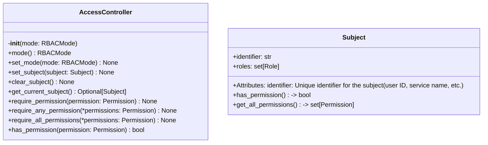

# File Overview

This file implements a role-based access control (RBAC) system for the DeepWiki application. It defines the core components for managing permissions, roles, and subjects, as well as the access control logic that enforces these rules.

The system supports different enforcement modes (disabled, permissive, enforced) and provides decorators and direct methods to check permissions. It integrates with asynchronous and synchronous code paths using `asyncio` and `threading`.

## Classes

### RBACMode

An enumeration defining the enforcement modes for RBAC:

- `DISABLED`: No permission checks are performed.
- `PERMISSIVE`: Checks if a subject is set; allows access if not. This is the default mode.
- `ENFORCED`: Always requires an authenticated subject.

### Permission

An enumeration of available permissions in the system, grouped by functionality:

- **Index management**: `INDEX_READ`, `INDEX_WRITE`, `INDEX_DELETE`
- **Configuration**: `CONFIG_READ`, `CONFIG_WRITE`
- **Query operations**: `QUERY_SEARCH`, `QUERY_DEEP_RESEARCH`
- **Export operations**: `EXPORT_HTML`, `EXPORT_PDF`
- **System operations**: `SYSTEM_ADMIN`

### Role

An enumeration of predefined roles in the system:

- `ADMIN`
- `EDITOR`
- `VIEWER`
- `GUEST`

### AccessDeniedException

Raised when access is denied due to insufficient permissions.

### AuthenticationException

Raised when authentication fails, such as when a subject lacks an identifier or roles.

### Subject

Represents a user or service making a request.

**Attributes**:
- `identifier`: Unique identifier for the subject (user ID, service name, etc.)
- `roles`: Set of roles assigned to the subject.

**Methods**:
- `has_permission(permission: Permission) -> bool`: Checks if this subject has the required permission through any of its roles.

### AccessController

Manages the current subject and enforces access control rules based on the configured mode.

**Methods**:
- `__init__(mode: RBACMode = RBACMode.PERMISSIVE)`: Initializes the access controller with a specified mode.
- `mode() -> RBACMode`: Gets the current RBAC mode.
- `set_mode(mode: RBACMode) -> None`: Sets the RBAC enforcement mode.
- `set_subject(subject: Subject) -> None`: Sets the current subject for access checks.
- `clear_subject() -> None`: Clears the current subject.
- `get_current_subject() -> Optional[Subject]`: Gets the currently authenticated subject.
- `require_permission(permission: Permission) -> None`: Requires a specific permission for access.
- `require_any_permission(permissions: list[Permission]) -> None`: Requires at least one of the specified permissions.
- `require_all_permissions(permissions: list[Permission]) -> None`: Requires all of the specified permissions.
- `has_permission(permission: Permission) -> bool`: Checks if the current subject has a specific permission.

## Functions

### get_access_controller

Retrieves the global instance of the `AccessController`.

### reset_access_controller

Resets the global `AccessController` instance, typically used in tests.

### require_permission

A decorator that ensures the current subject has the specified permission.

**Parameters**:
- `permission`: The permission required for access.

**Returns**:
- A decorator function that wraps the target function.

### require_any_permission

A decorator that ensures the current subject has at least one of the specified permissions.

**Parameters**:
- `permissions`: A list of permissions, at least one of which is required.

**Returns**:
- A decorator function that wraps the target function.

### require_all_permissions

A decorator that ensures the current subject has all of the specified permissions.

**Parameters**:
- `permissions`: A list of permissions, all of which are required.

**Returns**:
- A decorator function that wraps the target function.

## Integration

This module is used by `test_access_control` for testing access control logic. It provides the core functionality for managing subjects, roles, and permissions, and is integrated into the application's authentication and authorization layers.

## Usage Examples

### Setting a Subject

```python
subject = Subject(identifier="user123", roles={Role.ADMIN})
access_controller.set_subject(subject)
```

### Checking Permissions

```python
try:
    access_controller.require_permission(Permission.INDEX_READ)
except AccessDeniedException:
    print("Access denied")
```

### Using Decorators

```python
@require_permission(Permission.INDEX_WRITE)
def update_index():
    pass
```

### Enforcing RBAC Mode

```python
access_controller.set_mode(RBACMode.ENFORCED)
```

## API Reference

### class `RBACMode`

**Inherits from:** `str`, `Enum`

RBAC enforcement modes.


<details>
<summary>View Source (lines 18-23) | <a href="https://github.com/UrbanDiver/local-deepwiki-mcp/blob/[main](../export/pdf.md)/src/local_deepwiki/security/access_control.py#L18-L23">GitHub</a></summary>

```python
class RBACMode(str, Enum):
    """RBAC enforcement modes."""

    DISABLED = "disabled"  # No permission checks
    PERMISSIVE = "permissive"  # Check if subject set, allow if not (default)
    ENFORCED = "enforced"  # Always require authenticated subject
```

</details>

### class `Permission`

**Inherits from:** `str`, `Enum`

Available permissions in the system.


<details>
<summary>View Source (lines 26-47) | <a href="https://github.com/UrbanDiver/local-deepwiki-mcp/blob/[main](../export/pdf.md)/src/local_deepwiki/security/access_control.py#L26-L47">GitHub</a></summary>

```python
class Permission(str, Enum):
    """Available permissions in the system."""

    # Index management
    INDEX_READ = "index:read"
    INDEX_WRITE = "index:write"
    INDEX_DELETE = "index:delete"

    # Configuration
    CONFIG_READ = "config:read"
    CONFIG_WRITE = "config:write"

    # Query operations
    QUERY_SEARCH = "query:search"
    QUERY_DEEP_RESEARCH = "query:deep_research"

    # Export operations
    EXPORT_HTML = "export:html"
    EXPORT_PDF = "export:pdf"

    # System operations
    SYSTEM_ADMIN = "system:admin"
```

</details>

### class `Role`

**Inherits from:** `str`, `Enum`

Predefined roles in the system.


<details>
<summary>View Source (lines 50-56) | <a href="https://github.com/UrbanDiver/local-deepwiki-mcp/blob/[main](../export/pdf.md)/src/local_deepwiki/security/access_control.py#L50-L56">GitHub</a></summary>

```python
class Role(str, Enum):
    """Predefined roles in the system."""

    ADMIN = "admin"
    EDITOR = "editor"
    VIEWER = "viewer"
    GUEST = "guest"
```

</details>

### class `AccessDeniedException`

**Inherits from:** `Exception`

Raised when access is denied due to insufficient permissions.


<details>
<summary>View Source (lines 94-97) | <a href="https://github.com/UrbanDiver/local-deepwiki-mcp/blob/[main](../export/pdf.md)/src/local_deepwiki/security/access_control.py#L94-L97">GitHub</a></summary>

```python
class AccessDeniedException(Exception):
    """Raised when access is denied due to insufficient permissions."""

    pass
```

</details>

### class `AuthenticationException`

**Inherits from:** `Exception`

Raised when authentication fails.


<details>
<summary>View Source (lines 100-103) | <a href="https://github.com/UrbanDiver/local-deepwiki-mcp/blob/[main](../export/pdf.md)/src/local_deepwiki/security/access_control.py#L100-L103">GitHub</a></summary>

```python
class AuthenticationException(Exception):
    """Raised when authentication fails."""

    pass
```

</details>

### class `Subject`

Represents a user or service making a request.  Attributes: identifier: Unique identifier for the subject (user ID, service name, etc.) roles: Set of roles assigned to the subject.

**Methods:**


<details>
<summary>View Source (lines 107-141) | <a href="https://github.com/UrbanDiver/local-deepwiki-mcp/blob/[main](../export/pdf.md)/src/local_deepwiki/security/access_control.py#L107-L141">GitHub</a></summary>

```python
class Subject:
    """Represents a user or service making a request.

    Attributes:
        identifier: Unique identifier for the subject (user ID, service name, etc.)
        roles: Set of roles assigned to the subject.
    """

    identifier: str
    roles: set[Role]

    def has_permission(self, permission: Permission) -> bool:
        """Check if this subject has the required permission.

        Args:
            permission: The permission to check.

        Returns:
            True if the subject has the permission through any of its roles.
        """
        for role in self.roles:
            if permission in ROLE_PERMISSIONS.get(role, set()):
                return True
        return False

    def get_all_permissions(self) -> set[Permission]:
        """Get all permissions for this subject.

        Returns:
            Set of all permissions granted through assigned roles.
        """
        permissions: set[Permission] = set()
        for role in self.roles:
            permissions.update(ROLE_PERMISSIONS.get(role, set()))
        return permissions
```

</details>

#### `has_permission`

```python
def has_permission(permission: Permission) -> bool
```

Check if this subject has the required permission.


| [Parameter](../generators/api_docs.md) | Type | Default | Description |
|-----------|------|---------|-------------|
| `permission` | `Permission` | - | The permission to check. |


<details>
<summary>View Source (lines 107-141) | <a href="https://github.com/UrbanDiver/local-deepwiki-mcp/blob/[main](../export/pdf.md)/src/local_deepwiki/security/access_control.py#L107-L141">GitHub</a></summary>

```python
class Subject:
    """Represents a user or service making a request.

    Attributes:
        identifier: Unique identifier for the subject (user ID, service name, etc.)
        roles: Set of roles assigned to the subject.
    """

    identifier: str
    roles: set[Role]

    def has_permission(self, permission: Permission) -> bool:
        """Check if this subject has the required permission.

        Args:
            permission: The permission to check.

        Returns:
            True if the subject has the permission through any of its roles.
        """
        for role in self.roles:
            if permission in ROLE_PERMISSIONS.get(role, set()):
                return True
        return False

    def get_all_permissions(self) -> set[Permission]:
        """Get all permissions for this subject.

        Returns:
            Set of all permissions granted through assigned roles.
        """
        permissions: set[Permission] = set()
        for role in self.roles:
            permissions.update(ROLE_PERMISSIONS.get(role, set()))
        return permissions
```

</details>

#### `get_all_permissions`

```python
def get_all_permissions() -> set[Permission]
```

Get all permissions for this subject.


<details>
<summary>View Source (lines 107-141) | <a href="https://github.com/UrbanDiver/local-deepwiki-mcp/blob/[main](../export/pdf.md)/src/local_deepwiki/security/access_control.py#L107-L141">GitHub</a></summary>

```python
class Subject:
    """Represents a user or service making a request.

    Attributes:
        identifier: Unique identifier for the subject (user ID, service name, etc.)
        roles: Set of roles assigned to the subject.
    """

    identifier: str
    roles: set[Role]

    def has_permission(self, permission: Permission) -> bool:
        """Check if this subject has the required permission.

        Args:
            permission: The permission to check.

        Returns:
            True if the subject has the permission through any of its roles.
        """
        for role in self.roles:
            if permission in ROLE_PERMISSIONS.get(role, set()):
                return True
        return False

    def get_all_permissions(self) -> set[Permission]:
        """Get all permissions for this subject.

        Returns:
            Set of all permissions granted through assigned roles.
        """
        permissions: set[Permission] = set()
        for role in self.roles:
            permissions.update(ROLE_PERMISSIONS.get(role, set()))
        return permissions
```

</details>

### class `AccessController`

Manages access control and authorization.  This class provides centralized access control for the system, allowing permission checks and enforcement of access policies.  The controller supports three RBAC modes: - DISABLED: No permission checks are performed - PERMISSIVE: Checks only if a subject is set, allows if not (default) - ENFORCED: Always requires an authenticated subject

**Methods:**


<details>
<summary>View Source (lines 144-318) | <a href="https://github.com/UrbanDiver/local-deepwiki-mcp/blob/[main](../export/pdf.md)/src/local_deepwiki/security/access_control.py#L144-L318">GitHub</a></summary>

```python
class AccessController:
    # Methods: __init__, mode, set_mode, set_subject, clear_subject, get_current_subject, require_permission, require_any_permission, require_all_permissions, has_permission
```

</details>

#### `__init__`

```python
def __init__(mode: RBACMode = RBACMode.PERMISSIVE)
```

Initialize the access controller.


| [Parameter](../generators/api_docs.md) | Type | Default | Description |
|-----------|------|---------|-------------|
| `mode` | `RBACMode` | `RBACMode.PERMISSIVE` | The RBAC enforcement mode. Defaults to PERMISSIVE. |


<details>
<summary>View Source (lines 156-163) | <a href="https://github.com/UrbanDiver/local-deepwiki-mcp/blob/[main](../export/pdf.md)/src/local_deepwiki/security/access_control.py#L156-L163">GitHub</a></summary>

```python
def __init__(self, mode: RBACMode = RBACMode.PERMISSIVE):
        """Initialize the access controller.

        Args:
            mode: The RBAC enforcement mode. Defaults to PERMISSIVE.
        """
        self._current_subject: Optional[Subject] = None
        self._mode = mode
```

</details>

#### `mode`

```python
def mode() -> RBACMode
```

Get the current RBAC mode.


<details>
<summary>View Source (lines 166-168) | <a href="https://github.com/UrbanDiver/local-deepwiki-mcp/blob/[main](../export/pdf.md)/src/local_deepwiki/security/access_control.py#L166-L168">GitHub</a></summary>

```python
def mode(self) -> RBACMode:
        """Get the current RBAC mode."""
        return self._mode
```

</details>

#### `set_mode`

```python
def set_mode(mode: RBACMode) -> None
```

Set the RBAC enforcement mode.


| [Parameter](../generators/api_docs.md) | Type | Default | Description |
|-----------|------|---------|-------------|
| `mode` | `RBACMode` | - | The new RBAC mode. |


<details>
<summary>View Source (lines 170-176) | <a href="https://github.com/UrbanDiver/local-deepwiki-mcp/blob/[main](../export/pdf.md)/src/local_deepwiki/security/access_control.py#L170-L176">GitHub</a></summary>

```python
def set_mode(self, mode: RBACMode) -> None:
        """Set the RBAC enforcement mode.

        Args:
            mode: The new RBAC mode.
        """
        self._mode = mode
```

</details>

#### `set_subject`

```python
def set_subject(subject: Subject) -> None
```

Set the current subject for access checks.


| [Parameter](../generators/api_docs.md) | Type | Default | Description |
|-----------|------|---------|-------------|
| `subject` | `Subject` | - | The subject making the request. |


<details>
<summary>View Source (lines 178-188) | <a href="https://github.com/UrbanDiver/local-deepwiki-mcp/blob/[main](../export/pdf.md)/src/local_deepwiki/security/access_control.py#L178-L188">GitHub</a></summary>

```python
def set_subject(self, subject: Subject) -> None:
        """Set the current subject for access checks.

        Args:
            subject: The subject making the request.
        """
        if not subject or not subject.identifier:
            raise AuthenticationException("Invalid subject: identifier is required")
        if not subject.roles:
            raise AuthenticationException("Invalid subject: at least one role is required")
        self._current_subject = subject
```

</details>

#### `clear_subject`

```python
def clear_subject() -> None
```

Clear the current subject.


<details>
<summary>View Source (lines 190-192) | <a href="https://github.com/UrbanDiver/local-deepwiki-mcp/blob/[main](../export/pdf.md)/src/local_deepwiki/security/access_control.py#L190-L192">GitHub</a></summary>

```python
def clear_subject(self) -> None:
        """Clear the current subject."""
        self._current_subject = None
```

</details>

#### `get_current_subject`

```python
def get_current_subject() -> Optional[Subject]
```

Get the currently authenticated subject.


<details>
<summary>View Source (lines 194-200) | <a href="https://github.com/UrbanDiver/local-deepwiki-mcp/blob/[main](../export/pdf.md)/src/local_deepwiki/security/access_control.py#L194-L200">GitHub</a></summary>

```python
def get_current_subject(self) -> Optional[Subject]:
        """Get the currently authenticated subject.

        Returns:
            The current subject, or None if no subject is set.
        """
        return self._current_subject
```

</details>

#### `require_permission`

```python
def require_permission(permission: Permission) -> None
```

Check that the current subject has the required permission.  The behavior depends on the current RBAC mode: - DISABLED: Skip all checks - PERMISSIVE: Check only if subject is set, allow if not - ENFORCED: Always require an authenticated subject


| [Parameter](../generators/api_docs.md) | Type | Default | Description |
|-----------|------|---------|-------------|
| `permission` | `Permission` | - | The required permission. |


<details>
<summary>View Source (lines 202-233) | <a href="https://github.com/UrbanDiver/local-deepwiki-mcp/blob/[main](../export/pdf.md)/src/local_deepwiki/security/access_control.py#L202-L233">GitHub</a></summary>

```python
def require_permission(self, permission: Permission) -> None:
        """Check that the current subject has the required permission.

        The behavior depends on the current RBAC mode:
        - DISABLED: Skip all checks
        - PERMISSIVE: Check only if subject is set, allow if not
        - ENFORCED: Always require an authenticated subject

        Args:
            permission: The required permission.

        Raises:
            AuthenticationException: If no subject is authenticated (ENFORCED mode
                or when subject is set in PERMISSIVE mode).
            AccessDeniedException: If the subject lacks the required permission.
        """
        # If disabled, skip all checks
        if self._mode == RBACMode.DISABLED:
            return

        # If permissive and no subject, allow
        if self._mode == RBACMode.PERMISSIVE and not self._current_subject:
            return

        # Enforced mode or subject is set - do the check
        if not self._current_subject:
            raise AuthenticationException("No subject authenticated")

        if not self._current_subject.has_permission(permission):
            raise AccessDeniedException(
                f"Subject '{self._current_subject.identifier}' lacks permission: {permission}"
            )
```

</details>

#### `require_any_permission`

```python
def require_any_permission() -> None
```

Check that the current subject has any of the required permissions.  The behavior depends on the current RBAC mode: - DISABLED: Skip all checks - PERMISSIVE: Check only if subject is set, allow if not - ENFORCED: Always require an authenticated subject


<details>
<summary>View Source (lines 235-270) | <a href="https://github.com/UrbanDiver/local-deepwiki-mcp/blob/[main](../export/pdf.md)/src/local_deepwiki/security/access_control.py#L235-L270">GitHub</a></summary>

```python
def require_any_permission(self, *permissions: Permission) -> None:
        """Check that the current subject has any of the required permissions.

        The behavior depends on the current RBAC mode:
        - DISABLED: Skip all checks
        - PERMISSIVE: Check only if subject is set, allow if not
        - ENFORCED: Always require an authenticated subject

        Args:
            *permissions: One or more permissions, any of which will satisfy the check.

        Raises:
            AuthenticationException: If no subject is authenticated (ENFORCED mode
                or when subject is set in PERMISSIVE mode).
            AccessDeniedException: If the subject lacks all specified permissions.
        """
        # If disabled, skip all checks
        if self._mode == RBACMode.DISABLED:
            return

        # If permissive and no subject, allow
        if self._mode == RBACMode.PERMISSIVE and not self._current_subject:
            return

        # Enforced mode or subject is set - do the check
        if not self._current_subject:
            raise AuthenticationException("No subject authenticated")

        for permission in permissions:
            if self._current_subject.has_permission(permission):
                return

        permission_list = ", ".join(str(p) for p in permissions)
        raise AccessDeniedException(
            f"Subject '{self._current_subject.identifier}' lacks any of: {permission_list}"
        )
```

</details>

#### `require_all_permissions`

```python
def require_all_permissions() -> None
```

Check that the current subject has all required permissions.  The behavior depends on the current RBAC mode: - DISABLED: Skip all checks - PERMISSIVE: Check only if subject is set, allow if not - ENFORCED: Always require an authenticated subject


<details>
<summary>View Source (lines 272-304) | <a href="https://github.com/UrbanDiver/local-deepwiki-mcp/blob/[main](../export/pdf.md)/src/local_deepwiki/security/access_control.py#L272-L304">GitHub</a></summary>

```python
def require_all_permissions(self, *permissions: Permission) -> None:
        """Check that the current subject has all required permissions.

        The behavior depends on the current RBAC mode:
        - DISABLED: Skip all checks
        - PERMISSIVE: Check only if subject is set, allow if not
        - ENFORCED: Always require an authenticated subject

        Args:
            *permissions: Permissions that are all required.

        Raises:
            AuthenticationException: If no subject is authenticated (ENFORCED mode
                or when subject is set in PERMISSIVE mode).
            AccessDeniedException: If the subject lacks any required permission.
        """
        # If disabled, skip all checks
        if self._mode == RBACMode.DISABLED:
            return

        # If permissive and no subject, allow
        if self._mode == RBACMode.PERMISSIVE and not self._current_subject:
            return

        # Enforced mode or subject is set - do the check
        if not self._current_subject:
            raise AuthenticationException("No subject authenticated")

        for permission in permissions:
            if not self._current_subject.has_permission(permission):
                raise AccessDeniedException(
                    f"Subject '{self._current_subject.identifier}' lacks permission: {permission}"
                )
```

</details>

#### `has_permission`

```python
def has_permission(permission: Permission) -> bool
```

Check if the current subject has the required permission.


| [Parameter](../generators/api_docs.md) | Type | Default | Description |
|-----------|------|---------|-------------|
| `permission` | `Permission` | - | The permission to check. |


---


<details>
<summary>View Source (lines 306-318) | <a href="https://github.com/UrbanDiver/local-deepwiki-mcp/blob/[main](../export/pdf.md)/src/local_deepwiki/security/access_control.py#L306-L318">GitHub</a></summary>

```python
def has_permission(self, permission: Permission) -> bool:
        """Check if the current subject has the required permission.

        Args:
            permission: The permission to check.

        Returns:
            True if the current subject has the permission, False otherwise.
            Returns False if no subject is authenticated.
        """
        if not self._current_subject:
            return False
        return self._current_subject.has_permission(permission)
```

</details>

### Functions

#### `get_access_controller`

```python
def get_access_controller() -> AccessController
```

Get the global access controller instance (thread-safe).

**Returns:** `AccessController`


<details>
<summary>View Source (lines 326-338) | <a href="https://github.com/UrbanDiver/local-deepwiki-mcp/blob/[main](../export/pdf.md)/src/local_deepwiki/security/access_control.py#L326-L338">GitHub</a></summary>

```python
def get_access_controller() -> AccessController:
    """Get the global access controller instance (thread-safe).

    Returns:
        The global AccessController instance.
    """
    global _access_controller
    if _access_controller is None:
        with _access_controller_lock:
            # Double-check locking pattern
            if _access_controller is None:
                _access_controller = AccessController()
    return _access_controller
```

</details>

#### `reset_access_controller`

```python
def reset_access_controller() -> None
```

Reset the global access controller (for testing only).  This clears the global instance, allowing a fresh controller to be created on the next call to get_access_controller().

**Returns:** `None`


<details>
<summary>View Source (lines 341-349) | <a href="https://github.com/UrbanDiver/local-deepwiki-mcp/blob/[main](../export/pdf.md)/src/local_deepwiki/security/access_control.py#L341-L349">GitHub</a></summary>

```python
def reset_access_controller() -> None:
    """Reset the global access controller (for testing only).

    This clears the global instance, allowing a fresh controller
    to be created on the next call to get_access_controller().
    """
    global _access_controller
    with _access_controller_lock:
        _access_controller = None
```

</details>

#### `require_permission`

```python
def require_permission(permission: Permission) -> Callable[[F], F]
```

Decorator to require a specific permission for a function.  Supports both sync and async functions.


| [Parameter](../generators/api_docs.md) | Type | Default | Description |
|-----------|------|---------|-------------|
| `permission` | `Permission` | - | The required permission. |

**Returns:** `Callable[[F], F]`


<details>
<summary>View Source (lines 202-233) | <a href="https://github.com/UrbanDiver/local-deepwiki-mcp/blob/[main](../export/pdf.md)/src/local_deepwiki/security/access_control.py#L202-L233">GitHub</a></summary>

```python
def require_permission(self, permission: Permission) -> None:
        """Check that the current subject has the required permission.

        The behavior depends on the current RBAC mode:
        - DISABLED: Skip all checks
        - PERMISSIVE: Check only if subject is set, allow if not
        - ENFORCED: Always require an authenticated subject

        Args:
            permission: The required permission.

        Raises:
            AuthenticationException: If no subject is authenticated (ENFORCED mode
                or when subject is set in PERMISSIVE mode).
            AccessDeniedException: If the subject lacks the required permission.
        """
        # If disabled, skip all checks
        if self._mode == RBACMode.DISABLED:
            return

        # If permissive and no subject, allow
        if self._mode == RBACMode.PERMISSIVE and not self._current_subject:
            return

        # Enforced mode or subject is set - do the check
        if not self._current_subject:
            raise AuthenticationException("No subject authenticated")

        if not self._current_subject.has_permission(permission):
            raise AccessDeniedException(
                f"Subject '{self._current_subject.identifier}' lacks permission: {permission}"
            )
```

</details>

#### `decorator`

```python
def decorator(func: F) -> F
```


| [Parameter](../generators/api_docs.md) | Type | Default | Description |
|-----------|------|---------|-------------|
| `func` | `F` | - | - |

**Returns:** `F`


<details>
<summary>View Source (lines 442-458) | <a href="https://github.com/UrbanDiver/local-deepwiki-mcp/blob/[main](../export/pdf.md)/src/local_deepwiki/security/access_control.py#L442-L458">GitHub</a></summary>

```python
def decorator(func: F) -> F:
        if asyncio.iscoroutinefunction(func):
            @wraps(func)
            async def async_wrapper(*args, **kwargs):
                controller = get_access_controller()
                controller.require_all_permissions(*permissions)
                return await func(*args, **kwargs)

            return async_wrapper  # type: ignore
        else:
            @wraps(func)
            def sync_wrapper(*args, **kwargs):
                controller = get_access_controller()
                controller.require_all_permissions(*permissions)
                return func(*args, **kwargs)

            return sync_wrapper  # type: ignore
```

</details>

#### `async_wrapper`

`@wraps(func)`

```python
async def async_wrapper(*args, **kwargs)
```


| [Parameter](../generators/api_docs.md) | Type | Default | Description |
|-----------|------|---------|-------------|
| `*args` | - | - | - |
| `**kwargs` | - | - | - |


<details>
<summary>View Source (lines 445-448) | <a href="https://github.com/UrbanDiver/local-deepwiki-mcp/blob/[main](../export/pdf.md)/src/local_deepwiki/security/access_control.py#L445-L448">GitHub</a></summary>

```python
async def async_wrapper(*args, **kwargs):
                controller = get_access_controller()
                controller.require_all_permissions(*permissions)
                return await func(*args, **kwargs)
```

</details>

#### `sync_wrapper`

`@wraps(func)`

```python
def sync_wrapper(*args, **kwargs)
```


| [Parameter](../generators/api_docs.md) | Type | Default | Description |
|-----------|------|---------|-------------|
| `*args` | - | - | - |
| `**kwargs` | - | - | - |


<details>
<summary>View Source (lines 453-456) | <a href="https://github.com/UrbanDiver/local-deepwiki-mcp/blob/[main](../export/pdf.md)/src/local_deepwiki/security/access_control.py#L453-L456">GitHub</a></summary>

```python
def sync_wrapper(*args, **kwargs):
                controller = get_access_controller()
                controller.require_all_permissions(*permissions)
                return func(*args, **kwargs)
```

</details>

#### `require_any_permission`

```python
def require_any_permission() -> Callable[[F], F]
```

Decorator to require any of the specified permissions.  Supports both sync and async functions.

**Returns:** `Callable[[F], F]`


<details>
<summary>View Source (lines 235-270) | <a href="https://github.com/UrbanDiver/local-deepwiki-mcp/blob/[main](../export/pdf.md)/src/local_deepwiki/security/access_control.py#L235-L270">GitHub</a></summary>

```python
def require_any_permission(self, *permissions: Permission) -> None:
        """Check that the current subject has any of the required permissions.

        The behavior depends on the current RBAC mode:
        - DISABLED: Skip all checks
        - PERMISSIVE: Check only if subject is set, allow if not
        - ENFORCED: Always require an authenticated subject

        Args:
            *permissions: One or more permissions, any of which will satisfy the check.

        Raises:
            AuthenticationException: If no subject is authenticated (ENFORCED mode
                or when subject is set in PERMISSIVE mode).
            AccessDeniedException: If the subject lacks all specified permissions.
        """
        # If disabled, skip all checks
        if self._mode == RBACMode.DISABLED:
            return

        # If permissive and no subject, allow
        if self._mode == RBACMode.PERMISSIVE and not self._current_subject:
            return

        # Enforced mode or subject is set - do the check
        if not self._current_subject:
            raise AuthenticationException("No subject authenticated")

        for permission in permissions:
            if self._current_subject.has_permission(permission):
                return

        permission_list = ", ".join(str(p) for p in permissions)
        raise AccessDeniedException(
            f"Subject '{self._current_subject.identifier}' lacks any of: {permission_list}"
        )
```

</details>

#### `decorator`

```python
def decorator(func: F) -> F
```


| [Parameter](../generators/api_docs.md) | Type | Default | Description |
|-----------|------|---------|-------------|
| `func` | `F` | - | - |

**Returns:** `F`


<details>
<summary>View Source (lines 442-458) | <a href="https://github.com/UrbanDiver/local-deepwiki-mcp/blob/[main](../export/pdf.md)/src/local_deepwiki/security/access_control.py#L442-L458">GitHub</a></summary>

```python
def decorator(func: F) -> F:
        if asyncio.iscoroutinefunction(func):
            @wraps(func)
            async def async_wrapper(*args, **kwargs):
                controller = get_access_controller()
                controller.require_all_permissions(*permissions)
                return await func(*args, **kwargs)

            return async_wrapper  # type: ignore
        else:
            @wraps(func)
            def sync_wrapper(*args, **kwargs):
                controller = get_access_controller()
                controller.require_all_permissions(*permissions)
                return func(*args, **kwargs)

            return sync_wrapper  # type: ignore
```

</details>

#### `async_wrapper`

`@wraps(func)`

```python
async def async_wrapper(*args, **kwargs)
```


| [Parameter](../generators/api_docs.md) | Type | Default | Description |
|-----------|------|---------|-------------|
| `*args` | - | - | - |
| `**kwargs` | - | - | - |


<details>
<summary>View Source (lines 445-448) | <a href="https://github.com/UrbanDiver/local-deepwiki-mcp/blob/[main](../export/pdf.md)/src/local_deepwiki/security/access_control.py#L445-L448">GitHub</a></summary>

```python
async def async_wrapper(*args, **kwargs):
                controller = get_access_controller()
                controller.require_all_permissions(*permissions)
                return await func(*args, **kwargs)
```

</details>

#### `sync_wrapper`

`@wraps(func)`

```python
def sync_wrapper(*args, **kwargs)
```


| [Parameter](../generators/api_docs.md) | Type | Default | Description |
|-----------|------|---------|-------------|
| `*args` | - | - | - |
| `**kwargs` | - | - | - |


<details>
<summary>View Source (lines 453-456) | <a href="https://github.com/UrbanDiver/local-deepwiki-mcp/blob/[main](../export/pdf.md)/src/local_deepwiki/security/access_control.py#L453-L456">GitHub</a></summary>

```python
def sync_wrapper(*args, **kwargs):
                controller = get_access_controller()
                controller.require_all_permissions(*permissions)
                return func(*args, **kwargs)
```

</details>

#### `require_all_permissions`

```python
def require_all_permissions() -> Callable[[F], F]
```

Decorator to require all of the specified permissions.  Supports both sync and async functions.

**Returns:** `Callable[[F], F]`


<details>
<summary>View Source (lines 272-304) | <a href="https://github.com/UrbanDiver/local-deepwiki-mcp/blob/[main](../export/pdf.md)/src/local_deepwiki/security/access_control.py#L272-L304">GitHub</a></summary>

```python
def require_all_permissions(self, *permissions: Permission) -> None:
        """Check that the current subject has all required permissions.

        The behavior depends on the current RBAC mode:
        - DISABLED: Skip all checks
        - PERMISSIVE: Check only if subject is set, allow if not
        - ENFORCED: Always require an authenticated subject

        Args:
            *permissions: Permissions that are all required.

        Raises:
            AuthenticationException: If no subject is authenticated (ENFORCED mode
                or when subject is set in PERMISSIVE mode).
            AccessDeniedException: If the subject lacks any required permission.
        """
        # If disabled, skip all checks
        if self._mode == RBACMode.DISABLED:
            return

        # If permissive and no subject, allow
        if self._mode == RBACMode.PERMISSIVE and not self._current_subject:
            return

        # Enforced mode or subject is set - do the check
        if not self._current_subject:
            raise AuthenticationException("No subject authenticated")

        for permission in permissions:
            if not self._current_subject.has_permission(permission):
                raise AccessDeniedException(
                    f"Subject '{self._current_subject.identifier}' lacks permission: {permission}"
                )
```

</details>

#### `decorator`

```python
def decorator(func: F) -> F
```


| [Parameter](../generators/api_docs.md) | Type | Default | Description |
|-----------|------|---------|-------------|
| `func` | `F` | - | - |

**Returns:** `F`


<details>
<summary>View Source (lines 442-458) | <a href="https://github.com/UrbanDiver/local-deepwiki-mcp/blob/[main](../export/pdf.md)/src/local_deepwiki/security/access_control.py#L442-L458">GitHub</a></summary>

```python
def decorator(func: F) -> F:
        if asyncio.iscoroutinefunction(func):
            @wraps(func)
            async def async_wrapper(*args, **kwargs):
                controller = get_access_controller()
                controller.require_all_permissions(*permissions)
                return await func(*args, **kwargs)

            return async_wrapper  # type: ignore
        else:
            @wraps(func)
            def sync_wrapper(*args, **kwargs):
                controller = get_access_controller()
                controller.require_all_permissions(*permissions)
                return func(*args, **kwargs)

            return sync_wrapper  # type: ignore
```

</details>

#### `async_wrapper`

`@wraps(func)`

```python
async def async_wrapper(*args, **kwargs)
```


| [Parameter](../generators/api_docs.md) | Type | Default | Description |
|-----------|------|---------|-------------|
| `*args` | - | - | - |
| `**kwargs` | - | - | - |


<details>
<summary>View Source (lines 445-448) | <a href="https://github.com/UrbanDiver/local-deepwiki-mcp/blob/[main](../export/pdf.md)/src/local_deepwiki/security/access_control.py#L445-L448">GitHub</a></summary>

```python
async def async_wrapper(*args, **kwargs):
                controller = get_access_controller()
                controller.require_all_permissions(*permissions)
                return await func(*args, **kwargs)
```

</details>

#### `sync_wrapper`

`@wraps(func)`

```python
def sync_wrapper(*args, **kwargs)
```


| [Parameter](../generators/api_docs.md) | Type | Default | Description |
|-----------|------|---------|-------------|
| `*args` | - | - | - |
| `**kwargs` | - | - | - |


<details>
<summary>View Source (lines 453-456) | <a href="https://github.com/UrbanDiver/local-deepwiki-mcp/blob/[main](../export/pdf.md)/src/local_deepwiki/security/access_control.py#L453-L456">GitHub</a></summary>

```python
def sync_wrapper(*args, **kwargs):
                controller = get_access_controller()
                controller.require_all_permissions(*permissions)
                return func(*args, **kwargs)
```

</details>

## Class Diagram



## Call Graph

```mermaid
flowchart TD
    N0[AccessController]
    N1[AccessController.has_permis...]
    N2[AccessController.require_al...]
    N3[AccessController.require_an...]
    N4[AccessController.require_pe...]
    N5[AccessController.set_subject]
    N6[AccessDeniedException]
    N7[AuthenticationException]
    N8[async_wrapper]
    N9[decorator]
    N10[func]
    N11[get_access_controller]
    N12[has_permission]
    N13[iscoroutinefunction]
    N14[require_all_permissions]
    N15[require_any_permission]
    N16[require_permission]
    N17[sync_wrapper]
    N18[wraps]
    N11 --> N0
    N16 --> N13
    N16 --> N18
    N16 --> N11
    N16 --> N16
    N16 --> N10
    N9 --> N13
    N9 --> N18
    N9 --> N11
    N9 --> N14
    N9 --> N10
    N8 --> N11
    N8 --> N14
    N8 --> N10
    N17 --> N11
    N17 --> N14
    N17 --> N10
    N15 --> N13
    N15 --> N18
    N15 --> N11
    N15 --> N15
    N15 --> N10
    N14 --> N13
    N14 --> N18
    N14 --> N11
    N14 --> N14
    N14 --> N10
    N5 --> N7
    N4 --> N7
    N4 --> N12
    N4 --> N6
    N3 --> N7
    N3 --> N12
    N3 --> N6
    N2 --> N7
    N2 --> N12
    N2 --> N6
    N1 --> N12
    classDef func fill:#e1f5fe
    class N0,N6,N7,N8,N9,N10,N11,N12,N13,N14,N15,N16,N17,N18 func
    classDef method fill:#fff3e0
    class N1,N2,N3,N4,N5 method
```



## Used By

Functions and methods in this file and their callers:

- **`AccessController`**: called by `get_access_controller`
- **`AccessDeniedException`**: called by `AccessController.require_all_permissions`, `AccessController.require_any_permission`, `AccessController.require_permission`
- **`AuthenticationException`**: called by `AccessController.require_all_permissions`, `AccessController.require_any_permission`, `AccessController.require_permission`, `AccessController.set_subject`
- **`func`**: called by `async_wrapper`, `decorator`, `require_all_permissions`, `require_any_permission`, `require_permission`, `sync_wrapper`
- **`get_access_controller`**: called by `async_wrapper`, `decorator`, `require_all_permissions`, `require_any_permission`, `require_permission`, `sync_wrapper`
- **`has_permission`**: called by `AccessController.has_permission`, `AccessController.require_all_permissions`, `AccessController.require_any_permission`, `AccessController.require_permission`
- **`iscoroutinefunction`**: called by `decorator`, `require_all_permissions`, `require_any_permission`, `require_permission`
- **`require_all_permissions`**: called by `async_wrapper`, `decorator`, `require_all_permissions`, `sync_wrapper`
- **`require_any_permission`**: called by `require_any_permission`
- **`require_permission`**: called by `require_permission`
- **`wraps`**: called by `decorator`, `require_all_permissions`, `require_any_permission`, `require_permission`

## Usage Examples

*Examples extracted from test files*

### Verify all expected permission values are defined

From `test_access_control.py::TestPermissionEnum::test_all_permission_values_exist`:

```python
expected_permissions = [
    "INDEX_READ",
    "INDEX_WRITE",
    "INDEX_DELETE",
    "CONFIG_READ",
    "CONFIG_WRITE",
    "QUERY_SEARCH",
    "QUERY_DEEP_RESEARCH",
    "EXPORT_HTML",
    "EXPORT_PDF",
    "SYSTEM_ADMIN",
]
for perm_name in expected_permissions:
    assert hasattr(Permission, perm_name), f"Permission.{perm_name} should exist"
```

### Verify permission string values are formatted correctly

From `test_access_control.py::TestPermissionEnum::test_permission_string_representation`:

```python
assert Permission.INDEX_READ == "index:read"
assert Permission.INDEX_WRITE == "index:write"
assert Permission.INDEX_DELETE == "index:delete"
assert Permission.CONFIG_READ == "config:read"
assert Permission.CONFIG_WRITE == "config:write"
assert Permission.QUERY_SEARCH == "query:search"
assert Permission.QUERY_DEEP_RESEARCH == "query:deep_research"
assert Permission.EXPORT_HTML == "export:html"
assert Permission.EXPORT_PDF == "export:pdf"
assert Permission.SYSTEM_ADMIN == "system:admin"
```

### Verify all expected role values are defined

From `test_access_control.py::TestRoleEnum::test_all_role_values_exist`:

```python
expected_roles = ["ADMIN", "EDITOR", "VIEWER", "GUEST"]
for role_name in expected_roles:
    assert hasattr(Role, role_name), f"Role.{role_name} should exist"
```

### Verify role string values are lowercase

From `test_access_control.py::TestRoleEnum::test_role_string_representation`:

```python
assert Role.ADMIN == "admin"
assert Role.EDITOR == "editor"
assert Role.VIEWER == "viewer"
assert Role.GUEST == "guest"
```

### Verify has_permission works with a single role

From `test_access_control.py::TestSubject::test_has_permission_with_single_role`:

```python
assert admin_subject.has_permission(Permission.SYSTEM_ADMIN)
assert admin_subject.has_permission(Permission.INDEX_READ)
assert admin_subject.has_permission(Permission.INDEX_WRITE)
```


## Last Modified

| Entity | Type | Author | Date | Commit |
|--------|------|--------|------|--------|
| `RBACMode` | class | Brian Breidenbach | 1 week ago | `5717c3a` Phase 4: RBAC hardening wit... |
| `AccessController` | class | Brian Breidenbach | 1 week ago | `5717c3a` Phase 4: RBAC hardening wit... |
| `__init__` | method | Brian Breidenbach | 1 week ago | `5717c3a` Phase 4: RBAC hardening wit... |
| `mode` | method | Brian Breidenbach | 1 week ago | `5717c3a` Phase 4: RBAC hardening wit... |
| `set_mode` | method | Brian Breidenbach | 1 week ago | `5717c3a` Phase 4: RBAC hardening wit... |
| `require_permission` | method | Brian Breidenbach | 1 week ago | `5717c3a` Phase 4: RBAC hardening wit... |
| `require_any_permission` | method | Brian Breidenbach | 1 week ago | `5717c3a` Phase 4: RBAC hardening wit... |
| `require_all_permissions` | method | Brian Breidenbach | 1 week ago | `5717c3a` Phase 4: RBAC hardening wit... |
| `get_access_controller` | function | Brian Breidenbach | 1 week ago | `b416426` Phase 2 completion: Fix RBA... |
| `reset_access_controller` | function | Brian Breidenbach | 1 week ago | `b416426` Phase 2 completion: Fix RBA... |
| `require_permission` | function | Brian Breidenbach | 1 week ago | `b416426` Phase 2 completion: Fix RBA... |
| `decorator` | function | Brian Breidenbach | 1 week ago | `b416426` Phase 2 completion: Fix RBA... |
| `async_wrapper` | function | Brian Breidenbach | 1 week ago | `b416426` Phase 2 completion: Fix RBA... |
| `sync_wrapper` | function | Brian Breidenbach | 1 week ago | `b416426` Phase 2 completion: Fix RBA... |
| `require_any_permission` | function | Brian Breidenbach | 1 week ago | `b416426` Phase 2 completion: Fix RBA... |
| `decorator` | function | Brian Breidenbach | 1 week ago | `b416426` Phase 2 completion: Fix RBA... |
| `async_wrapper` | function | Brian Breidenbach | 1 week ago | `b416426` Phase 2 completion: Fix RBA... |
| `sync_wrapper` | function | Brian Breidenbach | 1 week ago | `b416426` Phase 2 completion: Fix RBA... |
| `require_all_permissions` | function | Brian Breidenbach | 1 week ago | `b416426` Phase 2 completion: Fix RBA... |
| `decorator` | function | Brian Breidenbach | 1 week ago | `b416426` Phase 2 completion: Fix RBA... |
| `async_wrapper` | function | Brian Breidenbach | 1 week ago | `b416426` Phase 2 completion: Fix RBA... |
| `sync_wrapper` | function | Brian Breidenbach | 1 week ago | `b416426` Phase 2 completion: Fix RBA... |
| `Permission` | class | Brian Breidenbach | 1 week ago | `4eb4353` Phase 2: Implement RBAC, de... |
| `Role` | class | Brian Breidenbach | 1 week ago | `4eb4353` Phase 2: Implement RBAC, de... |
| `AccessDeniedException` | class | Brian Breidenbach | 1 week ago | `4eb4353` Phase 2: Implement RBAC, de... |
| `AuthenticationException` | class | Brian Breidenbach | 1 week ago | `4eb4353` Phase 2: Implement RBAC, de... |
| `Subject` | class | Brian Breidenbach | 1 week ago | `4eb4353` Phase 2: Implement RBAC, de... |
| `set_subject` | method | Brian Breidenbach | 1 week ago | `4eb4353` Phase 2: Implement RBAC, de... |
| `clear_subject` | method | Brian Breidenbach | 1 week ago | `4eb4353` Phase 2: Implement RBAC, de... |
| `get_current_subject` | method | Brian Breidenbach | 1 week ago | `4eb4353` Phase 2: Implement RBAC, de... |
| `has_permission` | method | Brian Breidenbach | 1 week ago | `4eb4353` Phase 2: Implement RBAC, de... |

## Additional Source Code

Source code for functions and methods not listed in the API Reference above.

#### `require_permission`

<details>
<summary>View Source (lines 352-386) | <a href="https://github.com/UrbanDiver/local-deepwiki-mcp/blob/[main](../export/pdf.md)/src/local_deepwiki/security/access_control.py#L352-L386">GitHub</a></summary>

```python
def require_permission(permission: Permission) -> Callable[[F], F]:
    """Decorator to require a specific permission for a function.

    Supports both sync and async functions.

    Args:
        permission: The required permission.

    Returns:
        A decorator function that checks permissions before execution.

    Raises:
        AccessDeniedException: If the current subject lacks the permission.
        AuthenticationException: If no subject is authenticated.
    """

    def decorator(func: F) -> F:
        if asyncio.iscoroutinefunction(func):
            @wraps(func)
            async def async_wrapper(*args, **kwargs):
                controller = get_access_controller()
                controller.require_permission(permission)
                return await func(*args, **kwargs)

            return async_wrapper  # type: ignore
        else:
            @wraps(func)
            def sync_wrapper(*args, **kwargs):
                controller = get_access_controller()
                controller.require_permission(permission)
                return func(*args, **kwargs)

            return sync_wrapper  # type: ignore

    return decorator
```

</details>


#### `decorator`

<details>
<summary>View Source (lines 368-384) | <a href="https://github.com/UrbanDiver/local-deepwiki-mcp/blob/[main](../export/pdf.md)/src/local_deepwiki/security/access_control.py#L368-L384">GitHub</a></summary>

```python
def decorator(func: F) -> F:
        if asyncio.iscoroutinefunction(func):
            @wraps(func)
            async def async_wrapper(*args, **kwargs):
                controller = get_access_controller()
                controller.require_permission(permission)
                return await func(*args, **kwargs)

            return async_wrapper  # type: ignore
        else:
            @wraps(func)
            def sync_wrapper(*args, **kwargs):
                controller = get_access_controller()
                controller.require_permission(permission)
                return func(*args, **kwargs)

            return sync_wrapper  # type: ignore
```

</details>


#### `async_wrapper`

<details>
<summary>View Source (lines 371-374) | <a href="https://github.com/UrbanDiver/local-deepwiki-mcp/blob/[main](../export/pdf.md)/src/local_deepwiki/security/access_control.py#L371-L374">GitHub</a></summary>

```python
async def async_wrapper(*args, **kwargs):
                controller = get_access_controller()
                controller.require_permission(permission)
                return await func(*args, **kwargs)
```

</details>


#### `sync_wrapper`

<details>
<summary>View Source (lines 379-382) | <a href="https://github.com/UrbanDiver/local-deepwiki-mcp/blob/[main](../export/pdf.md)/src/local_deepwiki/security/access_control.py#L379-L382">GitHub</a></summary>

```python
def sync_wrapper(*args, **kwargs):
                controller = get_access_controller()
                controller.require_permission(permission)
                return func(*args, **kwargs)
```

</details>


#### `require_any_permission`

<details>
<summary>View Source (lines 389-423) | <a href="https://github.com/UrbanDiver/local-deepwiki-mcp/blob/[main](../export/pdf.md)/src/local_deepwiki/security/access_control.py#L389-L423">GitHub</a></summary>

```python
def require_any_permission(*permissions: Permission) -> Callable[[F], F]:
    """Decorator to require any of the specified permissions.

    Supports both sync and async functions.

    Args:
        *permissions: One or more permissions, any of which will satisfy the check.

    Returns:
        A decorator function that checks permissions before execution.

    Raises:
        AccessDeniedException: If the current subject lacks all permissions.
        AuthenticationException: If no subject is authenticated.
    """

    def decorator(func: F) -> F:
        if asyncio.iscoroutinefunction(func):
            @wraps(func)
            async def async_wrapper(*args, **kwargs):
                controller = get_access_controller()
                controller.require_any_permission(*permissions)
                return await func(*args, **kwargs)

            return async_wrapper  # type: ignore
        else:
            @wraps(func)
            def sync_wrapper(*args, **kwargs):
                controller = get_access_controller()
                controller.require_any_permission(*permissions)
                return func(*args, **kwargs)

            return sync_wrapper  # type: ignore

    return decorator
```

</details>


#### `decorator`

<details>
<summary>View Source (lines 405-421) | <a href="https://github.com/UrbanDiver/local-deepwiki-mcp/blob/[main](../export/pdf.md)/src/local_deepwiki/security/access_control.py#L405-L421">GitHub</a></summary>

```python
def decorator(func: F) -> F:
        if asyncio.iscoroutinefunction(func):
            @wraps(func)
            async def async_wrapper(*args, **kwargs):
                controller = get_access_controller()
                controller.require_any_permission(*permissions)
                return await func(*args, **kwargs)

            return async_wrapper  # type: ignore
        else:
            @wraps(func)
            def sync_wrapper(*args, **kwargs):
                controller = get_access_controller()
                controller.require_any_permission(*permissions)
                return func(*args, **kwargs)

            return sync_wrapper  # type: ignore
```

</details>


#### `async_wrapper`

<details>
<summary>View Source (lines 408-411) | <a href="https://github.com/UrbanDiver/local-deepwiki-mcp/blob/[main](../export/pdf.md)/src/local_deepwiki/security/access_control.py#L408-L411">GitHub</a></summary>

```python
async def async_wrapper(*args, **kwargs):
                controller = get_access_controller()
                controller.require_any_permission(*permissions)
                return await func(*args, **kwargs)
```

</details>


#### `sync_wrapper`

<details>
<summary>View Source (lines 416-419) | <a href="https://github.com/UrbanDiver/local-deepwiki-mcp/blob/[main](../export/pdf.md)/src/local_deepwiki/security/access_control.py#L416-L419">GitHub</a></summary>

```python
def sync_wrapper(*args, **kwargs):
                controller = get_access_controller()
                controller.require_any_permission(*permissions)
                return func(*args, **kwargs)
```

</details>


#### `require_all_permissions`

<details>
<summary>View Source (lines 426-460) | <a href="https://github.com/UrbanDiver/local-deepwiki-mcp/blob/[main](../export/pdf.md)/src/local_deepwiki/security/access_control.py#L426-L460">GitHub</a></summary>

```python
def require_all_permissions(*permissions: Permission) -> Callable[[F], F]:
    """Decorator to require all of the specified permissions.

    Supports both sync and async functions.

    Args:
        *permissions: Permissions that are all required.

    Returns:
        A decorator function that checks permissions before execution.

    Raises:
        AccessDeniedException: If the current subject lacks any permission.
        AuthenticationException: If no subject is authenticated.
    """

    def decorator(func: F) -> F:
        if asyncio.iscoroutinefunction(func):
            @wraps(func)
            async def async_wrapper(*args, **kwargs):
                controller = get_access_controller()
                controller.require_all_permissions(*permissions)
                return await func(*args, **kwargs)

            return async_wrapper  # type: ignore
        else:
            @wraps(func)
            def sync_wrapper(*args, **kwargs):
                controller = get_access_controller()
                controller.require_all_permissions(*permissions)
                return func(*args, **kwargs)

            return sync_wrapper  # type: ignore

    return decorator
```

</details>

## Relevant Source Files

- `src/local_deepwiki/security/access_control.py:18-23`
