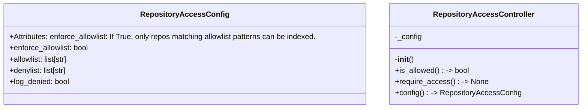
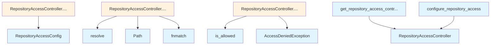

# File Overview

This file, `src/local_deepwiki/security/repository_access.py`, provides functionality for controlling access to repositories during indexing. It implements a deny-first access control model using allowlist and denylist patterns to determine which repositories are permitted.

The module uses thread-safe singleton patterns to manage a global `RepositoryAccessController` instance, making it suitable for use across multiple threads in a multi-threaded environment. It integrates with logging and access control components from the `local_deepwiki.security` package.

## Classes

### RepositoryAccessConfig

Configuration class for repository access control.

**Attributes:**
- `enforce_allowlist`: If True, only repos matching allowlist patterns can be indexed.
- `allowlist`: Glob patterns for allowed repositories (e.g., "/home/user/projects/*").
- `denylist`: Glob patterns for denied repositories (checked before allowlist).
- `log_denied`: If True, log denied access attempts.

### RepositoryAccessController

Controls which repositories can be indexed.

This controller implements a deny-first access control model:
1. Check denylist first - deny takes precedence
2. If allowlist is not enforced, allow all non-denied paths
3. If allowlist is enforced and empty, deny all paths
4. If allowlist is enforced, check if path matches any allowlist pattern

**Example usage:**
```python
config = RepositoryAccessConfig(
    enforce_allowlist=True,
    allowlist=["/home/user/projects/*", "/opt/repos/*"],
    denylist=["/home/user/private/*"]
)
configure_repository_access(config)
```

## Functions

### get_repository_access_controller

Get the global repository access controller instance (thread-safe).

**Returns:**
- The global `RepositoryAccessController` instance.

### configure_repository_access

Configure the global repository access controller.

**Parameters:**
- `config`: The `RepositoryAccessConfig` to use.

### reset_repository_access

Reset the global repository access controller (for testing only).

This clears the global instance, allowing a fresh controller to be created on the next call to `get_repository_access_controller()`.

**Parameters:**
- None

## Integration

This file integrates with:
- `local_deepwiki.logging` for logging access control decisions
- `local_deepwiki.security.access_control` for [`AccessDeniedException`](access_control.md)
- The global singleton pattern allows the controller to be shared across modules without reconfiguration

The `reset_repository_access` function is used by `test_repository_access` for testing purposes, indicating this module supports test isolation.

This module is related to:
- `src/local_deepwiki/core/__init__.py`
- `src/local_deepwiki/generators/source_refs.py`
- `src/local_deepwiki/plugins/base.py`
- `tests/__init__.py`
- `tests/test_plugins.py`

## Usage Examples

### Configure Access Control

```python
from local_deepwiki.security.repository_access import RepositoryAccessConfig, configure_repository_access

config = RepositoryAccessConfig(
    enforce_allowlist=True,
    allowlist=["/home/user/projects/*", "/opt/repos/*"],
    denylist=["/home/user/private/*"],
    log_denied=True
)
configure_repository_access(config)
```

### Check Repository Access

```python
from local_deepwiki.security.repository_access import get_repository_access_controller

controller = get_repository_access_controller()
# controller.check_access(path)
```

### Reset for Testing

```python
from local_deepwiki.security.repository_access import reset_repository_access

reset_repository_access()
```

## API Reference

### class `RepositoryAccessConfig`

Configuration for repository access control.  Attributes: enforce_allowlist: If True, only repos matching allowlist patterns can be indexed. allowlist: Glob patterns for allowed repositories (e.g., "/home/user/projects/*"). denylist: Glob patterns for denied repositories (checked before allowlist). log_denied: If True, log denied access attempts.


<details>
<summary>View Source (lines 19-32) | <a href="https://github.com/UrbanDiver/local-deepwiki-mcp/blob/[main](../export/pdf.md)/src/local_deepwiki/security/repository_access.py#L19-L32">GitHub</a></summary>

```python
class RepositoryAccessConfig:
    """Configuration for repository access control.

    Attributes:
        enforce_allowlist: If True, only repos matching allowlist patterns can be indexed.
        allowlist: Glob patterns for allowed repositories (e.g., "/home/user/projects/*").
        denylist: Glob patterns for denied repositories (checked before allowlist).
        log_denied: If True, log denied access attempts.
    """

    enforce_allowlist: bool = False
    allowlist: list[str] = field(default_factory=list)
    denylist: list[str] = field(default_factory=list)
    log_denied: bool = True
```

</details>

### class `RepositoryAccessController`

Controls which repositories can be indexed.  This controller implements a deny-first access control model: 1. Check denylist first - deny takes precedence 2. If allowlist is not enforced, allow all non-denied paths 3. If allowlist is enforced and empty, deny all paths 4. If allowlist is enforced, check if path matches any allowlist pattern  Example usage: config = RepositoryAccessConfig( enforce_allowlist=True, allowlist=["/home/user/projects/*", "/opt/repos/*"], denylist=["/home/user/projects/private/*"], ) controller = RepositoryAccessController(config)  if controller.is_allowed("/home/user/projects/my-app"): # Safe to index pass

**Methods:**


<details>
<summary>View Source (lines 35-128) | <a href="https://github.com/UrbanDiver/local-deepwiki-mcp/blob/[main](../export/pdf.md)/src/local_deepwiki/security/repository_access.py#L35-L128">GitHub</a></summary>

```python
class RepositoryAccessController:
    """Controls which repositories can be indexed.

    This controller implements a deny-first access control model:
    1. Check denylist first - deny takes precedence
    2. If allowlist is not enforced, allow all non-denied paths
    3. If allowlist is enforced and empty, deny all paths
    4. If allowlist is enforced, check if path matches any allowlist pattern

    Example usage:
        config = RepositoryAccessConfig(
            enforce_allowlist=True,
            allowlist=["/home/user/projects/*", "/opt/repos/*"],
            denylist=["/home/user/projects/private/*"],
        )
        controller = RepositoryAccessController(config)

        if controller.is_allowed("/home/user/projects/my-app"):
            # Safe to index
            pass
    """

    def __init__(self, config: Optional[RepositoryAccessConfig] = None):
        """Initialize the repository access controller.

        Args:
            config: Repository access configuration. If None, uses permissive defaults.
        """
        self._config = config or RepositoryAccessConfig()

    def is_allowed(self, repo_path: str | Path) -> bool:
        """Check if repository path is allowed for indexing.

        Args:
            repo_path: Path to the repository to check.

        Returns:
            True if the repository is allowed for indexing, False otherwise.
        """
        resolved = Path(repo_path).resolve()
        path_str = str(resolved)

        # Check denylist first (deny takes precedence)
        for pattern in self._config.denylist:
            if fnmatch.fnmatch(path_str, pattern):
                if self._config.log_denied:
                    logger.warning(
                        f"Repository access denied (denylist match): {path_str} "
                        f"matches pattern '{pattern}'"
                    )
                return False

        # If allowlist is not enforced, allow all non-denied
        if not self._config.enforce_allowlist:
            return True

        # If allowlist is empty and enforced, deny all
        if not self._config.allowlist:
            if self._config.log_denied:
                logger.warning(f"Repository access denied (empty allowlist): {path_str}")
            return False

        # Check allowlist
        for pattern in self._config.allowlist:
            if fnmatch.fnmatch(path_str, pattern):
                return True

        # No allowlist match
        if self._config.log_denied:
            logger.warning(f"Repository access denied (no allowlist match): {path_str}")
        return False

    def require_access(self, repo_path: str | Path) -> None:
        """Require access to repository, raising if denied.

        Args:
            repo_path: Path to the repository to check.

        Raises:
            AccessDeniedException: If access to the repository is denied.
        """
        if not self.is_allowed(repo_path):
            from local_deepwiki.security.access_control import AccessDeniedException

            raise AccessDeniedException(f"Access denied to repository: {repo_path}")

    @property
    def config(self) -> RepositoryAccessConfig:
        """Get the current configuration.

        Returns:
            The RepositoryAccessConfig instance.
        """
        return self._config
```

</details>

#### `__init__`

```python
def __init__(config: Optional[RepositoryAccessConfig] = None)
```

Initialize the repository access controller.


| [Parameter](../generators/api_docs.md) | Type | Default | Description |
|-----------|------|---------|-------------|
| `config` | `Optional[RepositoryAccessConfig]` | `None` | Repository access configuration. If None, uses permissive defaults. |


<details>
<summary>View Source (lines 35-128) | <a href="https://github.com/UrbanDiver/local-deepwiki-mcp/blob/[main](../export/pdf.md)/src/local_deepwiki/security/repository_access.py#L35-L128">GitHub</a></summary>

```python
class RepositoryAccessController:
    """Controls which repositories can be indexed.

    This controller implements a deny-first access control model:
    1. Check denylist first - deny takes precedence
    2. If allowlist is not enforced, allow all non-denied paths
    3. If allowlist is enforced and empty, deny all paths
    4. If allowlist is enforced, check if path matches any allowlist pattern

    Example usage:
        config = RepositoryAccessConfig(
            enforce_allowlist=True,
            allowlist=["/home/user/projects/*", "/opt/repos/*"],
            denylist=["/home/user/projects/private/*"],
        )
        controller = RepositoryAccessController(config)

        if controller.is_allowed("/home/user/projects/my-app"):
            # Safe to index
            pass
    """

    def __init__(self, config: Optional[RepositoryAccessConfig] = None):
        """Initialize the repository access controller.

        Args:
            config: Repository access configuration. If None, uses permissive defaults.
        """
        self._config = config or RepositoryAccessConfig()

    def is_allowed(self, repo_path: str | Path) -> bool:
        """Check if repository path is allowed for indexing.

        Args:
            repo_path: Path to the repository to check.

        Returns:
            True if the repository is allowed for indexing, False otherwise.
        """
        resolved = Path(repo_path).resolve()
        path_str = str(resolved)

        # Check denylist first (deny takes precedence)
        for pattern in self._config.denylist:
            if fnmatch.fnmatch(path_str, pattern):
                if self._config.log_denied:
                    logger.warning(
                        f"Repository access denied (denylist match): {path_str} "
                        f"matches pattern '{pattern}'"
                    )
                return False

        # If allowlist is not enforced, allow all non-denied
        if not self._config.enforce_allowlist:
            return True

        # If allowlist is empty and enforced, deny all
        if not self._config.allowlist:
            if self._config.log_denied:
                logger.warning(f"Repository access denied (empty allowlist): {path_str}")
            return False

        # Check allowlist
        for pattern in self._config.allowlist:
            if fnmatch.fnmatch(path_str, pattern):
                return True

        # No allowlist match
        if self._config.log_denied:
            logger.warning(f"Repository access denied (no allowlist match): {path_str}")
        return False

    def require_access(self, repo_path: str | Path) -> None:
        """Require access to repository, raising if denied.

        Args:
            repo_path: Path to the repository to check.

        Raises:
            AccessDeniedException: If access to the repository is denied.
        """
        if not self.is_allowed(repo_path):
            from local_deepwiki.security.access_control import AccessDeniedException

            raise AccessDeniedException(f"Access denied to repository: {repo_path}")

    @property
    def config(self) -> RepositoryAccessConfig:
        """Get the current configuration.

        Returns:
            The RepositoryAccessConfig instance.
        """
        return self._config
```

</details>

#### `is_allowed`

```python
def is_allowed(repo_path: str | Path) -> bool
```

Check if repository path is allowed for indexing.


| [Parameter](../generators/api_docs.md) | Type | Default | Description |
|-----------|------|---------|-------------|
| `repo_path` | `str | Path` | - | Path to the repository to check. |


<details>
<summary>View Source (lines 35-128) | <a href="https://github.com/UrbanDiver/local-deepwiki-mcp/blob/[main](../export/pdf.md)/src/local_deepwiki/security/repository_access.py#L35-L128">GitHub</a></summary>

```python
class RepositoryAccessController:
    """Controls which repositories can be indexed.

    This controller implements a deny-first access control model:
    1. Check denylist first - deny takes precedence
    2. If allowlist is not enforced, allow all non-denied paths
    3. If allowlist is enforced and empty, deny all paths
    4. If allowlist is enforced, check if path matches any allowlist pattern

    Example usage:
        config = RepositoryAccessConfig(
            enforce_allowlist=True,
            allowlist=["/home/user/projects/*", "/opt/repos/*"],
            denylist=["/home/user/projects/private/*"],
        )
        controller = RepositoryAccessController(config)

        if controller.is_allowed("/home/user/projects/my-app"):
            # Safe to index
            pass
    """

    def __init__(self, config: Optional[RepositoryAccessConfig] = None):
        """Initialize the repository access controller.

        Args:
            config: Repository access configuration. If None, uses permissive defaults.
        """
        self._config = config or RepositoryAccessConfig()

    def is_allowed(self, repo_path: str | Path) -> bool:
        """Check if repository path is allowed for indexing.

        Args:
            repo_path: Path to the repository to check.

        Returns:
            True if the repository is allowed for indexing, False otherwise.
        """
        resolved = Path(repo_path).resolve()
        path_str = str(resolved)

        # Check denylist first (deny takes precedence)
        for pattern in self._config.denylist:
            if fnmatch.fnmatch(path_str, pattern):
                if self._config.log_denied:
                    logger.warning(
                        f"Repository access denied (denylist match): {path_str} "
                        f"matches pattern '{pattern}'"
                    )
                return False

        # If allowlist is not enforced, allow all non-denied
        if not self._config.enforce_allowlist:
            return True

        # If allowlist is empty and enforced, deny all
        if not self._config.allowlist:
            if self._config.log_denied:
                logger.warning(f"Repository access denied (empty allowlist): {path_str}")
            return False

        # Check allowlist
        for pattern in self._config.allowlist:
            if fnmatch.fnmatch(path_str, pattern):
                return True

        # No allowlist match
        if self._config.log_denied:
            logger.warning(f"Repository access denied (no allowlist match): {path_str}")
        return False

    def require_access(self, repo_path: str | Path) -> None:
        """Require access to repository, raising if denied.

        Args:
            repo_path: Path to the repository to check.

        Raises:
            AccessDeniedException: If access to the repository is denied.
        """
        if not self.is_allowed(repo_path):
            from local_deepwiki.security.access_control import AccessDeniedException

            raise AccessDeniedException(f"Access denied to repository: {repo_path}")

    @property
    def config(self) -> RepositoryAccessConfig:
        """Get the current configuration.

        Returns:
            The RepositoryAccessConfig instance.
        """
        return self._config
```

</details>

#### `require_access`

```python
def require_access(repo_path: str | Path) -> None
```

Require access to repository, raising if denied.


| [Parameter](../generators/api_docs.md) | Type | Default | Description |
|-----------|------|---------|-------------|
| `repo_path` | `str | Path` | - | Path to the repository to check. |


<details>
<summary>View Source (lines 35-128) | <a href="https://github.com/UrbanDiver/local-deepwiki-mcp/blob/[main](../export/pdf.md)/src/local_deepwiki/security/repository_access.py#L35-L128">GitHub</a></summary>

```python
class RepositoryAccessController:
    """Controls which repositories can be indexed.

    This controller implements a deny-first access control model:
    1. Check denylist first - deny takes precedence
    2. If allowlist is not enforced, allow all non-denied paths
    3. If allowlist is enforced and empty, deny all paths
    4. If allowlist is enforced, check if path matches any allowlist pattern

    Example usage:
        config = RepositoryAccessConfig(
            enforce_allowlist=True,
            allowlist=["/home/user/projects/*", "/opt/repos/*"],
            denylist=["/home/user/projects/private/*"],
        )
        controller = RepositoryAccessController(config)

        if controller.is_allowed("/home/user/projects/my-app"):
            # Safe to index
            pass
    """

    def __init__(self, config: Optional[RepositoryAccessConfig] = None):
        """Initialize the repository access controller.

        Args:
            config: Repository access configuration. If None, uses permissive defaults.
        """
        self._config = config or RepositoryAccessConfig()

    def is_allowed(self, repo_path: str | Path) -> bool:
        """Check if repository path is allowed for indexing.

        Args:
            repo_path: Path to the repository to check.

        Returns:
            True if the repository is allowed for indexing, False otherwise.
        """
        resolved = Path(repo_path).resolve()
        path_str = str(resolved)

        # Check denylist first (deny takes precedence)
        for pattern in self._config.denylist:
            if fnmatch.fnmatch(path_str, pattern):
                if self._config.log_denied:
                    logger.warning(
                        f"Repository access denied (denylist match): {path_str} "
                        f"matches pattern '{pattern}'"
                    )
                return False

        # If allowlist is not enforced, allow all non-denied
        if not self._config.enforce_allowlist:
            return True

        # If allowlist is empty and enforced, deny all
        if not self._config.allowlist:
            if self._config.log_denied:
                logger.warning(f"Repository access denied (empty allowlist): {path_str}")
            return False

        # Check allowlist
        for pattern in self._config.allowlist:
            if fnmatch.fnmatch(path_str, pattern):
                return True

        # No allowlist match
        if self._config.log_denied:
            logger.warning(f"Repository access denied (no allowlist match): {path_str}")
        return False

    def require_access(self, repo_path: str | Path) -> None:
        """Require access to repository, raising if denied.

        Args:
            repo_path: Path to the repository to check.

        Raises:
            AccessDeniedException: If access to the repository is denied.
        """
        if not self.is_allowed(repo_path):
            from local_deepwiki.security.access_control import AccessDeniedException

            raise AccessDeniedException(f"Access denied to repository: {repo_path}")

    @property
    def config(self) -> RepositoryAccessConfig:
        """Get the current configuration.

        Returns:
            The RepositoryAccessConfig instance.
        """
        return self._config
```

</details>

#### `config`

```python
def config() -> RepositoryAccessConfig
```

Get the current configuration.


---


<details>
<summary>View Source (lines 35-128) | <a href="https://github.com/UrbanDiver/local-deepwiki-mcp/blob/[main](../export/pdf.md)/src/local_deepwiki/security/repository_access.py#L35-L128">GitHub</a></summary>

```python
class RepositoryAccessController:
    """Controls which repositories can be indexed.

    This controller implements a deny-first access control model:
    1. Check denylist first - deny takes precedence
    2. If allowlist is not enforced, allow all non-denied paths
    3. If allowlist is enforced and empty, deny all paths
    4. If allowlist is enforced, check if path matches any allowlist pattern

    Example usage:
        config = RepositoryAccessConfig(
            enforce_allowlist=True,
            allowlist=["/home/user/projects/*", "/opt/repos/*"],
            denylist=["/home/user/projects/private/*"],
        )
        controller = RepositoryAccessController(config)

        if controller.is_allowed("/home/user/projects/my-app"):
            # Safe to index
            pass
    """

    def __init__(self, config: Optional[RepositoryAccessConfig] = None):
        """Initialize the repository access controller.

        Args:
            config: Repository access configuration. If None, uses permissive defaults.
        """
        self._config = config or RepositoryAccessConfig()

    def is_allowed(self, repo_path: str | Path) -> bool:
        """Check if repository path is allowed for indexing.

        Args:
            repo_path: Path to the repository to check.

        Returns:
            True if the repository is allowed for indexing, False otherwise.
        """
        resolved = Path(repo_path).resolve()
        path_str = str(resolved)

        # Check denylist first (deny takes precedence)
        for pattern in self._config.denylist:
            if fnmatch.fnmatch(path_str, pattern):
                if self._config.log_denied:
                    logger.warning(
                        f"Repository access denied (denylist match): {path_str} "
                        f"matches pattern '{pattern}'"
                    )
                return False

        # If allowlist is not enforced, allow all non-denied
        if not self._config.enforce_allowlist:
            return True

        # If allowlist is empty and enforced, deny all
        if not self._config.allowlist:
            if self._config.log_denied:
                logger.warning(f"Repository access denied (empty allowlist): {path_str}")
            return False

        # Check allowlist
        for pattern in self._config.allowlist:
            if fnmatch.fnmatch(path_str, pattern):
                return True

        # No allowlist match
        if self._config.log_denied:
            logger.warning(f"Repository access denied (no allowlist match): {path_str}")
        return False

    def require_access(self, repo_path: str | Path) -> None:
        """Require access to repository, raising if denied.

        Args:
            repo_path: Path to the repository to check.

        Raises:
            AccessDeniedException: If access to the repository is denied.
        """
        if not self.is_allowed(repo_path):
            from local_deepwiki.security.access_control import AccessDeniedException

            raise AccessDeniedException(f"Access denied to repository: {repo_path}")

    @property
    def config(self) -> RepositoryAccessConfig:
        """Get the current configuration.

        Returns:
            The RepositoryAccessConfig instance.
        """
        return self._config
```

</details>

### Functions

#### `get_repository_access_controller`

```python
def get_repository_access_controller() -> RepositoryAccessController
```

Get the global repository access controller instance (thread-safe).

**Returns:** `RepositoryAccessController`


<details>
<summary>View Source (lines 136-148) | <a href="https://github.com/UrbanDiver/local-deepwiki-mcp/blob/[main](../export/pdf.md)/src/local_deepwiki/security/repository_access.py#L136-L148">GitHub</a></summary>

```python
def get_repository_access_controller() -> RepositoryAccessController:
    """Get the global repository access controller instance (thread-safe).

    Returns:
        The global RepositoryAccessController instance.
    """
    global _repo_access_controller
    if _repo_access_controller is None:
        with _repo_access_controller_lock:
            # Double-check locking pattern
            if _repo_access_controller is None:
                _repo_access_controller = RepositoryAccessController()
    return _repo_access_controller
```

</details>

#### `configure_repository_access`

```python
def configure_repository_access(config: RepositoryAccessConfig) -> None
```

Configure the global repository access controller.


| [Parameter](../generators/api_docs.md) | Type | Default | Description |
|-----------|------|---------|-------------|
| `config` | `RepositoryAccessConfig` | - | The RepositoryAccessConfig to use. |

**Returns:** `None`


<details>
<summary>View Source (lines 151-159) | <a href="https://github.com/UrbanDiver/local-deepwiki-mcp/blob/[main](../export/pdf.md)/src/local_deepwiki/security/repository_access.py#L151-L159">GitHub</a></summary>

```python
def configure_repository_access(config: RepositoryAccessConfig) -> None:
    """Configure the global repository access controller.

    Args:
        config: The RepositoryAccessConfig to use.
    """
    global _repo_access_controller
    with _repo_access_controller_lock:
        _repo_access_controller = RepositoryAccessController(config)
```

</details>

#### `reset_repository_access`

```python
def reset_repository_access() -> None
```

Reset the global repository access controller (for testing only).  This clears the global instance, allowing a fresh controller to be created on the next call to get_repository_access_controller().

**Returns:** `None`


<details>
<summary>View Source (lines 162-170) | <a href="https://github.com/UrbanDiver/local-deepwiki-mcp/blob/[main](../export/pdf.md)/src/local_deepwiki/security/repository_access.py#L162-L170">GitHub</a></summary>

```python
def reset_repository_access() -> None:
    """Reset the global repository access controller (for testing only).

    This clears the global instance, allowing a fresh controller
    to be created on the next call to get_repository_access_controller().
    """
    global _repo_access_controller
    with _repo_access_controller_lock:
        _repo_access_controller = None
```

</details>

## Class Diagram



## Call Graph



## Used By

Functions and methods in this file and their callers:

- **[`AccessDeniedException`](access_control.md)**: called by `RepositoryAccessController.require_access`
- **`Path`**: called by `RepositoryAccessController.is_allowed`
- **`RepositoryAccessConfig`**: called by `RepositoryAccessController.__init__`
- **`RepositoryAccessController`**: called by `configure_repository_access`, `get_repository_access_controller`
- **`fnmatch`**: called by `RepositoryAccessController.is_allowed`
- **`is_allowed`**: called by `RepositoryAccessController.require_access`
- **`resolve`**: called by `RepositoryAccessController.is_allowed`

## Usage Examples

*Examples extracted from test files*

### Test default configuration values

From `test_repository_access.py::TestRepositoryAccessConfig::test_default_values`:

```python
config = RepositoryAccessConfig()
assert config.enforce_allowlist is False
assert config.allowlist == []
assert config.denylist == []
assert config.log_denied is True
```

### Test custom configuration values

From `test_repository_access.py::TestRepositoryAccessConfig::test_custom_values`:

```python
config = RepositoryAccessConfig(
    enforce_allowlist=True,
    allowlist=["/home/user/projects/*"],
    denylist=["/home/user/projects/secret/*"],
    log_denied=False,
)
assert config.enforce_allowlist is True
assert config.allowlist == ["/home/user/projects/*"]
```

### Test that default config allows all paths

From `test_repository_access.py::TestRepositoryAccessController::test_default_config_allows_all`:

```python
controller = RepositoryAccessController()
assert controller.is_allowed(tmp_path) is True
```

### Test that denylist blocks matching paths

From `test_repository_access.py::TestRepositoryAccessController::test_denylist_blocks_matching_path`:

```python
controller = RepositoryAccessController(config)

# Parent path should be allowed
assert controller.is_allowed(tmp_path) is True

# Child path should be blocked
child_path = tmp_path / "project"
child_path.mkdir()
assert controller.is_allowed(child_path) is False
```

### Test that get_repository_access_controller returns singleton

From `test_repository_access.py::TestGlobalController::test_get_repository_access_controller_returns_same_instance`:

```python
controller1 = get_repository_access_controller()
controller2 = get_repository_access_controller()
assert controller1 is controller2
```


## Last Modified

| Entity | Type | Author | Date | Commit |
|--------|------|--------|------|--------|
| `RepositoryAccessConfig` | class | Brian Breidenbach | 1 week ago | `5717c3a` Phase 4: RBAC hardening wit... |
| `RepositoryAccessController` | class | Brian Breidenbach | 1 week ago | `5717c3a` Phase 4: RBAC hardening wit... |
| `get_repository_access_controller` | function | Brian Breidenbach | 1 week ago | `5717c3a` Phase 4: RBAC hardening wit... |
| `configure_repository_access` | function | Brian Breidenbach | 1 week ago | `5717c3a` Phase 4: RBAC hardening wit... |
| `reset_repository_access` | function | Brian Breidenbach | 1 week ago | `5717c3a` Phase 4: RBAC hardening wit... |

## Relevant Source Files

- `src/local_deepwiki/security/repository_access.py:19-32`
