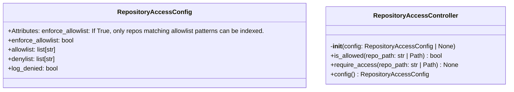
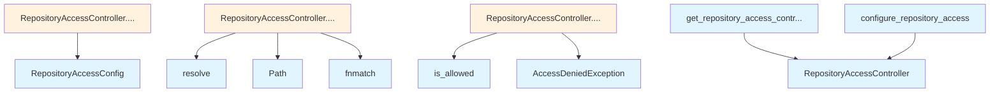

# File: `src/local_deepwiki/security/repository_access.py`

## File Overview

This module provides repository access control functionality to restrict which repositories can be indexed based on configurable allowlist and denylist patterns. It is designed to support security policies by enabling or denying access to specific repository paths, using glob-style patterns for flexible matching.

The core responsibility of this module is to enforce repository access rules in a centralized, configurable way. It uses a global controller instance to manage access decisions, making it easy to configure access policies once and apply them across the application.

## Key Concepts

### Repository Access Control with Allowlist/Denylist

The module implements a two-tier access control mechanism:

1. **Denylist**: Patterns that explicitly deny access to repositories. Denylist entries are checked first and take precedence.
2. **Allowlist**: Patterns that explicitly allow access. Only applies if `enforce_allowlist` is enabled.

This approach provides a flexible and secure way to define access policies, allowing administrators to:
- Block specific repositories or paths with denylist
- Restrict indexing to only certain repositories with allowlist
- Combine both mechanisms for fine-grained control

### Pattern Matching with `fnmatch`

Repository paths are matched against configured patterns using `fnmatch.fnmatch`, which supports glob-style patterns (e.g., `/home/user/projects/*`). This choice was made for its simplicity and familiarity to system administrators.

### Global Controller Pattern

The module uses a global `RepositoryAccessController` instance managed by a `ContextVar`. This design allows:
- Centralized access control configuration
- Easy integration with other modules without passing controller instances
- Testability via `reset_repository_access` and `configure_repository_access`

This pattern reduces coupling and simplifies usage, especially in a CLI or application that may need to check access in various parts of the codebase.

## Integration

This module is used by the test suite through the functions:
- `get_repository_access_controller`
- `configure_repository_access`
- `reset_repository_access`

These functions are called by test cases to set up and manage access control behavior in tests, ensuring that repository access policies can be tested in isolation.

It integrates with:
- [`local_deepwiki.security.access_control.AccessDeniedException`](access_control.md) — used to raise exceptions when access is denied.
- [`local_deepwiki.logging.get_logger`](../logging.md) — used for logging denied access attempts when enabled.

It is not directly imported or used by other core modules in the provided code, but is designed to be used by modules like `cli/main.py` or `core/chunk_builders.py` that may need to validate access to repositories before processing them.

## Design Notes

### Configuration Flexibility

The `RepositoryAccessConfig` class supports:
- Permissive defaults (i.e., no restrictions if not configured)
- Optional logging of denied access attempts
- Enabling or disabling allowlist enforcement

This design ensures that the module can be used in development environments without restrictions, while still providing strong access controls in production.

### Precedence of Denylist Over Allowlist

The denylist is checked before the allowlist, ensuring that even if a repository matches an allowlist pattern, it will be denied if it also matches a denylist pattern. This provides a way to override allowlist rules with specific exclusions.

### Logging of Denied Access

When `log_denied` is enabled, access denials are logged using the standard logger. This helps in debugging access control issues and monitoring repository access.

### Thread Safety and Context Isolation

The use of `ContextVar` ensures that each context (e.g., thread or async task) can have its own controller instance, which is important in asynchronous or multi-threaded environments. However, the current implementation assumes a single global controller unless explicitly configured otherwise.

### Testing Support

The functions `configure_repository_access` and `reset_repository_access` are designed to support test isolation. This allows tests to:
- Configure a specific access policy
- Reset the global controller to a clean state between tests

This makes it possible to write reliable unit tests that verify access control logic without side effects.

## API Reference

### class `RepositoryAccessConfig`

Configuration for repository access control.  Attributes: enforce_allowlist: If True, only repos matching allowlist patterns can be indexed. allowlist: Glob patterns for allowed repositories (e.g., "/home/user/projects/*"). denylist: Glob patterns for denied repositories (checked before allowlist). log_denied: If True, log denied access attempts.


<details>
<summary>View Source (lines 19-32) | <a href="https://github.com/UrbanDiver/local-deepwiki-mcp/blob/main/src/local_deepwiki/security/repository_access.py#L19-L32">GitHub</a></summary>

```python
class RepositoryAccessConfig:
    """Configuration for repository access control.

    Attributes:
        enforce_allowlist: If True, only repos matching allowlist patterns can be indexed.
        allowlist: Glob patterns for allowed repositories (e.g., "/home/user/projects/*").
        denylist: Glob patterns for denied repositories (checked before allowlist).
        log_denied: If True, log denied access attempts.
    """

    enforce_allowlist: bool = False
    allowlist: list[str] = field(default_factory=list)
    denylist: list[str] = field(default_factory=list)
    log_denied: bool = True
```

</details>

### class `RepositoryAccessController`

Controls which repositories can be indexed.  This controller implements a deny-first access control model: 1. Check denylist first - deny takes precedence 2. If allowlist is not enforced, allow all non-denied paths 3. If allowlist is enforced and empty, deny all paths 4. If allowlist is enforced, check if path matches any allowlist pattern  Example usage: config = RepositoryAccessConfig( enforce_allowlist=True, allowlist=["/home/user/projects/*", "/opt/repos/*"], denylist=["/home/user/projects/private/*"], ) controller = RepositoryAccessController(config)  if controller.is_allowed("/home/user/projects/my-app"): # Safe to index pass

**Methods:**


<details>
<summary>View Source (lines 35-135) | <a href="https://github.com/UrbanDiver/local-deepwiki-mcp/blob/main/src/local_deepwiki/security/repository_access.py#L35-L135">GitHub</a></summary>

```python
class RepositoryAccessController:
    # Methods: __init__, is_allowed, require_access, config
```

</details>

#### `__init__`

```python
def __init__(config: RepositoryAccessConfig | None = None)
```

Initialize the repository access controller.


| Parameter | Type | Default | Description |
|-----------|------|---------|-------------|
| `config` | `RepositoryAccessConfig | None` | `None` | Repository access configuration. If None, uses permissive defaults. |


<details>
<summary>View Source (lines 57-63) | <a href="https://github.com/UrbanDiver/local-deepwiki-mcp/blob/main/src/local_deepwiki/security/repository_access.py#L57-L63">GitHub</a></summary>

```python
def __init__(self, config: RepositoryAccessConfig | None = None):
        """Initialize the repository access controller.

        Args:
            config: Repository access configuration. If None, uses permissive defaults.
        """
        self._config = config or RepositoryAccessConfig()
```

</details>

#### `is_allowed`

```python
def is_allowed(repo_path: str | Path) -> bool
```

Check if repository path is allowed for indexing.


| Parameter | Type | Default | Description |
|-----------|------|---------|-------------|
| `repo_path` | `str | Path` | - | Path to the repository to check. |


<details>
<summary>View Source (lines 65-112) | <a href="https://github.com/UrbanDiver/local-deepwiki-mcp/blob/main/src/local_deepwiki/security/repository_access.py#L65-L112">GitHub</a></summary>

```python
def is_allowed(self, repo_path: str | Path) -> bool:
        """Check if repository path is allowed for indexing.

        Args:
            repo_path: Path to the repository to check.

        Returns:
            True if the repository is allowed for indexing, False otherwise.
        """
        resolved = Path(repo_path).resolve()
        path_str = str(resolved)

        # Check denylist first (deny takes precedence)
        denied_pattern = next(
            (p for p in self._config.denylist if fnmatch.fnmatch(path_str, p)),
            None,
        )
        if denied_pattern is not None:
            if self._config.log_denied:
                logger.warning(
                    "Repository access denied (denylist match): %s matches pattern '%s'",
                    path_str,
                    denied_pattern,
                )
            return False

        # If allowlist is not enforced, allow all non-denied
        if not self._config.enforce_allowlist:
            return True

        # If allowlist is empty and enforced, deny all
        if not self._config.allowlist:
            if self._config.log_denied:
                logger.warning(
                    "Repository access denied (empty allowlist): %s", path_str
                )
            return False

        # Check allowlist
        if any(fnmatch.fnmatch(path_str, p) for p in self._config.allowlist):
            return True

        # No allowlist match
        if self._config.log_denied:
            logger.warning(
                "Repository access denied (no allowlist match): %s", path_str
            )
        return False
```

</details>

#### `require_access`

```python
def require_access(repo_path: str | Path) -> None
```

Require access to repository, raising if denied.


| Parameter | Type | Default | Description |
|-----------|------|---------|-------------|
| `repo_path` | `str | Path` | - | Path to the repository to check. |


<details>
<summary>View Source (lines 114-126) | <a href="https://github.com/UrbanDiver/local-deepwiki-mcp/blob/main/src/local_deepwiki/security/repository_access.py#L114-L126">GitHub</a></summary>

```python
def require_access(self, repo_path: str | Path) -> None:
        """Require access to repository, raising if denied.

        Args:
            repo_path: Path to the repository to check.

        Raises:
            AccessDeniedException: If access to the repository is denied.
        """
        if not self.is_allowed(repo_path):
            from local_deepwiki.security.access_control import AccessDeniedException

            raise AccessDeniedException(f"Access denied to repository: {repo_path}")
```

</details>

#### `config`

```python
def config() -> RepositoryAccessConfig
```

Get the current configuration.


---


<details>
<summary>View Source (lines 129-135) | <a href="https://github.com/UrbanDiver/local-deepwiki-mcp/blob/main/src/local_deepwiki/security/repository_access.py#L129-L135">GitHub</a></summary>

```python
def config(self) -> RepositoryAccessConfig:
        """Get the current configuration.

        Returns:
            The RepositoryAccessConfig instance.
        """
        return self._config
```

</details>

### Functions

#### `get_repository_access_controller`

```python
def get_repository_access_controller() -> RepositoryAccessController
```

Get the global repository access controller instance.

**Returns:** `RepositoryAccessController`


<details>
<summary>View Source (lines 144-154) | <a href="https://github.com/UrbanDiver/local-deepwiki-mcp/blob/main/src/local_deepwiki/security/repository_access.py#L144-L154">GitHub</a></summary>

```python
def get_repository_access_controller() -> RepositoryAccessController:
    """Get the global repository access controller instance.

    Returns:
        The global RepositoryAccessController instance.
    """
    val = _repo_access_controller_var.get()
    if val is None:
        val = RepositoryAccessController()
        _repo_access_controller_var.set(val)
    return val
```

</details>

#### `configure_repository_access`

```python
def configure_repository_access(config: RepositoryAccessConfig) -> None
```

Configure the global repository access controller.


| Parameter | Type | Default | Description |
|-----------|------|---------|-------------|
| `config` | `RepositoryAccessConfig` | - | The RepositoryAccessConfig to use. |

**Returns:** `None`


<details>
<summary>View Source (lines 157-163) | <a href="https://github.com/UrbanDiver/local-deepwiki-mcp/blob/main/src/local_deepwiki/security/repository_access.py#L157-L163">GitHub</a></summary>

```python
def configure_repository_access(config: RepositoryAccessConfig) -> None:
    """Configure the global repository access controller.

    Args:
        config: The RepositoryAccessConfig to use.
    """
    _repo_access_controller_var.set(RepositoryAccessController(config))
```

</details>

#### `reset_repository_access`

```python
def reset_repository_access() -> None
```

Reset the global repository access controller (for testing only).  This clears the global instance, allowing a fresh controller to be created on the next call to get_repository_access_controller().

**Returns:** `None`


<details>
<summary>View Source (lines 166-172) | <a href="https://github.com/UrbanDiver/local-deepwiki-mcp/blob/main/src/local_deepwiki/security/repository_access.py#L166-L172">GitHub</a></summary>

```python
def reset_repository_access() -> None:
    """Reset the global repository access controller (for testing only).

    This clears the global instance, allowing a fresh controller
    to be created on the next call to get_repository_access_controller().
    """
    _repo_access_controller_var.set(None)
```

</details>

## Class Diagram



## Call Graph



## Used By

Functions and methods in this file and their callers:

- **[`AccessDeniedException`](access_control.md)**: called by `RepositoryAccessController.require_access`
- **`Path`**: called by `RepositoryAccessController.is_allowed`
- **`RepositoryAccessConfig`**: called by `RepositoryAccessController.__init__`
- **`RepositoryAccessController`**: called by `configure_repository_access`, `get_repository_access_controller`
- **`fnmatch`**: called by `RepositoryAccessController.is_allowed`
- **`is_allowed`**: called by `RepositoryAccessController.require_access`
- **`resolve`**: called by `RepositoryAccessController.is_allowed`

## Usage Examples

*Examples extracted from test files*

### Test default configuration values

From `test_repository_access.py::TestRepositoryAccessConfig::test_default_values`:

```python
config = RepositoryAccessConfig()
assert config.enforce_allowlist is False
assert config.allowlist == []
assert config.denylist == []
assert config.log_denied is True
```

### Test default configuration values

From `test_repository_access.py::TestRepositoryAccessConfig::test_default_values`:

```python
config = RepositoryAccessConfig()
assert config.enforce_allowlist is False
assert config.allowlist == []
assert config.denylist == []
assert config.log_denied is True
```

### Test custom configuration values

From `test_repository_access.py::TestRepositoryAccessConfig::test_custom_values`:

```python
config = RepositoryAccessConfig(
    enforce_allowlist=True,
    allowlist=["/home/user/projects/*"],
    denylist=["/home/user/projects/secret/*"],
    log_denied=False,
)
assert config.enforce_allowlist is True
assert config.allowlist == ["/home/user/projects/*"]
```

### Test custom configuration values

From `test_repository_access.py::TestRepositoryAccessConfig::test_custom_values`:

```python
config = RepositoryAccessConfig(
    enforce_allowlist=True,
    allowlist=["/home/user/projects/*"],
    denylist=["/home/user/projects/secret/*"],
    log_denied=False,
)
assert config.enforce_allowlist is True
assert config.allowlist == ["/home/user/projects/*"]
```

### Test that default config allows all paths

From `test_repository_access.py::TestRepositoryAccessController::test_default_config_allows_all`:

```python
controller = RepositoryAccessController()
assert controller.is_allowed(tmp_path) is True
```


## Last Modified

| Entity | Type | Author | Date | Commit |
|--------|------|--------|------|--------|
| `get_repository_access_controller` | function | Brian Breidenbach | Feb 22, 2026 | `78abcdc` refactor: replace global si... |
| `configure_repository_access` | function | Brian Breidenbach | Feb 22, 2026 | `78abcdc` refactor: replace global si... |
| `reset_repository_access` | function | Brian Breidenbach | Feb 22, 2026 | `78abcdc` refactor: replace global si... |
| `RepositoryAccessController` | class | Brian Breidenbach | Feb 20, 2026 | `b807417` refactor: high-priority Pyt... |
| `is_allowed` | method | Brian Breidenbach | Feb 20, 2026 | `b807417` refactor: high-priority Pyt... |
| `__init__` | method | Brian Breidenbach | Feb 11, 2026 | `ba96da1` fix: publication plan P0-P2... |
| `RepositoryAccessConfig` | class | Brian Breidenbach | Jan 26, 2026 | `5717c3a` Phase 4: RBAC hardening wit... |
| `require_access` | method | Brian Breidenbach | Jan 26, 2026 | `5717c3a` Phase 4: RBAC hardening wit... |
| `config` | method | Brian Breidenbach | Jan 26, 2026 | `5717c3a` Phase 4: RBAC hardening wit... |

## Relevant Source Files

- `src/local_deepwiki/security/repository_access.py:19-32`
