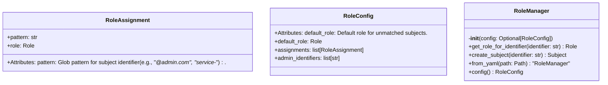
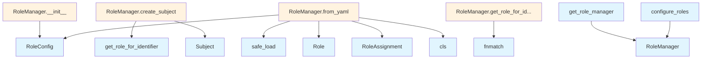

# File Overview

This file, `src/local_deepwiki/security/role_config.py`, defines the role-based access control configuration for the local deepwiki system. It provides classes and functions to manage role assignments based on subject identifiers, including support for YAML-based configuration loading.

The module imports standard Python libraries and uses `yaml` for parsing configuration files. It depends on [`Role`](access_control.md) and [`Subject`](access_control.md) from `local_deepwiki.security.access_control`.

## Classes

### RoleAssignment

Maps an identifier pattern to a role.

**Attributes:**
- `pattern`: Glob pattern for subject identifier (e.g., "*@admin.com", "service-*").
- `role`: The role to assign when the pattern matches.

### RoleConfig

Configuration for role assignments.

**Attributes:**
- `default_role`: Default role for unmatched subjects. Defaults to `Role.VIEWER`.
- `assignments`: Explicit role assignments (checked in order, first match wins).
- `admin_identifiers`: Admin identifiers (convenience - always get ADMIN role).

### RoleManager

Manages role assignments and provides methods to determine roles for identifiers and create subjects.

**Methods:**
- `__init__(self, config: Optional[RoleConfig] = None)`: Initialize the role manager.
- `get_role_for_identifier(self, identifier: str) -> Role`: Get the role for a given identifier.
- `create_subject(self, identifier: str) -> Subject`: Create a [Subject](access_control.md) with the appropriate role for the identifier.
- `from_yaml(cls, path: Path) -> "RoleManager"`: Load role configuration from YAML file.
- `config(self) -> RoleConfig`: Get the current role configuration.

## Functions

### get_role_manager

Get the global role manager instance.

If no role manager has been configured, creates one with default settings.

**Returns:**
- The global `RoleManager` instance.

### configure_roles

Configure the global role manager with the given configuration.

**Parameters:**
- `config`: The role configuration to use.

### reset_role_manager

Reset the global role manager (for testing only).

This clears the global instance, allowing a fresh manager to be created on the next call to `get_role_manager()`.

## Integration

This file integrates with the `local_deepwiki.security.access_control` module by using the [`Role`](access_control.md) and [`Subject`](access_control.md) types. It is used by the `RoleManager` class and functions like `test_role_config` in tests.

It is closely related to files such as `src/local_deepwiki/core/__init__.py`, `src/local_deepwiki/generators/source_refs.py`, and `src/local_deepwiki/plugins/base.py`, though the exact integration points are not detailed in the provided code.

## Usage Examples

### Creating a RoleManager from YAML

```python
from pathlib import Path
from local_deepwiki.security.role_config import RoleManager

manager = RoleManager.from_yaml(Path("config/roles.yaml"))
```

### Getting a Role for an Identifier

```python
from local_deepwiki.security.role_config import get_role_manager

manager = get_role_manager()
role = manager.get_role_for_identifier("user@example.com")
```

### Creating a Subject

```python
from local_deepwiki.security.role_config import get_role_manager

manager = get_role_manager()
subject = manager.create_subject("user@example.com")
```

### Configuring Roles Globally

```python
from local_deepwiki.security.role_config import configure_roles, RoleConfig, Role

config = RoleConfig(default_role=Role.EDITOR)
configure_roles(config)
```

## API Reference

### class `RoleAssignment`

Maps an identifier pattern to a role.  Attributes: pattern: Glob pattern for subject identifier (e.g., "*@admin.com", "service-*"). role: The role to assign when the pattern matches.


<details>
<summary>View Source (lines 18-27) | <a href="https://github.com/UrbanDiver/local-deepwiki-mcp/blob/[main](../export/pdf.md)/src/local_deepwiki/security/role_config.py#L18-L27">GitHub</a></summary>

```python
class RoleAssignment:
    """Maps an identifier pattern to a role.

    Attributes:
        pattern: Glob pattern for subject identifier (e.g., "*@admin.com", "service-*").
        role: The role to assign when the pattern matches.
    """

    pattern: str
    role: Role
```

</details>

### class `RoleConfig`

Configuration for role assignments.  Attributes: default_role: Default role for unmatched subjects. assignments: Explicit role assignments (checked in order, first match wins). admin_identifiers: Admin identifiers (convenience - always get ADMIN role).


<details>
<summary>View Source (lines 31-42) | <a href="https://github.com/UrbanDiver/local-deepwiki-mcp/blob/[main](../export/pdf.md)/src/local_deepwiki/security/role_config.py#L31-L42">GitHub</a></summary>

```python
class RoleConfig:
    """Configuration for role assignments.

    Attributes:
        default_role: Default role for unmatched subjects.
        assignments: Explicit role assignments (checked in order, first match wins).
        admin_identifiers: Admin identifiers (convenience - always get ADMIN role).
    """

    default_role: Role = Role.VIEWER
    assignments: list[RoleAssignment] = field(default_factory=list)
    admin_identifiers: list[str] = field(default_factory=list)
```

</details>

### class `RoleManager`

Manages role assignments for subjects.  This class provides centralized role assignment based on configuration, supporting pattern matching, explicit admin identifiers, and default roles.

**Methods:**


<details>
<summary>View Source (lines 45-163) | <a href="https://github.com/UrbanDiver/local-deepwiki-mcp/blob/[main](../export/pdf.md)/src/local_deepwiki/security/role_config.py#L45-L163">GitHub</a></summary>

```python
class RoleManager:
    # Methods: __init__, get_role_for_identifier, create_subject, from_yaml, config
```

</details>

#### `__init__`

```python
def __init__(config: Optional[RoleConfig] = None)
```

Initialize the role manager.


| [Parameter](../generators/api_docs.md) | Type | Default | Description |
|-----------|------|---------|-------------|
| `config` | `Optional[RoleConfig]` | `None` | [Role](access_control.md) configuration. If None, uses default configuration. |


<details>
<summary>View Source (lines 65-71) | <a href="https://github.com/UrbanDiver/local-deepwiki-mcp/blob/[main](../export/pdf.md)/src/local_deepwiki/security/role_config.py#L65-L71">GitHub</a></summary>

```python
def __init__(self, config: Optional[RoleConfig] = None):
        """Initialize the role manager.

        Args:
            config: Role configuration. If None, uses default configuration.
        """
        self._config = config or RoleConfig()
```

</details>

#### `get_role_for_identifier`

```python
def get_role_for_identifier(identifier: str) -> Role
```

Get the role for a given identifier.  The matching order is: 1. Check admin identifiers (exact match) 2. Check explicit assignments (first pattern match wins) 3. Return default role


| [Parameter](../generators/api_docs.md) | Type | Default | Description |
|-----------|------|---------|-------------|
| `identifier` | `str` | - | The subject identifier to match. |


<details>
<summary>View Source (lines 73-97) | <a href="https://github.com/UrbanDiver/local-deepwiki-mcp/blob/[main](../export/pdf.md)/src/local_deepwiki/security/role_config.py#L73-L97">GitHub</a></summary>

```python
def get_role_for_identifier(self, identifier: str) -> Role:
        """Get the role for a given identifier.

        The matching order is:
        1. Check admin identifiers (exact match)
        2. Check explicit assignments (first pattern match wins)
        3. Return default role

        Args:
            identifier: The subject identifier to match.

        Returns:
            The role assigned to the identifier.
        """
        # Check admin identifiers first (exact match)
        if identifier in self._config.admin_identifiers:
            return Role.ADMIN

        # Check explicit assignments (first match wins)
        for assignment in self._config.assignments:
            if fnmatch.fnmatch(identifier, assignment.pattern):
                return assignment.role

        # Return default role
        return self._config.default_role
```

</details>

#### `create_subject`

```python
def create_subject(identifier: str) -> Subject
```

Create a [Subject](access_control.md) with the appropriate role for the identifier.


| [Parameter](../generators/api_docs.md) | Type | Default | Description |
|-----------|------|---------|-------------|
| `identifier` | `str` | - | The unique identifier for the subject. |


<details>
<summary>View Source (lines 99-109) | <a href="https://github.com/UrbanDiver/local-deepwiki-mcp/blob/[main](../export/pdf.md)/src/local_deepwiki/security/role_config.py#L99-L109">GitHub</a></summary>

```python
def create_subject(self, identifier: str) -> Subject:
        """Create a Subject with the appropriate role for the identifier.

        Args:
            identifier: The unique identifier for the subject.

        Returns:
            A Subject instance with the appropriate role assigned.
        """
        role = self.get_role_for_identifier(identifier)
        return Subject(identifier=identifier, roles={role})
```

</details>

#### `from_yaml`

```python
def from_yaml(path: Path) -> "RoleManager"
```

Load role configuration from YAML file.  The YAML file should have the following structure: default_role: viewer admin_identifiers: - admin - root assignments: - pattern: "*@admin.example.com" role: admin - pattern: "editor-*" role: editor


| [Parameter](../generators/api_docs.md) | Type | Default | Description |
|-----------|------|---------|-------------|
| `path` | `Path` | - | Path to the YAML configuration file. |


<details>
<summary>View Source (lines 112-154) | <a href="https://github.com/UrbanDiver/local-deepwiki-mcp/blob/[main](../export/pdf.md)/src/local_deepwiki/security/role_config.py#L112-L154">GitHub</a></summary>

```python
def from_yaml(cls, path: Path) -> "RoleManager":
        """Load role configuration from YAML file.

        The YAML file should have the following structure:
            default_role: viewer
            admin_identifiers:
              - admin
              - root
            assignments:
              - pattern: "*@admin.example.com"
                role: admin
              - pattern: "editor-*"
                role: editor

        Args:
            path: Path to the YAML configuration file.

        Returns:
            A RoleManager instance configured from the file.

        Raises:
            FileNotFoundError: If the file does not exist.
            yaml.YAMLError: If the file contains invalid YAML.
            ValueError: If the configuration contains invalid role names.
        """
        with open(path) as f:
            data = yaml.safe_load(f)

        if data is None:
            data = {}

        config = RoleConfig(
            default_role=Role(data.get("default_role", "viewer")),
            admin_identifiers=data.get("admin_identifiers", []),
            assignments=[
                RoleAssignment(
                    pattern=a["pattern"],
                    role=Role(a["role"]),
                )
                for a in data.get("assignments", [])
            ],
        )
        return cls(config)
```

</details>

#### `config`

```python
def config() -> RoleConfig
```

Get the current role configuration.


---


<details>
<summary>View Source (lines 157-163) | <a href="https://github.com/UrbanDiver/local-deepwiki-mcp/blob/[main](../export/pdf.md)/src/local_deepwiki/security/role_config.py#L157-L163">GitHub</a></summary>

```python
def config(self) -> RoleConfig:
        """Get the current role configuration.

        Returns:
            The RoleConfig instance used by this manager.
        """
        return self._config
```

</details>

### Functions

#### `get_role_manager`

```python
def get_role_manager() -> RoleManager
```

Get the global role manager instance.  If no role manager has been configured, creates one with default settings.

**Returns:** `RoleManager`


<details>
<summary>View Source (lines 170-181) | <a href="https://github.com/UrbanDiver/local-deepwiki-mcp/blob/[main](../export/pdf.md)/src/local_deepwiki/security/role_config.py#L170-L181">GitHub</a></summary>

```python
def get_role_manager() -> RoleManager:
    """Get the global role manager instance.

    If no role manager has been configured, creates one with default settings.

    Returns:
        The global RoleManager instance.
    """
    global _role_manager
    if _role_manager is None:
        _role_manager = RoleManager()
    return _role_manager
```

</details>

#### `configure_roles`

```python
def configure_roles(config: RoleConfig) -> None
```

Configure the global role manager with the given configuration.


| [Parameter](../generators/api_docs.md) | Type | Default | Description |
|-----------|------|---------|-------------|
| `config` | `RoleConfig` | - | The role configuration to use. |

**Returns:** `None`


<details>
<summary>View Source (lines 184-191) | <a href="https://github.com/UrbanDiver/local-deepwiki-mcp/blob/[main](../export/pdf.md)/src/local_deepwiki/security/role_config.py#L184-L191">GitHub</a></summary>

```python
def configure_roles(config: RoleConfig) -> None:
    """Configure the global role manager with the given configuration.

    Args:
        config: The role configuration to use.
    """
    global _role_manager
    _role_manager = RoleManager(config)
```

</details>

#### `reset_role_manager`

```python
def reset_role_manager() -> None
```

Reset the global role manager (for testing only).  This clears the global instance, allowing a fresh manager to be created on the next call to get_role_manager().

**Returns:** `None`


<details>
<summary>View Source (lines 194-201) | <a href="https://github.com/UrbanDiver/local-deepwiki-mcp/blob/[main](../export/pdf.md)/src/local_deepwiki/security/role_config.py#L194-L201">GitHub</a></summary>

```python
def reset_role_manager() -> None:
    """Reset the global role manager (for testing only).

    This clears the global instance, allowing a fresh manager
    to be created on the next call to get_role_manager().
    """
    global _role_manager
    _role_manager = None
```

</details>

## Class Diagram



## Call Graph



## Used By

Functions and methods in this file and their callers:

- **[`Role`](access_control.md)**: called by `RoleManager.from_yaml`
- **`RoleAssignment`**: called by `RoleManager.from_yaml`
- **`RoleConfig`**: called by `RoleManager.__init__`, `RoleManager.from_yaml`
- **`RoleManager`**: called by `configure_roles`, `get_role_manager`
- **[`Subject`](access_control.md)**: called by `RoleManager.create_subject`
- **`cls`**: called by `RoleManager.from_yaml`
- **`fnmatch`**: called by `RoleManager.get_role_for_identifier`
- **`get_role_for_identifier`**: called by `RoleManager.create_subject`
- **`safe_load`**: called by `RoleManager.from_yaml`

## Usage Examples

*Examples extracted from test files*

### Verify RoleAssignment can be created with pattern and role

From `test_role_config.py::TestRoleAssignment::test_role_assignment_creation`:

```python
assignment = RoleAssignment(pattern="*@admin.com", role=Role.ADMIN)
assert assignment.pattern == "*@admin.com"
assert assignment.role == Role.ADMIN
```

### Verify RoleAssignment works with all role types

From `test_role_config.py::TestRoleAssignment::test_role_assignment_with_different_roles`:

```python
for role in Role:
    assignment = RoleAssignment(pattern=f"test-{role.value}-*", role=role)
    assert assignment.role == role
```

### Verify RoleConfig default values

From `test_role_config.py::TestRoleConfig::test_default_role_config`:

```python
config = RoleConfig()
assert config.default_role == Role.VIEWER
assert config.assignments == []
assert config.admin_identifiers == []
```

### Verify RoleConfig default values

From `test_role_config.py::TestRoleConfig::test_default_role_config`:

```python
config = RoleConfig()
assert config.default_role == Role.VIEWER
assert config.assignments == []
assert config.admin_identifiers == []
```

### Verify RoleConfig can set a custom default role

From `test_role_config.py::TestRoleConfig::test_role_config_with_custom_default_role`:

```python
config = RoleConfig(default_role=Role.GUEST)
assert config.default_role == Role.GUEST
```


## Last Modified

| Entity | Type | Author | Date | Commit |
|--------|------|--------|------|--------|
| `RoleAssignment` | class | Brian Breidenbach | 1 week ago | `5717c3a` Phase 4: RBAC hardening wit... |
| `RoleConfig` | class | Brian Breidenbach | 1 week ago | `5717c3a` Phase 4: RBAC hardening wit... |
| `RoleManager` | class | Brian Breidenbach | 1 week ago | `5717c3a` Phase 4: RBAC hardening wit... |
| `__init__` | method | Brian Breidenbach | 1 week ago | `5717c3a` Phase 4: RBAC hardening wit... |
| `get_role_for_identifier` | method | Brian Breidenbach | 1 week ago | `5717c3a` Phase 4: RBAC hardening wit... |
| `create_subject` | method | Brian Breidenbach | 1 week ago | `5717c3a` Phase 4: RBAC hardening wit... |
| `from_yaml` | method | Brian Breidenbach | 1 week ago | `5717c3a` Phase 4: RBAC hardening wit... |
| `config` | method | Brian Breidenbach | 1 week ago | `5717c3a` Phase 4: RBAC hardening wit... |
| `get_role_manager` | function | Brian Breidenbach | 1 week ago | `5717c3a` Phase 4: RBAC hardening wit... |
| `configure_roles` | function | Brian Breidenbach | 1 week ago | `5717c3a` Phase 4: RBAC hardening wit... |
| `reset_role_manager` | function | Brian Breidenbach | 1 week ago | `5717c3a` Phase 4: RBAC hardening wit... |

## Relevant Source Files

- `src/local_deepwiki/security/role_config.py:18-27`
