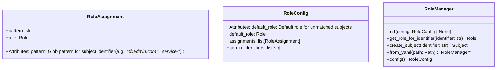
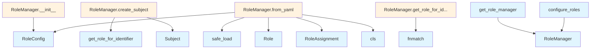

# File: `src/local_deepwiki/security/role_config.py`

## File Overview

This module provides a configuration-driven system for assigning roles to subjects in the local_deepwiki security framework. It enables flexible role assignment using glob-style pattern matching, explicit role mappings, and a default fallback role. The system supports loading role configurations from YAML files and provides a global singleton `RoleManager` for centralized access.

The module is designed to be both extensible and testable, allowing different configurations to be injected and reset during testing. It integrates with the `local_deepwiki.security.access_control` module to define and manage subject roles.

## Key Concepts

### Role Assignment and Pattern Matching

The core abstraction is `RoleAssignment`, which maps a glob pattern to a role. This enables flexible matching of identifiers, such as email addresses or service names, using `fnmatch` for pattern matching. This design choice supports common use cases like assigning roles to all users with a specific domain (`*@admin.com`) or all services with a specific prefix (`service-*`).

### Configuration-Driven Role Management

The `RoleConfig` class encapsulates all role-related configuration:
- `default_role`: The role assigned to unmatched subjects.
- `assignments`: A list of `RoleAssignment` objects checked in order, with the first match winning.
- `admin_identifiers`: A convenience list of exact match identifiers that are always granted `Role.ADMIN`.

This structure supports both explicit and implicit role assignments, making it easy to define granular access control policies.

### Global Role Manager with ContextVar

The `RoleManager` is implemented as a singleton using `ContextVar`, ensuring that a single instance is shared globally but still allows for easy testing and configuration changes. This approach avoids global state pollution and enables clean separation of concerns in multi-threaded or multi-request environments.

### YAML-Based Configuration Loading

The `from_yaml` class method allows loading role configurations from external YAML files. This supports runtime configuration changes and keeps security policies decoupled from code. It also provides structured validation and error handling for malformed configurations.

## Integration

This module integrates with the broader `local_deepwiki` security system by relying on the `Role` and [`Subject`](access_control.md) types defined in `local_deepwiki.security.access_control`. It is used by test fixtures (`test_role_config`) and is expected to be consumed by other parts of the application that require role-based access control.

The `RoleManager` is accessed globally via the `get_role_manager()` function, which is likely used throughout the application to determine subject permissions. The ability to configure and reset the role manager via `configure_roles()` and `reset_role_manager()` makes this module suitable for testing scenarios, where different configurations may be needed.

## Design Notes

### Why `fnmatch` for Pattern Matching

`fnmatch` is used for pattern matching instead of regular expressions because it is simpler and sufficient for the intended use cases (glob-style matching). It avoids the complexity and potential performance overhead of regex engines while still providing powerful pattern matching capabilities.

### Why `ContextVar` for Singleton Management

`ContextVar` is used instead of a plain global variable or singleton pattern to allow for better testability. It enables the role manager to be easily replaced in tests without side effects, and supports environments where multiple contexts (e.g., threads or requests) might need different role configurations.

### Default Role Handling

The default role is set to `Role.VIEWER`, which is a conservative default that ensures even unauthenticated or unknown users are not granted excessive permissions. This default can be overridden in configuration files.

### YAML Configuration Validation

The `from_yaml` method includes validation for role names, raising `ValueError` for invalid roles. This prevents runtime errors due to misconfigured YAML files and ensures that only valid roles are accepted. The method also gracefully handles missing or empty YAML data by defaulting to sensible values.

### Explicit Assignment Order

Assignments are checked in order, with the first match winning. This allows for fine-grained control over role assignment, where more specific patterns can override general ones. This design choice supports the common security pattern of "least privilege" with explicit overrides.

## API Reference

### class `RoleAssignment`

Maps an identifier pattern to a role.  Attributes: pattern: Glob pattern for subject identifier (e.g., "*@admin.com", "service-*"). role: The role to assign when the pattern matches.


<details>
<summary>View Source (lines 20-29) | <a href="https://github.com/UrbanDiver/local-deepwiki-mcp/blob/main/src/local_deepwiki/security/role_config.py#L20-L29">GitHub</a></summary>

```python
class RoleAssignment:
    """Maps an identifier pattern to a role.

    Attributes:
        pattern: Glob pattern for subject identifier (e.g., "*@admin.com", "service-*").
        role: The role to assign when the pattern matches.
    """

    pattern: str
    role: Role
```

</details>

### class `RoleConfig`

Configuration for role assignments.  Attributes: default_role: Default role for unmatched subjects. assignments: Explicit role assignments (checked in order, first match wins). admin_identifiers: Admin identifiers (convenience - always get ADMIN role).


<details>
<summary>View Source (lines 33-44) | <a href="https://github.com/UrbanDiver/local-deepwiki-mcp/blob/main/src/local_deepwiki/security/role_config.py#L33-L44">GitHub</a></summary>

```python
class RoleConfig:
    """Configuration for role assignments.

    Attributes:
        default_role: Default role for unmatched subjects.
        assignments: Explicit role assignments (checked in order, first match wins).
        admin_identifiers: Admin identifiers (convenience - always get ADMIN role).
    """

    default_role: Role = Role.VIEWER
    assignments: list[RoleAssignment] = field(default_factory=list)
    admin_identifiers: list[str] = field(default_factory=list)
```

</details>

### class `RoleManager`

Manages role assignments for subjects.  This class provides centralized role assignment based on configuration, supporting pattern matching, explicit admin identifiers, and default roles.

**Methods:**


<details>
<summary>View Source (lines 47-165) | <a href="https://github.com/UrbanDiver/local-deepwiki-mcp/blob/main/src/local_deepwiki/security/role_config.py#L47-L165">GitHub</a></summary>

```python
class RoleManager:
    # Methods: __init__, get_role_for_identifier, create_subject, from_yaml, config
```

</details>

#### `__init__`

```python
def __init__(config: RoleConfig | None = None)
```

Initialize the role manager.


| Parameter | Type | Default | Description |
|-----------|------|---------|-------------|
| `config` | `RoleConfig | None` | `None` | Role configuration. If None, uses default configuration. |


<details>
<summary>View Source (lines 67-73) | <a href="https://github.com/UrbanDiver/local-deepwiki-mcp/blob/main/src/local_deepwiki/security/role_config.py#L67-L73">GitHub</a></summary>

```python
def __init__(self, config: RoleConfig | None = None):
        """Initialize the role manager.

        Args:
            config: Role configuration. If None, uses default configuration.
        """
        self._config = config or RoleConfig()
```

</details>

#### `get_role_for_identifier`

```python
def get_role_for_identifier(identifier: str) -> Role
```

Get the role for a given identifier.  The matching order is: 1. Check admin identifiers (exact match) 2. Check explicit assignments (first pattern match wins) 3. Return default role


| Parameter | Type | Default | Description |
|-----------|------|---------|-------------|
| `identifier` | `str` | - | The subject identifier to match. |


<details>
<summary>View Source (lines 75-99) | <a href="https://github.com/UrbanDiver/local-deepwiki-mcp/blob/main/src/local_deepwiki/security/role_config.py#L75-L99">GitHub</a></summary>

```python
def get_role_for_identifier(self, identifier: str) -> Role:
        """Get the role for a given identifier.

        The matching order is:
        1. Check admin identifiers (exact match)
        2. Check explicit assignments (first pattern match wins)
        3. Return default role

        Args:
            identifier: The subject identifier to match.

        Returns:
            The role assigned to the identifier.
        """
        # Check admin identifiers first (exact match)
        if identifier in self._config.admin_identifiers:
            return Role.ADMIN

        # Check explicit assignments (first match wins)
        for assignment in self._config.assignments:
            if fnmatch.fnmatch(identifier, assignment.pattern):
                return assignment.role

        # Return default role
        return self._config.default_role
```

</details>

#### `create_subject`

```python
def create_subject(identifier: str) -> Subject
```

Create a [Subject](access_control.md) with the appropriate role for the identifier.


| Parameter | Type | Default | Description |
|-----------|------|---------|-------------|
| `identifier` | `str` | - | The unique identifier for the subject. |


<details>
<summary>View Source (lines 101-111) | <a href="https://github.com/UrbanDiver/local-deepwiki-mcp/blob/main/src/local_deepwiki/security/role_config.py#L101-L111">GitHub</a></summary>

```python
def create_subject(self, identifier: str) -> Subject:
        """Create a Subject with the appropriate role for the identifier.

        Args:
            identifier: The unique identifier for the subject.

        Returns:
            A Subject instance with the appropriate role assigned.
        """
        role = self.get_role_for_identifier(identifier)
        return Subject(identifier=identifier, roles={role})
```

</details>

#### `from_yaml`

```python
def from_yaml(path: Path) -> "RoleManager"
```

Load role configuration from YAML file.  The YAML file should have the following structure: default_role: viewer admin_identifiers: - admin - root assignments: - pattern: "*@admin.example.com" role: admin - pattern: "editor-*" role: editor


| Parameter | Type | Default | Description |
|-----------|------|---------|-------------|
| `path` | `Path` | - | Path to the YAML configuration file. |


<details>
<summary>View Source (lines 114-156) | <a href="https://github.com/UrbanDiver/local-deepwiki-mcp/blob/main/src/local_deepwiki/security/role_config.py#L114-L156">GitHub</a></summary>

```python
def from_yaml(cls, path: Path) -> "RoleManager":
        """Load role configuration from YAML file.

        The YAML file should have the following structure:
            default_role: viewer
            admin_identifiers:
              - admin
              - root
            assignments:
              - pattern: "*@admin.example.com"
                role: admin
              - pattern: "editor-*"
                role: editor

        Args:
            path: Path to the YAML configuration file.

        Returns:
            A RoleManager instance configured from the file.

        Raises:
            FileNotFoundError: If the file does not exist.
            yaml.YAMLError: If the file contains invalid YAML.
            ValueError: If the configuration contains invalid role names.
        """
        with open(path) as f:
            data = yaml.safe_load(f)

        if data is None:
            data = {}

        config = RoleConfig(
            default_role=Role(data.get("default_role", "viewer")),
            admin_identifiers=data.get("admin_identifiers", []),
            assignments=[
                RoleAssignment(
                    pattern=a["pattern"],
                    role=Role(a["role"]),
                )
                for a in data.get("assignments", [])
            ],
        )
        return cls(config)
```

</details>

#### `config`

```python
def config() -> RoleConfig
```

Get the current role configuration.


---


<details>
<summary>View Source (lines 159-165) | <a href="https://github.com/UrbanDiver/local-deepwiki-mcp/blob/main/src/local_deepwiki/security/role_config.py#L159-L165">GitHub</a></summary>

```python
def config(self) -> RoleConfig:
        """Get the current role configuration.

        Returns:
            The RoleConfig instance used by this manager.
        """
        return self._config
```

</details>

### Functions

#### `get_role_manager`

```python
def get_role_manager() -> RoleManager
```

Get the global role manager instance.  If no role manager has been configured, creates one with default settings.

**Returns:** `RoleManager`


<details>
<summary>View Source (lines 174-186) | <a href="https://github.com/UrbanDiver/local-deepwiki-mcp/blob/main/src/local_deepwiki/security/role_config.py#L174-L186">GitHub</a></summary>

```python
def get_role_manager() -> RoleManager:
    """Get the global role manager instance.

    If no role manager has been configured, creates one with default settings.

    Returns:
        The global RoleManager instance.
    """
    val = _role_manager_var.get()
    if val is None:
        val = RoleManager()
        _role_manager_var.set(val)
    return val
```

</details>

#### `configure_roles`

```python
def configure_roles(config: RoleConfig) -> None
```

Configure the global role manager with the given configuration.


| Parameter | Type | Default | Description |
|-----------|------|---------|-------------|
| `config` | `RoleConfig` | - | The role configuration to use. |

**Returns:** `None`


<details>
<summary>View Source (lines 189-195) | <a href="https://github.com/UrbanDiver/local-deepwiki-mcp/blob/main/src/local_deepwiki/security/role_config.py#L189-L195">GitHub</a></summary>

```python
def configure_roles(config: RoleConfig) -> None:
    """Configure the global role manager with the given configuration.

    Args:
        config: The role configuration to use.
    """
    _role_manager_var.set(RoleManager(config))
```

</details>

#### `reset_role_manager`

```python
def reset_role_manager() -> None
```

Reset the global role manager (for testing only).  This clears the global instance, allowing a fresh manager to be created on the next call to get_role_manager().

**Returns:** `None`


<details>
<summary>View Source (lines 198-204) | <a href="https://github.com/UrbanDiver/local-deepwiki-mcp/blob/main/src/local_deepwiki/security/role_config.py#L198-L204">GitHub</a></summary>

```python
def reset_role_manager() -> None:
    """Reset the global role manager (for testing only).

    This clears the global instance, allowing a fresh manager
    to be created on the next call to get_role_manager().
    """
    _role_manager_var.set(None)
```

</details>

## Class Diagram



## Call Graph



## Used By

Functions and methods in this file and their callers:

- **`Role`**: called by `RoleManager.from_yaml`
- **`RoleAssignment`**: called by `RoleManager.from_yaml`
- **`RoleConfig`**: called by `RoleManager.__init__`, `RoleManager.from_yaml`
- **`RoleManager`**: called by `configure_roles`, `get_role_manager`
- **[`Subject`](access_control.md)**: called by `RoleManager.create_subject`
- **`cls`**: called by `RoleManager.from_yaml`
- **`fnmatch`**: called by `RoleManager.get_role_for_identifier`
- **`get_role_for_identifier`**: called by `RoleManager.create_subject`
- **`safe_load`**: called by `RoleManager.from_yaml`

## Usage Examples

*Examples extracted from test files*

### Verify RoleAssignment can be created with pattern and role

From `test_role_config.py::TestRoleAssignment::test_role_assignment_creation`:

```python
assignment = RoleAssignment(pattern="*@admin.com", role=Role.ADMIN)
assert assignment.pattern == "*@admin.com"
assert assignment.role == Role.ADMIN
```

### Verify RoleAssignment works with all role types

From `test_role_config.py::TestRoleAssignment::test_role_assignment_with_different_roles`:

```python
for role in Role:
    assignment = RoleAssignment(pattern=f"test-{role.value}-*", role=role)
    assert assignment.role == role
```

### Verify RoleConfig default values

From `test_role_config.py::TestRoleConfig::test_default_role_config`:

```python
config = RoleConfig()
assert config.default_role == Role.VIEWER
assert config.assignments == []
assert config.admin_identifiers == []
```

### Verify RoleConfig default values

From `test_role_config.py::TestRoleConfig::test_default_role_config`:

```python
config = RoleConfig()
assert config.default_role == Role.VIEWER
assert config.assignments == []
assert config.admin_identifiers == []
```

### Verify RoleConfig can set a custom default role

From `test_role_config.py::TestRoleConfig::test_role_config_with_custom_default_role`:

```python
config = RoleConfig(default_role=Role.GUEST)
assert config.default_role == Role.GUEST
```


## Last Modified

| Entity | Type | Author | Date | Commit |
|--------|------|--------|------|--------|
| `get_role_manager` | function | Brian Breidenbach | Feb 22, 2026 | `78abcdc` refactor: replace global si... |
| `configure_roles` | function | Brian Breidenbach | Feb 22, 2026 | `78abcdc` refactor: replace global si... |
| `reset_role_manager` | function | Brian Breidenbach | Feb 22, 2026 | `78abcdc` refactor: replace global si... |
| `RoleManager` | class | Brian Breidenbach | Feb 11, 2026 | `ba96da1` fix: publication plan P0-P2... |
| `__init__` | method | Brian Breidenbach | Feb 11, 2026 | `ba96da1` fix: publication plan P0-P2... |
| `RoleAssignment` | class | Brian Breidenbach | Jan 26, 2026 | `5717c3a` Phase 4: RBAC hardening wit... |
| `RoleConfig` | class | Brian Breidenbach | Jan 26, 2026 | `5717c3a` Phase 4: RBAC hardening wit... |
| `get_role_for_identifier` | method | Brian Breidenbach | Jan 26, 2026 | `5717c3a` Phase 4: RBAC hardening wit... |
| `create_subject` | method | Brian Breidenbach | Jan 26, 2026 | `5717c3a` Phase 4: RBAC hardening wit... |
| `from_yaml` | method | Brian Breidenbach | Jan 26, 2026 | `5717c3a` Phase 4: RBAC hardening wit... |
| `config` | method | Brian Breidenbach | Jan 26, 2026 | `5717c3a` Phase 4: RBAC hardening wit... |

## Relevant Source Files

- `src/local_deepwiki/security/role_config.py:20-29`
