# server.py

## File Overview

The server.py file implements an MCP (Model Context Protocol) server that provides tools for repository indexing and wiki generation. It serves as the main server interface for the local-deepwiki system, exposing functionality through MCP tools that can be called by compatible clients.

## Functions

### Validation Functions

#### `_validate_positive_int`
Validates that a value is a positive integer.

#### `_validate_non_empty_string`
Validates that a value is a non-empty string.

#### `_validate_language`
Validates that a language value is a valid Language enum member.

#### `_validate_languages_list`
Validates that a value is a list of valid Language enum members.

#### `_validate_provider`
Validates that a provider value is supported.

### MCP Server Functions

#### `list_tools`
Returns the list of available MCP tools that the server provides. This function defines the tools interface for the MCP server.

#### `call_tool`
Handles incoming tool calls from MCP clients. Routes tool requests to the appropriate handler functions based on the tool name.

### Tool Handlers

#### `handle_index_repository`
Handles the repository indexing tool call. This function:
- Takes repository path and configuration parameters
- Creates a RepositoryIndexer instance
- Indexes the specified repository
- Returns status information about the indexing operation

#### `progress_callback`
Callback function used during repository indexing to handle progress updates from the indexing process.

## Related Components

The server integrates with several other components from the local-deepwiki system:

- **[Config](config.md)**: Uses [get_config](config.md) and [set_config](config.md) for configuration management
- **RepositoryIndexer**: Core component for indexing repository contents
- **[VectorStore](core/vectorstore.md)**: Storage system for embeddings and indexed content
- **WikiStructure and Language**: Data models for wiki generation
- **Embedding providers**: Through get_embedding_provider for vector embeddings
- **Wiki generation**: Through [generate_wiki](generators/wiki.md) function
- **Logging**: Uses get_logger for logging functionality

## Usage Context

This server is designed to be run as an MCP server, communicating over stdio with MCP-compatible clients. The server exposes repository indexing and wiki generation capabilities as tools that can be invoked remotely through the MCP protocol.

The server handles:
- Repository indexing with configurable parameters
- Progress tracking during long-running operations
- Error handling and validation of input parameters
- Integration with the broader local-deepwiki ecosystem

## API Reference

### Functions

#### `list_tools`

`@server.list_tools()`

```python
async def list_tools() -> list[Tool]
```

List available tools.

**Returns:** `list[Tool]`


#### `call_tool`

`@server.call_tool()`

```python
async def call_tool(name: str, arguments: dict[str, Any]) -> list[TextContent]
```

Handle tool calls.


| [Parameter](generators/api_docs.md) | Type | Default | Description |
|-----------|------|---------|-------------|
| `name` | `str` | - | - |
| `arguments` | `dict[str, Any]` | - | - |

**Returns:** `list[TextContent]`


#### `handle_index_repository`

```python
async def handle_index_repository(args: dict[str, Any]) -> list[TextContent]
```

Handle index_repository tool call.


| [Parameter](generators/api_docs.md) | Type | Default | Description |
|-----------|------|---------|-------------|
| `args` | `dict[str, Any]` | - | - |

**Returns:** `list[TextContent]`


#### `progress_callback`

```python
def progress_callback(msg: str, current: int, total: int)
```


| [Parameter](generators/api_docs.md) | Type | Default | Description |
|-----------|------|---------|-------------|
| `msg` | `str` | - | - |
| `current` | `int` | - | - |
| `total` | `int` | - | - |


#### `handle_ask_question`

```python
async def handle_ask_question(args: dict[str, Any]) -> list[TextContent]
```

Handle ask_question tool call.


| [Parameter](generators/api_docs.md) | Type | Default | Description |
|-----------|------|---------|-------------|
| `args` | `dict[str, Any]` | - | - |

**Returns:** `list[TextContent]`


#### `handle_read_wiki_structure`

```python
async def handle_read_wiki_structure(args: dict[str, Any]) -> list[TextContent]
```

Handle read_wiki_structure tool call.


| [Parameter](generators/api_docs.md) | Type | Default | Description |
|-----------|------|---------|-------------|
| `args` | `dict[str, Any]` | - | - |

**Returns:** `list[TextContent]`


#### `handle_read_wiki_page`

```python
async def handle_read_wiki_page(args: dict[str, Any]) -> list[TextContent]
```

Handle read_wiki_page tool call.


| [Parameter](generators/api_docs.md) | Type | Default | Description |
|-----------|------|---------|-------------|
| `args` | `dict[str, Any]` | - | - |

**Returns:** `list[TextContent]`


#### `handle_search_code`

```python
async def handle_search_code(args: dict[str, Any]) -> list[TextContent]
```

Handle search_code tool call.


| [Parameter](generators/api_docs.md) | Type | Default | Description |
|-----------|------|---------|-------------|
| `args` | `dict[str, Any]` | - | - |

**Returns:** `list[TextContent]`


#### `handle_export_wiki_html`

```python
async def handle_export_wiki_html(args: dict[str, Any]) -> list[TextContent]
```

Handle export_wiki_html tool call.


| [Parameter](generators/api_docs.md) | Type | Default | Description |
|-----------|------|---------|-------------|
| `args` | `dict[str, Any]` | - | - |

**Returns:** `list[TextContent]`


#### `handle_export_wiki_pdf`

```python
async def handle_export_wiki_pdf(args: dict[str, Any]) -> list[TextContent]
```

Handle export_wiki_pdf tool call.


| [Parameter](generators/api_docs.md) | Type | Default | Description |
|-----------|------|---------|-------------|
| `args` | `dict[str, Any]` | - | - |

**Returns:** `list[TextContent]`


#### `main`

```python
def main()
```

Main entry point for the MCP server.


#### `run`

```python
async def run()
```


## Call Graph

```mermaid
flowchart TD
    N0[Path]
    N1[TextContent]
    N2[ValueError]
    N3[VectorStore]
    N4[_validate_language]
    N5[_validate_languages_list]
    N6[_validate_non_empty_string]
    N7[_validate_positive_int]
    N8[_validate_provider]
    N9[call_tool]
    N10[create_initialization_options]
    N11[dumps]
    N12[exception]
    N13[exists]
    N14[get_config]
    N15[get_embedding_provider]
    N16[get_vector_db_path]
    N17[handle_ask_question]
    N18[handle_export_wiki_html]
    N19[handle_export_wiki_pdf]
    N20[handle_index_repository]
    N21[handle_read_wiki_page]
    N22[handle_read_wiki_structure]
    N23[handle_search_code]
    N24[main]
    N25[read_text]
    N26[resolve]
    N27[run]
    N28[search]
    N29[stdio_server]
    N7 --> N2
    N6 --> N2
    N4 --> N2
    N5 --> N2
    N8 --> N2
    N9 --> N20
    N9 --> N17
    N9 --> N22
    N9 --> N21
    N9 --> N23
    N9 --> N18
    N9 --> N19
    N9 --> N1
    N20 --> N26
    N20 --> N0
    N20 --> N13
    N20 --> N1
    N20 --> N5
    N20 --> N8
    N20 --> N14
    N20 --> N11
    N20 --> N12
    N17 --> N26
    N17 --> N0
    N17 --> N6
    N17 --> N7
    N17 --> N1
    N17 --> N14
    N17 --> N16
    N17 --> N13
    N17 --> N15
    N17 --> N3
    N17 --> N28
    N17 --> N11
    N17 --> N12
    N22 --> N26
    N22 --> N0
    N22 --> N13
    N22 --> N1
    N22 --> N25
    N22 --> N11
    N21 --> N26
    N21 --> N0
    N21 --> N1
    N21 --> N13
    N21 --> N25
    N23 --> N26
    N23 --> N0
    N23 --> N6
    N23 --> N7
    N23 --> N4
    N23 --> N1
    N23 --> N14
    N23 --> N16
    N23 --> N13
    N23 --> N15
    N23 --> N3
    N23 --> N28
    N23 --> N11
    N18 --> N26
    N18 --> N0
    N18 --> N13
    N18 --> N1
    N18 --> N11
    N19 --> N26
    N19 --> N0
    N19 --> N13
    N19 --> N1
    N19 --> N11
    N24 --> N29
    N24 --> N27
    N24 --> N10
    N27 --> N29
    N27 --> N27
    N27 --> N10
    classDef func fill:#e1f5fe
    class N0,N1,N2,N3,N4,N5,N6,N7,N8,N9,N10,N11,N12,N13,N14,N15,N16,N17,N18,N19,N20,N21,N22,N23,N24,N25,N26,N27,N28,N29 func
```



## Relevant Source Files

- `src/local_deepwiki/server.py:33-53`

## See Also

- [vectorstore](core/vectorstore.md) - dependency
- [config](config.md) - dependency
- [pdf](export/pdf.md) - dependency
