# File Overview

This file defines the main server implementation for the local_deepwiki application. It sets up the MCP (Model Communication Protocol) server that handles various tools for repository indexing, question answering, wiki generation, and code searching.

# Classes

## Config

The [Config](config.md) class manages configuration settings for the local_deepwiki application. It stores and retrieves configuration values needed for the system's operation.

## RepositoryIndexer

The RepositoryIndexer class is responsible for indexing repository content for later retrieval and analysis.

## VectorStore

The [VectorStore](core/vectorstore.md) class handles vector-based storage and retrieval of embeddings for semantic search capabilities.

## WikiStructure

The WikiStructure class represents the hierarchical structure of a wiki generated by the system.

# Functions

## list_tools

```python
async def list_tools() -> list[Tool]
```

Returns a list of available tools for the MCP server.

**Returns:**
- `list[Tool]`: List of available tools

## call_tool

```python
async def call_tool(tool_name: str, arguments: dict[str, Any]) -> Any
```

Executes a tool by name with the given arguments.

**Parameters:**
- `tool_name` (str): Name of the tool to call
- `arguments` (dict[str, Any]): Arguments to pass to the tool

**Returns:**
- `Any`: Result of the tool execution

## handle_index_repository

```python
async def handle_index_repository(repository_path: str, include_patterns: list[str] | None = None, exclude_patterns: list[str] | None = None) -> dict[str, Any]
```

Indexes a repository for later use in question answering and wiki generation.

**Parameters:**
- `repository_path` (str): Path to the repository to index
- `include_patterns` (list[str] | None): File patterns to include
- `exclude_patterns` (list[str] | None): File patterns to exclude

**Returns:**
- `dict[str, Any]`: Indexing results

## progress_callback

```python
def progress_callback(progress: float, total: float, message: str) -> None
```

Callback function to report indexing progress.

**Parameters:**
- `progress` (float): Current progress
- `total` (float): Total amount
- `message` (str): Progress message

## handle_ask_question

```python
async def handle_ask_question(question: str, context: str | None = None) -> str
```

Answers a question based on the indexed repository content.

**Parameters:**
- `question` (str): The question to answer
- `context` (str | None): Optional additional context

**Returns:**
- `str`: Answer to the question

## handle_read_wiki_structure

```python
async def handle_read_wiki_structure() -> WikiStructure
```

Reads the current wiki structure.

**Returns:**
- `WikiStructure`: The current wiki structure

## handle_read_wiki_page

```python
async def handle_read_wiki_page(page_path: str) -> str
```

Reads a specific wiki page.

**Parameters:**
- `page_path` (str): Path to the wiki page

**Returns:**
- `str`: Content of the wiki page

## handle_search_code

```python
async def handle_search_code(query: str, limit: int = 10) -> list[dict[str, Any]]
```

Searches for code snippets matching the query.

**Parameters:**
- `query` (str): Search query
- `limit` (int): Maximum number of results (default: 10)

**Returns:**
- `list[dict[str, Any]]`: List of matching code snippets

## handle_export_wiki_html

```python
async def handle_export_wiki_html(output_path: str) -> str
```

Exports the wiki to HTML format.

**Parameters:**
- `output_path` (str): Path where the HTML should be saved

**Returns:**
- `str`: Path to the exported HTML file

# Usage Examples

## Starting the Server

```python
async def main():
    server = Server("local_deepwiki")
    
    # Register tools
    server.tools.add("index_repository", handle_index_repository)
    server.tools.add("ask_question", handle_ask_question)
    server.tools.add("read_wiki_structure", handle_read_wiki_structure)
    server.tools.add("read_wiki_page", handle_read_wiki_page)
    server.tools.add("search_code", handle_search_code)
    server.tools.add("export_wiki_html", handle_export_wiki_html)
    
    # Run the server
    async with stdio_server() as (read, write):
        await server.run(read, write)

if __name__ == "__main__":
    asyncio.run(main())
```

## Indexing a Repository

```python
await handle_index_repository(
    repository_path="/path/to/repo",
    include_patterns=["*.py", "*.js"],
    exclude_patterns=["node_modules/", "__pycache__/"]
)
```

## Asking a Question

```python
answer = await handle_ask_question(
    question="How does the authentication work?",
    context="Repository contains a user authentication system"
)
print(answer)
```

# Related Components

This file works with several core components:

- **[Config](config.md)**: Manages application configuration
- **RepositoryIndexer**: Handles repository indexing
- **[VectorStore](core/vectorstore.md)**: Provides vector storage for semantic search
- **[WikiGenerator](generators/wiki.md)**: Generates wiki content (via [`generate_wiki`](generators/wiki.md) function)
- **EmbeddingProvider**: Provides embeddings for vector storage
- **LLMProvider**: Provides language model capabilities for question answering

The server integrates with the MCP (Model Communication Protocol) framework for communication with clients, using `mcp.server` and `mcp.server.stdio` for server implementation.

## API Reference

### Functions

#### `list_tools`

`@server.list_tools()`

```python
async def list_tools() -> list[Tool]
```

List available tools.

**Returns:** `list[Tool]`


#### `call_tool`

`@server.call_tool()`

```python
async def call_tool(name: str, arguments: dict[str, Any]) -> list[TextContent]
```

Handle tool calls.


| [Parameter](generators/api_docs.md) | Type | Default | Description |
|-----------|------|---------|-------------|
| `name` | `str` | - | - |
| `arguments` | `dict[str, Any]` | - | - |

**Returns:** `list[TextContent]`


#### `handle_index_repository`

```python
async def handle_index_repository(args: dict[str, Any]) -> list[TextContent]
```

Handle index_repository tool call.


| [Parameter](generators/api_docs.md) | Type | Default | Description |
|-----------|------|---------|-------------|
| `args` | `dict[str, Any]` | - | - |

**Returns:** `list[TextContent]`


#### `progress_callback`

```python
def progress_callback(msg: str, current: int, total: int)
```


| [Parameter](generators/api_docs.md) | Type | Default | Description |
|-----------|------|---------|-------------|
| `msg` | `str` | - | - |
| `current` | `int` | - | - |
| `total` | `int` | - | - |


#### `handle_ask_question`

```python
async def handle_ask_question(args: dict[str, Any]) -> list[TextContent]
```

Handle ask_question tool call.


| [Parameter](generators/api_docs.md) | Type | Default | Description |
|-----------|------|---------|-------------|
| `args` | `dict[str, Any]` | - | - |

**Returns:** `list[TextContent]`


#### `handle_read_wiki_structure`

```python
async def handle_read_wiki_structure(args: dict[str, Any]) -> list[TextContent]
```

Handle read_wiki_structure tool call.


| [Parameter](generators/api_docs.md) | Type | Default | Description |
|-----------|------|---------|-------------|
| `args` | `dict[str, Any]` | - | - |

**Returns:** `list[TextContent]`


#### `handle_read_wiki_page`

```python
async def handle_read_wiki_page(args: dict[str, Any]) -> list[TextContent]
```

Handle read_wiki_page tool call.


| [Parameter](generators/api_docs.md) | Type | Default | Description |
|-----------|------|---------|-------------|
| `args` | `dict[str, Any]` | - | - |

**Returns:** `list[TextContent]`


#### `handle_search_code`

```python
async def handle_search_code(args: dict[str, Any]) -> list[TextContent]
```

Handle search_code tool call.


| [Parameter](generators/api_docs.md) | Type | Default | Description |
|-----------|------|---------|-------------|
| `args` | `dict[str, Any]` | - | - |

**Returns:** `list[TextContent]`


#### `handle_export_wiki_html`

```python
async def handle_export_wiki_html(args: dict[str, Any]) -> list[TextContent]
```

Handle export_wiki_html tool call.


| [Parameter](generators/api_docs.md) | Type | Default | Description |
|-----------|------|---------|-------------|
| `args` | `dict[str, Any]` | - | - |

**Returns:** `list[TextContent]`


#### `main`

```python
def main()
```

Main entry point for the MCP server.


#### `run`

```python
async def run()
```


## Call Graph

```mermaid
flowchart TD
    N0[Path]
    N1[RepositoryIndexer]
    N2[TextContent]
    N3[Tool]
    N4[VectorStore]
    N5[call_tool]
    N6[create_initialization_options]
    N7[dumps]
    N8[exists]
    N9[generate]
    N10[generate_wiki]
    N11[get_config]
    N12[get_embedding_provider]
    N13[get_llm_provider]
    N14[get_vector_db_path]
    N15[get_wiki_path]
    N16[handle_ask_question]
    N17[handle_export_wiki_html]
    N18[handle_index_repository]
    N19[handle_read_wiki_page]
    N20[handle_read_wiki_structure]
    N21[handle_search_code]
    N22[is_dir]
    N23[list_tools]
    N24[main]
    N25[read_text]
    N26[resolve]
    N27[run]
    N28[search]
    N29[stdio_server]
    N23 --> N3
    N5 --> N18
    N5 --> N16
    N5 --> N20
    N5 --> N19
    N5 --> N21
    N5 --> N17
    N5 --> N2
    N18 --> N26
    N18 --> N0
    N18 --> N8
    N18 --> N2
    N18 --> N22
    N18 --> N11
    N18 --> N1
    N18 --> N10
    N18 --> N7
    N16 --> N26
    N16 --> N0
    N16 --> N11
    N16 --> N15
    N16 --> N14
    N16 --> N8
    N16 --> N2
    N16 --> N12
    N16 --> N4
    N16 --> N28
    N16 --> N13
    N16 --> N9
    N16 --> N7
    N20 --> N26
    N20 --> N0
    N20 --> N8
    N20 --> N2
    N20 --> N25
    N20 --> N7
    N19 --> N26
    N19 --> N0
    N19 --> N8
    N19 --> N2
    N19 --> N25
    N21 --> N26
    N21 --> N0
    N21 --> N11
    N21 --> N14
    N21 --> N8
    N21 --> N2
    N21 --> N12
    N21 --> N4
    N21 --> N28
    N21 --> N7
    N17 --> N26
    N17 --> N0
    N17 --> N8
    N17 --> N2
    N17 --> N7
    N24 --> N29
    N24 --> N27
    N24 --> N6
    N27 --> N29
    N27 --> N27
    N27 --> N6
    classDef func fill:#e1f5fe
    class N0,N1,N2,N3,N4,N5,N6,N7,N8,N9,N10,N11,N12,N13,N14,N15,N16,N17,N18,N19,N20,N21,N22,N23,N24,N25,N26,N27,N28,N29 func
```



## Relevant Source Files

- `src/local_deepwiki/server.py:24-162`

## See Also

- [wiki](generators/wiki.md) - dependency
- [vectorstore](core/vectorstore.md) - dependency
- [config](config.md) - dependency
- [html](export/html.md) - dependency
- [chunker](core/chunker.md) - shares 4 dependencies
