# server.py

## File Overview

The `server.py` module implements an MCP (Model Context Protocol) server that provides tools for managing repository indexing, vector storage, and wiki generation. The server exposes functionality through a set of tools that can be called remotely to configure settings, index repositories, search content, and generate documentation.

## Functions

### Validation Functions

#### `_validate_positive_int`
Validates that a value is a positive integer.

**Parameters:**
- `value: Any` - The value to validate
- `field_name: str` - The name of the field being validated for error messages

**Returns:**
- `int` - The validated positive integer

#### `_validate_non_empty_string`
Validates that a value is a non-empty string.

**Parameters:**
- `value: Any` - The value to validate
- `field_name: str` - The name of the field being validated for error messages

**Returns:**
- `str` - The validated non-empty string

#### `_validate_language`
Validates that a value is a valid [Language](models.md) enum value.

**Parameters:**
- `value: Any` - The value to validate
- `field_name: str` - The name of the field being validated for error messages

**Returns:**
- [`Language`](models.md) - The validated [Language](models.md) enum value

#### `_validate_languages_list`
Validates that a value is a list of valid [Language](models.md) enum values.

**Parameters:**
- `value: Any` - The value to validate
- `field_name: str` - The name of the field being validated for error messages

**Returns:**
- `list[Language]` - The validated list of [Language](models.md) enum values

#### `_validate_provider`
Validates that a value is a valid embedding provider name.

**Parameters:**
- `value: Any` - The value to validate
- `field_name: str` - The name of the field being validated for error messages

**Returns:**
- `str` - The validated provider name

### Server Handler Functions

#### `list_tools`
Returns the list of available tools that the server provides.

**Returns:**
- `list[Tool]` - List of Tool objects describing available functionality

#### `call_tool`
Handles tool execution requests from MCP clients.

**Parameters:**
- `name: str` - The name of the tool to execute
- `arguments: dict[str, Any] | None` - Arguments for the tool execution

**Returns:**
- `list[TextContent]` - The results of the tool execution

#### `handle_index_repository`
Handles repository indexing operations with progress tracking.

**Parameters:**
- `repo_path: str` - Path to the repository to index
- `languages: list[Language]` - List of programming languages to index
- `chunk_size: int` - Size of chunks for processing
- `chunk_overlap: int` - Overlap between chunks

**Returns:**
- `str` - Success message upon completion

#### `progress_callback`
Callback function for tracking indexing progress.

**Parameters:**
- `current: int` - Current progress count
- `total: int` - Total items to process

## Usage Examples

### Running the Server

```python
import asyncio
from local_deepwiki.server import main

# Run the MCP server
asyncio.run(main())
```

### Tool Execution Pattern

The server handles various tools through the `call_tool` function:

```python
# Example tool call structure (handled internally by MCP)
result = await call_tool(
    name="index_repository",
    arguments={
        "repo_path": "/path/to/repository",
        "languages": ["PYTHON", "JAVASCRIPT"],
        "chunk_size": 1000,
        "chunk_overlap": 200
    }
)
```

## Related Components

This module integrates with several other components:

- **[Config](config.md)** - Manages configuration settings through [`get_config`](config.md) and [`set_config`](config.md)
- **[RepositoryIndexer](core/indexer.md)** - Handles the actual repository indexing process
- **[VectorStore](core/vectorstore.md)** - Manages vector storage and similarity search operations
- **[WikiGenerator](generators/wiki.md)** - Generates wiki documentation from indexed content
- **[Language](models.md)** - Enum for supported programming languages
- **[WikiStructure](models.md)** - Data structure for wiki organization

The server acts as a bridge between MCP clients and the core local-deepwiki functionality, providing a standardized interface for repository analysis and documentation generation.

## API Reference

### Functions

#### `list_tools`

`@server.list_tools()`

```python
async def list_tools() -> list[Tool]
```

List available tools.

**Returns:** `list[Tool]`


#### `call_tool`

`@server.call_tool()`

```python
async def call_tool(name: str, arguments: dict[str, Any]) -> list[TextContent]
```

Handle tool calls.


| [Parameter](generators/api_docs.md) | Type | Default | Description |
|-----------|------|---------|-------------|
| `name` | `str` | - | - |
| `arguments` | `dict[str, Any]` | - | - |

**Returns:** `list[TextContent]`


#### `handle_index_repository`

```python
async def handle_index_repository(args: dict[str, Any]) -> list[TextContent]
```

Handle index_repository tool call.


| [Parameter](generators/api_docs.md) | Type | Default | Description |
|-----------|------|---------|-------------|
| `args` | `dict[str, Any]` | - | - |

**Returns:** `list[TextContent]`


#### `progress_callback`

```python
def progress_callback(msg: str, current: int, total: int)
```


| [Parameter](generators/api_docs.md) | Type | Default | Description |
|-----------|------|---------|-------------|
| `msg` | `str` | - | - |
| `current` | `int` | - | - |
| `total` | `int` | - | - |


#### `handle_ask_question`

```python
async def handle_ask_question(args: dict[str, Any]) -> list[TextContent]
```

Handle ask_question tool call.


| [Parameter](generators/api_docs.md) | Type | Default | Description |
|-----------|------|---------|-------------|
| `args` | `dict[str, Any]` | - | - |

**Returns:** `list[TextContent]`


#### `handle_deep_research`

```python
async def handle_deep_research(args: dict[str, Any]) -> list[TextContent]
```

Handle deep_research tool call for multi-step reasoning.


| [Parameter](generators/api_docs.md) | Type | Default | Description |
|-----------|------|---------|-------------|
| `args` | `dict[str, Any]` | - | - |

**Returns:** `list[TextContent]`


#### `is_cancelled`

```python
def is_cancelled() -> bool
```

Check if the research should be cancelled.

**Returns:** `bool`


#### `progress_callback`

```python
async def progress_callback(progress: ResearchProgress) -> None
```


| [Parameter](generators/api_docs.md) | Type | Default | Description |
|-----------|------|---------|-------------|
| `progress` | [`ResearchProgress`](models.md) | - | - |

**Returns:** `None`


#### `send_cancellation_notification`

```python
async def send_cancellation_notification(step: str) -> None
```

Send a cancellation progress notification.


| [Parameter](generators/api_docs.md) | Type | Default | Description |
|-----------|------|---------|-------------|
| `step` | `str` | - | - |

**Returns:** `None`


#### `handle_read_wiki_structure`

```python
async def handle_read_wiki_structure(args: dict[str, Any]) -> list[TextContent]
```

Handle read_wiki_structure tool call.


| [Parameter](generators/api_docs.md) | Type | Default | Description |
|-----------|------|---------|-------------|
| `args` | `dict[str, Any]` | - | - |

**Returns:** `list[TextContent]`


#### `handle_read_wiki_page`

```python
async def handle_read_wiki_page(args: dict[str, Any]) -> list[TextContent]
```

Handle read_wiki_page tool call.


| [Parameter](generators/api_docs.md) | Type | Default | Description |
|-----------|------|---------|-------------|
| `args` | `dict[str, Any]` | - | - |

**Returns:** `list[TextContent]`


#### `handle_search_code`

```python
async def handle_search_code(args: dict[str, Any]) -> list[TextContent]
```

Handle search_code tool call.


| [Parameter](generators/api_docs.md) | Type | Default | Description |
|-----------|------|---------|-------------|
| `args` | `dict[str, Any]` | - | - |

**Returns:** `list[TextContent]`


#### `handle_export_wiki_html`

```python
async def handle_export_wiki_html(args: dict[str, Any]) -> list[TextContent]
```

Handle export_wiki_html tool call.


| [Parameter](generators/api_docs.md) | Type | Default | Description |
|-----------|------|---------|-------------|
| `args` | `dict[str, Any]` | - | - |

**Returns:** `list[TextContent]`


#### `handle_export_wiki_pdf`

```python
async def handle_export_wiki_pdf(args: dict[str, Any]) -> list[TextContent]
```

Handle export_wiki_pdf tool call.


| [Parameter](generators/api_docs.md) | Type | Default | Description |
|-----------|------|---------|-------------|
| `args` | `dict[str, Any]` | - | - |

**Returns:** `list[TextContent]`


#### `main`

```python
def main()
```

Main entry point for the MCP server.


#### `run`

```python
async def run()
```


## Call Graph

```mermaid
flowchart TD
    N0[Path]
    N1[TextContent]
    N2[ValueError]
    N3[VectorStore]
    N4[_validate_language]
    N5[_validate_languages_list]
    N6[_validate_non_empty_string]
    N7[_validate_positive_int]
    N8[call_tool]
    N9[dumps]
    N10[exception]
    N11[exists]
    N12[get_config]
    N13[get_embedding_provider]
    N14[get_vector_db_path]
    N15[handle_ask_question]
    N16[handle_deep_research]
    N17[handle_export_wiki_html]
    N18[handle_export_wiki_pdf]
    N19[handle_index_repository]
    N20[handle_read_wiki_page]
    N21[handle_read_wiki_structure]
    N22[handle_search_code]
    N23[is_cancelled]
    N24[main]
    N25[model_dump_json]
    N26[resolve]
    N27[run]
    N28[send_cancellation_notification]
    N29[send_progress_notification]
    N7 --> N2
    N6 --> N2
    N4 --> N2
    N5 --> N2
    N8 --> N19
    N8 --> N15
    N8 --> N16
    N8 --> N21
    N8 --> N20
    N8 --> N22
    N8 --> N17
    N8 --> N18
    N8 --> N1
    N19 --> N26
    N19 --> N0
    N19 --> N11
    N19 --> N1
    N19 --> N5
    N19 --> N12
    N19 --> N9
    N19 --> N10
    N15 --> N26
    N15 --> N0
    N15 --> N6
    N15 --> N7
    N15 --> N1
    N15 --> N12
    N15 --> N14
    N15 --> N11
    N15 --> N13
    N15 --> N3
    N15 --> N9
    N15 --> N10
    N16 --> N26
    N16 --> N0
    N16 --> N6
    N16 --> N7
    N16 --> N1
    N16 --> N12
    N16 --> N14
    N16 --> N11
    N16 --> N13
    N16 --> N3
    N16 --> N29
    N16 --> N25
    N16 --> N9
    N16 --> N28
    N16 --> N10
    N28 --> N29
    N28 --> N25
    N21 --> N26
    N21 --> N0
    N21 --> N11
    N21 --> N1
    N21 --> N9
    N20 --> N26
    N20 --> N0
    N20 --> N1
    N20 --> N11
    N22 --> N26
    N22 --> N0
    N22 --> N6
    N22 --> N7
    N22 --> N4
    N22 --> N1
    N22 --> N12
    N22 --> N14
    N22 --> N11
    N22 --> N13
    N22 --> N3
    N22 --> N9
    N17 --> N26
    N17 --> N0
    N17 --> N11
    N17 --> N1
    N17 --> N9
    N18 --> N26
    N18 --> N0
    N18 --> N11
    N18 --> N1
    N18 --> N9
    N24 --> N27
    N27 --> N27
    classDef func fill:#e1f5fe
    class N0,N1,N2,N3,N4,N5,N6,N7,N8,N9,N10,N11,N12,N13,N14,N15,N16,N17,N18,N19,N20,N21,N22,N23,N24,N25,N26,N27,N28,N29 func
```



## Relevant Source Files

- `src/local_deepwiki/server.py:33-53`

## See Also

- [test_server_validation](../../tests/test_server_validation.md) - uses this
- [test_server_handlers](../../tests/test_server_handlers.md) - uses this
