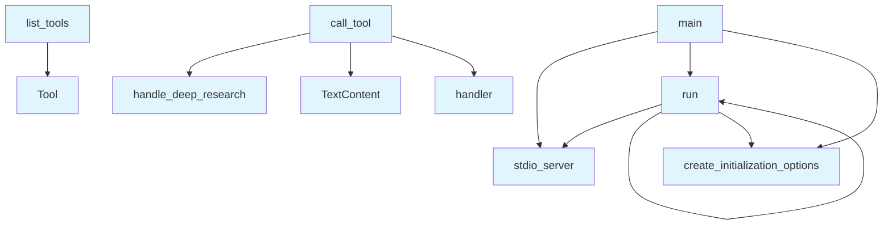

# server.py

## File Overview

The `server.py` module implements the main MCP (Model Context Protocol) server for the Local DeepWiki application. It serves as the entry point that sets up and runs the server, handling tool registration and execution for various wiki-related operations.

## Functions

### list_tools()

Returns the list of available tools that the server can execute. Based on the imports, this function likely registers tools for repository indexing, wiki operations, code searching, and content export functionality.

### call_tool()

Handles the execution of tools called by clients. This function routes tool calls to the appropriate handler functions imported from the handlers module.

**Parameters:**
- Tool execution parameters (specific signature not visible in the provided code)

**Returns:**
- Tool execution results (specific return type not visible in the provided code)

### main()

The main entry point function that sets up and configures the MCP server. This function likely initializes the Server instance and registers the tool handlers.

### run()

Executes the server using the stdio transport mechanism. This function starts the server and keeps it running to handle incoming requests.

## Usage Examples

```python
# Run the server (typical usage)
from local_deepwiki.server import run

# Start the MCP server
run()
```

```python
# Alternative entry through main function
from local_deepwiki.server import main

# Initialize and run the server
main()
```

## Related Components

This module integrates with several other components from the Local DeepWiki system:

- **ToolHandler**: Base handler class for tool operations
- **Handler functions**: Specific handlers for different operations:
  - [`handle_ask_question`](handlers.md): Processes question-answering requests
  - [`handle_deep_research`](handlers.md): Performs deep research operations
  - [`handle_export_wiki_html`](handlers.md): Exports wiki content as HTML
  - [`handle_export_wiki_pdf`](handlers.md): Exports wiki content as PDF
  - [`handle_index_repository`](handlers.md): Handles repository indexing
  - [`handle_read_wiki_page`](handlers.md): Reads individual wiki pages
  - [`handle_read_wiki_structure`](handlers.md): Reads wiki structure information
  - [`handle_search_code`](handlers.md): Performs code search operations

The module uses the MCP server framework components:
- **Server**: Main server class from the mcp.server package
- **stdio_server**: Standard I/O server transport
- **TextContent** and **Tool**: MCP type definitions for content and tool handling

The logging functionality is provided through the [`get_logger`](logging.md) function from the local_deepwiki.logging module.

## API Reference

### Functions

#### `list_tools`

`@server.list_tools()`

```python
async def list_tools() -> list[Tool]
```

List available tools.

**Returns:** `list[Tool]`


<details>
<summary>View Source (lines 31-222) | <a href="https://github.com/UrbanDiver/local-deepwiki-mcp/blob/feature/better-search/src/local_deepwiki/server.py#L31-L222">GitHub</a></summary>

```python
async def list_tools() -> list[Tool]:
    """List available tools."""
    return [
        Tool(
            name="index_repository",
            description="Index a repository and generate wiki documentation. This parses all source files, extracts semantic code chunks, generates embeddings, and creates wiki markdown files.",
            inputSchema={
                "type": "object",
                "properties": {
                    "repo_path": {
                        "type": "string",
                        "description": "Absolute path to the repository to index",
                    },
                    "output_dir": {
                        "type": "string",
                        "description": "Optional output directory for wiki (default: {repo}/.deepwiki)",
                    },
                    "languages": {
                        "type": "array",
                        "items": {"type": "string"},
                        "description": "Optional list of languages to include (default: all supported)",
                    },
                    "full_rebuild": {
                        "type": "boolean",
                        "description": "Force full rebuild instead of incremental update (default: false)",
                    },
                    "llm_provider": {
                        "type": "string",
                        "enum": ["ollama", "anthropic", "openai"],
                        "description": "LLM provider for wiki generation (default: from config)",
                    },
                    "embedding_provider": {
                        "type": "string",
                        "enum": ["local", "openai"],
                        "description": "Embedding provider for semantic search (default: from config)",
                    },
                    "use_cloud_for_github": {
                        "type": "boolean",
                        "description": "Use cloud LLM (Anthropic Claude) for GitHub repos. Faster and higher quality but requires API key. (default: from config)",
                    },
                },
                "required": ["repo_path"],
            },
        ),
        Tool(
            name="ask_question",
            description="Ask a question about an indexed repository using RAG. Returns an answer based on relevant code context.",
            inputSchema={
                "type": "object",
                "properties": {
                    "repo_path": {
                        "type": "string",
                        "description": "Path to the indexed repository",
                    },
                    "question": {
                        "type": "string",
                        "description": "Natural language question about the codebase",
                    },
                    "max_context": {
                        "type": "integer",
                        "description": "Maximum number of code chunks for context (default: 5)",
                    },
                },
                "required": ["repo_path", "question"],
            },
        ),
        Tool(
            name="deep_research",
            description="Perform deep research on a codebase question using multi-step reasoning. Unlike ask_question (single retrieval), this performs query decomposition, parallel retrieval, gap analysis, and comprehensive synthesis. Best for complex architectural questions.",
            inputSchema={
                "type": "object",
                "properties": {
                    "repo_path": {
                        "type": "string",
                        "description": "Path to the indexed repository",
                    },
                    "question": {
                        "type": "string",
                        "description": "Complex architectural question about the codebase",
                    },
                    "max_chunks": {
                        "type": "integer",
                        "description": "Maximum total code chunks to analyze (default: 30)",
                    },
                    "preset": {
                        "type": "string",
                        "enum": ["quick", "default", "thorough"],
                        "description": "Research mode preset: 'quick' (fast, fewer sub-questions), 'default' (balanced), 'thorough' (comprehensive, more analysis)",
                    },
                },
                "required": ["repo_path", "question"],
            },
        ),
        Tool(
            name="read_wiki_structure",
            description="Get the table of contents and structure of a generated wiki.",
            inputSchema={
                "type": "object",
                "properties": {
                    "wiki_path": {
                        "type": "string",
                        "description": "Path to the wiki directory (typically {repo}/.deepwiki)",
                    },
                },
                "required": ["wiki_path"],
            },
        ),
        Tool(
            name="read_wiki_page",
            description="Read a specific wiki page content.",
            inputSchema={
                "type": "object",
                "properties": {
                    "wiki_path": {
                        "type": "string",
                        "description": "Path to the wiki directory",
                    },
                    "page": {
                        "type": "string",
                        "description": "Page path relative to wiki root (e.g., 'index.md', 'modules/auth.md')",
                    },
                },
                "required": ["wiki_path", "page"],
            },
        ),
        Tool(
            name="search_code",
            description="Semantic search across the indexed codebase. Returns relevant code chunks with similarity scores.",
            inputSchema={
                "type": "object",
                "properties": {
                    "repo_path": {
                        "type": "string",
                        "description": "Path to the indexed repository",
                    },
                    "query": {
                        "type": "string",
                        "description": "Semantic search query",
                    },
                    "limit": {
                        "type": "integer",
                        "description": "Maximum number of results (default: 10)",
                    },
                    "language": {
                        "type": "string",
                        "description": "Optional language filter",
                    },
                },
                "required": ["repo_path", "query"],
            },
        ),
        Tool(
            name="export_wiki_html",
            description="Export wiki documentation to static HTML files. Creates a self-contained website that can be viewed without a server.",
            inputSchema={
                "type": "object",
                "properties": {
                    "wiki_path": {
                        "type": "string",
                        "description": "Path to the wiki directory (typically {repo}/.deepwiki)",
                    },
                    "output_path": {
                        "type": "string",
                        "description": "Output directory for HTML files (default: {wiki_path}_html)",
                    },
                },
                "required": ["wiki_path"],
            },
        ),
        Tool(
            name="export_wiki_pdf",
            description="Export wiki documentation to PDF format. Creates a printable PDF document with proper formatting, page numbers, and table of contents.",
            inputSchema={
                "type": "object",
                "properties": {
                    "wiki_path": {
                        "type": "string",
                        "description": "Path to the wiki directory (typically {repo}/.deepwiki)",
                    },
                    "output_path": {
                        "type": "string",
                        "description": "Output path for PDF file (default: {wiki_path}.pdf)",
                    },
                    "single_file": {
                        "type": "boolean",
                        "description": "If true, combine all pages into one PDF. If false, create separate PDFs for each page. Default: true",
                    },
                },
                "required": ["wiki_path"],
            },
        ),
    ]
```

</details>

#### `call_tool`

`@server.call_tool()`

```python
async def call_tool(name: str, arguments: dict[str, Any]) -> list[TextContent]
```

Handle tool calls.


| [Parameter](generators/api_docs.md) | Type | Default | Description |
|-----------|------|---------|-------------|
| `name` | `str` | - | - |
| `arguments` | `dict[str, Any]` | - | - |

**Returns:** `list[TextContent]`


<details>
<summary>View Source (lines 240-254) | <a href="https://github.com/UrbanDiver/local-deepwiki-mcp/blob/feature/better-search/src/local_deepwiki/server.py#L240-L254">GitHub</a></summary>

```python
async def call_tool(name: str, arguments: dict[str, Any]) -> list[TextContent]:
    """Handle tool calls."""
    logger.info(f"Tool call received: {name}")
    logger.debug(f"Tool arguments: {arguments}")

    # Special handling for deep_research (needs server context for progress)
    if name == "deep_research":
        return await handle_deep_research(arguments, server=server)

    handler = TOOL_HANDLERS.get(name)
    if handler is None:
        logger.warning(f"Unknown tool requested: {name}")
        return [TextContent(type="text", text=f"Unknown tool: {name}")]

    return await handler(arguments)
```

</details>

#### `main`

```python
def main()
```

Main entry point for the MCP server.


<details>
<summary>View Source (lines 257-269) | <a href="https://github.com/UrbanDiver/local-deepwiki-mcp/blob/feature/better-search/src/local_deepwiki/server.py#L257-L269">GitHub</a></summary>

```python
def main():
    """Main entry point for the MCP server."""
    logger.info("Starting local-deepwiki MCP server")

    async def run():
        async with stdio_server() as (read_stream, write_stream):
            await server.run(
                read_stream,
                write_stream,
                server.create_initialization_options(),
            )

    asyncio.run(run())
```

</details>

#### `run`

```python
async def run()
```


<details>
<summary>View Source (lines 261-267) | <a href="https://github.com/UrbanDiver/local-deepwiki-mcp/blob/feature/better-search/src/local_deepwiki/server.py#L261-L267">GitHub</a></summary>

```python
async def run():
        async with stdio_server() as (read_stream, write_stream):
            await server.run(
                read_stream,
                write_stream,
                server.create_initialization_options(),
            )
```

</details>

## Call Graph



## Used By

Functions and methods in this file and their callers:

- **`TextContent`**: called by `call_tool`
- **`Tool`**: called by `list_tools`
- **`create_initialization_options`**: called by `main`, `run`
- **[`handle_deep_research`](handlers.md)**: called by `call_tool`
- **`handler`**: called by `call_tool`
- **`run`**: called by `main`, `run`
- **`stdio_server`**: called by `main`, `run`

## Relevant Source Files

- `src/local_deepwiki/server.py:31-222`
