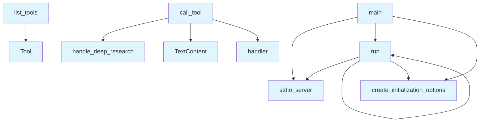

# server.py

## File Overview

This module implements an MCP (Model Context Protocol) server for the local_deepwiki application. It serves as the main entry point that provides tools for wiki operations, code analysis, and research functionality through a standardized server interface.

## Functions

### list_tools()

Returns a list of available tools that can be called through the MCP server interface.

**Returns:**
- List of Tool objects defining the available operations

### call_tool(name: str, arguments: dict[str, Any] | None)

Handles tool execution by routing requests to appropriate handler functions based on the tool name.

**Parameters:**
- `name` (str): The name of the tool to execute
- `arguments` (dict[str, Any] | None): Optional dictionary of arguments to pass to the tool

**Returns:**
- List of TextContent objects containing the tool's response

### main()

Sets up and runs the MCP server using stdio transport. This is the main entry point for the server application.

### run()

Entry point function that executes the main server loop.

## Usage Examples

### Starting the Server

```python
# Run the server
from local_deepwiki.server import run
run()
```

### Tool Execution Flow

The server handles various tool calls through the call_tool function:

```python
# Example of how tools are called (internally)
result = await call_tool("search_code", {
    "query": "function definition",
    "file_pattern": "*.py"
})
```

## Related Components

This module integrates with several handler components from the local_deepwiki.handlers module:

- **ToolHandler**: Base handler class for tool operations
- **[handle_ask_question](handlers.md)**: Processes question-answering requests
- **[handle_deep_research](handlers.md)**: Manages research operations
- **[handle_export_wiki_html](handlers.md)**: Handles HTML wiki export functionality
- **[handle_export_wiki_pdf](handlers.md)**: Manages PDF wiki export operations
- **[handle_index_repository](handlers.md)**: Processes repository indexing requests
- **[handle_read_wiki_page](handlers.md)**: Retrieves specific wiki page content
- **[handle_read_wiki_structure](handlers.md)**: Returns wiki structure information
- **[handle_search_code](handlers.md)**: Performs code search operations

The module also uses the logging system from local_deepwiki.logging and relies on the MCP server framework for protocol implementation.

## API Reference

### Functions

#### `list_tools`

`@server.list_tools()`

```python
async def list_tools() -> list[Tool]
```

List available tools.

**Returns:** `list[Tool]`


#### `call_tool`

`@server.call_tool()`

```python
async def call_tool(name: str, arguments: dict[str, Any]) -> list[TextContent]
```

Handle tool calls.


| [Parameter](generators/api_docs.md) | Type | Default | Description |
|-----------|------|---------|-------------|
| `name` | `str` | - | - |
| `arguments` | `dict[str, Any]` | - | - |

**Returns:** `list[TextContent]`


#### `main`

```python
def main()
```

Main entry point for the MCP server.


#### `run`

```python
async def run()
```


## Call Graph



## Relevant Source Files

- `src/local_deepwiki/server.py:31-222`

## See Also

- [logging](logging.md) - dependency
- [chunker](core/chunker.md) - shares 2 dependencies
- [vectorstore](core/vectorstore.md) - shares 2 dependencies
- [llm_cache](core/llm_cache.md) - shares 2 dependencies
