# File: src/local_deepwiki/server.py

## File Overview

This file implements the main server logic for the local_deepwiki application. It serves as the entry point for running the application as an MCP (Model Control Protocol) server, providing tools for indexing repositories, searching code, generating wikis, and answering questions about codebases. The server integrates with various components including the configuration system, repository indexer, vector store, and language model providers.

The server acts as the central coordination point that brings together the core functionality of the application and exposes it through the MCP protocol for use by other tools and applications.

## Classes

### Server

The Server class is the main entry point for the MCP server implementation. It manages the lifecycle of the server and provides the tool interface for all functionality.

**Key Methods:**
- `__init__(self)`: Initializes the server instance with default configuration
- `list_tools(self)`: Returns a list of available tools for the MCP server
- `call_tool(self, tool_name, arguments)`: Executes a tool with the given arguments

**Usage:**
The Server class is instantiated and used to run the MCP server via the main function. It coordinates between different components like the repository indexer, vector store, and LLM providers to provide the full functionality of the local_deepwiki system.

## Functions

### list_tools

```python
async def list_tools(self) -> list[Tool]:
```

Returns a list of available tools that can be called through the MCP server. These tools include functions for indexing repositories, searching code, generating wikis, and answering questions.

**Parameters:** None

**Return Value:** A list of Tool objects describing each available function

### call_tool

```python
async def call_tool(self, tool_name: str, arguments: dict[str, Any]) -> Any:
```

Executes a specific tool with the provided arguments.

**Parameters:**
- `tool_name`: Name of the tool to execute
- `arguments`: Dictionary of arguments for the tool

**Return Value:** The result of executing the tool

### handle_index_repository

```python
async def handle_index_repository(self, repository_path: str, config: dict[str, Any] = None) -> dict[str, Any]:
```

Indexes a repository for later searching and wiki generation.

**Parameters:**
- `repository_path`: Path to the repository to index
- `config`: Optional configuration parameters for indexing

**Return Value:** Dictionary containing indexing results and metadata

### progress_callback

```python
def progress_callback(message: str, progress: float = None):
```

A callback function that can be used to report progress during long-running operations.

**Parameters:**
- `message`: Progress message to report
- `progress`: Optional progress percentage (0-100)

**Return Value:** None

### handle_ask_question

```python
async def handle_ask_question(self, question: str, context: str = None) -> dict[str, Any]:
```

Answers a question about the indexed repository using the language model.

**Parameters:**
- `question`: The question to answer
- `context`: Optional additional context for the question

**Return Value:** Dictionary containing the answer and any relevant sources

### handle_read_wiki_structure

```python
async def handle_read_wiki_structure(self) -> dict[str, Any]:
```

Reads and returns the current wiki structure.

**Parameters:** None

**Return Value:** Dictionary containing the wiki structure

### handle_read_wiki_page

```python
async def handle_read_wiki_page(self, page_name: str) -> dict[str, Any]:
```

Reads and returns a specific wiki page.

**Parameters:**
- `page_name`: Name of the wiki page to read

**Return Value:** Dictionary containing the page content

### handle_search_code

```python
async def handle_search_code(self, query: str, limit: int = 10) -> dict[str, Any]:
```

Searches the indexed code for relevant snippets.

**Parameters:**
- `query`: Search query
- `limit`: Maximum number of results to return

**Return Value:** Dictionary containing search results

### main

```python
async def main():
```

Main entry point for running the MCP server.

**Parameters:** None

**Return Value:** None

### run

```python
async def run():
```

Runs the server with the configured settings.

**Parameters:** None

**Return Value:** None

## Usage Examples

### Starting the Server

```python
import asyncio
from local_deepwiki.server import main

asyncio.run(main())
```

### Using the Index Repository Tool

```python
from local_deepwiki.server import Server

server = Server()
result = await server.handle_index_repository("/path/to/repo", {
    "include_patterns": ["*.py", "*.js"],
    "exclude_patterns": ["node_modules", "__pycache__"]
})
print(result)
```

### Searching Code

```python
from local_deepwiki.server import Server

server = Server()
results = await server.handle_search_code("database connection", limit=5)
print(results)
```

### Asking Questions

```python
from local_deepwiki.server import Server

server = Server()
answer = await server.handle_ask_question("How does the authentication work?")
print(answer)
```

## Related Components

This server works with the [Config](config.md) class to manage application settings and the [get_config](config.md) and [set_config](config.md) functions for configuration access. It integrates with [RepositoryIndexer](core/indexer.md) to process and index code repositories, and with [VectorStore](core/vectorstore.md) to store and retrieve embeddings for semantic search. The server uses get_embedding_provider and get_llm_provider functions to access external services for embeddings and language model capabilities. It also works with [WikiStructure](models.md) to manage the wiki organization and [generate_wiki](generators/wiki.md) to create wiki content from the indexed repository data.

## API Reference

### Functions

#### `list_tools`

`@server.list_tools()`

```python
async def list_tools() -> list[Tool]
```

List available tools.

**Returns:** `list[Tool]`


#### `call_tool`

`@server.call_tool()`

```python
async def call_tool(name: str, arguments: dict[str, Any]) -> list[TextContent]
```

Handle tool calls.


| [Parameter](generators/api_docs.md) | Type | Default | Description |
|-----------|------|---------|-------------|
| `name` | `str` | - | - |
| `arguments` | `dict[str, Any]` | - | - |

**Returns:** `list[TextContent]`


#### `handle_index_repository`

```python
async def handle_index_repository(args: dict[str, Any]) -> list[TextContent]
```

Handle index_repository tool call.


| [Parameter](generators/api_docs.md) | Type | Default | Description |
|-----------|------|---------|-------------|
| `args` | `dict[str, Any]` | - | - |

**Returns:** `list[TextContent]`


#### `progress_callback`

```python
def progress_callback(msg: str, current: int, total: int)
```


| [Parameter](generators/api_docs.md) | Type | Default | Description |
|-----------|------|---------|-------------|
| `msg` | `str` | - | - |
| `current` | `int` | - | - |
| `total` | `int` | - | - |


#### `handle_ask_question`

```python
async def handle_ask_question(args: dict[str, Any]) -> list[TextContent]
```

Handle ask_question tool call.


| [Parameter](generators/api_docs.md) | Type | Default | Description |
|-----------|------|---------|-------------|
| `args` | `dict[str, Any]` | - | - |

**Returns:** `list[TextContent]`


#### `handle_read_wiki_structure`

```python
async def handle_read_wiki_structure(args: dict[str, Any]) -> list[TextContent]
```

Handle read_wiki_structure tool call.


| [Parameter](generators/api_docs.md) | Type | Default | Description |
|-----------|------|---------|-------------|
| `args` | `dict[str, Any]` | - | - |

**Returns:** `list[TextContent]`


#### `handle_read_wiki_page`

```python
async def handle_read_wiki_page(args: dict[str, Any]) -> list[TextContent]
```

Handle read_wiki_page tool call.


| [Parameter](generators/api_docs.md) | Type | Default | Description |
|-----------|------|---------|-------------|
| `args` | `dict[str, Any]` | - | - |

**Returns:** `list[TextContent]`


#### `handle_search_code`

```python
async def handle_search_code(args: dict[str, Any]) -> list[TextContent]
```

Handle search_code tool call.


| [Parameter](generators/api_docs.md) | Type | Default | Description |
|-----------|------|---------|-------------|
| `args` | `dict[str, Any]` | - | - |

**Returns:** `list[TextContent]`


#### `main`

```python
def main()
```

Main entry point for the MCP server.


#### `run`

```python
async def run()
```


## Call Graph

```mermaid
flowchart TD
    N0[Path]
    N1[RepositoryIndexer]
    N2[TextContent]
    N3[Tool]
    N4[VectorStore]
    N5[call_tool]
    N6[create_initialization_options]
    N7[dumps]
    N8[exists]
    N9[generate]
    N10[generate_wiki]
    N11[get_config]
    N12[get_embedding_provider]
    N13[get_llm_provider]
    N14[get_vector_db_path]
    N15[get_wiki_path]
    N16[handle_ask_question]
    N17[handle_index_repository]
    N18[handle_read_wiki_page]
    N19[handle_read_wiki_structure]
    N20[handle_search_code]
    N21[is_dir]
    N22[list_tools]
    N23[main]
    N24[relative_to]
    N25[resolve]
    N26[rglob]
    N27[run]
    N28[search]
    N29[stdio_server]
    N22 --> N3
    N5 --> N17
    N5 --> N16
    N5 --> N19
    N5 --> N18
    N5 --> N20
    N5 --> N2
    N17 --> N25
    N17 --> N0
    N17 --> N8
    N17 --> N2
    N17 --> N21
    N17 --> N11
    N17 --> N1
    N17 --> N10
    N17 --> N7
    N16 --> N25
    N16 --> N0
    N16 --> N11
    N16 --> N15
    N16 --> N14
    N16 --> N8
    N16 --> N2
    N16 --> N12
    N16 --> N4
    N16 --> N28
    N16 --> N13
    N16 --> N9
    N16 --> N7
    N19 --> N25
    N19 --> N0
    N19 --> N8
    N19 --> N2
    N19 --> N26
    N19 --> N24
    N19 --> N7
    N18 --> N25
    N18 --> N0
    N18 --> N8
    N18 --> N2
    N20 --> N25
    N20 --> N0
    N20 --> N11
    N20 --> N14
    N20 --> N8
    N20 --> N2
    N20 --> N12
    N20 --> N4
    N20 --> N28
    N20 --> N7
    N23 --> N29
    N23 --> N27
    N23 --> N6
    N27 --> N29
    N27 --> N27
    N27 --> N6
    classDef func fill:#e1f5fe
    class N0,N1,N2,N3,N4,N5,N6,N7,N8,N9,N10,N11,N12,N13,N14,N15,N16,N17,N18,N19,N20,N21,N22,N23,N24,N25,N26,N27,N28,N29 func
```



## See Also

- [models](models.md) - dependency
- [config](config.md) - dependency
- [vectorstore](core/vectorstore.md) - dependency
- [wiki](generators/wiki.md) - dependency
- [indexer](core/indexer.md) - dependency
