# File Overview

This file implements the main server logic for the local_deepwiki application. It sets up an MCP (Model Control Protocol) server that provides tools for indexing repositories, searching code, and generating wiki content. The server integrates with various components including repository indexing, vector storage, embedding providers, and LLM providers.

# Classes

## Config

The [Config](config.md) class manages configuration settings for the local_deepwiki application. It handles loading and storing configuration values needed for the server's operation.

## RepositoryIndexer

The RepositoryIndexer class is responsible for indexing repository contents. It processes files in a repository and prepares them for vector storage and search.

## VectorStore

The [VectorStore](core/vectorstore.md) class handles vector-based storage and retrieval of indexed content. It provides functionality for storing embeddings and performing similarity searches.

## WikiStructure

The [WikiStructure](models.md) class represents the hierarchical structure of generated wiki content. It organizes pages and sections in a structured format.

# Functions

## list_tools

```python
async def list_tools() -> list[Tool]
```

Returns a list of available tools that can be called by the MCP server. The tools include:
- `index-repository`: Index a repository for search
- `ask-question`: Ask a question about the repository content
- `read-wiki-structure`: Read the structure of the generated wiki
- `read-wiki-page`: Read a specific wiki page
- `search-code`: Search code in the repository

## call_tool

```python
async def call_tool(tool_name: str, tool_arguments: Any) -> Any
```

Calls a specific tool by name with the provided arguments. This function routes tool calls to their respective handlers.

## handle_index_repository

```python
async def handle_index_repository(args: dict[str, Any]) -> str
```

Handles the `index-repository` tool call. Indexes a repository at the specified path and returns a success message.

**Parameters:**
- `args`: Dictionary containing the repository path

**Returns:**
- Success message string

## progress_callback

```python
def progress_callback(message: str) -> None
```

A callback function that logs progress messages during indexing operations.

## handle_ask_question

```python
async def handle_ask_question(args: dict[str, Any]) -> str
```

Handles the `ask-question` tool call. Answers questions about the repository content using the configured LLM provider.

**Parameters:**
- `args`: Dictionary containing the question

**Returns:**
- Answer string

## handle_read_wiki_structure

```python
async def handle_read_wiki_structure(args: dict[str, Any]) -> str
```

Handles the `read-wiki-structure` tool call. Returns the structure of the generated wiki.

**Parameters:**
- `args`: Dictionary with no required arguments

**Returns:**
- Wiki structure as JSON string

## handle_read_wiki_page

```python
async def handle_read_wiki_page(args: dict[str, Any]) -> str
```

Handles the `read-wiki-page` tool call. Returns the content of a specific wiki page.

**Parameters:**
- `args`: Dictionary containing the page name

**Returns:**
- Page content as JSON string

## handle_search_code

```python
async def handle_search_code(args: dict[str, Any]) -> str
```

Handles the `search-code` tool call. Searches for code snippets matching the query.

**Parameters:**
- `args`: Dictionary containing the search query

**Returns:**
- Search results as JSON string

## main

```python
async def main() -> None
```

Main entry point for the server. Sets up the MCP server with the defined tools and runs it.

## run

```python
def run() -> None
```

Entry point function that runs the main async function using asyncio.

# Usage Examples

## Starting the Server

```python
# Run the server
if __name__ == "__main__":
    run()
```

## Using Tools

The server provides several tools that can be called through the MCP protocol:

```python
# Index a repository
await call_tool("index-repository", {"path": "/path/to/repo"})

# Ask a question about the repository
await call_tool("ask-question", {"question": "What does this function do?"})

# Search code
await call_tool("search-code", {"query": "authentication logic"})
```

# Related Components

This file works with the following components:

- **[WikiGenerator](generators/wiki.md)**: Used for generating wiki content from repository data
- **get_embedding_provider**: Provides embedding model for vector storage
- **get_llm_provider**: Provides language model for answering questions
- **[get_config](config.md)**: Manages configuration settings
- **[set_config](config.md)**: Sets configuration values
- **RepositoryIndexer**: Indexes repository contents
- **[VectorStore](core/vectorstore.md)**: Handles vector storage and search operations

## API Reference

### Functions

#### `list_tools`

`@server.list_tools()`

```python
async def list_tools() -> list[Tool]
```

List available tools.

**Returns:** `list[Tool]`


#### `call_tool`

`@server.call_tool()`

```python
async def call_tool(name: str, arguments: dict[str, Any]) -> list[TextContent]
```

Handle tool calls.


| [Parameter](generators/api_docs.md) | Type | Default | Description |
|-----------|------|---------|-------------|
| `name` | `str` | - | - |
| `arguments` | `dict[str, Any]` | - | - |

**Returns:** `list[TextContent]`


#### `handle_index_repository`

```python
async def handle_index_repository(args: dict[str, Any]) -> list[TextContent]
```

Handle index_repository tool call.


| [Parameter](generators/api_docs.md) | Type | Default | Description |
|-----------|------|---------|-------------|
| `args` | `dict[str, Any]` | - | - |

**Returns:** `list[TextContent]`


#### `progress_callback`

```python
def progress_callback(msg: str, current: int, total: int)
```


| [Parameter](generators/api_docs.md) | Type | Default | Description |
|-----------|------|---------|-------------|
| `msg` | `str` | - | - |
| `current` | `int` | - | - |
| `total` | `int` | - | - |


#### `handle_ask_question`

```python
async def handle_ask_question(args: dict[str, Any]) -> list[TextContent]
```

Handle ask_question tool call.


| [Parameter](generators/api_docs.md) | Type | Default | Description |
|-----------|------|---------|-------------|
| `args` | `dict[str, Any]` | - | - |

**Returns:** `list[TextContent]`


#### `handle_read_wiki_structure`

```python
async def handle_read_wiki_structure(args: dict[str, Any]) -> list[TextContent]
```

Handle read_wiki_structure tool call.


| [Parameter](generators/api_docs.md) | Type | Default | Description |
|-----------|------|---------|-------------|
| `args` | `dict[str, Any]` | - | - |

**Returns:** `list[TextContent]`


#### `handle_read_wiki_page`

```python
async def handle_read_wiki_page(args: dict[str, Any]) -> list[TextContent]
```

Handle read_wiki_page tool call.


| [Parameter](generators/api_docs.md) | Type | Default | Description |
|-----------|------|---------|-------------|
| `args` | `dict[str, Any]` | - | - |

**Returns:** `list[TextContent]`


#### `handle_search_code`

```python
async def handle_search_code(args: dict[str, Any]) -> list[TextContent]
```

Handle search_code tool call.


| [Parameter](generators/api_docs.md) | Type | Default | Description |
|-----------|------|---------|-------------|
| `args` | `dict[str, Any]` | - | - |

**Returns:** `list[TextContent]`


#### `main`

```python
def main()
```

Main entry point for the MCP server.


#### `run`

```python
async def run()
```


## Call Graph

```mermaid
flowchart TD
    N0[Path]
    N1[RepositoryIndexer]
    N2[TextContent]
    N3[Tool]
    N4[VectorStore]
    N5[call_tool]
    N6[create_initialization_options]
    N7[dumps]
    N8[exists]
    N9[generate]
    N10[generate_wiki]
    N11[get_config]
    N12[get_embedding_provider]
    N13[get_llm_provider]
    N14[get_vector_db_path]
    N15[get_wiki_path]
    N16[handle_ask_question]
    N17[handle_index_repository]
    N18[handle_read_wiki_page]
    N19[handle_read_wiki_structure]
    N20[handle_search_code]
    N21[is_dir]
    N22[list_tools]
    N23[loads]
    N24[main]
    N25[read_text]
    N26[resolve]
    N27[run]
    N28[search]
    N29[stdio_server]
    N22 --> N3
    N5 --> N17
    N5 --> N16
    N5 --> N19
    N5 --> N18
    N5 --> N20
    N5 --> N2
    N17 --> N26
    N17 --> N0
    N17 --> N8
    N17 --> N2
    N17 --> N21
    N17 --> N11
    N17 --> N1
    N17 --> N10
    N17 --> N7
    N16 --> N26
    N16 --> N0
    N16 --> N11
    N16 --> N15
    N16 --> N14
    N16 --> N8
    N16 --> N2
    N16 --> N12
    N16 --> N4
    N16 --> N28
    N16 --> N13
    N16 --> N9
    N16 --> N7
    N19 --> N26
    N19 --> N0
    N19 --> N8
    N19 --> N2
    N19 --> N23
    N19 --> N25
    N19 --> N7
    N18 --> N26
    N18 --> N0
    N18 --> N8
    N18 --> N2
    N18 --> N25
    N20 --> N26
    N20 --> N0
    N20 --> N11
    N20 --> N14
    N20 --> N8
    N20 --> N2
    N20 --> N12
    N20 --> N4
    N20 --> N28
    N20 --> N7
    N24 --> N29
    N24 --> N27
    N24 --> N6
    N27 --> N29
    N27 --> N27
    N27 --> N6
    classDef func fill:#e1f5fe
    class N0,N1,N2,N3,N4,N5,N6,N7,N8,N9,N10,N11,N12,N13,N14,N15,N16,N17,N18,N19,N20,N21,N22,N23,N24,N25,N26,N27,N28,N29 func
```



## Relevant Source Files

- `src/local_deepwiki/server.py`

## See Also

- [models](models.md) - dependency
- [wiki](generators/wiki.md) - dependency
- [config](config.md) - dependency
- [vectorstore](core/vectorstore.md) - dependency
- [chunker](core/chunker.md) - shares 4 dependencies
