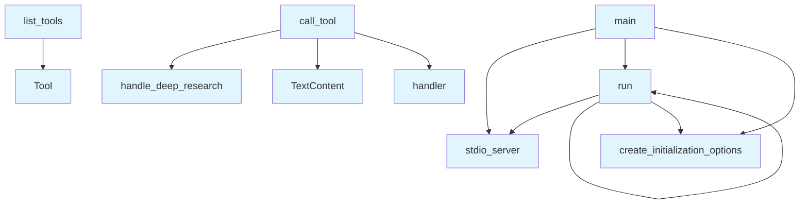

# server.py

## File Overview

The server.py file implements an MCP (Model Context Protocol) server for the Local DeepWiki system. It serves as the main entry point that exposes various wiki and code analysis tools through the MCP protocol, handling tool registration and request routing.

## Functions

### list_tools()

Returns a list of available tools that can be called through the MCP server. Based on the imports, this function registers tools for:

- Repository indexing
- Code searching
- Wiki page operations
- Question answering
- Deep research
- Export functionality

### call_tool()

Handles incoming tool calls by routing requests to appropriate handler functions. This function processes tool invocations and delegates to the imported handler functions from the handlers module.

**Handler Functions Called:**
- [`handle_ask_question`](handlers.md) - Processes question answering requests
- [`handle_deep_research`](handlers.md) - Handles deep research operations
- [`handle_export_wiki_html`](handlers.md) - Exports wiki content as HTML
- [`handle_export_wiki_pdf`](handlers.md) - Exports wiki content as PDF
- [`handle_index_repository`](handlers.md) - Indexes code repositories
- [`handle_read_wiki_page`](handlers.md) - Reads specific wiki pages
- [`handle_read_wiki_structure`](handlers.md) - Retrieves wiki structure information
- [`handle_search_code`](handlers.md) - Searches through indexed code

### main()

The main entry point function that sets up and runs the MCP server using stdio transport.

### run()

Executes the server startup process using asyncio.

## Usage Examples

### Running the Server

```python
# Start the MCP server
if __name__ == "__main__":
    run()
```

### Server Setup

The server uses stdio transport for communication:

```python
from mcp.server.stdio import stdio_server

# Server runs with stdio transport
async def main():
    async with stdio_server() as streams:
        await server.run(
            streams[0], streams[1], server.create_initialization_options()
        )
```

## Related Components

The server integrates with several components from the Local DeepWiki system:

- **ToolHandler** - Base handler class for tool operations
- **Handler Functions** - Specific tool implementation functions from the handlers module
- **Logging System** - Uses the logging module via [`get_logger`](logging.md) for operation tracking
- **MCP Framework** - Built on the Model Context Protocol server framework with `Server`, `stdio_server`, `TextContent`, and `Tool` types

The server acts as the protocol adapter, exposing the wiki and code analysis capabilities through a standardized MCP interface that can be consumed by compatible clients.

## API Reference

### Functions

#### `list_tools`

`@server.list_tools()`

```python
async def list_tools() -> list[Tool]
```

List available tools.

**Returns:** `list[Tool]`


#### `call_tool`

`@server.call_tool()`

```python
async def call_tool(name: str, arguments: dict[str, Any]) -> list[TextContent]
```

Handle tool calls.


| [Parameter](generators/api_docs.md) | Type | Default | Description |
|-----------|------|---------|-------------|
| `name` | `str` | - | - |
| `arguments` | `dict[str, Any]` | - | - |

**Returns:** `list[TextContent]`


#### `main`

```python
def main()
```

Main entry point for the MCP server.


#### `run`

```python
async def run()
```


## Call Graph



## Relevant Source Files

- `src/local_deepwiki/server.py:31-222`

## See Also

- [logging](logging.md) - dependency
- [chunker](core/chunker.md) - shares 2 dependencies
- [vectorstore](core/vectorstore.md) - shares 2 dependencies
- [llm_cache](core/llm_cache.md) - shares 2 dependencies
