# File Overview

This file implements the main server logic for the Local DeepWiki application. It sets up and runs an MCP (Model Control Protocol) server that provides tools for indexing repositories and generating wikis. The server integrates with various components including configuration management, repository indexing, vector storage, and embedding providers.

# Classes

## Server

The Server class is the main entry point for the MCP server implementation. It handles tool registration, server startup, and communication with the MCP protocol.

Key methods:
- `__init__`: Initializes the server with configuration and components
- `list_tools`: Returns the list of available tools
- `call_tool`: Executes a tool based on the provided request
- `start`: Starts the server using stdio communication

# Functions

## _validate_positive_int

Validates that a value is a positive integer.

Parameters:
- `value`: The value to validate

Returns:
- `int`: The validated positive integer

## _validate_non_empty_string

Validates that a value is a non-empty string.

Parameters:
- `value`: The value to validate

Returns:
- `str`: The validated non-empty string

## _validate_language

Validates that a value is a valid Language enum value.

Parameters:
- `value`: The value to validate

Returns:
- `Language`: The validated Language enum value

## _validate_languages_list

Validates that a value is a list of valid Language enum values.

Parameters:
- `value`: The value to validate

Returns:
- `list[Language]`: The validated list of Language enum values

## _validate_provider

Validates that a value is a valid provider string.

Parameters:
- `value`: The value to validate

Returns:
- `str`: The validated provider string

## list_tools

Returns the list of available tools for the server.

Parameters:
- `server`: The Server instance

Returns:
- `list[Tool]`: List of available tools

## call_tool

Executes a tool based on the provided request.

Parameters:
- `server`: The Server instance
- `request`: The tool call request

Returns:
- `Any`: The result of the tool execution

## handle_index_repository

Handles the repository indexing process.

Parameters:
- `server`: The Server instance
- `request`: The index repository request
- `progress_callback`: Optional callback for progress updates

Returns:
- `dict`: The result of the indexing operation

## progress_callback

A callback function for reporting progress during indexing.

Parameters:
- `message`: The progress message to report

# Usage Examples

```python
# Initialize the server
config = get_config()
server = Server(config)

# Start the server
asyncio.run(server.start())
```

# Related Components

This file works with the following components:
- The [Config](config.md) class for configuration management
- The RepositoryIndexer for repository indexing functionality
- The [VectorStore](core/vectorstore.md) for vector storage operations
- The [WikiGenerator](generators/wiki.md) for wiki generation
- The embedding providers through the get_embedding_provider function
- The Language enum for language validation
- The WikiStructure for wiki structure definitions
- The MCP server protocol components for communication
- The logging system through the get_logger function

## API Reference

### Functions

#### `list_tools`

`@server.list_tools()`

```python
async def list_tools() -> list[Tool]
```

List available tools.

**Returns:** `list[Tool]`


#### `call_tool`

`@server.call_tool()`

```python
async def call_tool(name: str, arguments: dict[str, Any]) -> list[TextContent]
```

Handle tool calls.


| [Parameter](generators/api_docs.md) | Type | Default | Description |
|-----------|------|---------|-------------|
| `name` | `str` | - | - |
| `arguments` | `dict[str, Any]` | - | - |

**Returns:** `list[TextContent]`


#### `handle_index_repository`

```python
async def handle_index_repository(args: dict[str, Any]) -> list[TextContent]
```

Handle index_repository tool call.


| [Parameter](generators/api_docs.md) | Type | Default | Description |
|-----------|------|---------|-------------|
| `args` | `dict[str, Any]` | - | - |

**Returns:** `list[TextContent]`


#### `progress_callback`

```python
def progress_callback(msg: str, current: int, total: int)
```


| [Parameter](generators/api_docs.md) | Type | Default | Description |
|-----------|------|---------|-------------|
| `msg` | `str` | - | - |
| `current` | `int` | - | - |
| `total` | `int` | - | - |


#### `handle_ask_question`

```python
async def handle_ask_question(args: dict[str, Any]) -> list[TextContent]
```

Handle ask_question tool call.


| [Parameter](generators/api_docs.md) | Type | Default | Description |
|-----------|------|---------|-------------|
| `args` | `dict[str, Any]` | - | - |

**Returns:** `list[TextContent]`


#### `handle_read_wiki_structure`

```python
async def handle_read_wiki_structure(args: dict[str, Any]) -> list[TextContent]
```

Handle read_wiki_structure tool call.


| [Parameter](generators/api_docs.md) | Type | Default | Description |
|-----------|------|---------|-------------|
| `args` | `dict[str, Any]` | - | - |

**Returns:** `list[TextContent]`


#### `handle_read_wiki_page`

```python
async def handle_read_wiki_page(args: dict[str, Any]) -> list[TextContent]
```

Handle read_wiki_page tool call.


| [Parameter](generators/api_docs.md) | Type | Default | Description |
|-----------|------|---------|-------------|
| `args` | `dict[str, Any]` | - | - |

**Returns:** `list[TextContent]`


#### `handle_search_code`

```python
async def handle_search_code(args: dict[str, Any]) -> list[TextContent]
```

Handle search_code tool call.


| [Parameter](generators/api_docs.md) | Type | Default | Description |
|-----------|------|---------|-------------|
| `args` | `dict[str, Any]` | - | - |

**Returns:** `list[TextContent]`


#### `handle_export_wiki_html`

```python
async def handle_export_wiki_html(args: dict[str, Any]) -> list[TextContent]
```

Handle export_wiki_html tool call.


| [Parameter](generators/api_docs.md) | Type | Default | Description |
|-----------|------|---------|-------------|
| `args` | `dict[str, Any]` | - | - |

**Returns:** `list[TextContent]`


#### `main`

```python
def main()
```

Main entry point for the MCP server.


#### `run`

```python
async def run()
```


## Call Graph

```mermaid
flowchart TD
    N0[Path]
    N1[TextContent]
    N2[ValueError]
    N3[VectorStore]
    N4[_validate_language]
    N5[_validate_languages_list]
    N6[_validate_non_empty_string]
    N7[_validate_positive_int]
    N8[_validate_provider]
    N9[call_tool]
    N10[create_initialization_options]
    N11[dumps]
    N12[exception]
    N13[exists]
    N14[get_config]
    N15[get_embedding_provider]
    N16[get_vector_db_path]
    N17[handle_ask_question]
    N18[handle_export_wiki_html]
    N19[handle_index_repository]
    N20[handle_read_wiki_page]
    N21[handle_read_wiki_structure]
    N22[handle_search_code]
    N23[list_tools]
    N24[main]
    N25[read_text]
    N26[resolve]
    N27[run]
    N28[search]
    N29[stdio_server]
    N7 --> N2
    N6 --> N2
    N4 --> N2
    N5 --> N2
    N8 --> N2
    N9 --> N19
    N9 --> N17
    N9 --> N21
    N9 --> N20
    N9 --> N22
    N9 --> N18
    N9 --> N1
    N19 --> N26
    N19 --> N0
    N19 --> N13
    N19 --> N1
    N19 --> N5
    N19 --> N8
    N19 --> N14
    N19 --> N11
    N19 --> N12
    N17 --> N26
    N17 --> N0
    N17 --> N6
    N17 --> N7
    N17 --> N1
    N17 --> N14
    N17 --> N16
    N17 --> N13
    N17 --> N15
    N17 --> N3
    N17 --> N28
    N17 --> N11
    N17 --> N12
    N21 --> N26
    N21 --> N0
    N21 --> N13
    N21 --> N1
    N21 --> N25
    N21 --> N11
    N20 --> N26
    N20 --> N0
    N20 --> N1
    N20 --> N13
    N20 --> N25
    N22 --> N26
    N22 --> N0
    N22 --> N6
    N22 --> N7
    N22 --> N4
    N22 --> N1
    N22 --> N14
    N22 --> N16
    N22 --> N13
    N22 --> N15
    N22 --> N3
    N22 --> N28
    N22 --> N11
    N18 --> N26
    N18 --> N0
    N18 --> N13
    N18 --> N1
    N18 --> N11
    N24 --> N29
    N24 --> N27
    N24 --> N10
    N27 --> N29
    N27 --> N27
    N27 --> N10
    classDef func fill:#e1f5fe
    class N0,N1,N2,N3,N4,N5,N6,N7,N8,N9,N10,N11,N12,N13,N14,N15,N16,N17,N18,N19,N20,N21,N22,N23,N24,N25,N26,N27,N28,N29 func
```



## Relevant Source Files

- `src/local_deepwiki/server.py:33-53`

## See Also

- [vectorstore](core/vectorstore.md) - dependency
- [config](config.md) - dependency
