# File: src/local_deepwiki/server.py

## File Overview

This file implements the main server logic for the Local DeepWiki application. It serves as the core entry point that handles tool execution, repository indexing, question answering, and wiki generation through the MCP (Model Communication Protocol) server interface.

The server integrates with various components including configuration management, repository indexing, vector storage, embedding providers, and LLM providers to create a complete local knowledge base system that can answer questions about code repositories and generate wikis.

## Classes

### Server

The Server class is the main entry point for the MCP server implementation. It handles tool registration and execution, managing the lifecycle of various operations such as repository indexing, question answering, and wiki generation.

Key methods:
- `list_tools`: Returns a list of available tools for the MCP client
- `call_tool`: Executes a specific tool based on tool name and arguments
- `handle_index_repository`: Processes repository indexing operations
- `handle_ask_question`: Handles question answering operations
- `handle_read_wiki_structure`: Reads and returns the wiki structure
- `handle_read_wiki_page`: Reads and returns a specific wiki page
- `handle_search_code`: Performs code search operations
- `main`: Entry point for starting the server
- `run`: Main server execution loop

The Server class works with RepositoryIndexer to process repositories, [VectorStore](core/vectorstore.md) to manage embeddings, and various providers to handle embeddings and LLM operations.

## Functions

### list_tools

Returns a list of available tools that can be called by the MCP client.

**Parameters**: None

**Returns**: List of Tool objects that define the available operations

### call_tool

Executes a specific tool based on the tool name and provided arguments.

**Parameters**:
- `tool_name` (str): Name of the tool to execute
- `arguments` (dict): Arguments to pass to the tool

**Returns**: Result of the tool execution

### handle_index_repository

Handles the repository indexing operation, which processes a repository to create embeddings and store them in the vector database.

**Parameters**:
- `arguments` (dict): Arguments including repository path and other configuration options

**Returns**: Status of the indexing operation

### progress_callback

A callback function that reports progress during long-running operations.

**Parameters**:
- `progress` (int): Progress percentage
- `message` (str): Progress message

**Returns**: None

### handle_ask_question

Handles question answering operations by retrieving relevant information from the vector store and generating responses using LLM.

**Parameters**:
- `arguments` (dict): Arguments including the question and context

**Returns**: Answer to the question

### handle_read_wiki_structure

Reads and returns the current wiki structure from the repository.

**Parameters**: None

**Returns**: [WikiStructure](models.md) object containing the wiki structure

### handle_read_wiki_page

Reads and returns a specific wiki page content.

**Parameters**:
- `arguments` (dict): Arguments including page name

**Returns**: Content of the requested wiki page

### handle_search_code

Performs code search operations using the vector store to [find](generators/manifest.md) relevant code snippets.

**Parameters**:
- `arguments` (dict): Arguments including search query and parameters

**Returns**: List of search results

### main

Entry point for starting the server.

**Parameters**: None

**Returns**: None

### run

Main server execution loop that starts the MCP server.

**Parameters**: None

**Returns**: None

## Usage Examples

### Starting the Server

```python
if __name__ == "__main__":
    main()
```

### Using the Index Repository Tool

```python
# Index a repository
arguments = {
    "repository_path": "/path/to/repo",
    "config": {
        "chunk_size": 1000,
        "chunk_overlap": 200
    }
}
result = call_tool("index_repository", arguments)
```

### Asking a Question

```python
# Ask a question about the repository
arguments = {
    "question": "What does the User class do?",
    "context": "Repository: /path/to/repo"
}
answer = handle_ask_question(arguments)
print(answer)
```

### Generating a Wiki

```python
# Generate wiki structure
wiki_structure = handle_read_wiki_structure()
print(wiki_structure)

# Read specific wiki page
arguments = {
    "page_name": "README.md"
}
page_content = handle_read_wiki_page(arguments)
print(page_content)
```

## Related Components

This file works with Configuration to manage settings, RepositoryIndexer to process repositories, [VectorStore](core/vectorstore.md) to store and retrieve embeddings, and various providers to handle embedding and LLM operations. The server integrates with the MCP protocol for communication with clients and uses the [WikiGenerator](generators/wiki.md) to create wiki content from repository information.

## API Reference

### Functions

#### `list_tools`

`@server.list_tools()`

```python
async def list_tools() -> list[Tool]
```

List available tools.

**Returns:** `list[Tool]`


#### `call_tool`

`@server.call_tool()`

```python
async def call_tool(name: str, arguments: dict[str, Any]) -> list[TextContent]
```

Handle tool calls.


| [Parameter](generators/api_docs.md) | Type | Default | Description |
|-----------|------|---------|-------------|
| `name` | `str` | - | - |
| `arguments` | `dict[str, Any]` | - | - |

**Returns:** `list[TextContent]`


#### `handle_index_repository`

```python
async def handle_index_repository(args: dict[str, Any]) -> list[TextContent]
```

Handle index_repository tool call.


| [Parameter](generators/api_docs.md) | Type | Default | Description |
|-----------|------|---------|-------------|
| `args` | `dict[str, Any]` | - | - |

**Returns:** `list[TextContent]`


#### `progress_callback`

```python
def progress_callback(msg: str, current: int, total: int)
```


| [Parameter](generators/api_docs.md) | Type | Default | Description |
|-----------|------|---------|-------------|
| `msg` | `str` | - | - |
| `current` | `int` | - | - |
| `total` | `int` | - | - |


#### `handle_ask_question`

```python
async def handle_ask_question(args: dict[str, Any]) -> list[TextContent]
```

Handle ask_question tool call.


| [Parameter](generators/api_docs.md) | Type | Default | Description |
|-----------|------|---------|-------------|
| `args` | `dict[str, Any]` | - | - |

**Returns:** `list[TextContent]`


#### `handle_read_wiki_structure`

```python
async def handle_read_wiki_structure(args: dict[str, Any]) -> list[TextContent]
```

Handle read_wiki_structure tool call.


| [Parameter](generators/api_docs.md) | Type | Default | Description |
|-----------|------|---------|-------------|
| `args` | `dict[str, Any]` | - | - |

**Returns:** `list[TextContent]`


#### `handle_read_wiki_page`

```python
async def handle_read_wiki_page(args: dict[str, Any]) -> list[TextContent]
```

Handle read_wiki_page tool call.


| [Parameter](generators/api_docs.md) | Type | Default | Description |
|-----------|------|---------|-------------|
| `args` | `dict[str, Any]` | - | - |

**Returns:** `list[TextContent]`


#### `handle_search_code`

```python
async def handle_search_code(args: dict[str, Any]) -> list[TextContent]
```

Handle search_code tool call.


| [Parameter](generators/api_docs.md) | Type | Default | Description |
|-----------|------|---------|-------------|
| `args` | `dict[str, Any]` | - | - |

**Returns:** `list[TextContent]`


#### `main`

```python
def main()
```

Main entry point for the MCP server.


#### `run`

```python
async def run()
```


## Call Graph

```mermaid
flowchart TD
    N0[Path]
    N1[RepositoryIndexer]
    N2[TextContent]
    N3[Tool]
    N4[VectorStore]
    N5[call_tool]
    N6[create_initialization_options]
    N7[dumps]
    N8[exists]
    N9[generate]
    N10[generate_wiki]
    N11[get_config]
    N12[get_embedding_provider]
    N13[get_llm_provider]
    N14[get_vector_db_path]
    N15[get_wiki_path]
    N16[handle_ask_question]
    N17[handle_index_repository]
    N18[handle_read_wiki_page]
    N19[handle_read_wiki_structure]
    N20[handle_search_code]
    N21[is_dir]
    N22[list_tools]
    N23[main]
    N24[relative_to]
    N25[resolve]
    N26[rglob]
    N27[run]
    N28[search]
    N29[stdio_server]
    N22 --> N3
    N5 --> N17
    N5 --> N16
    N5 --> N19
    N5 --> N18
    N5 --> N20
    N5 --> N2
    N17 --> N25
    N17 --> N0
    N17 --> N8
    N17 --> N2
    N17 --> N21
    N17 --> N11
    N17 --> N1
    N17 --> N10
    N17 --> N7
    N16 --> N25
    N16 --> N0
    N16 --> N11
    N16 --> N15
    N16 --> N14
    N16 --> N8
    N16 --> N2
    N16 --> N12
    N16 --> N4
    N16 --> N28
    N16 --> N13
    N16 --> N9
    N16 --> N7
    N19 --> N25
    N19 --> N0
    N19 --> N8
    N19 --> N2
    N19 --> N26
    N19 --> N24
    N19 --> N7
    N18 --> N25
    N18 --> N0
    N18 --> N8
    N18 --> N2
    N20 --> N25
    N20 --> N0
    N20 --> N11
    N20 --> N14
    N20 --> N8
    N20 --> N2
    N20 --> N12
    N20 --> N4
    N20 --> N28
    N20 --> N7
    N23 --> N29
    N23 --> N27
    N23 --> N6
    N27 --> N29
    N27 --> N27
    N27 --> N6
    classDef func fill:#e1f5fe
    class N0,N1,N2,N3,N4,N5,N6,N7,N8,N9,N10,N11,N12,N13,N14,N15,N16,N17,N18,N19,N20,N21,N22,N23,N24,N25,N26,N27,N28,N29 func
```



## See Also

- [models](models.md) - dependency
- [config](config.md) - dependency
- [vectorstore](core/vectorstore.md) - dependency
- [wiki](generators/wiki.md) - dependency
- [chunker](core/chunker.md) - shares 4 dependencies
