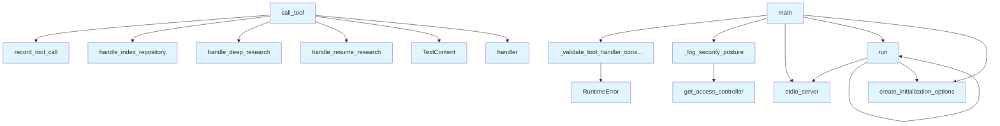

# File: `src/local_deepwiki/server.py`

## File Overview

This file implements the main MCP (Model Control Protocol) server for the `local_deepwiki` application. It provides the core functionality to expose a set of tools and handlers that allow an LLM or other client to interact with the local codebase and documentation system.

The server is responsible for:
- Defining and registering available tools via `TOOL_DEFINITIONS`
- Mapping tool names to their corresponding handlers
- Handling tool invocation with proper logging and session tracking
- Managing server startup, including validation and security posture logging
- Running the MCP server over stdio for communication with clients

## Key Concepts

### Tool Registration and Dispatching

The server uses a centralized approach to tool registration via `TOOL_DEFINITIONS` and a mapping of tool names to handlers (`TOOL_HANDLERS`). This pattern enables:
- Clear separation between tool definition and implementation
- Easy addition or removal of tools without changing core server logic
- Validation that all defined tools have corresponding handlers and vice versa

### Asynchronous Execution

The server is built using `asyncio`, allowing it to handle concurrent tool calls efficiently. Tools like `index_repository`, `deep_research`, and `resume_research` are special-cased to receive a server context for progress streaming, demonstrating an awareness of asynchronous workflows.

### Security and Access Control

The server integrates with a Role-Based Access Control (RBAC) system. It logs the current security mode at startup to inform users about the level of authentication enforcement. This design choice emphasizes the importance of security configuration in development and production environments.

## Integration

### Within the Codebase

This file is a core component of the `local_deepwiki` system and integrates with several other modules:

- **Handlers**: The server imports a large number of handlers from `local_deepwiki.handlers`, which implement the actual functionality of each tool.
- **Tool Definitions**: It uses `TOOL_DEFINITIONS` from `local_deepwiki.tool_defs` to define available tools.
- **Session State Management**: It imports [`record_tool_call`](handlers/session_state.md) from `local_deepwiki.handlers.session_state` to track tool usage.
- **Security Module**: It uses [`get_access_controller`](security/access_control.md) and [`RBACMode`](security/access_control.md) from `local_deepwiki.security.access_control` to manage access control.

### External Usage

The `main` function is the primary entry point for starting the server and is used by `test_pdf_streaming`. The functions `list_tools` and `_validate_tool_handler_consistency` are used by `test_server`, ensuring that tool definitions and handlers are in sync.

## Design Notes

### Tool Handler Consistency Validation

The `_validate_tool_handler_consistency` function ensures that there are no mismatches between tool definitions and handlers. This prevents silent regressions where:
- A new tool is defined but not implemented
- A handler exists for a tool that has been removed

This validation is performed at startup to fail fast and maintain system integrity.

### Special Handling for Progress-Enabled Tools

Tools like `index_repository`, `deep_research`, and `resume_research` require special handling for progress updates. These tools are explicitly dispatched with a `server` parameter to enable streaming progress back to the client. This design choice acknowledges that certain long-running operations benefit from real-time feedback.

### Logging Security Posture

The `_log_security_posture` function logs the current RBAC mode at startup. This is a deliberate design to make security configuration visible to users, encouraging proper setup in production environments. The use of different log levels (`warning`, `info`) helps differentiate between disabled and enforced modes.

### Asynchronous Server Run

The `run` function uses `asyncio.run()` to execute the MCP server loop. It relies on `stdio_server` from the `mcp` library to establish communication over standard input/output, which is a common pattern for MCP servers to integrate with LLM clients and agents.

## API Reference

### Functions

#### `list_tools`

`@server.list_tools()`

```python
async def list_tools() -> list
```

List available tools.

**Returns:** `list`


<details>
<summary>View Source (lines 98-100) | <a href="https://github.com/UrbanDiver/local-deepwiki-mcp/blob/main/src/local_deepwiki/server.py#L98-L100">GitHub</a></summary>

```python
async def list_tools() -> list:
    """List available tools."""
    return list(TOOL_DEFINITIONS)
```

</details>

#### `call_tool`

`@server.call_tool()`

```python
async def call_tool(name: str, arguments: dict[str, Any]) -> list[TextContent]
```

Handle tool calls.


| Parameter | Type | Default | Description |
|-----------|------|---------|-------------|
| `name` | `str` | - | - |
| `arguments` | `dict[str, Any]` | - | - |

**Returns:** `list[TextContent]`


<details>
<summary>View Source (lines 204-227) | <a href="https://github.com/UrbanDiver/local-deepwiki-mcp/blob/main/src/local_deepwiki/server.py#L204-L227">GitHub</a></summary>

```python
async def call_tool(name: str, arguments: dict[str, Any]) -> list[TextContent]:
    """Handle tool calls."""
    from local_deepwiki.handlers.session_state import record_tool_call

    logger.info("Tool call received: %s", name)
    logger.debug("Tool arguments: %s", arguments)
    record_tool_call(name)

    # Special handling for tools that need server context for progress streaming
    if name == "index_repository":
        return await handle_index_repository(arguments, server=server)

    if name == "deep_research":
        return await handle_deep_research(arguments, server=server)

    if name == "resume_research":
        return await handle_resume_research(arguments, server=server)

    handler = TOOL_HANDLERS.get(name)
    if handler is None:
        logger.warning("Unknown tool requested: %s", name)
        return [TextContent(type="text", text=f"Unknown tool: {name}")]

    return await handler(arguments)
```

</details>

#### `main`

```python
def main() -> None
```

Main entry point for the MCP server.

**Returns:** `None`


<details>
<summary>View Source (lines 248-262) | <a href="https://github.com/UrbanDiver/local-deepwiki-mcp/blob/main/src/local_deepwiki/server.py#L248-L262">GitHub</a></summary>

```python
def main() -> None:
    """Main entry point for the MCP server."""
    logger.info("Starting local-deepwiki MCP server")
    _validate_tool_handler_consistency()
    _log_security_posture()

    async def run() -> None:
        async with stdio_server() as (read_stream, write_stream):
            await server.run(
                read_stream,
                write_stream,
                server.create_initialization_options(),
            )

    asyncio.run(run())
```

</details>

#### `run`

```python
async def run() -> None
```

**Returns:** `None`


<details>
<summary>View Source (lines 254-260) | <a href="https://github.com/UrbanDiver/local-deepwiki-mcp/blob/main/src/local_deepwiki/server.py#L254-L260">GitHub</a></summary>

```python
async def run() -> None:
        async with stdio_server() as (read_stream, write_stream):
            await server.run(
                read_stream,
                write_stream,
                server.create_initialization_options(),
            )
```

</details>

## Call Graph


```mermaid
flowchart TD
    N0[RuntimeError]
    N1[TextContent]
    N2[_log_security_posture]
    N3[_validate_tool_handler_cons...]
    N4[call_tool]
    N5[create_initialization_options]
    N6[get_access_controller]
    N7[handle_deep_research]
    N8[handle_index_repository]
    N9[handle_resume_research]
    N10[handler]
    N11[main]
    N12[record_tool_call]
    N13[run]
    N14[stdio_server]
    N3 --> N0
    N4 --> N12
    N4 --> N8
    N4 --> N7
    N4 --> N9
    N4 --> N1
    N4 --> N10
    N2 --> N6
    N11 --> N3
    N11 --> N2
    N11 --> N14
    N11 --> N13
    N11 --> N5
    N13 --> N14
    N13 --> N13
    N13 --> N5
    classDef func fill:#e1f5fe
    class N0,N1,N2,N3,N4,N5,N6,N7,N8,N9,N10,N11,N12,N13,N14 func
```

## Used By

Functions and methods in this file and their callers:

- **`RuntimeError`**: called by `_validate_tool_handler_consistency`
- **`TextContent`**: called by `call_tool`
- **`_log_security_posture`**: called by `main`
- **`_validate_tool_handler_consistency`**: called by `main`
- **`create_initialization_options`**: called by `main`, `run`
- **[`get_access_controller`](security/access_control.md)**: called by `_log_security_posture`
- **[`handle_deep_research`](handlers/research.md)**: called by `call_tool`
- **[`handle_index_repository`](handlers/indexing.md)**: called by `call_tool`
- **[`handle_resume_research`](handlers/research.md)**: called by `call_tool`
- **`handler`**: called by `call_tool`
- **[`record_tool_call`](handlers/session_state.md)**: called by `call_tool`
- **`run`**: called by `main`, `run`
- **`stdio_server`**: called by `main`, `run`

## Usage Examples

*Examples extracted from test files*

### Test that the server is properly initialized

From `test_server.py::TestServer::test_server_is_initialized`:

```python
assert server is not None
assert server.name == "local-deepwiki"
```

### Test that list_tools returns a list of Tool objects

From `test_server.py::TestListTools::test_list_tools_returns_list`:

```python
tools = await list_tools()
assert isinstance(tools, list)
assert len(tools) > 0
```

### Test that all expected tools are returned

From `test_server.py::TestListTools::test_list_tools_returns_all_expected_tools`:

```python
tools = await list_tools()
tool_names = [t.name for t in tools]

expected_tools = [
    "index_repository",
    "ask_question",
    "deep_research",
    "read_wiki_structure",
    "read_wiki_page",
    "search_code",
    "export_wiki_html",
    "export_wiki_pdf",
    "serve_wiki",
    "stop_wiki_server",
]

for expected in expected_tools:
    assert expected in tool_names, f"Missing tool: {expected}"
```

### Test that unknown tools return an error message

From `test_server.py::TestCallTool::test_unknown_tool_returns_error`:

```python
result = await call_tool("nonexistent_tool", {})

assert len(result) == 1
assert isinstance(result[0], TextContent)
assert "Unknown tool" in result[0].text
assert "nonexistent_tool" in result[0].text
```

### Test that real handler validates inputs (no mocking)

From `test_server.py::TestToolHandlersIntegration::test_index_repository_real_handler_validation`:

```python
nonexistent = tmp_path / "nonexistent"
result = await call_tool("index_repository", {"repo_path": str(nonexistent)})

assert len(result) == 1
assert "error" in result[0].text.lower()
assert "does not exist" in result[0].text
```


## Last Modified

| Entity | Type | Author | Date | Commit |
|--------|------|--------|------|--------|
| `_validate_tool_handler_consistency` | function | Brian Breidenbach | 2 weeks ago | `8ede573` feat: add startup validatio... |
| `main` | function | Brian Breidenbach | 2 weeks ago | `8ede573` feat: add startup validatio... |
| `run` | function | Brian Breidenbach | Feb 23, 2026 | `c6fe2bd` refactor: split oversized m... |
| `list_tools` | function | Brian Breidenbach | Feb 21, 2026 | `e45a53a` refactor: apply Pythonic id... |
| `call_tool` | function | Brian Breidenbach | Feb 14, 2026 | `2732638` feat: agent UX improvements... |
| `_log_security_posture` | function | Brian Breidenbach | Feb 11, 2026 | `25db622` fix: publication review P0-... |

## Additional Source Code

Source code for functions and methods not listed in the API Reference above.

#### `_validate_tool_handler_consistency`

<details>
<summary>View Source (lines 176-200) | <a href="https://github.com/UrbanDiver/local-deepwiki-mcp/blob/main/src/local_deepwiki/server.py#L176-L200">GitHub</a></summary>

```python
def _validate_tool_handler_consistency() -> None:
    """Verify that every tool definition has a handler and vice-versa.

    Raises ``RuntimeError`` at startup if the sets diverge, preventing
    silent regressions where a new tool is defined but never dispatched
    (or a handler exists for a tool that was removed).
    """
    handler_names = set(TOOL_HANDLERS.keys()) | set(PROGRESS_ENABLED_TOOLS)
    definition_names = {t.name for t in TOOL_DEFINITIONS}

    missing_handlers = definition_names - handler_names
    extra_handlers = handler_names - definition_names

    errors: list[str] = []
    if missing_handlers:
        errors.append(f"Tool definitions without a handler: {sorted(missing_handlers)}")
    if extra_handlers:
        errors.append(f"Handlers without a tool definition: {sorted(extra_handlers)}")
    if errors:
        raise RuntimeError(
            "Tool-handler consistency check failed:\n  " + "\n  ".join(errors)
        )
    logger.debug(
        "Tool-handler consistency OK: %d tools validated", len(definition_names)
    )
```

</details>


#### `_log_security_posture`

<details>
<summary>View Source (lines 230-245) | <a href="https://github.com/UrbanDiver/local-deepwiki-mcp/blob/main/src/local_deepwiki/server.py#L230-L245">GitHub</a></summary>

```python
def _log_security_posture() -> None:
    """Log the current security configuration at startup."""
    from local_deepwiki.security.access_control import RBACMode, get_access_controller

    controller = get_access_controller()
    mode = controller.mode
    if mode == RBACMode.DISABLED:
        logger.warning(
            "SECURITY: RBAC is DISABLED — no permission checks will be performed"
        )
    elif mode == RBACMode.PERMISSIVE:
        logger.info(
            "SECURITY: RBAC is PERMISSIVE — unauthenticated requests are allowed"
        )
    else:
        logger.info("SECURITY: RBAC is ENFORCED — all requests require authentication")
```

</details>

## Relevant Source Files

- `src/local_deepwiki/server.py:98-100`
