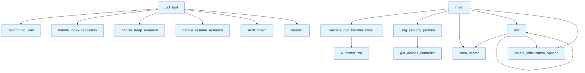

# File: `src/local_deepwiki/server.py`

## File Overview

This file implements the **MCP (Model Control Protocol) server** for the `local_deepwiki` application. It serves as the core entry point for handling tool requests and integrating with the DeepWiki functionality. The server is built using the `mcp` library and supports communication via stdio, making it compatible with tools that implement the MCP protocol.

The server is responsible for:
- Defining and validating available tools
- Handling tool execution via registered handlers
- Managing access control and logging security posture
- Initializing and running the MCP server instance

## Key Concepts

### Tool Registration and Dispatch

The server uses a centralized `TOOL_DEFINITIONS` list to define all available tools. Each tool is mapped to a corresponding handler function in `TOOL_HANDLERS`. This pattern ensures that:
- Tools are explicitly defined and documented
- There's a clear separation between tool definition and implementation
- Runtime consistency checks prevent missing or extra handlers

### Asynchronous Execution Model

The server leverages `asyncio` for handling concurrent tool calls and I/O operations. This is essential for:
- Supporting long-running operations like repository indexing or deep research
- Efficiently managing multiple concurrent tool requests
- Integrating with the `mcp` server which is inherently async

### Security and Access Control

The server implements a role-based access control (RBAC) system that can be configured in three modes:
- `DISABLED`: No permission checks
- `PERMISSIVE`: Unauthenticated requests allowed
- `ENFORCED`: All requests must be authenticated

This design allows the system to be used in development (permissive) or production (enforced) environments without code changes.

## Integration

### With Other Components

This file integrates with several other parts of the codebase:
- **Handlers**: All tool implementations are imported from `local_deepwiki.handlers` and registered via `TOOL_HANDLERS`.
- **Tool Definitions**: `TOOL_DEFINITIONS` from `local_deepwiki.tool_defs` is used to validate tool handlers.
- **Logging**: Uses `local_deepwiki.logging.get_logger()` for consistent logging.
- **Access Control**: Relies on `local_deepwiki.security.access_control` for RBAC setup.
- **Session State**: Uses `local_deepwiki.handlers.session_state` to track tool usage.

### External Usage

This file is used by:
- `list_tools` and `_validate_tool_handler_consistency` are used by `test_server` for testing.
- `main` is used by `test_pdf_streaming` for integration testing.

## Design Notes

### Tool Handler Consistency

The `_validate_tool_handler_consistency` function ensures that:
- Every tool defined in `TOOL_DEFINITIONS` has a corresponding handler in `TOOL_HANDLERS`
- Every handler in `TOOL_HANDLERS` has a matching tool definition

This prevents silent regressions where new tools are added but not implemented, or handlers are removed but tool definitions remain.

### Special Handling for Progress-Enabled Tools

Some tools, such as `index_repository`, `deep_research`, and `resume_research`, require server context to stream progress updates. These are handled specially in `call_tool` to pass the `server` object to their handlers.

### Security Logging

The `_log_security_posture` function logs the current RBAC mode at startup to ensure operators are aware of the security configuration, especially in production environments.

### Async Entry Point

The `main` function and `run` inner function follow the `mcp` library's recommended pattern for running servers via stdio. This design choice enables integration with tools that support the MCP protocol, such as LLM agents or IDE extensions.

## API Reference

### Functions

#### `list_tools`

`@server.list_tools()`

```python
async def list_tools() -> list
```

List available tools.

**Returns:** `list`


<details>
<summary>View Source (lines 92-94) | <a href="https://github.com/UrbanDiver/local-deepwiki-mcp/blob/main/src/local_deepwiki/server.py#L92-L94">GitHub</a></summary>

```python
async def list_tools() -> list:
    """List available tools."""
    return list(TOOL_DEFINITIONS)
```

</details>

#### `call_tool`

`@server.call_tool()`

```python
async def call_tool(name: str, arguments: dict[str, Any]) -> list[TextContent]
```

Handle tool calls.


| Parameter | Type | Default | Description |
|-----------|------|---------|-------------|
| `name` | `str` | - | - |
| `arguments` | `dict[str, Any]` | - | - |

**Returns:** `list[TextContent]`


<details>
<summary>View Source (lines 192-215) | <a href="https://github.com/UrbanDiver/local-deepwiki-mcp/blob/main/src/local_deepwiki/server.py#L192-L215">GitHub</a></summary>

```python
async def call_tool(name: str, arguments: dict[str, Any]) -> list[TextContent]:
    """Handle tool calls."""
    from local_deepwiki.handlers.session_state import record_tool_call

    logger.info("Tool call received: %s", name)
    logger.debug("Tool arguments: %s", arguments)
    record_tool_call(name)

    # Special handling for tools that need server context for progress streaming
    if name == "index_repository":
        return await handle_index_repository(arguments, server=server)

    if name == "deep_research":
        return await handle_deep_research(arguments, server=server)

    if name == "resume_research":
        return await handle_resume_research(arguments, server=server)

    handler = TOOL_HANDLERS.get(name)
    if handler is None:
        logger.warning("Unknown tool requested: %s", name)
        return [TextContent(type="text", text=f"Unknown tool: {name}")]

    return await handler(arguments)
```

</details>

#### `main`

```python
def main() -> None
```

Main entry point for the MCP server.

**Returns:** `None`


<details>
<summary>View Source (lines 236-250) | <a href="https://github.com/UrbanDiver/local-deepwiki-mcp/blob/main/src/local_deepwiki/server.py#L236-L250">GitHub</a></summary>

```python
def main() -> None:
    """Main entry point for the MCP server."""
    logger.info("Starting local-deepwiki MCP server")
    _validate_tool_handler_consistency()
    _log_security_posture()

    async def run() -> None:
        async with stdio_server() as (read_stream, write_stream):
            await server.run(
                read_stream,
                write_stream,
                server.create_initialization_options(),
            )

    asyncio.run(run())
```

</details>

#### `run`

```python
async def run() -> None
```

**Returns:** `None`


<details>
<summary>View Source (lines 242-248) | <a href="https://github.com/UrbanDiver/local-deepwiki-mcp/blob/main/src/local_deepwiki/server.py#L242-L248">GitHub</a></summary>

```python
async def run() -> None:
        async with stdio_server() as (read_stream, write_stream):
            await server.run(
                read_stream,
                write_stream,
                server.create_initialization_options(),
            )
```

</details>

## Call Graph


```mermaid
flowchart TD
    N0[RuntimeError]
    N1[TextContent]
    N2[_log_security_posture]
    N3[_validate_tool_handler_cons...]
    N4[call_tool]
    N5[create_initialization_options]
    N6[get_access_controller]
    N7[handle_deep_research]
    N8[handle_index_repository]
    N9[handle_resume_research]
    N10[handler]
    N11[main]
    N12[record_tool_call]
    N13[run]
    N14[stdio_server]
    N3 --> N0
    N4 --> N12
    N4 --> N8
    N4 --> N7
    N4 --> N9
    N4 --> N1
    N4 --> N10
    N2 --> N6
    N11 --> N3
    N11 --> N2
    N11 --> N14
    N11 --> N13
    N11 --> N5
    N13 --> N14
    N13 --> N13
    N13 --> N5
    classDef func fill:#e1f5fe
    class N0,N1,N2,N3,N4,N5,N6,N7,N8,N9,N10,N11,N12,N13,N14 func
```

## Used By

Functions and methods in this file and their callers:

- **`RuntimeError`**: called by `_validate_tool_handler_consistency`
- **`TextContent`**: called by `call_tool`
- **`_log_security_posture`**: called by `main`
- **`_validate_tool_handler_consistency`**: called by `main`
- **`create_initialization_options`**: called by `main`, `run`
- **[`get_access_controller`](security/access_control.md)**: called by `_log_security_posture`
- **[`handle_deep_research`](handlers/research.md)**: called by `call_tool`
- **[`handle_index_repository`](handlers/indexing.md)**: called by `call_tool`
- **[`handle_resume_research`](handlers/research.md)**: called by `call_tool`
- **`handler`**: called by `call_tool`
- **[`record_tool_call`](handlers/session_state.md)**: called by `call_tool`
- **`run`**: called by `main`, `run`
- **`stdio_server`**: called by `main`, `run`

## Usage Examples

*Examples extracted from test files*

### Test that the server is properly initialized

From `test_server.py::TestServer::test_server_is_initialized`:

```python
assert server is not None
assert server.name == "local-deepwiki"
```

### Test that list_tools returns a list of Tool objects

From `test_server.py::TestListTools::test_list_tools_returns_list`:

```python
tools = await list_tools()
assert isinstance(tools, list)
assert len(tools) > 0
```

### Test that all expected tools are returned

From `test_server.py::TestListTools::test_list_tools_returns_all_expected_tools`:

```python
tools = await list_tools()
tool_names = [t.name for t in tools]

expected_tools = [
    "index_repository",
    "ask_question",
    "deep_research",
    "read_wiki_structure",
    "read_wiki_page",
    "search_code",
    "export_wiki_html",
    "export_wiki_pdf",
    "serve_wiki",
    "stop_wiki_server",
]

for expected in expected_tools:
    assert expected in tool_names, f"Missing tool: {expected}"
```

### Test that unknown tools return an error message

From `test_server.py::TestCallTool::test_unknown_tool_returns_error`:

```python
result = await call_tool("nonexistent_tool", {})

assert len(result) == 1
assert isinstance(result[0], TextContent)
assert "Unknown tool" in result[0].text
assert "nonexistent_tool" in result[0].text
```

### Test that real handler validates inputs (no mocking)

From `test_server.py::TestToolHandlersIntegration::test_index_repository_real_handler_validation`:

```python
nonexistent = tmp_path / "nonexistent"
result = await call_tool("index_repository", {"repo_path": str(nonexistent)})

assert len(result) == 1
assert "error" in result[0].text.lower()
assert "does not exist" in result[0].text
```


## Last Modified

| Entity | Type | Author | Date | Commit |
|--------|------|--------|------|--------|
| `_validate_tool_handler_consistency` | function | Brian Breidenbach | 2 weeks ago | `8ede573` feat: add startup validatio... |
| `main` | function | Brian Breidenbach | 2 weeks ago | `8ede573` feat: add startup validatio... |
| `run` | function | Brian Breidenbach | Feb 23, 2026 | `c6fe2bd` refactor: split oversized m... |
| `list_tools` | function | Brian Breidenbach | Feb 21, 2026 | `e45a53a` refactor: apply Pythonic id... |
| `call_tool` | function | Brian Breidenbach | Feb 14, 2026 | `2732638` feat: agent UX improvements... |
| `_log_security_posture` | function | Brian Breidenbach | Feb 11, 2026 | `25db622` fix: publication review P0-... |

## Additional Source Code

Source code for functions and methods not listed in the API Reference above.

#### `_validate_tool_handler_consistency`

<details>
<summary>View Source (lines 164-188) | <a href="https://github.com/UrbanDiver/local-deepwiki-mcp/blob/main/src/local_deepwiki/server.py#L164-L188">GitHub</a></summary>

```python
def _validate_tool_handler_consistency() -> None:
    """Verify that every tool definition has a handler and vice-versa.

    Raises ``RuntimeError`` at startup if the sets diverge, preventing
    silent regressions where a new tool is defined but never dispatched
    (or a handler exists for a tool that was removed).
    """
    handler_names = set(TOOL_HANDLERS.keys()) | set(PROGRESS_ENABLED_TOOLS)
    definition_names = {t.name for t in TOOL_DEFINITIONS}

    missing_handlers = definition_names - handler_names
    extra_handlers = handler_names - definition_names

    errors: list[str] = []
    if missing_handlers:
        errors.append(f"Tool definitions without a handler: {sorted(missing_handlers)}")
    if extra_handlers:
        errors.append(f"Handlers without a tool definition: {sorted(extra_handlers)}")
    if errors:
        raise RuntimeError(
            "Tool-handler consistency check failed:\n  " + "\n  ".join(errors)
        )
    logger.debug(
        "Tool-handler consistency OK: %d tools validated", len(definition_names)
    )
```

</details>


#### `_log_security_posture`

<details>
<summary>View Source (lines 218-233) | <a href="https://github.com/UrbanDiver/local-deepwiki-mcp/blob/main/src/local_deepwiki/server.py#L218-L233">GitHub</a></summary>

```python
def _log_security_posture() -> None:
    """Log the current security configuration at startup."""
    from local_deepwiki.security.access_control import RBACMode, get_access_controller

    controller = get_access_controller()
    mode = controller.mode
    if mode == RBACMode.DISABLED:
        logger.warning(
            "SECURITY: RBAC is DISABLED — no permission checks will be performed"
        )
    elif mode == RBACMode.PERMISSIVE:
        logger.info(
            "SECURITY: RBAC is PERMISSIVE — unauthenticated requests are allowed"
        )
    else:
        logger.info("SECURITY: RBAC is ENFORCED — all requests require authentication")
```

</details>

## Relevant Source Files

- `src/local_deepwiki/server.py:92-94`
